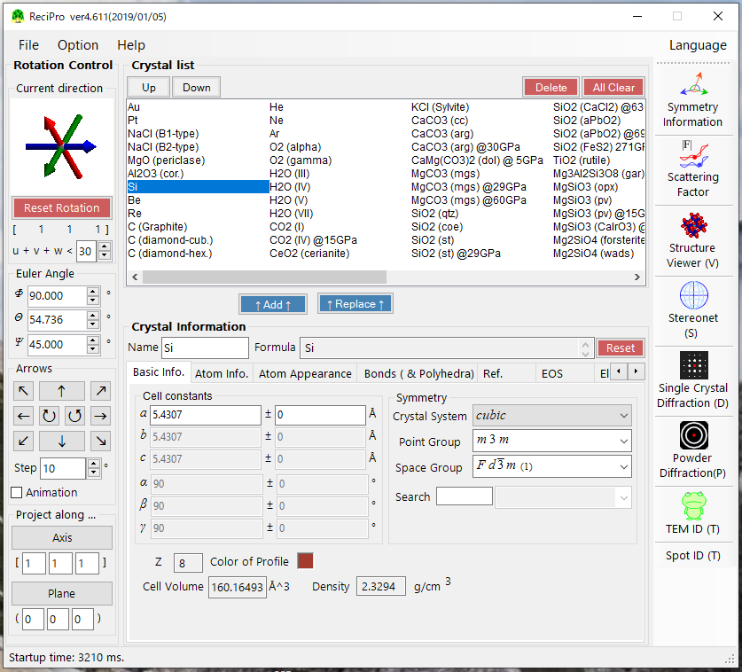
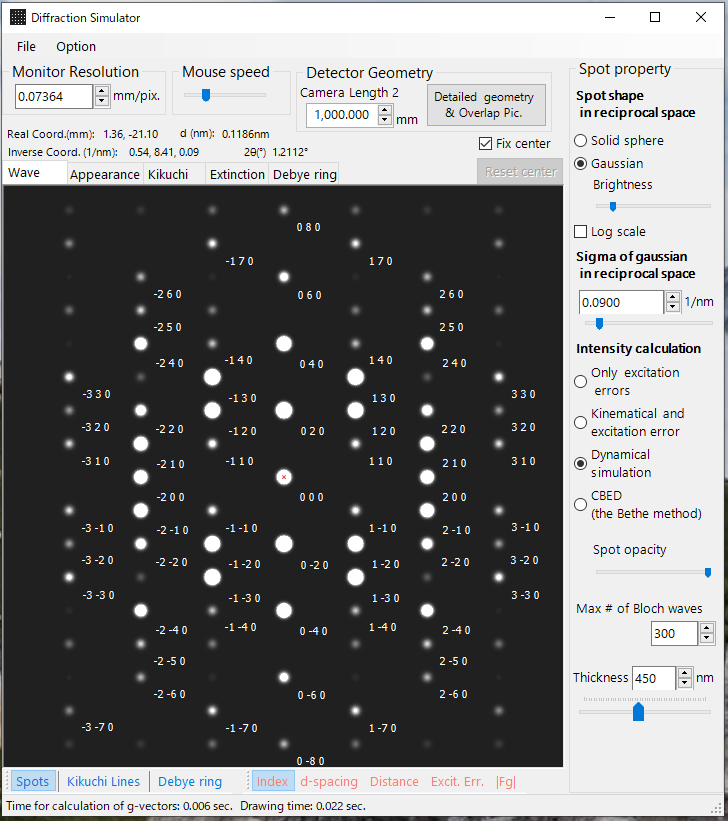
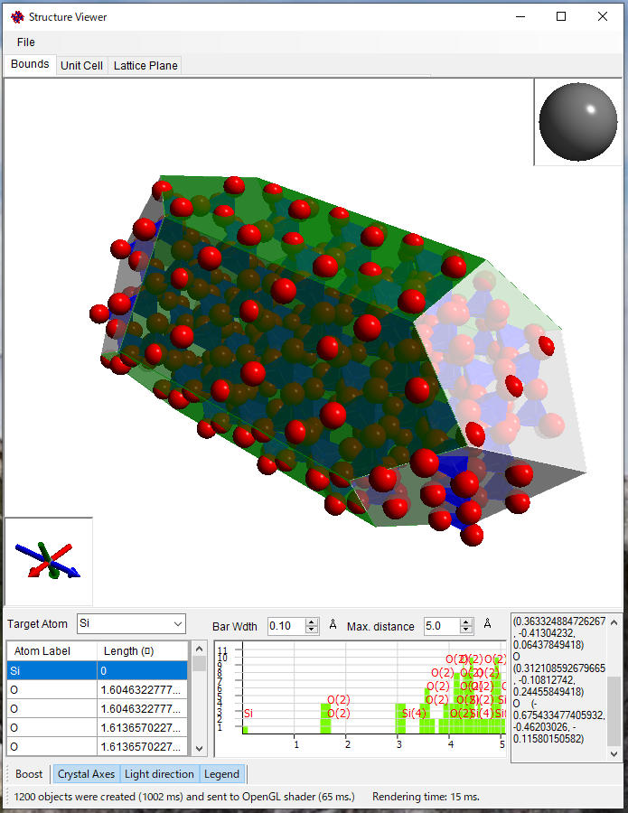
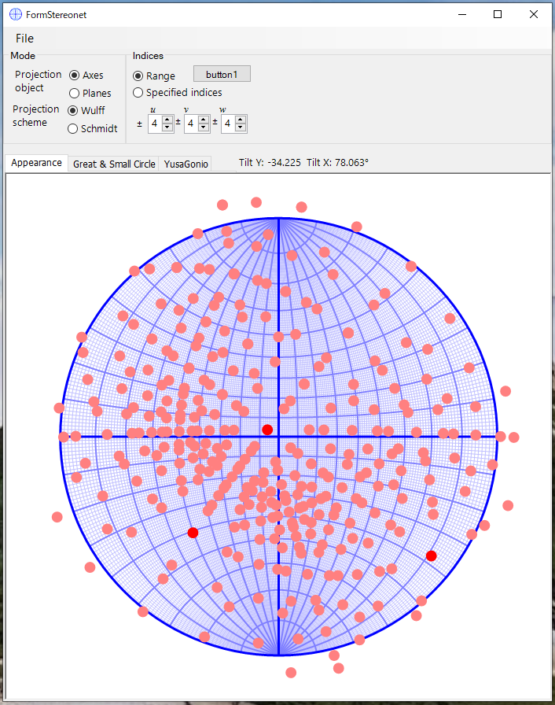

ReciPro is free software that provides a variety of crystallographic calculations and simulations, and has been downloaded >10,000 times since its release on github (Mar 2020). ***[See also Wiki to learn how to use!](https://github.com/seto77/ReciPro/wiki)***

[Various simulations being performed in real time (sample: SrTiO3)](https://user-images.githubusercontent.com/44538886/123412384-7e20a980-d5ec-11eb-86fd-921c37ce460c.mp4)

* *ReciPro* makes various crystallographic calculations, visualizes a crystal structure, simulates a diffraction pattern and high-resolution TEM image, indexes diffraction spots, plots stereographic projection, and so on.
* *ReciPro* is developed by [Seto Y.](https://yseto.net/) (Osaka Meteropolitan University, Japan) and [Ohtsuka M.](https://profs.provost.nagoya-u.ac.jp/html/100006527_en.html) (Nagoya University, Japan). The functions and algorithms are also presented in [the paper](https://github.com/seto77/ReciPro/blob/master/ReciProSetoOhtsuka2022.pdf). If you use this software to write an academic paper, please cite the following reference.
  * [Seto, Y. & Ohtsuka, M. (2022). *J. Appl. Cryst.* **55**, 397-410, doi: 10.1107/S1600576722000139.](https://doi.org/10.1107/S1600576722000139)
***

## Install
* Access https://github.com/seto77/ReciPro/releases/latest, download *ReciProSetup.msi*, and execute it.
* *ReciPro* runs on Windows OS with ***.Net Desktop Runtime 9.0*** (not ***.Net Runtime 9.0***), which can be installed from [here](https://dotnet.microsoft.com/download/dotnet/9.0).

## Manual
  * Japanese version : https://raw.githubusercontent.com/seto77/ReciPro/master/ReciPro/doc/ReciProManual(ja).pdf
  * English version : https://raw.githubusercontent.com/seto77/ReciPro/master/ReciPro/doc/ReciProManual(en).pdf
***

## Main features
* Makes crystallographic calculations.
  * 530 (Hall symbol) space groups are available. 
    * General conditions (or extinction rules), Wyckoff positions, multiplicities of all space groups.  
    * Geometrical calculation of periodicity and/or angle between planes and/or axes.
    * Generation of equivalent atomic positions.

* Provides crystal database.
  * Over 20,000 crystal structures are available after installation.
    * The database is provided by American Mineralogist Crystal Database (AMCSD, [Downs & Hall-Wallace, 2003, American Mineralogist 88, 247-250](https://www.geo.arizona.edu/xtal/group/pdf/am88_247.pdf))

* Includes atomic properties.
  * Characteristic X-ray wavelength/energy.
  * Atomic scattering factor for X-ray, electron and neutron.
  
* Simulates diffraction patterns.
  * X-ray, electron, and neutron sources are available for incident beams.
  * Kinematic simulations for the all sources.
  * Dynamical simulations for electron diffraction based on the Bloch wave method.
    * Parallel electron diffraction (SAED)
    * Precession electron diffraction (PED)
    * Convergent beam electron diffraction (CBED)
  
* Draws crystal structure using OpenGL4
  * Atom, bonds, polyhedra, unit cell and lattice planes.
  
* Plots stereonet (Wulf-net).
  * Axes and planes of any indices.
  * Large and small circles.
  
* Identifies diffraction spots in the observed image.
  * Major file formats (dm3, dm4, tiff, …) are supported.
  * Automatically detects diffraction spots, and identifies (or indexes) the spots for the selected crystal(s).
  
* Manages crystal data base.
  * ~80 crystal data are initially bundled. 
  * Import/export CIF, AMC format files.
  * Possible to use COD and AMCSD database through CSManager (https://github.com/seto77/CSManager/releases/latest). 
***

## Screenshots
  　　　   
***
