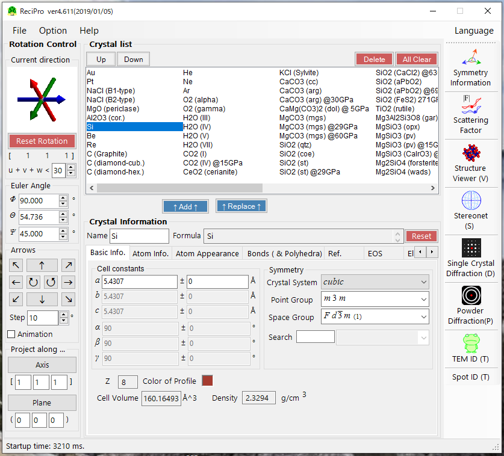
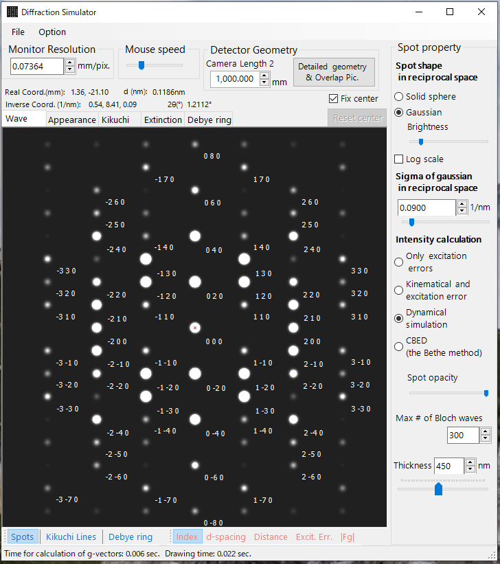
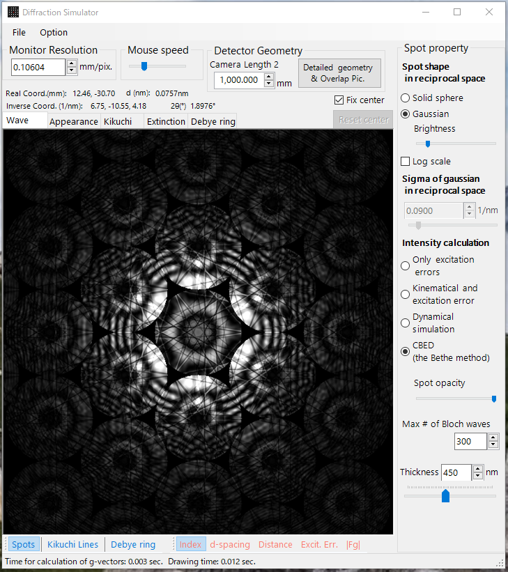
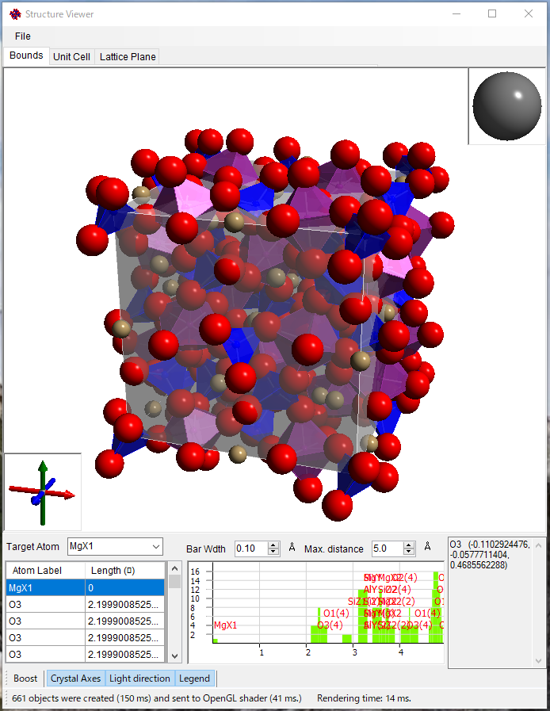
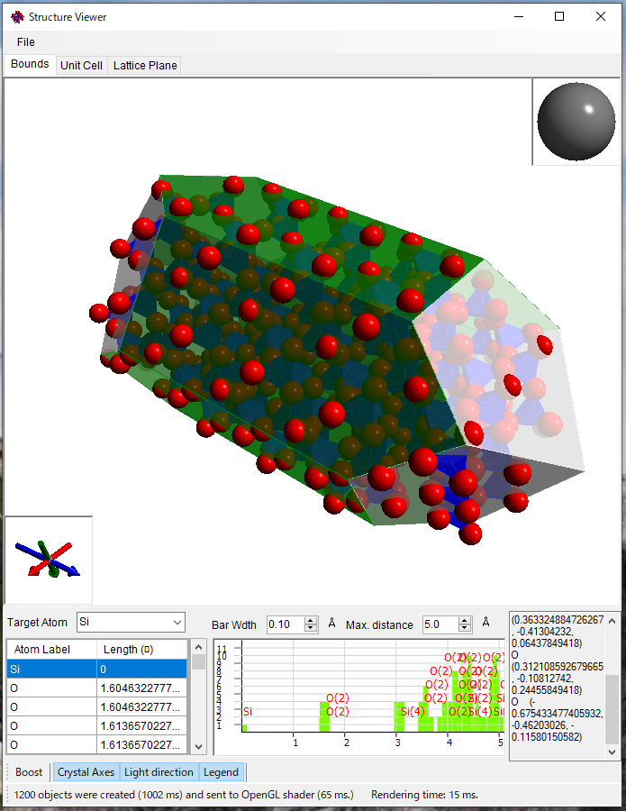
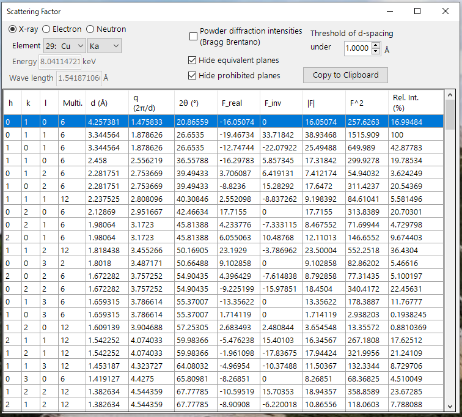
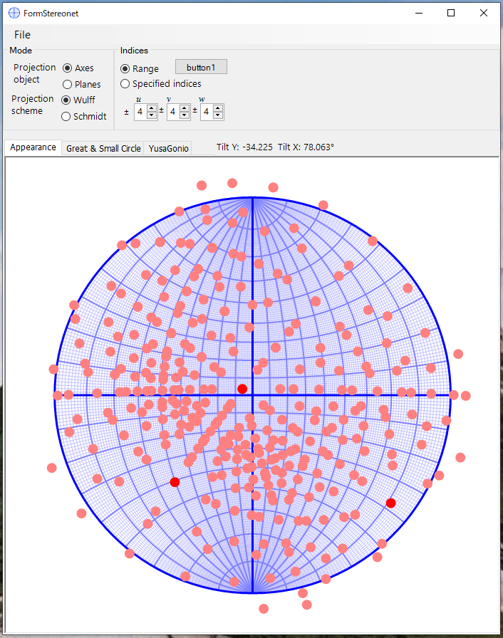

# ReciPro

*ReciPro* is a free and open-source GUI-based multipurpose crystallographic software that provides seamless access to functions to explore crystal databases, visualize crystal structures and goniometer settings, simulate diffraction patterns and high-resolution microscope images, and analyze diffraction data. These features are linked through a user-friendly GUI, and the results can be synchronously displayed almost in real time. *ReciPro* will assist a wide range of crystallographers (including beginners) using X-ray, electron and neutron diffraction crystallography and TEM.

*ReciPro* has been continuously developed since 2002 and has been available on GitHub since March 2020. It has been downloaded more than 25,000 times from GitHub, and is used by hundreds of users in more than a dozen laboratories at universities and companies.

***[See also Wiki to learn how to use!](https://github.com/seto77/ReciPro/wiki)***

[Various simulations being performed in real time (sample: SrTiO3)](https://user-images.githubusercontent.com/44538886/123412384-7e20a980-d5ec-11eb-86fd-921c37ce460c.mp4)

## Authors

*ReciPro* is developed by [Seto Y.](https://yseto.net/) (Osaka Metropolitan University, Japan) and [Ohtsuka M.](https://profs.provost.nagoya-u.ac.jp/html/100006527_en.html) (Nagoya University, Japan). The functions and algorithms are presented in [the paper](https://github.com/seto77/ReciPro/blob/master/ReciProSetoOhtsuka2022.pdf). If you use this software to write an academic paper, please cite the following reference:

  * [Seto, Y. & Ohtsuka, M. (2022). *J. Appl. Cryst.* **55**, 397-410, doi: 10.1107/S1600576722000139.](https://doi.org/10.1107/S1600576722000139)

***

## Install

* Access https://github.com/seto77/ReciPro/releases/latest, download *ReciProSetup.msi*, and execute it.
* *ReciPro* runs on Windows OS with ***.Net Desktop Runtime 10.0*** (NOT ***.Net Runtime 10.0***), which can be installed from [here](https://dotnet.microsoft.com/download/dotnet/10.0).
* *ReciPro* is distributed under the **MIT license** (free for anyone to use, modify, and redistribute).

### Note on Windows Security Warnings (260320Ch)

* Please download *ReciPro* only from the official GitHub Releases page: https://github.com/seto77/ReciPro/releases/latest
* On some Windows systems, Microsoft Defender SmartScreen or Smart App Control may display a warning before the installer is executed. This may happen for newly built or narrowly distributed research software, and the warning itself does not necessarily mean that the installer is malicious.
* If you would like to verify the downloaded installer yourself, you can calculate its SHA256 hash in PowerShell:

```powershell
Get-FileHash .\ReciProSetup.msi -Algorithm SHA256
```

* For an additional check, you may also scan the installer with a multi-engine service such as VirusTotal.

## Manual
  * English (PDF) : https://raw.githubusercontent.com/seto77/ReciPro/master/ReciPro/doc/ReciProManual(en).pdf
  * Japanese version : https://yseto.net/soft/recipro
  * Japanese (PDF) : https://raw.githubusercontent.com/seto77/ReciPro/master/ReciPro/doc/ReciProManual(ja).pdf
***

## Main Features

### Crystal Database

* **AMCSD** (American Mineralogist Crystal Structure Database): Over 21,000 crystal structures are built-in and available immediately after installation.
  * The database is highly compressed (~5 MB) and included in the installation file, so it is available in offline environments.
  * Users can search for crystals by name, chemical composition, lattice parameters, density, symmetry, and contained elements.
  * Reference: [Downs & Hall-Wallace, 2003, *American Mineralogist* **88**, 247-250](https://www.geo.arizona.edu/xtal/group/pdf/am88_247.pdf)
* **COD** (Crystallography Open Database): ~525,000 crystal structures including organic crystals are also available.
  * Downloaded automatically on first use (~880 MB), then available offline.
* Import/export CIF and AMC format files.

### Crystallographic Calculations

* 530 space-group notations are supported: 230 standard ITA settings + 300 non-standard axis settings.
  * General conditions (extinction rules), Wyckoff positions, multiplicities of all space groups.
  * Geometrical calculation of periodicity and/or angle between planes and/or axes.
  * Generation of equivalent atomic positions.
  * Easy conversion between non-standard axis settings (e.g. *Pbnm* to *Pnma*) and origin shifts.

### Atomic Properties

* Characteristic X-ray wavelength/energy for <sup>1</sup>H to <sup>98</sup>Cf.
* Atomic scattering factors for X-ray, electron and neutron.

### Structure Viewer

* 3D crystal structure visualization using OpenGL (GLSL) architecture.
  * Renders atoms, bonds, coordination polyhedra, unit cells, lattice planes, boundary surfaces, and legend labels.
  * Even complex crystal structures containing tens of thousands of atoms can be drawn smoothly in real time.
  * Default atom drawing colors and sizes are compatible with VESTA.
  * Drawing range can be specified by unit cell multiples or by crystal plane indices and distance from center.
  * Arbitrary crystal habits can be represented by coloring boundary planes.
  * Any lattice planes can be displayed, helping beginners understand the concept of lattice planes in diffraction phenomena.
  * Rotation, movement, and zoom are freely controlled with mouse operations.
  * Clicking an atom shows distances and bond angles to neighboring atoms.
  * The rotation state is immediately reflected in other functional windows (stereonet, diffraction simulator, etc.).
  * Built-in video encoder (ffmpeg) can generate rotation animation videos for presentations.

### Stereonet

* Plots crystal planes and crystal axes on a stereographic projection.
  * Both equal-angle (Wulff net) and equal-area (Schmidt net) projections are supported, with lines of latitude and longitude.
  * Indices can be specified by numerical range or specific values.
  * Great circles can be displayed by specifying zone axes.
  * Drawing objects can be saved or copied in vector format for later editing without losing resolution.
  * 3D visualization of stereographic projection geometry for educational purposes.

### Diffraction Simulator

* Simulates single-crystal diffraction patterns for X-ray, electron, and neutron sources.
  * Kinetic energy of incident beams can be freely configured.
  * Characteristic X-ray energies from <sup>1</sup>H to <sup>98</sup>Cf are built-in.
  * Plotting range specified by image resolution (pixel size) and camera length.
  * Tilted detector geometries are also supported.
  * Overlay of experimentally acquired images is supported.
  * Crystal rotation (diffraction condition) can be controlled and immediately synchronized with other windows.

* **Polycrystalline diffraction**: Debye ring pattern simulation assuming a polycrystalline sample.
* **Precession camera** (X-ray): Zero-order Laue zone precession camera pattern simulation.
* **Back-reflection Laue camera** (X-ray): Back-reflection Laue pattern simulation.

#### Kinematical Diffraction Theory
* Available for all beam sources (X-ray, electron, neutron).
* Diffraction intensities estimated from the square of the crystal structure factor amplitude and excitation error.
* Debye-Waller factor effects on diffraction intensities are incorporated.

#### Dynamical Diffraction Theory (Electron)
* Based on the **Bloch-wave method** (Bethe, 1928), which allows flexible crystal orientation without low-order zone axis restrictions.
* Two calculation approaches are available:
  * **Bethe eigenvalue method**: Matrix diagonalization for eigenvalues/eigenvectors of Bloch eigenstates. Suitable when varying sample thickness.
  * **Scattering matrix method**: Direct calculation of matrix exponentials using the scaling and squaring method with Padé approximation. Suitable for fast single-thickness calculations.
* The fastest algorithm and the best mathematical library (Eigen, Intel MKL, or Math.NET) are automatically selected.
* Thermal diffuse scattering (TDS) absorption potential is calculated analytically for high performance.

* **SAED** (Selected Area Electron Diffraction): Parallel-beam electron diffraction simulation with dynamical scattering effects.
* **PED** (Precession Electron Diffraction): Simulates PED patterns by specifying precession angle and azimuthal angular resolution. Useful for crystal structure analysis and optimization of quasi-kinematic PED conditions.
* **CBED** (Convergent Beam Electron Diffraction): Simulates CBED patterns with user-specified convergence semi-angle and division number. Through-thickness simulation is supported for sample thickness determination.
  * Position-averaged CBED (PACBED) patterns.
  * Large-angle CBED (LA-CBED) simulation.

### HRTEM Simulator

* High-Resolution Transmission Electron Microscopy image simulation using the same Bloch-wave theoretical framework.
* Optical parameters (acceleration voltage, spherical aberration coefficient, defocus value, sample thickness, etc.) are set through the GUI.
* Typical TEM optical parameter presets are built-in and can be called via right-click.
* Two imaging models for partial coherence:
  * **Linear contrast transfer theory**: Lower computational cost; suitable for thin samples satisfying the weak phase object approximation.
  * **Nonlinear contrast transfer theory (TCC model)**: Based on the first-order transmission cross coefficient (Ishizuka, 1980); reliable even for thicker samples and higher-Z materials.
* Contrast transfer function with envelope functions can be plotted.
* Thickness–defocus series images can be simultaneously calculated.
* Typically completes within 1 second under standard conditions.

### STEM Simulator

* Scanning Transmission Electron Microscopy image simulation.
  * Bright-field (BF), annular dark-field (ADF), and high-angle ADF (HAADF) imaging modes.
  * Convergent beam treated as superposition of many plane waves with accurate overlap calculation.
  * Inelastic scattering electrons calculated using the absorptive potential model.
  * Thickness–defocus series images can be generated.

### Spot ID

* Semi-automatic diffraction spot indexing for experimental SAED patterns.
* **Spot ID v1**: Search zone axes using geometric configuration (distances and angles) of diffraction spots. Supports simultaneous analysis of 2–3 images.
* **Spot ID v2**: Import SAED pattern images directly.
  * Supports standard image formats: TIFF (.tif), Digital Micrograph 3/4 (.dm3, .dm4), and more.
  * Automatic detection and fitting of diffraction spots with 2D pseudo-Voigt functions.
  * Exhaustive search for crystal orientations matching the reciprocal-lattice vector arrangement.
  * Accurate determination of even high-order zone axes.

### Rotation Geometry (Goniometer)

* Links the Euler angles in ReciPro to the goniometer in the laboratory.
* Provides information on how the goniometer should be rotated to achieve the desired crystal orientation (e.g. low-order zone axis).
* Supports arbitrary goniometer definitions.

### Macro

* Python-syntax macro scripting for task automation.
  * Example: Rotate a crystal in 1° steps and save diffraction patterns or STEM images at each step.
  * ReciPro-specific functions are available in the "ReciPro" namespace.
  * Usage examples are available on the [GitHub Wiki](https://github.com/seto77/ReciPro/wiki).

### Other Features

* **Electron Range Simulator**: Monte Carlo simulation of electron range in materials.
* **EBSD** (Electron Backscatter Diffraction): Under development.

***

## Technical Details

* Written in **C++**, **C#**, and **OpenGL Shading Language (GLSL)**.
* Multi-threading parallelization for high-performance calculations on modern many-core CPUs.
* All functional windows update synchronously in real time when crystal orientation changes.
* Uses a right-handed Cartesian coordinate system (X: right, Y: up, Z: front) with Z–X–Z Euler angle convention.
* Coordinate definitions are compatible with EBSD software by Thermo Fisher Scientific.

## Papers using ReciPro

https://scholar.google.jp/scholar?cites=12625594477623342627

## Screenshots
  　　　  
***
