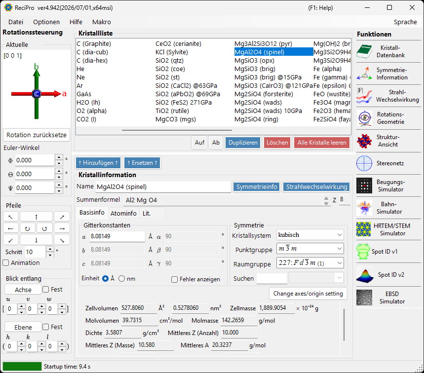
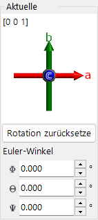
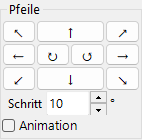
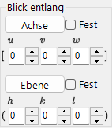
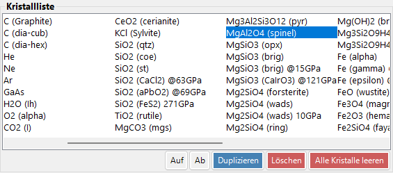
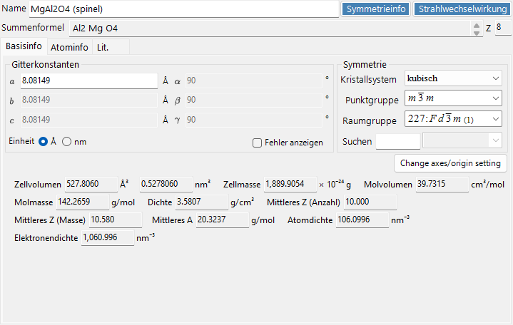
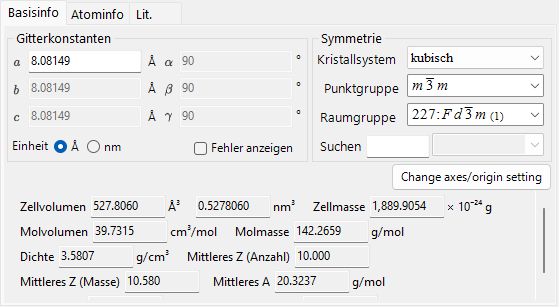
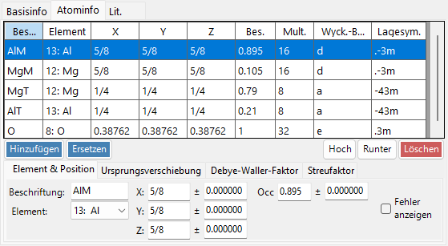
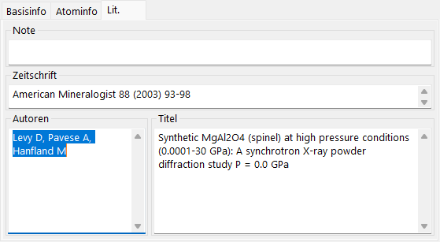
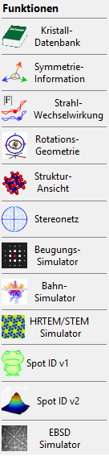

# Hauptfenster

Beim Start von ReciPro erscheint das Hauptfenster. Von diesem Fenster aus wählen Sie den Kristall, steuern seine Rotation und rufen verschiedene Funktionen auf.

| Bereich | Position | Beschreibung |
|------|----------|-------------|
| **Dateimenü** | Oben | Dateioperationen, Optionen, Hilfe |
| **Rotationssteuerung** | Links | Kristallorientierung ansehen/festlegen |
| **Kristallliste** | Oben Mitte | Kristalle auswählen und verwalten |
| **Kristallinformation** | Unten Mitte | Gitterparameter, Symmetrie, Atome bearbeiten |
| **Funktionen** | Rechts | Simulations-/Analysefenster starten |

---

## Tastatur- & Maus-Kurzbefehle {#keyboard-mouse-shortcuts}

Das Hauptfenster installiert mehrere **anwendungsweite** Kurzbefehle. Sie bleiben aktiv, während die Fenster Strukturansicht, Stereonetz, Beugungssimulator, Spot ID und Rechner den Fokus haben.

| Kurzbefehl | Aktion |
|----------|--------|
| <kbd>F1</kbd> | Diese Seite des Online-Handbuchs öffnen |
| <kbd>CTRL</kbd>+<kbd>SHIFT</kbd>+<kbd>D</kbd> | **Beugungssimulator** öffnen / schließen |
| <kbd>CTRL</kbd>+<kbd>SHIFT</kbd>+<kbd>V</kbd> | **Strukturansicht** öffnen / schließen |
| <kbd>CTRL</kbd>+<kbd>SHIFT</kbd>+<kbd>S</kbd> | **Stereonetz** öffnen / schließen |
| <kbd>CTRL</kbd>+<kbd>SHIFT</kbd>+<kbd>T</kbd> | **Spot ID** öffnen / schließen |
| <kbd>CTRL</kbd>+<kbd>SHIFT</kbd> + Pfeiltasten | Den Kristall einen Schritt in diese Richtung drehen (zwei Pfeile gleichzeitig für diagonal) |
| Doppeltipp <kbd>CTRL</kbd> | **Rechner** öffnen / schließen |
| <kbd>CTRL</kbd>+<kbd>SHIFT</kbd>+<kbd>R</kbd> | Das Kennzeichen **Reserved** des ausgewählten Kristalls umschalten |
| <kbd>CTRL</kbd> beim Start von ReciPro halten | Mit deaktiviertem OpenGL starten (Wiederherstellung bei Grafikproblemen) |
| Mit links das Orientierungs-Widget ziehen (unten links, unter *Aktuelle Orientierung*) | Den Kristall drehen |
| Rechts-Doppelklick auf das Orientierungs-Widget | Das Widget-Bild in die Zwischenablage kopieren |
| Einfachklick auf eine Funktionsschaltfläche | Das betreffende Fenster öffnen / schließen |
| Doppelklick auf eine Funktionsschaltfläche | Das Fenster sichtbar erzwingen und in den Vordergrund holen |
| Rechtsklick auf einen Kristall in der Liste | Kontextmenü (Umbenennen / Duplizieren / Löschen / CIF exportieren…) |
| Doppelklick auf die Beschriftung **Current Index** | Das max-UVW-Feld ein-/ausblenden |
| Eine Datei auf das Fenster ablegen | Eine Kristallliste (`.xml`, `.cdb2`) oder einen Kristall (`.cif`, `.amc`) laden |

→ Siehe **[21. Tastatur- & Maus-Kurzbefehle](21-shortcuts.md)** für jedes Fenster auf einen Blick.

---

## Grundlegender Arbeitsablauf

Wenn Sie ReciPro zum ersten Mal verwenden, folgen Sie diesen Schritten:

1. Wählen Sie den gewünschten Kristall in der **Kristallliste**. Um eine CIF/AMC-Datei zu verwenden, ziehen Sie sie per Drag & Drop in die **Kristallinformation**.
2. Wenn Sie Gitterparameter oder Atompositionen bearbeiten, drücken Sie **↑ Hinzufügen ↑** oder **↑ Ersetzen ↑**, damit die Änderungen in die Kristallliste zurückgeschrieben werden.
3. Stellen Sie die Kristallorientierung in der **Rotationssteuerung** über eine Zonenachse, eine Kristallebene, Euler-Winkel oder durch Ziehen mit der Maus ein.
4. Öffnen Sie das gewünschte Werkzeug aus den **Funktionen**. Die Rechenfenster für Beugung, HRTEM/STEM, EBSD und andere verwenden den aktuell ausgewählten Kristall und dessen Orientierung.

---

## Dateimenü

### File

| Menüpunkt | Beschreibung |
|-----------|-------------|
| Read crystal list (as new list) | Eine Kristalllisten-Datei (*.xml) laden und die aktuelle Liste ersetzen |
| Read crystal list (and add) | An die aktuelle Liste anhängen |
| Read initial crystal list | Die Standard-Kristallliste neu laden |
| Save crystal list | Die aktuelle Kristallliste speichern |
| Export selected crystal to CIF | Im CIF-Format speichern |
| Clear crystal list | Alle Kristalle entfernen |
| Exit | Die Anwendung schließen |

### Option

| Menüpunkt | Beschreibung |
|-----------|-------------|
| Show Tooltips | Anzeige der Tooltips umschalten |
| Use Miller-Bravais (hkil) index | In der gesamten Anwendung die 4-Index-Notation für trigonale/hexagonale Systeme verwenden |
| Reset registry settings on exit (effective after restart) | Einstellungen beim nächsten Neustart zurücksetzen |
| Disable Crystallography.Native library (requires restart) | Auf verwalteten Code zurückfallen, falls die native (C++) Bibliothek nicht geladen werden kann |
| Disable all OpenGL rendering (requires restart) | Für ältere GPUs / Remotedesktop |
| Disable OpenGL text rendering (requires restart) | Behelfslösung für Textdarstellungsprobleme auf manchen GPUs |
| Use MKL Library | Intel MKL für numerische Routinen verwenden |
| Dark mode | Zwischen hellem und dunklem Farbdesign umschalten |
| Powder diffraction function (under development) | Das Fenster für polykristalline (Pulver-) Beugung aktivieren |
| Capture GUI Components… | Entwicklerwerkzeug zum Speichern von GUI-Screenshots |

### Help

| Menüpunkt | Beschreibung |
|-----------|-------------|
| Program updates | Prüfen, ob eine neue Version von ReciPro verfügbar ist, und sie installieren |
| Hint | Bedienungshinweise anzeigen (veraltet) |
| Version history | Den Versionsverlauf-Dialog öffnen |
| License | Die MIT-Lizenz anzeigen |
| GitHub page | Das ReciPro-Repository im Browser öffnen |
| Report bugs, requests, or comments | Die GitHub-Issues-Seite öffnen |
| Help (Web) | Das Online-Handbuch auf GitHub Pages in der zur UI-Sprache passenden Seite öffnen. |

Die Sprache wird über das separate Menü **Language** umgeschaltet (Englisch/Japanisch, erfordert Neustart).

### Language

Die UI-Sprache zwischen Englisch und Japanisch umschalten. Die Änderung wird nach einem Neustart von ReciPro wirksam.

### Macro

Öffnet das [Makro](20-macro/index.md)-Fenster, um ReciPro-Operationen mit Python-ähnlichen Skripten zu automatisieren. Für wiederkehrende Arbeitsabläufe siehe die [integrierten Funktionen](20-macro/1-built-in-functions.md) und die [Makro-Beispiele](20-macro/2-examples.md).

---

## Kristallorientierungssteuerung

Der Rotationszustand des Kristalls wird vom Beugungssimulator, der Strukturansicht, dem Stereonetz, dem HRTEM/STEM-Simulator, dem EBSD-Simulator und anderen Fenstern gemeinsam genutzt. Es ist nicht nur eine Ansichtseinstellung — er definiert die Richtung des einfallenden Strahls und die Kristallkoordinatenbeziehung, die in den Simulationen verwendet wird. Ein kurzes Video-Tutorial finden Sie auf der Seite [Bedienung](appendix/a0-how-to-use.md).

### Aktuelle Orientierung

Zeigt die Kristallorientierung. Zum Drehen ziehen. Achsen: rot = *a*, grün = *b*, blau = *c*.

### Rotation zurücksetzen
Setzt auf den Anfangszustand zurück: *c*-Achse senkrecht zum Bildschirm, *b*-Achse nach oben.

### Zonenachse
Zeigt die zur Bildschirmnormalen nächstgelegene Zonenachse an (z. B. *u*+*v*+*w* < 30).

### Euler-Winkel (Z-X-Z)
Stellen Sie die Kristallorientierung mit **Z–X–Z**-Euler-Winkeln ein:

- \(\Phi\): Drehung um die Z-Achse
- \(\Theta\): Drehung um die X-Achse
- \(\Psi\): Drehung um die Z-Achse

Die Drehungen werden in der Reihenfolge \(\Psi \to \Theta \to \Phi\) angewendet. Siehe [Rotationsgeometrie](4-rotation-geometry.md) und [Anhang A1. Koordinatensystem](appendix/a1-coordinate-system/1-orientation.md) für Details.

### Pfeile

Dreht um den Winkel Schritt. Aktivieren Sie Animation für kontinuierliche Drehung.

### Blick entlang

Richtet eine Zonenachse [*uvw*] oder eine Kristallebene (*hkl*) senkrecht zum Bildschirm aus.

- **Fest**: Wenn aktiviert, wird die angegebene Zonenachse oder Ebene während nachfolgender Rotationsoperationen räumlich fixiert gehalten.
- **Achse**: Stellt die eingegebene Zonenachse \([uvw]\) senkrecht zum Bildschirm. Wenn zusätzlich **Ebene** gesetzt ist, wird diese Richtung auf dem Bildschirm nach oben ausgerichtet.
- **Ebene**: Stellt die Normale der eingegebenen Kristallebene \((hkl)\) senkrecht zum Bildschirm. Wenn zusätzlich **Achse** gesetzt ist, wird diese Richtung auf dem Bildschirm nach oben ausgerichtet.

### Grundlegende Möglichkeiten zur Festlegung der Orientierung

| Methode | Anwenden, wenn | Wo |
|--------|----------|-------|
| Ziehen mit der Maus | Sie frei drehen möchten, während Sie die Kristallachsen beobachten. | Panel **Aktuelle Orientierung** |
| Pfeilschaltflächen | Sie kleine, wiederholbare Drehungen möchten. | Panel **Pfeile** |
| Zonenachse | Sie die Blickrichtung kennen, etwa \([001]\) oder \([110]\). | **Blick entlang** / Zonenachsen-Eingabe |
| Ebenennormale | Sie eine Kristallebene \((hkl)\) senkrecht zum Bildschirm möchten. | **Blick entlang** / Ebenen-Eingabe |
| Euler-Winkel | Sie eine reproduzierbare numerische Orientierung benötigen. | **Euler-Winkel (Z-X-Z)** |

Siehe [Rotationsgeometrie](4-rotation-geometry.md) und [Anhang A1. Koordinatensysteme](appendix/a1-coordinate-system/1-orientation.md) für die Rotationsmatrizen und Koordinatenkonventionen.

---

## Kristallliste

~80 Kristalle in der Standardinstallation. Auswählen, um Details anzuzeigen und für Berechnungen festzulegen. **Rechtsklick auf einen Kristall** in der Kristallliste für ein Kontextmenü: *Rename*, *Export as CIF*, *Duplicate*, *Delete*.

| Schaltfläche | Aktion |
|--------|--------|
| Auf / Ab | Reihenfolge ändern |
| Duplicate | Den ausgewählten Kristall kopieren |
| Löschen / Alle Kristalle leeren | Kristalle entfernen |
| ↑ Hinzufügen ↑ / ↑ Ersetzen ↑ | Zur Liste hinzufügen oder den ausgewählten Eintrag ersetzen |

---

## Kristallinformation

Bearbeiten Sie Gitterparameter, Symmetrie und Atome; ziehen Sie CIF/AMC-Dateien per Drag & Drop hinein, um eine Struktur zu laden. Dieses Steuerelement wird von ReciPro, PDIndexer und CSmanager gemeinsam genutzt, aber die angezeigten Registerkarten und Funktionen unterscheiden sich je nach Anwendung. ReciPro zeigt die Registerkarten Basisinfo, Atominfo und Lit. (die Registerkarten EOS, Elasticity und andere sind für die anderen Anwendungen und werden in ReciPro nicht angezeigt).

> **Wichtig**: Drücken Sie **↑ Hinzufügen ↑** oder **↑ Ersetzen ↑**, um Änderungen zu speichern.

Der obere Bereich des Panels zeigt stets **Name** (Kristallname), **Formula** (chemische Formel, aus der Atomliste berechnet) und **Reset** (alle Felder leeren).

### Registerkarte Basisinfo

Gitterparameter, Symmetrie und daraus abgeleitete Größen.

| Element | Beschreibung |
|------|------|
| Cell constants | Gitterparameter a, b, c (in Å = 10⁻¹⁰ m) und α, β, γ. Die Wahl einer Symmetrie schränkt sie automatisch ein (z. B. a=b=c, α=β=γ=90° für kubisch). |
| Symmetry | Wählen Sie Kristallsystem, Punktgruppe und Raumgruppe. Geben Sie in das **Search**-Feld ein, um passende Kandidaten aufzulisten (Groß-/Kleinschreibung beachten). |
| Cell Volume / Cell Mass | Volumen und Masse der Elementarzelle. |
| Molar Volume / Molar Mass / Z / Density | Molvolumen, molare Masse, Anzahl der Formeleinheiten pro Elementarzelle (Z) und Dichte. Wird **nur angezeigt, wenn Atome eingegeben wurden**. |
| Color of Profile | Farbe, die beim Auftragen des Beugungsprofils dieses Kristalls verwendet wird. |

### Registerkarte Atominfoinfo

Legen Sie Spezies, Position, Temperaturfaktor und Streufaktor jedes Atoms fest. Bearbeiten Sie die Atomliste mit **Hinzufügen**, **Ersetzen** (die ausgewählte Zeile ersetzen), **Hoch/Runter** (Reihenfolge ändern) und **Löschen**. Jedes Atom hat:

| Element | Beschreibung |
|------|------|
| Label | Atomkennung (beliebiger Bezeichner). |
| Element | Element (einschließlich Ionenwertigkeit). |
| X, Y, Z | Fraktionelle Koordinaten (0–1). Brüche wie 1/2 oder 2/3 können eingegeben werden. |
| Occ | Besetzung (0–1). |

**Ursprungsverschiebung**: verschiebt den Ursprung aller Atomkoordinaten. Verwenden Sie die voreingestellten Schaltflächen (**+** / **−**) für Standardverschiebungen oder **Apply custom shift** für einen beliebigen Betrag.

**Debye–Waller-Faktor (Temperaturfaktor)**:

| Element | Beschreibung |
|------|------|
| Notation | Die U- oder B-Notation verwenden. |
| Modell | Isotrop oder anisotrop. |
| B##, U## | Für den anisotropen Fall jede Komponente eingeben (B11, …). |

**Scattering factor**: Wählen Sie den für jedes Atom verwendeten Streufaktor.

| Strahlung | Quelle / Einstellung |
|-----------|------|
| X-ray | Streufaktoren einschließlich Ionenwertigkeit (International Tables for Crystallography, Vol. C). |
| Electron | Elektronen-Streufaktoren (Peng 1998, Acta Cryst. A54, 481–485). |
| Neutron | Neutronen-Streulängen. Wählen Sie **Natural isotope abundance** oder **Custom isotope abundance** (eine beliebige Isotopenzusammensetzung). |

### Registerkarte Lit.

Erfassen Sie die Quelle der Struktur: **Note**, **Autoren**, **Zeitschrift** und **Titel**.

### Kontextmenü (Rechtsklick)

Rechtsklick auf einen leeren Bereich des Steuerelements für diese Hauptaktionen:

| Menüpunkt | Aktion |
|-----------|------|
| Beam Interaction | Öffnet das Fenster [Strahl-Wechselwirkung](3-beam-interaction.md). |
| Symmetry information | Öffnet das Fenster [Symmetrieinformationen](2-symmetry-information.md). |
| Import from CIF, AMC | Lädt einen Kristall aus einer CIF-/AMC-Datei. |
| Export to CIF | Exportiert den aktuellen Kristall als CIF. |
| Revert cell constants | Stellt die Zellkonstanten auf die zuerst geladenen Werte zurück. |
| Convert to P1 spacegroup | Erweitert die Struktur auf die Raumgruppe P1. |
| Convert to a superstructure | Konvertiert in eine Überstruktur mit ganzzahligen Vielfachen von a, b, c (Größendialog). |
| Convert to an equivalent space group | Konvertiert in eine äquivalente Raumgruppe (eine andere Achsenaufstellung). |

---

## Funktionen-Panel {#functions}

Die senkrechte Schaltflächenleiste rechts startet die Analyse- und Simulationsfenster (siehe die Tabelle [Funktionen](#functions) unten).

| Schaltfläche | Beschreibung | Details |
|--------|-------------|---------|
| Crystal Database | Kristalle aus den mitgelieferten / Online-Datenbanken suchen und importieren | [1. Kristalldatenbank](1-crystal-database.md) |
| Symmetry Information | Raumgruppeninformationen und ITC-Vol.-A-Symmetriediagramme | [2. Symmetrieinformationen](2-symmetry-information.md) |
| Beam Interaction | Strahl-Kristall-Wechselwirkung: Reflexe, Abschwächung, Streufaktoren, Fluoreszenz | [3. Strahl-Wechselwirkung](3-beam-interaction.md) |
| Rotation Geometry | 3D-Rotationsmatrix / Goniometerwinkel | [4. Rotationsgeometrie](4-rotation-geometry.md) |
| Structure Viewer | 3D-Kristallstruktur | [5. Strukturansicht](5-structure-viewer.md) |
| Stereonet | Stereografische Projektion | [6. Stereonetz](6-stereonet.md) |
| Diffraction Simulator | Einkristall-Röntgen-/Elektronenbeugung | [7. Beugungssimulator](7-diffraction-simulator/index.md) |
| Trajectory Simulator | Monte-Carlo-Simulation von Elektronenbahnen | [8. Elektronenbahnen](8-electron-trajectory.md) |
| HRTEM/STEM Simulator | HRTEM-/STEM-Bildsimulation | [9. HRTEM/STEM-Simulator](9-hrtem-stem-simulator/index.md) |
| Spot ID v1 | SAED-Musterindizierung (früher „TEM ID") | [10. Spot ID v1](10-spot-id.md) |
| Spot ID v2 | Reflexerkennung & Indizierung | [11. Spot ID v2](11-spot-id-v2.md) |
| EBSD Simulator | EBSD-Mustersimulation | [12. EBSD-Simulation](12-ebsd-simulation.md) |
| Powder Diffraction | Polykristalline (Pulver-) Beugung — über **Option ▸ Powder diffraction function** aktivieren | - |

---

## Siehe auch

- [Kristalldatenbank](1-crystal-database.md)
- [Rotationsgeometrie](4-rotation-geometry.md)
- [Strukturansicht](5-structure-viewer.md)
- [Beugungssimulator](7-diffraction-simulator/index.md)
- [Tastatur- & Maus-Kurzbefehle](21-shortcuts.md)
- [Grundlegendes Koordinatensystem & Kristallorientierung](appendix/a1-coordinate-system/1-orientation.md)
