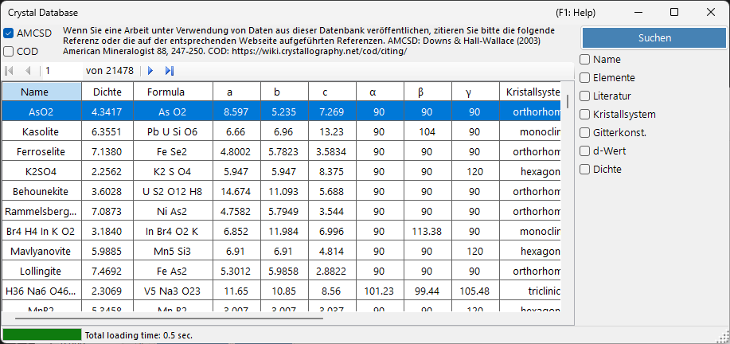
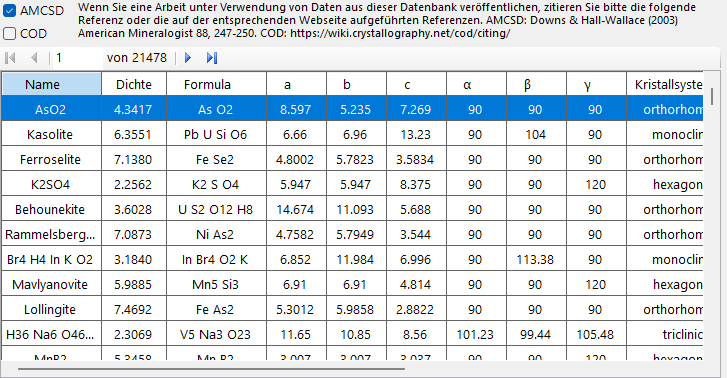
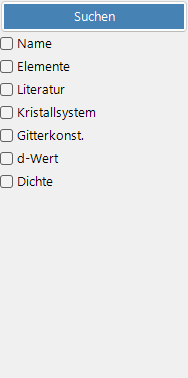

# Kristalldatenbank

Die **Kristalldatenbank** bietet Funktionen zum Suchen und Importieren von Kristallstrukturen aus zwei Quellen, die über die Kontrollkästchen **AMCSD** und **COD** ausgewählt werden:

- **AMCSD** : die mitgelieferte [American Mineralogist Crystal Structure Database](https://www.rruff.net/) (mehr als 20.000 Strukturen).
- **COD** : die [Crystallography Open Database](https://www.crystallography.net/cod/). Da die Datei groß ist, wird sie nicht mit dem Installationsprogramm mitgeliefert; die Datenbankdatei wird bei der ersten Verwendung automatisch heruntergeladen. Wenn die Datei auf dem Server aktualisiert wird, werden Sie aufgefordert, sie erneut herunterzuladen.

Bitte zitieren Sie die folgenden Referenzen, wenn Sie diese Datenbanken verwenden.

Bei Verwendung von **AMCSD**:

> Downs, R.T. and Hall-Wallace, M. (2003) The American Mineralogist Crystal Structure Database. *American Mineralogist* **88**, 247-250.

Bei Verwendung von **COD**:

> Gražulis, S. et al. (2009) Crystallography Open Database – an open-access collection of crystal structures. *Journal of Applied Crystallography* **42**, 726-729.
>
> Gražulis, S. et al. (2012) Crystallography Open Database (COD): an open-access collection of crystal structures and platform for world-wide collaboration. *Nucleic Acids Research* **40**, D420-D427.

---

## Tastatur- & Maus-Kurzbefehle

Dieses Fenster hat keine Tastenkombinationen mit Modifizierertasten; es wird durch gewöhnliche Klicks gesteuert. Die einzigen nicht offensichtlichen Eingaben sind:

| Kurzbefehl | Aktion |
|----------|--------|
| <kbd>F1</kbd> | Diese Seite des Online-Handbuchs öffnen |
| <kbd>ENTER</kbd> in einem beliebigen Suchfeld | Die Datenbanksuche ausführen (entspricht der Schaltfläche **Suchen**) |
| Auf eine Zeile in der Ergebnistabelle klicken | Diesen Kristall in das Hauptfenster laden |
| Auf ein Element im Popup **Periodic table** klicken | Seinen Filter durchschalten: *ignore* → *must include* → *must exclude* |

→ Siehe **[21. Tastatur- & Maus-Kurzbefehle](21-shortcuts.md)** für einen Überblick über jedes Fenster.

---

## Tabelle

Zeigt Kristalle an, die den Suchkriterien entsprechen. Wählen Sie einen Kristall aus, um ihn in die Kristallinformation des Hauptfensters zu übertragen. Drücken Sie **Add** oder **Replace**, um ihn zur Kristallliste hinzuzufügen.

---

## Suchoptionen

Geben Sie unten die Suchkriterien ein und drücken Sie die Schaltfläche **Suchen** oder die **Enter**-Taste.

| Kriterium | Beschreibung |
|-----------|-------------|
| **Name** | Kristallname |
| **Element** | Periodensystem-Auswahl (darf/muss/darf nicht enthalten) |
| **Literatur** | Titel, Zeitschrift, Autor |
| **Kristallsystem** | Kristallsystem auswählen |
| **Gitterkonst.** | Gitterkonstanten und Fehler |
| **d-spacing** | d-Werte des stärksten Reflexes und Fehler |
| **Dichte** | Dichte und Fehler |

### Name

Freitext-Abgleich gegen den Kristallnamen. Teilübereinstimmungen sind zulässig.

### Element

Drücken Sie die Schaltfläche **Periodic Table**, um die Elementauswahl zu öffnen. Jede Element-Schaltfläche durchläuft drei Zustände:

- **May or may not include** (Standard – grau)
- **Must include** (grün)
- **Must exclude** (rot)

Die drei Schaltflächen oben im Fenster setzen mit einem Klick jedes Element auf einen der drei Zustände zurück.

### Literatur

Freitext-Abgleich gegen die Publikationsmetadaten: Titel der Arbeit, Name der Zeitschrift und Autorenliste.

### Kristallsystem

Beschränkt die Suche auf ein bestimmtes Kristallsystem (Cubic, Tetragonal, Orthorhombic, Hexagonal, Trigonal, Monoclinic, Triclinic).

### Suche nach Zellparametern

Geben Sie die gewünschten Gitterkonstanten *a*, *b*, *c*, *α*, *β*, *γ* und zulässige Fehler ein. Leere Felder werden als Platzhalter behandelt.

### d-spacing

Geben Sie den *d*-Wert (d-spacing) des stärksten Reflexes (oder mehrerer starker Reflexe) und einen zulässigen Fehler ein. Nützlich, wenn aus einem Experiment nur die Positionen der Beugungspeaks bekannt sind.

### Dichte

Filtern nach Massendichte (g/cm³) innerhalb eines zulässigen Fehlerbandes.

---

## Siehe auch

- [Hauptfenster](0-main-window.md)
- [Symmetrieinformationen](2-symmetry-information.md)
- [Strahl-Wechselwirkung](3-beam-interaction.md)
- [Strukturansicht](5-structure-viewer.md)
