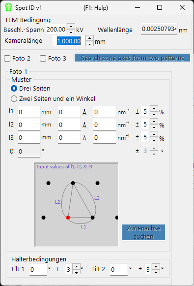

# Spot ID v1

**Spot ID v1** erkennt, fittet und indiziert Beugungsreflexe aus experimentellen Elektronenbeugungsbildern. Zusätzlich unterstützt es die manuelle Zonenachsensuche anhand einer numerisch eingegebenen Reflexgeometrie (das frühere **TEM ID**).

---

## Tastatur- & Maus-Kurzbefehle

Spot ID v1 nimmt die Reflexgeometrie als **numerische Eingabe** entgegen (der frühere *TEM ID*-Arbeitsablauf), und Reflexerkennung/-fit erfolgt schaltflächengesteuert; das Beugungsbild wird nur zur Referenz angezeigt und ist nicht klickbar (Mauszoom und manuelles Auswählen von Reflexen gehören zu [Spot ID v2](11-spot-id-v2.md)). Der einzige Kurzbefehl befindet sich im Ergebnisfenster:

| Kurzbefehl | Aktion |
|----------|--------|
| <kbd>F1</kbd> | Diese Seite des Online-Handbuchs öffnen |
| Doppelklick auf eine Zeile in der Ergebnisliste | Diesen Kristall auswählen und in die zugehörige Zonenachse drehen |

→ Siehe **[21. Tastatur- & Maus-Kurzbefehle](21-shortcuts.md)** für einen Überblick über alle Fenster.

---

## Hauptbereich

Zeigt das Beugungsbild zur Referenz an. Bilder werden per Drag & Drop oder über das Menü **File** geladen.

### Bildanpassungen

| Einstellung | Beschreibung |
|---------|-------------|
| Min / Max | Helligkeitsbereich (auch über den Schieberegler einstellbar) |
| Gradient | Positiv oder Negativ |
| Scale | Linear oder Log |
| Colour | Graustufen oder Cold-Warm |
| Dust & Scratch | Außergewöhnlich helle/dunkle Pixel entfernen (Bereich und Schwellenwert festlegen) |
| Gaussian blur | Weichzeichnung anwenden (Bereich in Pixeln) |

---

## Optik

Geben Sie die einfallende Quelle, Energie/Wellenlänge, Kameralänge und Detektor-Pixelgröße ein.

> Wird eine dm3/dm4-Datei (Gatan Digital Micrograph) geladen, werden diese Werte automatisch gesetzt.

---

## Reflexerkennung und -fit

Drücken Sie **Detect & fit spots**, um Beugungsreflexe automatisch zu erkennen und sie mit einer 2D-Pseudo-Voigt-Funktion zu fitten. Die Ergebnisse erscheinen in der Tabelle.

### Erkennungsoptionen

| Parameter | Beschreibung |
|-----------|-------------|
| Number | Maximale Anzahl der zu erkennenden Reflexe |
| Nearest neighbour | Mindestabstand zwischen erkannten Reflexen |
| Fitting range | Radius (Pixel) um jeden Reflex für den Fit |

### Tabellensteuerung

| Schaltfläche | Aktion |
|--------|--------|
| Reset range | Fit-Bereich für alle Reflexe zurücksetzen |
| Show label/symbol | Bezeichnungen/Symbole auf dem Bild überlagern |
| Clear all spots | Alle Reflexe entfernen |
| Save / Copy | Tabelle im tabulatorgetrennten Format (Excel) exportieren |
| Re-fit all | Alle Reflexe neu fitten |

### Reflexdetail-Fenster

Aktivieren Sie das Kontrollkästchen, um ein Detailfenster zu öffnen, das den ausgewählten Reflex (links) und Profile in vier Richtungen (rechts) zeigt. Blau = Messdaten, rot = Fit.

---

## Index

Drücken Sie **Identify spots**, um erkannte Reflexe gegen den im Hauptfenster ausgewählten Kristall zu indizieren.

| Einstellung | Beschreibung |
|---------|-------------|
| Acceptable error | Toleranz für die Indizierung |
| Single grain / Multi grains | Als Einkristall oder als mehrere Körner indizieren (maximale Kornanzahl festlegen) |
| Show label/symbol | Indizierte Bezeichnungen auf dem Bild überlagern |
| Refine thickness and direction | Dynamische Theorie (Bethe-Methode) anwenden, um Probendicke und Kristallorientierung zu verfeinern, die am besten zu den erkannten Intensitäten passen |

---

## Zonenachsensuche aus der Reflexgeometrie (früher TEM ID)

Wenn Sie kein Bild zum Laden haben, können Sie dennoch nach Kandidaten-Zonenachsen suchen, indem Sie die Geometrie eines Feinbereichs-Elektronenbeugungsmusters (SAED) von Hand eingeben. Geben Sie die TEM-Beobachtungsbedingungen und die Reflexgeometrie ein und drücken Sie dann **Zonenachsen aus drei Mustern suchen**, um Kandidaten für die Kristallorientierung zu finden.

### TEM-Bedingung

Geben Sie die TEM-Beobachtungsbedingungen ein (Beschleunigungsspannung, Kameralänge usw.).

### Foto 1, 2, 3

Geben Sie die Geometrie der Beugungsreflexe ein.

- Um den Abstand zwischen zwei Reflexen auf dem Detektor einzugeben, verwenden Sie das Feld **mm**.
- Wenn Sie den *d*-Wert kennen, geben Sie ihn in den Einheiten **Å** oder **nm⁻¹** ein.

**Three sides mode** : Geben Sie die Längen der drei Seiten eines Dreiecks ein, dessen einer Eckpunkt der direct spot ist.

**Two sides and an angle mode** : Geben Sie die Längen zweier Seiten ein (einschließlich des direct spot) sowie den Winkel zwischen ihnen.

---

## Siehe auch

- [Spot ID v2](11-spot-id-v2.md)
- [Beugungssimulator](7-diffraction-simulator/index.md)
- [Hauptfenster](0-main-window.md)
- [Kristalldatenbank](1-crystal-database.md)
- [EBSD-Simulation](12-ebsd-simulation.md)
