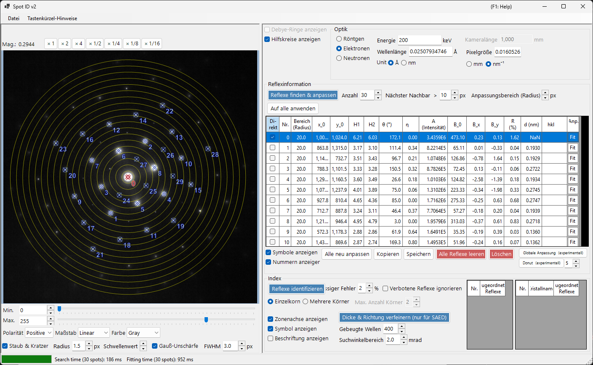
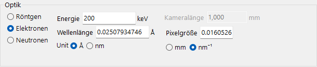
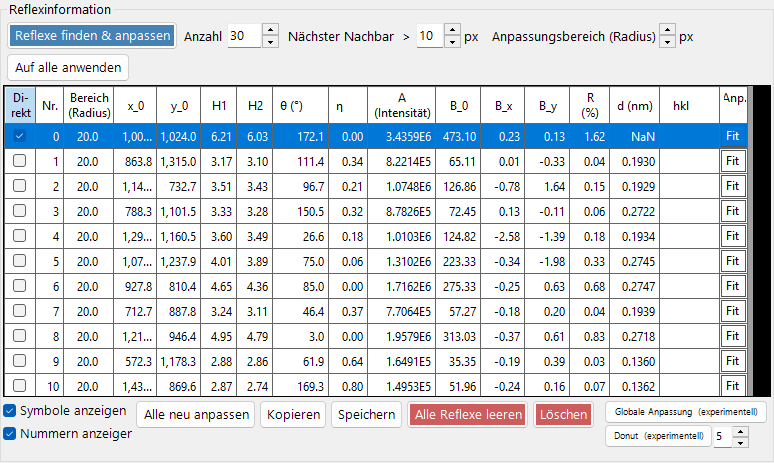
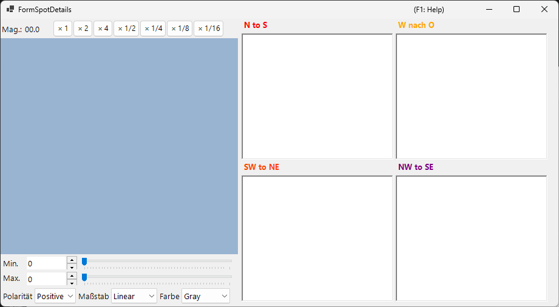
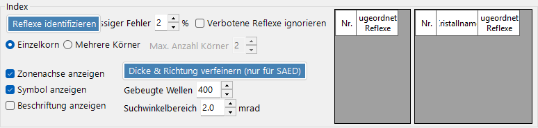

# Spot ID v2

**Spot ID v2** ist die erweiterte Version von [Spot ID](10-spot-id.md) mit verbesserter Reflexerkennung, verbesserten Fit-Algorithmen und einer leistungsfähigeren Indizierungs-Engine.

---

## Tastatur- & Maus-Kurzbefehle

Die Reflexliste erstellen Sie direkt auf dem geladenen Bild. Der Bildbereich nutzt die standardmäßige [Bildansicht-Navigation](21-shortcuts.md) von ReciPro zum Verschieben/Zoomen; für die Reflexbearbeitung kommen die folgenden Kombinationen hinzu.

| Kurzbefehl | Aktion |
|----------|--------|
| <kbd>F1</kbd> | Diese Seite des Online-Handbuchs öffnen |
| Linker Doppelklick auf das Bild | Einen Reflex an diesem Punkt hinzufügen (Peak-gefittet) |
| <kbd>CTRL</kbd> + linker Doppelklick | Einen Reflex hinzufügen und als direkten (000) Strahl markieren |
| Linksklick auf einen Reflex | Den nächstgelegenen Reflex auswählen |
| <kbd>CTRL</kbd> + Rechtsklick auf einen Reflex | Den nächstgelegenen Reflex löschen |
| <kbd>CTRL</kbd> + Pfeiltasten | Den ausgewählten Reflex um ein Pixel verschieben |
| Linksziehen / Mittelziehen (leerer Bereich) | Das Bild verschieben |
| Mausrad | Am Cursor hinein-/herauszoomen |
| Rechtsziehen eines Rahmens | In den ausgewählten Bereich hineinzoomen |
| Rechter Doppelklick | Herauszoomen |
| Doppelklick auf den Zeilenkopf eines Reflexes (Tabelle) | Auf diesen Reflex zoomen (×2) |

Mit <kbd>CTRL</kbd>+<kbd>SHIFT</kbd>+<kbd>T</kbd> im Hauptfenster wird dieses Fenster geöffnet/geschlossen.

→ Siehe **[21. Tastatur- & Maus-Kurzbefehle](21-shortcuts.md)** für jedes Fenster auf einen Blick.

---

## Menü „Datei“

Ein Beugungsbild öffnen/speichern. Das gleiche Laden per Drag & Drop wie bei [Spot ID v1](10-spot-id.md) wird unterstützt, und Gatan-DM3/DM4-Metadaten (Kameralänge, Wellenlänge, Pixelgröße) werden automatisch berücksichtigt.

---

## Optik

### Strahlungsquelle

Wählen Sie den Strahlungstyp (Röntgen / Elektron / Neutron) und stellen Sie die Energie oder Wellenlänge ein.

### Kameralänge / Pixelgröße

Die Kameralänge (mm) und die Detektor-Pixelgröße (mm oder nm⁻¹). Wenn eine Gatan-DM-Datei geladen wird, werden diese Werte aus dem Dateikopf übernommen.

---

## Reflexinformation

- **Detect & Fit Spots**: Automatische Reflexerkennung mittels lokaler Maxima und Untergrundabzug.
- **Number**: Die maximale Anzahl der zu erkennenden Reflexe.
- **Nearest neighbour**: Der minimale Abstand (px), der zwischen erkannten Reflexen zulässig ist. Peaks, die enger beieinander liegen, werden zusammengeführt, um eine Doppelerkennung desselben Reflexes zu verhindern.
- **Fitting range (radius)**: Der Radius (px) des kreisförmigen Bereichs, der zum Fitten des Peaks jedes Reflexes verwendet wird. Pixel innerhalb dieses Kreises werden mit einer Pseudo-Voigt-Funktion gefittet.
- **Apply to All**: Setzt den Fit-Radius jedes Reflexes auf den aktuellen Wert von **Fitting range (radius)**.
- **Delete spot / Clear spots**: Einzelne oder alle erkannten Reflexe entfernen.
- **Copy to clipboard**: Reflexpositionen und -intensitäten in die Zwischenablage kopieren.
- **Details of the spot**: Wenn aktiviert, öffnet sich ein Fenster mit detaillierten Informationen zum aktuell ausgewählten Reflex.

---

## Index

- **Identify Spots**: Führt den Indizierungsalgorithmus aus, um den am besten passenden Kristall und die Zonenachse zu finden.
- **Acceptable error**: Legt die akzeptable Abweichung im Netzebenenabstand und Winkel für eine Übereinstimmung fest.
- **Ignore prohibited reflections**: Wenn aktiviert, werden durch Schraubenachsen und Gleitspiegelebenen verbotene Reflexe bei der Suche nach der Zonenachse als nicht zwingend erfüllt behandelt.
- **Single Grain / Multiple Grains**: Suche nach einer einzelnen Orientierung (Einkristall) oder nach mehreren Orientierungen (ein polykristalliner / Mehrkorn-Bereich). Für mehrere Körner legt **Max. num. of grains** die Obergrenze für die Anzahl der zu suchenden Körner fest.
- **Results**: Die besten Übereinstimmungen werden mit Kristallname, Zonenachse [uvw] und den einzelnen Reflexindizes (hkl) angezeigt.

---

## Verbesserungen gegenüber v1

- Bessere Rauschbehandlung bei der Reflexerkennung.
- Robustere Fit-Algorithmen mit mehreren Profilformen.
- Schnellere Indizierung mit optimierten Suchalgorithmen.
- Unterstützung für überlappende Reflexe und Satellitenreflexe.

---

## Siehe auch

- [Spot ID v1](10-spot-id.md)
- [Beugungssimulator](7-diffraction-simulator/index.md)
- [Hauptfenster](0-main-window.md)
- [Tastatur- & Maus-Kurzbefehle](21-shortcuts.md)
