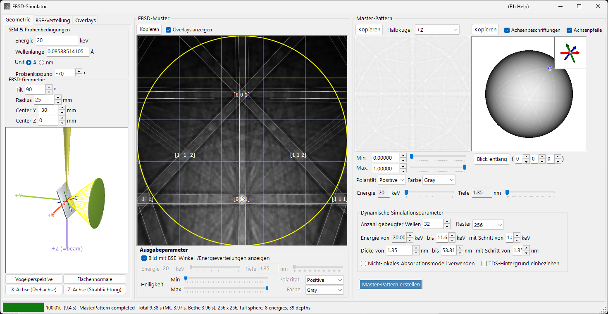
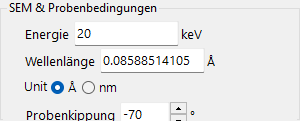
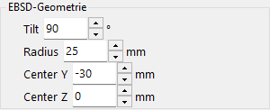
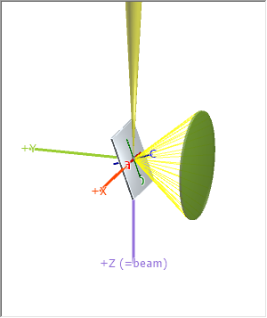
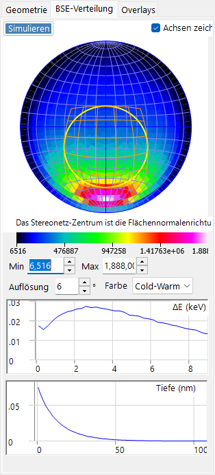
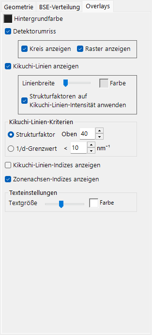
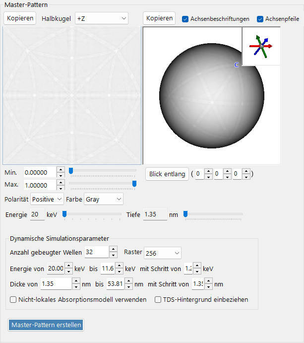
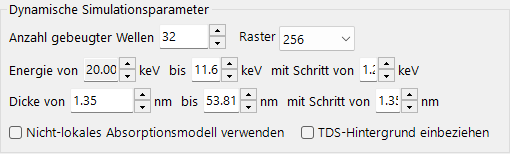
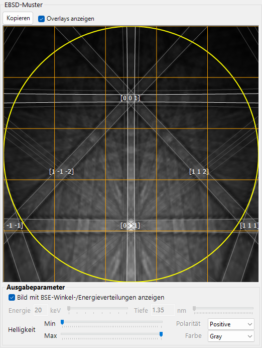

# EBSD-Simulation

Der **EBSD-Simulator** simuliert die mittels Elektronenrückstreubeugung (EBSD) in einem Rasterelektronenmikroskop (REM) erhaltenen Beugungsmuster — Kikuchi-Muster — anhand dynamisch-theoretischer Berechnungen. Er berechnet die Winkel-/Energie-/Tiefenverteilung der rückgestreuten Elektronen (BSE) mittels einer Monte-Carlo-Simulation, erstellt ein dynamisches (Bloch-Wellen-)**Master-Muster** des Kristalls und projiziert es für die aktuelle Kristallorientierung auf den Detektor.

Das Fenster besitzt drei Spalten.

- **Links** : Simulationsbedingungen. Die Registerkarten wählen **Geometry** (Proben-/Detektorgeometrie und eine 3D-Ansicht), **BSE Distribution** (Verteilungen der rückgestreuten Elektronen) und **Overlays** (Kikuchi-Linien und weitere Beschriftungen).
- **Mitte** : das EBSD-(Kikuchi-)Muster für die aktuelle Kristallorientierung.
- **Rechts** : das orientierungsunabhängige Master-Muster (2D-Projektion und 3D-Kugel).

---

## Tastatur- & Maus-Kurzbefehle

Die zentrale EBSD-(Kikuchi-)Musteransicht und die rechtsseitigen Master-Muster-Ansichten reagieren auf unterschiedliche Mausaktionen.

| Kurzbefehl | Aktion |
|----------|--------|
| <kbd>F1</kbd> | Diese Seite des Online-Handbuchs öffnen |
| Muster nahe der Mitte links ziehen | Kristall kippen |
| Im äußeren Bereich des Musters links ziehen | Kristall drehen |
| Doppelklick auf das Muster | Die Detektor-Teilzelle unter dem Cursor auswählen und ihre Statistik anzeigen |
| In einer 3D-Ansicht (Geometrie / Master-Kugel) links ziehen | Drehen |
| Rechts ziehen oder Mausrad in einer 3D-Ansicht | Zoomen |
| <kbd>CTRL</kbd> + Rechtsdoppelklick in einer 3D-Ansicht | Orthografisch / perspektivisch umschalten |
| Ziehen / Mausrad auf dem 2D-Master-Muster | Bild verschieben / zoomen |

Die 3D-Ansichten verwenden die standardmäßige [Ansichtsnavigation](21-shortcuts.md) von ReciPro (Verschieben deaktiviert).

→ Siehe **[21. Tastatur- & Maus-Kurzbefehle](21-shortcuts.md)** für einen Überblick über alle Fenster.

---

## Arbeitsablauf

Das Drücken von **Build Master Pattern** führt die folgenden Schritte der Reihe nach aus.

1. **Monte-Carlo-BSE-Simulation** : Anhand der aktuellen Kristallzusammensetzung, Dichte, Beschleunigungsspannung und Probenkippung werden etwa 2,5 Millionen Elektronen innerhalb der Probe verfolgt (elastische Streuung: Mott/NIST-Wirkungsquerschnitte; inelastische Streuung: Modell der dielektrischen Antwort). Dies liefert die gemeinsame Verteilung von *Eindringtiefe × Austrittsrichtung × Austrittsenergie* der rückgestreuten Elektronen.
2. **Automatische Bereichswahl** : Aus dieser Verteilung werden der Energiebereich (von der Einfallsenergie bis etwa zum 80. Perzentil des Energieverlusts) und der Tiefenbereich (bis etwa zum 99. Perzentil der Eindringtiefe), die in der dynamischen Berechnung verwendet werden, automatisch festgelegt.
3. **Master-Muster-Erstellung** : Für jede Energie und Tiefe wird das dynamische Beugungsproblem (Bloch-Wellen) gelöst und über die Kugel der Richtungen integriert, gewichtet mit der Monte-Carlo-Verteilung, um die Rückstreubeugungsintensität in jeder Richtung zu liefern. Das Ergebnis wird auf einem flächentreuen (Rosca–Lambert-)Gitter gespeichert.
4. **Projektion auf den Detektor, mit Gewichtung** : Für die aktuelle Kristallorientierung wird die Intensität für die von jedem Detektorpixel aufgespannte Richtung im Master-Muster nachgeschlagen und als Kikuchi-Muster gezeichnet, optional gewichtet mit der BSE-Winkel-/Energieverteilung.

Die Energie- und Tiefenbereiche werden in den Schritten 1–2 automatisch festgelegt, können aber vor der Erstellung manuell angepasst werden.

---

## REM-EBSD-Einstellungen

### REM- & Probenbedingungen

- **Energy** : Beschleunigungsspannung des einfallenden Strahls (keV).
- **Wavelength** : Elektronenwellenlänge (Å), gekoppelt an Energy.
- **Sample tilt** : Probenkippwinkel (typisch 70°). Die starke Kippung bei EBSD erhöht die Ausbeute an rückgestreuten Elektronen.

### EBSD-Geometrie

- **Detector tilt** : Kippung des Detektors (Leuchtschirm).
- **Detector radius** : Radius des Detektors (mm); legt das Winkelsichtfeld des gezeichneten Musters fest.
- **Detector center** : Position (Y, Z) der Detektormitte relativ zum Strahlauftreffpunkt (mm).

Die Geometrie lässt sich in der 3D-Ansicht auf der Registerkarte **Geometry** inspizieren.

Die graue Platte ist die Probe, der grüne Zylinder/Kegel ist der Detektor, und das violette **+Z (=beam)** ist der einfallende Strahl. Die Kristallachsen **a / b / c** (fest mit der Probe verbunden) werden ebenfalls angezeigt. Die Schaltflächen **Bird's-Eye View**, **Surface Normal**, **X Axis (Rotation Axis)** und **Z Axis (Beam Direction)** richten die Ansicht an Standardrichtungen aus. Siehe [Anhang A1. Koordinatensysteme](appendix/a1-coordinate-system/2-diffraction.md) für die Definitionen der Koordinatensysteme.

---

## BSE-Verteilung

Die Registerkarte **BSE Distribution** zeigt die Monte-Carlo-Verteilungen der rückgestreuten Elektronen. Verwenden Sie **Simulate**, um sie neu zu berechnen.

- **Stereonet** : Winkelverteilung (Histogramm der Austrittsrichtungen) der rückgestreuten Elektronen. Die Mitte ist die Oberflächennormalenrichtung, und die gelb/orangefarbene Umrandung markiert den vom Detektor aufgespannten Bereich. **Draw axes** überlagert die Kristallachsen, und die Farbskala (Min/Max, Auflösung, Farbe) ist einstellbar.
- **ΔE (keV)** : Energieverlustverteilung der rückgestreuten Elektronen.
- **Depth (nm)** : Verteilung der endgültigen Austrittstiefe der rückgestreuten Elektronen.

Diese Verteilungen werden von derselben Monte-Carlo-Engine wie bei [Elektronenbahnen](8-electron-trajectory.md) berechnet und dienen der Gewichtung des Master-Musters.

---

## Overlays

Die Registerkarte **Overlays** konfiguriert die auf dem EBSD-Muster gezeichneten Beschriftungen.

- **Background color** : Hintergrundfarbe.
- **Detector outline** : die Detektorumrandung. **Show circle** (Umfang) / **Show mesh** (Gitter).
- **Show Kikuchi lines** : Kikuchi-Linien zeichnen. **Line Width** / **Color** sowie **Apply structure factors to Kikuchi line intensity**.
- **Show Kikuchi line indices** : Indizes der Kikuchi-Linien (Bänder) anzeigen.
- **Show zone axis indices** : Zonenachsenindizes anzeigen.
- **Kikuchi line criteria** : welche Kikuchi-Linien gezeichnet werden: **Structure factor** (die obersten *N* nach Strukturfaktor) oder **1/d Cutoff** (jene mit 1/d unterhalb eines Schwellenwerts).
- **Text settings** : **Text Size** / **Color** der Indexbeschriftungen.

---

## Master-Muster

Das Master-Muster ist die Rückstreubeugungsintensität über alle Richtungen, im Voraus durch die dynamische Theorie mit **Build Master Pattern** berechnet.

- **2D-Ansicht** (links) : flächentreue Projektion einer Halbkugel. **Hemisphere** wählt die projizierte Halbkugel (+Z / −Z).
- **3D-Ansicht** (rechts) : eine Kugel mit darauf abgebildeter Intensität. Sie kann mit der Maus gedreht werden, und ein Einschub oben rechts zeigt die synchronisierten Kristallachsen (a/b/c). **Axis Labels** / **Axis Arrows** schalten die Beschriftungen/Pfeile um, und **View Along** blickt entlang einer gewählten Zonenachse [u v w].
- **Min / Max, Polarity, Color** : angezeigter Intensitätsbereich, Polarität und Farbskala.
- **Energy / Depth**-Schieberegler : wählen die anzuzeigende Energie-/Tiefenscheibe.
- Jede Ansicht kann mit **Copy** in die Zwischenablage übertragen werden.

### Parameter der dynamischen Simulation

- **Number of diffracted waves** : Anzahl der in die Bloch-Wellen-Berechnung einbezogenen gebeugten Strahlen (Wellen). Mehr Wellen sind genauer, aber langsamer.
- **Grid** : Auflösung des Master-Muster-Gitters (Standard 256).
- **Energy from … to … with step of …** : integrierter Energiebereich und Schrittweite (keV); aus dem Monte-Carlo-Ergebnis automatisch festgelegt.
- **Thickness from … to … with step of …** : integrierter Tiefenbereich und Schrittweite (nm); ebenfalls automatisch festgelegt.
- **Use non-local absorption model** : die nicht-lokale Absorptionsform verwenden.
- **Include TDS background intensities** : den Untergrund der thermisch-diffusen Streuung (TDS) einbeziehen.

---

## EBSD-Muster

Das zentrale Feld zeigt das EBSD-(Kikuchi-Band-)Muster für die aktuelle Kristallorientierung.

- **Show Dynamical EBSD Pattern (Master Pattern Required)** : projiziert das erstellte Master-Muster auf den Detektor.
- **Show overlays** : zeichnet die Overlays (unten), etwa Kikuchi-Linien und Indizes.
- **Output parameters**
  - **Show image with BSE angular/energy distributions** : ist diese Option aktiviert, wird das Muster durch Gewichtung mit der BSE-Verteilung (Energie, Tiefe, Richtung) statt einer einzelnen Scheibe zusammengesetzt.
  - **Energy / Depth** : ist das Obige deaktiviert, wählt dies die anzuzeigende Energie-/Tiefenscheibe.
  - **Brightness (Min/Max), Polarity, Color** : Helligkeitsbereich, Polarität und Farbskala.
- **Copy** : kopiert das Muster in die Zwischenablage.

---

## Siehe auch

- [Elektronenbahnen](8-electron-trajectory.md) — Monte-Carlo-Elektronenbahn- / BSE-Simulation, die zur Winkel-/Energie-/Tiefengewichtung verwendet wird.
- [Beugungssimulator](7-diffraction-simulator/index.md) — dynamische (Bloch-Wellen-)Elektronenbeugung.
- [Anhang A1. Koordinatensysteme](appendix/a1-coordinate-system/2-diffraction.md) — Definitionen der Proben-/Detektorkoordinatensysteme.
