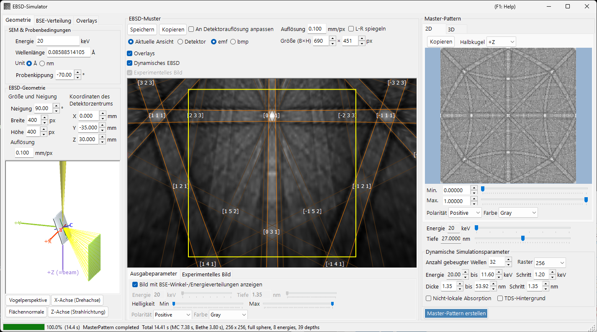
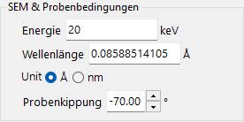
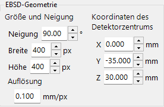
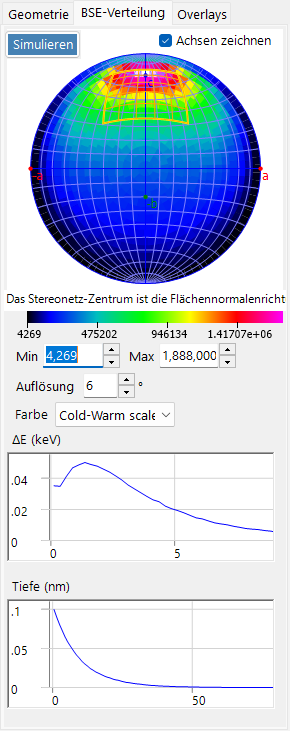
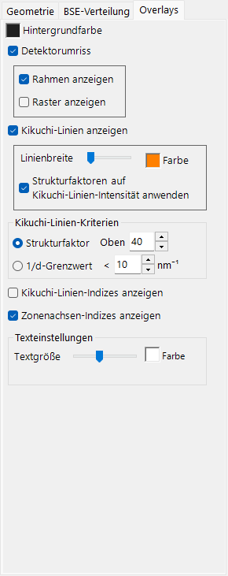
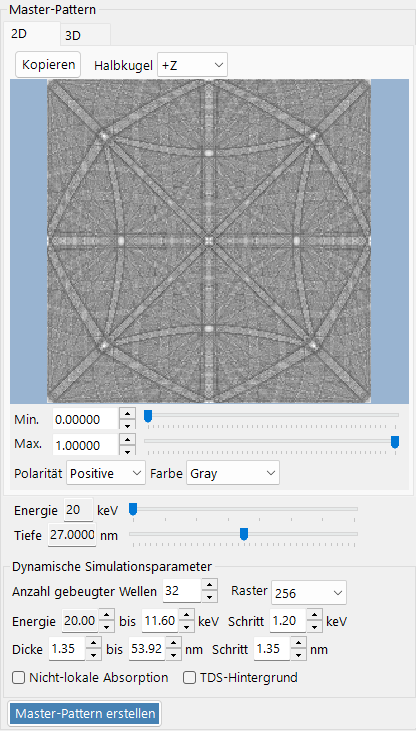
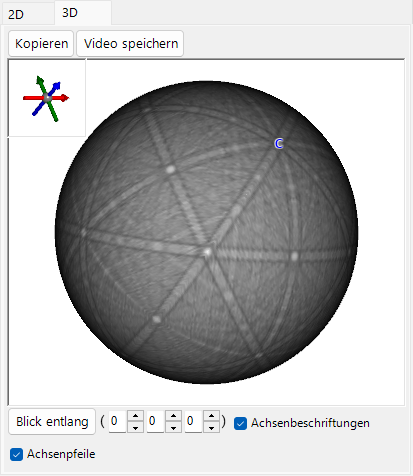
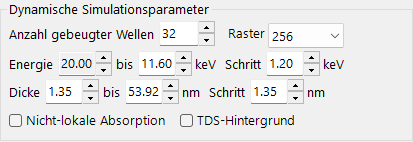
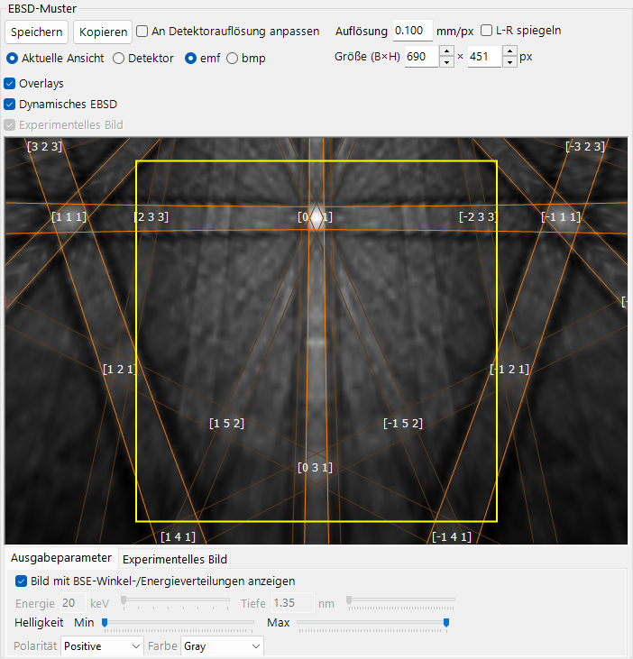
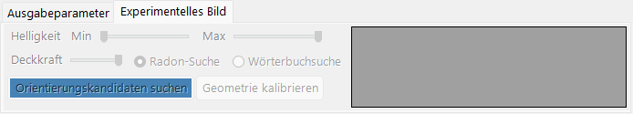

# EBSD-Simulation

Der **EBSD-Simulator** simuliert die mittels Elektronenrückstreubeugung (EBSD) in einem Rasterelektronenmikroskop (REM) erhaltenen Beugungsmuster — Kikuchi-Muster — anhand dynamisch-theoretischer Berechnungen. Er berechnet die Winkel-/Energie-/Tiefenverteilung der rückgestreuten Elektronen (BSE) mittels einer Monte-Carlo-Simulation, erstellt ein dynamisches (Bloch-Wellen-)**Master-Muster** des Kristalls und projiziert es für die aktuelle Kristallorientierung auf den Detektor. Ein experimentelles EBSD-Bild kann ebenfalls geladen und **indiziert** werden: Die Orientierung, die es am besten erklärt, wird automatisch gesucht ([Experimentelles Bild](#experimentelles-bild)).

Das Fenster besitzt drei Spalten.

- **Links** : Simulationsbedingungen. Die Registerkarten wählen **Geometrie** (Proben-/Detektorgeometrie und eine 3D-Ansicht), **BSE-Verteilung** (Verteilungen der rückgestreuten Elektronen) und **Overlays** (Kikuchi-Linien und weitere Beschriftungen).
- **Mitte** : das EBSD-(Kikuchi-)Muster für die aktuelle Kristallorientierung. Darunter wählen die Registerkarten **Ausgabeparameter** und **Experimentelles Bild**.
- **Rechts** : das orientierungsunabhängige Master-Muster in den Registerkarten **2D** und **3D**.

Die Statusleiste am unteren Rand zeigt den Fortschritt der laufenden Berechnung und eine Zusammenfassung ihres Ergebnisses.

---

## Tastatur- & Maus-Kurzbefehle

Die zentrale EBSD-(Kikuchi-)Musteransicht und die rechtsseitigen Master-Muster-Ansichten reagieren auf unterschiedliche Mausaktionen.

| Kurzbefehl | Aktion |
|----------|--------|
| <kbd>F1</kbd> | Diese Seite des Online-Handbuchs öffnen |
| Muster nahe der Mitte links ziehen | Kristall kippen |
| Im äußeren Bereich des Musters links ziehen | Kristall drehen |
| Doppelklick auf das Muster | Die Detektor-Teilzelle unter dem Cursor auswählen und ihre Statistik anzeigen |
| Bilddatei auf das Fenster ziehen | Sie als experimentelles EBSD-Bild laden |
| In einer 3D-Ansicht (Geometrie / Master-Kugel) links ziehen | Drehen |
| Rechts ziehen oder Mausrad in einer 3D-Ansicht | Zoomen |
| <kbd>CTRL</kbd> + Rechtsdoppelklick in einer 3D-Ansicht | Orthografisch / perspektivisch umschalten |
| Ziehen / Mausrad auf dem 2D-Master-Muster | Bild verschieben / zoomen |

Die 3D-Ansichten verwenden die standardmäßige [Ansichtsnavigation](21-shortcuts.md) von ReciPro (Verschieben deaktiviert).

→ Siehe **[21. Tastatur- & Maus-Kurzbefehle](21-shortcuts.md)** für einen Überblick über alle Fenster.

---

## Arbeitsablauf

Das Drücken von **Master-Pattern erstellen** führt die folgenden Schritte der Reihe nach aus.

1. **Monte-Carlo-BSE-Simulation** : Anhand der aktuellen Kristallzusammensetzung, Dichte, Beschleunigungsspannung und Probenkippung werden etwa 2,5 Millionen Elektronen innerhalb der Probe verfolgt (elastische Streuung: Mott/NIST-Wirkungsquerschnitte; inelastische Streuung: Modell der dielektrischen Antwort). Dies liefert die gemeinsame Verteilung von *Eindringtiefe × Austrittsrichtung × Austrittsenergie* der rückgestreuten Elektronen.
2. **Automatische Bereichswahl** : Aus dieser Verteilung werden der Energiebereich (von der Einfallsenergie bis etwa zum 95. Perzentil des Energieverlusts) und der Tiefenbereich, die in der dynamischen Berechnung verwendet werden, automatisch festgelegt. Die Tiefe ist hier die Dicke des Master-Musters, also die entlang der Austrittsrichtung gemessene Weglänge (Quelltiefe ÷ cos χ, wobei χ der Winkel zwischen Austrittsrichtung und Normale der Probenoberfläche ist). Der Tiefenbereich reicht bis zum 99,9. Perzentil dieser Weglänge für die Elektronen, die den Detektor erreichen (auf zwei signifikante Stellen aufgerundet), und ist in 40 ungleiche, zur Oberfläche hin feinere Schritte geteilt.
3. **Master-Muster-Erstellung** : Für jede Energie und Tiefe wird das dynamische Beugungsproblem (Bloch-Wellen) gelöst und über die Kugel der Richtungen integriert, gewichtet mit der Monte-Carlo-Verteilung, um die Rückstreubeugungsintensität in jeder Richtung zu liefern. Das Ergebnis wird auf einem flächentreuen (Roşca–Lambert-)Gitter gespeichert.
4. **Projektion auf den Detektor, mit Gewichtung** : Für die aktuelle Kristallorientierung wird die Intensität für die von jedem Detektorpixel aufgespannte Richtung im Master-Muster nachgeschlagen und als Kikuchi-Muster gezeichnet, optional gewichtet mit der BSE-Winkel-/Energieverteilung.

Die Energie- und Tiefenbereiche werden in den Schritten 1–2 automatisch festgelegt, können aber vor der Erstellung manuell angepasst werden.

---

## Geometrie

### SEM & Probenbedingungen

- **Energy** : Beschleunigungsspannung des einfallenden Strahls (keV).
- **Wavelength** : Elektronenwellenlänge, gekoppelt an Energy. **Unit** wählt Å oder nm.
- **Sample tilt** : Probenkippwinkel (typisch −70°). Die starke Kippung bei EBSD erhöht die Ausbeute an rückgestreuten Elektronen.

### EBSD-Geometrie

Der Detektor (Leuchtschirm) ist ein Rechteck, das durch eine Pixelzahl und eine Pixelgröße definiert ist.

- **Größe und Neigung** : **Tilt** ist die Neigung der Detektorebene (°); **Width** und **Height** sind die Anzahl der Detektorpixel.
- **Auflösung** : die physikalische Größe eines Detektorpixels (mm/px). Die physikalische Detektorgröße beträgt somit Width × Auflösung mal Height × Auflösung.
- **Koordinaten des Detektorzentrums** : Position **X**, **Y**, **Z** der Detektormitte relativ zum Strahlauftreffpunkt (mm). Y und Z bestimmen zusammen mit der Neigung die Kameralänge; X ist der Links-rechts-Versatz.

Beim Laden eines experimentellen Bildes werden **Width** und **Height** auf die Bildgröße gesetzt, sodass ein Detektorpixel einem Bildpixel entspricht (**Auflösung** bleibt unverändert).

Die Geometrie lässt sich in der 3D-Ansicht auf der Registerkarte **Geometrie** inspizieren.

Die graue Platte ist die Probe, die grüne rechteckige Platte ist der Detektor, und das violette **+Z (=beam)** ist der einfallende Strahl. Die Kristallachsen **a / b / c** (fest mit der Probe verbunden) werden ebenfalls angezeigt. Die Schaltflächen **Vogelperspektive**, **Flächennormale**, **X-Achse (Drehachse)** und **Z-Achse (Strahlrichtung)** richten die Ansicht an Standardrichtungen aus. Siehe [Anhang A1. Koordinatensysteme](appendix/a1-coordinate-system/2-diffraction.md) für die Definitionen der Koordinatensysteme.

---

## BSE-Verteilung

Die Registerkarte **BSE-Verteilung** zeigt die Monte-Carlo-Verteilungen der rückgestreuten Elektronen. Verwenden Sie **Simulieren**, um sie neu zu berechnen.

- **Stereonet** : Winkelverteilung (Histogramm der Austrittsrichtungen) der rückgestreuten Elektronen. Die Mitte ist die Oberflächennormalenrichtung, und die gelbe Umrandung markiert den vom Detektor aufgespannten rechteckigen Bereich. **Achsen zeichnen** überlagert die Kristallachsen, und die Farbskala (**Min** / **Max**, **Resolution**, **Farbe**) ist einstellbar.
- **ΔE (keV)** : Energieverlustverteilung der rückgestreuten Elektronen.
- **Tiefe (nm)** : Verteilung der Tiefe, in der die nachgewiesenen rückgestreuten Elektronen ihr letztes inelastisches Streuereignis hatten — dieselbe Tiefendefinition, die das Master-Muster gewichtet.

Diese Verteilungen werden von derselben Monte-Carlo-Engine wie bei [Elektronenbahnen](8-electron-trajectory.md) berechnet und dienen der Gewichtung des Master-Musters.

---

## Overlays

Die Registerkarte **Overlays** konfiguriert die auf dem EBSD-Muster gezeichneten Beschriftungen.

- **Background color** : Hintergrundfarbe.
- **Detektorumriss** : die Detektorumrandung. **Rahmen anzeigen** (das gelbe Rechteck am Detektorrand) / **Raster anzeigen** (Teilungsgitter).
- **Kikuchi-Linien anzeigen** : Kikuchi-Linien zeichnen. **Linienbreite** / **Farbe** sowie **Strukturfaktoren auf Kikuchi-Linien-Intensität anwenden** (jede Linie verblasst proportional zu ihrem Strukturfaktor in Richtung Hintergrund).
- **Kikuchi-Linien-Kriterien** : welche Kikuchi-Linien gezeichnet werden: **Strukturfaktor** (**Top** *N* nach Strukturfaktor) oder **1/d-Grenzwert** (jene mit 1/d unterhalb eines Schwellenwerts, nm⁻¹).
- **Kikuchi-Linien-Indizes anzeigen** : Indizes der Kikuchi-Linien (Bänder) anzeigen.
- **Zonenachsen-Indizes anzeigen** : Zonenachsenindizes anzeigen.
- **Texteinstellungen** : **Textgröße** / **Farbe** der Indexbeschriftungen.

---

## Master-Muster

Das Master-Muster ist die Rückstreubeugungsintensität über alle Richtungen, im Voraus durch die dynamische Theorie mit **Master-Pattern erstellen** berechnet (**Stopp** bricht die laufende Berechnung ab).

- Registerkarte **2D** : flächentreue (Lambert-)Projektion einer Halbkugel. **Halbkugel** wählt die projizierte Halbkugel (+Z / −Z).
- Registerkarte **3D** : eine Kugel mit darauf abgebildeter Intensität. Sie kann mit der Maus gedreht werden, und ein Einschub oben links zeigt die synchronisierten Kristallachsen (a/b/c). **Achsenbeschriftungen** / **Achsenpfeile** schalten die Beschriftungen/Pfeile um, und **Blick entlang** blickt entlang der daneben eingegebenen Zonenachse [u v w].
- **Energy / Depth**-Schieberegler : wählen die als Vorschau angezeigte Energie-/Tiefenscheibe.
- Jede Ansicht kann mit **Kopieren** in die Zwischenablage übertragen werden.
- **Video speichern** (Registerkarte **3D**) : speichert ein Video (MP4) des rotierenden sphärischen Master-Musters. Drehrichtung, Geschwindigkeit, Dauer, fps und Qualität werden im selben Dialog „Movie setting“ wie in der [Strukturansicht](5-structure-viewer.md) eingestellt. Es dreht sich nur diese 3D-Ansicht; die Kristallorientierung (die Euler-Winkel im Hauptfenster) bleibt unverändert.

### Dynamische Simulationsparameter

- **Number of diffracted waves** : Anzahl der in die Bloch-Wellen-Berechnung einbezogenen gebeugten Strahlen (Wellen). Mehr Wellen sind genauer, aber langsamer.
- **Raster** : Auflösung des Master-Muster-Gitters (Pixel pro Seite, 64–8192; Standard 256). 4096 und 8192 benötigen für die Zwischendaten enorm viel Speicher (bei den voreingestellten 16 Energien × 40 Tiefen etwa 344 GB bei 4096 und 1374 GB bei 8192; bereits etwa 86 GB bei 2048), sodass die Anzahl der Energie- und Tiefenschritte drastisch verringert werden muss, bevor sie nutzbar sind. Reicht der Speicher nicht aus, endet die Berechnung mit „MasterPattern failed“ (ReciPro selbst läuft weiter).
- **Energy from … to … with step of …** : integrierter Energiebereich und Schrittweite (keV); aus dem Monte-Carlo-Ergebnis automatisch festgelegt.
- **Thickness from … to … with step of …** : integrierter Tiefenbereich und Schrittweite (nm); ebenfalls automatisch festgelegt. Die automatisch gesetzten Tiefen sind ungleichmäßig verteilt; die Felder zeigen daher den flachsten Punkt, das obere Ende und das erste Intervall als Richtwerte. Wird ein Feld von Hand geändert, wird auf gleichmäßig verteilte Tiefen mit diesen Werten umgeschaltet.
- **Nicht-lokale Absorption** : die nicht-lokale Absorptionsform verwenden.
- **Nichtlokale Quelle** : ersetzt die am Atomort lokalisierte Rückstreuquelle durch die nichtlokale Form des absorptiven Potentials (U'_back, über die rückwärtige Hemisphäre integriert). Beide verwenden denselben physikalischen Wirkungsquerschnitt; es ist ein Modellwechsel, kein additiver Untergrund.
- **Quelltiefe (MC)** : welches Monte-Carlo-Ereignis die Tiefe der kohärenten Rückstreuquelle für die (Energie × Tiefe)-Gewichtung festlegt: das letzte inelastische Ereignis (Standard), das letzte Transportereignis beliebiger Art oder der letzte Kohärenzverlust. Im letzten Fall setzt ein Ereignis die Quelle nur zurück, wenn es lokalisiert genug ist, um Welches-Atom-Information in der Probe zu hinterlassen: elastische Ereignisse mit der thermisch-diffusen Wahrscheinlichkeit 1 − exp(−2B s²) aus dem Debye-Waller-Faktor (kohärente Bragg-Streuung nicht), inelastische Ereignisse bei Rumpf-/Hochverlust-Anregungen immer und bei Valenzanregungen nur mit dem Anteil, dessen Impulsübertrag den Plasmon-Cutoff q_c = ω_p/v_F übersteigt (Plasmonen und delokalisierte Elektron-Loch-Paare erhalten den Bloch-Zustand). Flachere Quellen tragen schwächere Kikuchi-Modulation, sodass die letzte Option den diffusen Untergrund allein aus dem Transport festlegt, ohne freien Parameter. Ein Wechsel bindet die gespeicherten Elektronen nur neu, ohne die Monte-Carlo-Rechnung zu wiederholen.
- **Amorphe Oberflächenschicht** : Dicke (nm) einer nichtkristallinen Oberflächenschicht (natives Oxid, Kontamination, Polier- oder Ionenätzschäden). Elektronen, deren kohärente Rückstreuquelle in der Schicht liegt, tragen keine Kikuchi-Modulation und werden als richtungsgemittelter, gleichförmiger Beitrag mit derselben Intensität pro Elektron addiert; Quellen unterhalb der Schicht werden von der Kristalloberfläche aus gemessen. Der Transport wird mit Zusammensetzung und Dichte des Kristalls berechnet, was für wenige nm ausreicht. 0 deaktiviert; eine Änderung bindet die gespeicherten Elektronen nur neu, ohne die Monte-Carlo-Rechnung zu wiederholen.
- **Nach Phosphorantwort gewichten** (Standard ein, E_dead = 2 keV) : gewichtet jedes Monte-Carlo-Elektron mit der Lichtausbeute eines Leuchtschirms, φ(E) = max(0, E − E_dead), statt jedes Elektron einmal zu zählen. Elektronen höherer Energie verlassen die gekippte Probe stärker nach vorn; die Gewichtung macht daher den Intensitätsgradienten von oben nach unten flacher (Si, 20 kV: von etwa 2,5 auf 1,7 über den Detektor) und die Zonenachsen etwas dunkler. Sie wirkt auf das Binning in der Detektorebene und auf die Energieverteilung je Bin; eine Änderung binnt die gespeicherten Elektronen neu, ohne die Monte-Carlo-Rechnung zu wiederholen. Für einen direkt zählenden Elektronendetektor ausschalten. E_dead ist die Totschicht- (Schwellen-) Energie des Leuchtstoffs; typisch 0–3 keV für einen P43-Schirm mit Aluminiumbeschichtung.
- **Absorbierten Fluss als Untergrund** (Standard aus) : In der Bloch-Wellen-Rechnung verschwinden Elektronen, die durch Absorption (thermisch-diffuse Streuung) den kohärenten Kanal verlassen, obwohl sie physikalisch ohne Kikuchi-Modulation den Detektor erreichen. Diese Option fügt sie als diffusen Untergrund D(t) = Σσ_n ∫(1 − N(z))dz wieder hinzu (N(z) = über die Elementarzelle gemittelte Dichte der kohärenten Welle), sodass der Fluss erhalten bleibt. Die absoluten Intensitäten steigen (bei 20 kV etwa 10 % für Si, 25 % für Fe₃O₄); die relative Helligkeit der Zonenachsen ändert sich kaum und hängt vom Kristall ab, da der zurückgeführte Fluss derselben Austrittsrichtung zugeordnet bleibt. Ohne Auslenkungsparameter (B = 0, keine Absorption) wirkungslos; solchen Kristallen B zuweisen.

---

## EBSD-Muster

Das zentrale Feld zeigt das EBSD-(Kikuchi-Band-)Muster für die aktuelle Kristallorientierung. Die Leiste über dem Muster steuert, was gezeichnet und wie kopiert wird.

- **Dynamisches EBSD** : projiziert das erstellte Master-Muster auf den Detektor; deaktiviert bleibt nur der Hintergrund.
- **Overlays** : zeichnet die auf der Registerkarte **Overlays** konfigurierten Kikuchi-Linien, Indizes und den Detektorumriss.
- **Experimentelles Bild** : überlagert das geladene experimentelle Bild (siehe unten).
- **L-R spiegeln** : spiegelt das Muster und alle Overlays links-rechts. Deaktiviert (Standard) ist die Ansicht vom Detektor zur Probe, also das Muster so, wie es eine EBSD-Kamera aufzeichnet; aktivieren Sie es nur, wenn Ihr experimentelles Bild die entgegengesetzte Händigkeit besitzt.
- **Resolution** (mm/px) und **Size (W×H)** (px) : Auflösung und Größe der angezeigten Ansicht.
- **Speichern** : speichert das Muster mit dem daneben gewählten Bereich und der gewählten Auflösung in eine Datei. Das Format (PNG / TIFF / EMF) wird im Speichern-Dialog gewählt.
  - **Pattern values (\*.csv)** schreibt statt eines Bildes die rohen Intensitäten auf dem Pixelraster des Detektors.
  - Ein TIFF wird als 16-Bit-Graustufenbild geschrieben (nicht auf 256 Stufen quantisiert), wenn der Bereich **Detektor** ist, **Dynamisches EBSD** angezeigt wird und **Experimentelles Bild** nicht. In diesem Fall werden die **Overlays** unabhängig von ihrem Kontrollkästchen weggelassen, und die Pixelwerte sind das Muster, linear von seinem eigenen Minimum–Maximum auf 0–65535 abgebildet (das verwendete Minimum und Maximum werden in der Statusleiste angezeigt; für absolute Werte den csv-Export verwenden).
- **Kopieren** : kopiert das Muster mit dem daneben gewählten Bereich und Format in die Zwischenablage.
  - **Aktuelle Ansicht** kopiert den derzeit angezeigten Bereich (mit Verschiebung und Zoom); **Detektor** kopiert nur den Detektorbereich, wobei der gelbe Rahmen entfällt, sodass das Bild genau am Detektorrand endet.
  - **emf** kopiert eine Enhanced Metafile und behält Kikuchi-Linien und Indexbeschriftungen als Vektoren bei; **bmp** rastert alles.
  - **An Detektorauflösung anpassen** kopiert mit einem Bildpixel je Detektorpixel (die längere Seite wird auf 4096 px begrenzt). Deaktiviert wird die Bildschirmauflösung verwendet.

### Ausgabeparameter

- **Bild mit BSE-Winkel-/Energieverteilungen anzeigen** : ist diese Option aktiviert, wird das Muster durch Gewichtung mit der BSE-Verteilung (Energie, Tiefe, Richtung) statt einer einzelnen Scheibe zusammengesetzt.
- **Energy / Depth** : ist das Obige deaktiviert, wählt dies die anzuzeigende Energie-/Tiefenscheibe.
- **Helligkeit** (**Min** / **Max**), **Polarität**, **Farbe** : Helligkeitsbereich, Polarität und Farbskala.
- **Untergrund glätten** (**FWHM**, px; Standard aus, 100 px) : zieht vom simulierten Muster eine gaußsch verwischte Kopie ab und entfernt so die langsam veränderliche Helligkeitsverteilung, damit Bänder und Zonenachsen mit einem untergrundkorrigierten Messmuster verglichen werden können. Die Halbwertsbreite ist in Detektorpixeln angegeben und hängt nicht vom Zoom ab. Wirkt auf die Anzeige und den PNG/TIFF-Export; der CSV-Export behält die Rohwerte.

### Experimentelles Bild

Ziehen Sie eine EBSD-Bilddatei (TIFF, PNG, BMP oder JPEG; 16-Bit-TIFF wird mit voller Tiefe gelesen) an eine beliebige Stelle des Fensters, um sie als experimentelles Muster zu laden. Sie wird über dem Detektorbereich gezeichnet — über dem simulierten Muster und unter den Kikuchi-Linien-Overlays — sodass sich Simulation und Messung direkt vergleichen lassen. Beim Laden werden außerdem **Width** und **Height** des Detektors auf die Bildgröße gesetzt.

- **Helligkeit** (**Min** / **Max**) : Schwarz- und Weißpunkt des überlagerten Bildes als Anteil seines eigenen Intensitätsbereichs (logarithmische Schieberegler). Sie wirken nur auf das experimentelle Bild, nicht auf das simulierte Muster.
- **Deckkraft** : Deckkraft des überlagerten Bildes, von 0 (unsichtbar) bis 100 % (undurchsichtig). Verringern Sie sie, um das darunterliegende simulierte Muster zu sehen.

Für die Suche nach der Orientierung, die das Bild erklärt, stehen zwei Verfahren zur Verfügung.

- **Radon-Suche** : gleicht kinematische Kikuchi-Band-Vorlagen mit der Radon-Karte (Liniendetektion) des experimentellen Bildes ab. Sie funktioniert ohne Master-Muster; existiert eines, werden die Kandidaten anhand einer robusten ZNCC (mittelwertfreie normierte Kreuzkorrelation) gegen das simulierte Muster neu bewertet.
- **Wörterbuchsuche** : erzeugt aus dem dynamischen Master-Muster Wörterbuchmuster für alle Orientierungen und vergleicht sie alle mittels robuster ZNCC. Sie erfordert das Master-Muster und dauert einige Sekunden, ist aber zuverlässiger als die Radon-Suche.

**Orientierungskandidaten suchen** führt das gewählte Verfahren aus und listet bis zu 10 Kandidaten, den besten zuerst; ist ein Master-Muster vorhanden, wird der beste Kandidat auf ±0,25° verfeinert. Die Spalten sind:

| Spalte | Bedeutung |
|--------|-----------|
| **#** | Rang (0 = bester) |
| **Score** | *z*-Wert der Radon-Bandevidenz |
| **Bands** | Übereinstimmende Bänder / vorhergesagte Bänder im Sichtfeld |
| **ZNCC** | Korrelation mit dem simulierten Muster |
| **Strong bands (hkl)** | Indizes der übereinstimmenden Bänder (nur Radon-Suche) |

**Ein Klick auf eine Zeile wendet diese Orientierung auf das gesamte Programm an**, sodass das simulierte Muster über dem experimentellen neu gezeichnet wird und die Kristallorientierung aller anderen Fenster folgt.

**Geometrie kalibrieren** verfeinert die Detektorgeometrie — Musterzentrum (PC) und Detektorabstand (DD) — abwechselnd mit der Orientierung, indem die ZNCC zwischen simuliertem und experimentellem Muster maximiert wird. Es erfordert das Master-Muster, hält die Detektorneigung fest und schreibt das Ergebnis in die Felder **Koordinaten des Detektorzentrums** X/Y/Z zurück. Da der Strahlrastervorgang eines REM das Musterzentrum nur um Bruchteile eines Millimeters verschiebt, genügt in der Regel eine Kalibrierung zu Beginn eines Experiments für eine ganze Bildserie.

---

## Siehe auch

- [Elektronenbahnen](8-electron-trajectory.md) — Monte-Carlo-Elektronenbahn- / BSE-Simulation, die zur Winkel-/Energie-/Tiefengewichtung verwendet wird.
- [Beugungssimulator](7-diffraction-simulator/index.md) — dynamische (Bloch-Wellen-)Elektronenbeugung.
- [Anhang A1. Koordinatensysteme](appendix/a1-coordinate-system/2-diffraction.md) — Definitionen der Proben-/Detektorkoordinatensysteme.
