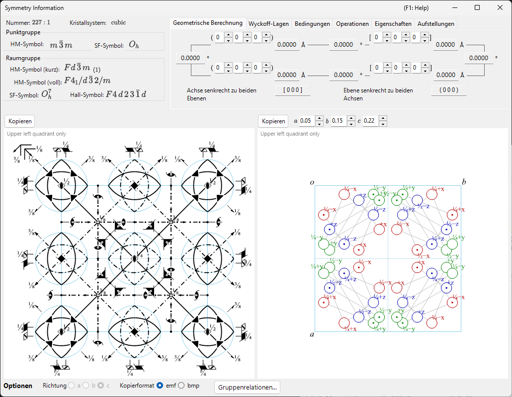
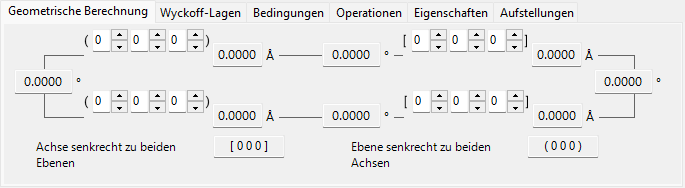
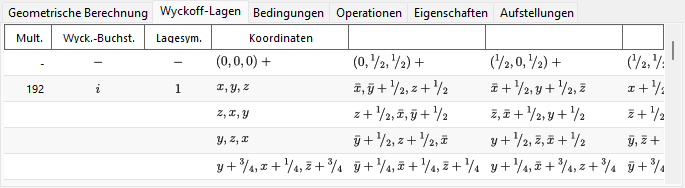
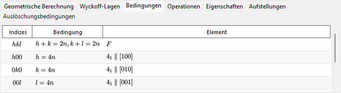
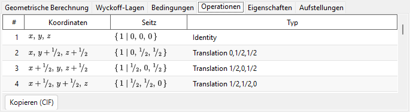
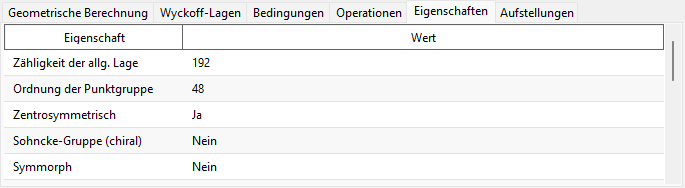
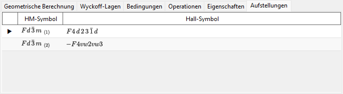

# Symmetrieinformationen

**Symmetrieinformationen** zeigt detaillierte Informationen über die Raumgruppensymmetrie des ausgewählten Kristalls an und stellt zusätzlich schematische Diagramme der Symmetrieelemente und der allgemeinen Lagen im Stil der *International Tables for Crystallography* Vol. A dar.

Das Fenster ist unterteilt in einen Bereich zur Raumgruppen-Identität (oben links), einen Berechnungs-/Tabellenbereich mit Registerkarten (oben rechts) und zwei schematische Diagramme (unten).

!!! tip "Symmetrietheorie (Anhang A4)"
    Was ein Hermann–Mauguin-/Hall-/Schoenflies-Symbol tatsächlich kodiert, die gruppentheoretischen Klassifikationen auf der Registerkarte **Eigenschaften** (zentrosymmetrisch, Sohncke, symmorph, polar, …), die Bedeutung der Symmetrieelement- und Allgemeine-Lagen-Diagramme unten sowie die von **Gruppenrelationen...** gezeigten Gruppe-Untergruppe-Beziehungen werden alle in **[Anhang A4. Symmetrie und Raumgruppen](appendix/a4-symmetry-space-groups/index.md)** erklärt.

---

## Tastatur- & Maus-Kurzbefehle

Dieses Fenster hat keine besonderen Tasten- oder Mauskombinationen. <kbd>F1</kbd> öffnet diese Handbuchseite, und die beiden **Kopieren**-Schaltflächen legen das Symmetrieelement-Diagramm und das Diagramm der allgemeinen Lagen in die Zwischenablage (als Vektor-**emf** oder Raster-**bmp**, wählbar über **Kopierformat**).

→ Siehe **[21. Tastatur- & Maus-Kurzbefehle](21-shortcuts.md)** für jedes Fenster auf einen Blick.

---

## Raumgruppen-Identität

Das Feld oben links listet für die aktuelle Raumgruppe:

- die **Nummer** (1–230) und den Aufstellungsindex
- das **Kristallsystem**
- die **Punktgruppe** : Hermann–Mauguin- (HM) und Schoenflies- (SF) Symbol
- die **Raumgruppe** : HM-Kurzsymbol, HM-Vollsymbol, SF-Symbol und **Hall-Symbol**

---

## Geometrische Berechnung

Geben Sie zwei Kristallebenen \((h_1, k_1, l_1)\), \((h_2, k_2, l_2)\) oder zwei Richtungsindizes \([u_1, v_1, w_1]\), \([u_2, v_2, w_2]\) ein, um Folgendes zu erhalten:

- den Netzebenenabstand jeder Ebene / die Länge jeder Achse,
- den Winkel zwischen den beiden Ebenen (oder den beiden Achsen),
- **den zu beiden Ebenen senkrechten Richtungsindex** und **den zu beiden Achsen senkrechten Ebenenindex**.

Diese Berechnungen berücksichtigen die Metrik der aktuellen Elementarzelle.

---

## Wyckoff-Lagen

Listet jede Wyckoff-Lage mit ihrer Multiplizität, ihrem Wyckoff-Buchstaben, ihrer Lagesymmetrie und der Angabe, ob es sich um eine allgemeine oder spezielle Lage handelt. Bei zentrierten Gittern werden die Gittertranslationsvektoren in der Kopfzeile angezeigt.

---

## Bedingungen

Die Reflexionsbedingungen, die sich aus der Gitterzentrierung und aus den Gleitspiegel- und Schraubenoperatoren ergeben.

---

## Operationen

Listet jede Symmetrieoperation der allgemeinen Lage (Gitterzentrierungstranslationen bereits eingerechnet) als Koordinatentripel, Seitz-Symbol und geometrischen Typ in Klartext (z. B. *"3-fold rotation"*, *"c-glide plane"*, *"screw axis"*). **Kopieren (CIF)** kopiert die vollständige Liste als CIF-Schleife `_space_group_symop_operation_xyz` in die Zwischenablage.

→ Wie diese drei Notationen zu lesen sind, erklärt **[Anhang A4.1](appendix/a4-symmetry-space-groups/symbols-and-diagrams.md#symmetrieoperationen-registerkarte-operationen)**.

---

## Eigenschaften

Berichtet gruppentheoretische Klassifikationen der aktuellen Raumgruppe (Zähligkeit der allgemeinen Lage, Ordnung der Punktgruppe, zentrosymmetrisch, Sohncke, symmorph, polare Richtung, enantiomorpher Partner, Kristallfamilie/Gittersystem/Bravais-Typ, arithmetische Kristallklasse, Patterson-Symmetrie) sowie, welche makroskopischen physikalischen Eigenschaften (pyroelektrisch/ferroelektrisch, piezoelektrisch, Frequenzverdopplung (SHG), optische Aktivität) diese Symmetrie zulässt.

→ Was die einzelnen Begriffe bedeuten, erklärt **[Anhang A4.1](appendix/a4-symmetry-space-groups/symbols-and-diagrams.md#gruppentheoretische-klassifikation-registerkarte-eigenschaften)**.

---

## Aufstellungen

Listet zu Referenzzwecken jede tabellierte Ursprungs-/Achsenaufstellung, die die IT-Nummer der aktuellen Raumgruppe teilt, jeweils mit ihrem HM- und Hall-Symbol; die aktuell angezeigte Aufstellung ist markiert. Die Auswahl einer Zeile ändert den Kristall nicht.

---

## Diagramme der Symmetrieelemente & der allgemeinen Lagen

Die beiden Felder unten geben die schematischen Symmetriediagramme der Raumgruppe in der Notation der *International Tables for Crystallography* Vol. A wieder.

- **Symmetrieelemente (links)**: Dreh-/Schraubenachsen, Spiegel-/Gleitspiegelebenen sowie Inversionszentren/Drehinversionspunkte werden mit den konventionellen graphischen Symbolen gezeichnet.
  - Für das \(F\)-Gitter des kubischen Systems wird nur ein Achtel der Elementarzelle (nur der obere linke Quadrant) gezeigt.
  - Diese Symmetrieelemente können auch direkt auf das 3D-Modell in der [Strukturansicht](5-structure-viewer.md) gezeichnet werden.
- **Allgemeine Lagen (rechts)**: Die allgemeinen äquivalenten Lagen werden als Kreise dargestellt (ein Komma bezeichnet ein Spiegelbild) und mit ihren fraktionellen Koordinaten beschriftet.
  - Nur für das kubische System verbinden Hilfslinien die drei Kreise, die durch eine dreizählige Drehachse miteinander verknüpft sind.

Bedienelemente unterhalb der Diagramme:

- **Richtung** (`a` / `b` / `c`) : wählt die Kristallachse, entlang derer projiziert wird.
- **Kopieren** : kopiert jedes Diagramm in dem mit **Kopierformat** gewählten Format (Vektor-**emf** / Raster-**bmp**) in die Zwischenablage; emf kann in PowerPoint entgruppiert und bearbeitet werden.
- **Gruppenrelationen...** öffnet einen Browser für die Beziehungen der aktuellen Raumgruppe zu ihren maximalen Untergruppen und minimalen Obergruppen. Wie er zu lesen ist, erklärt [Anhang A4.2](appendix/a4-symmetry-space-groups/group-subgroup-relations.md).

---

## Siehe auch

- [Kristalldatenbank](1-crystal-database.md)
- [Strukturansicht](5-structure-viewer.md)
- [Stereonetz](6-stereonet.md)
- [Rotationsgeometrie](4-rotation-geometry.md)
- [Hauptfenster](0-main-window.md)
- [Anhang A4. Symmetrie und Raumgruppen](appendix/a4-symmetry-space-groups/index.md) — der kristallographische und gruppentheoretische Hintergrund hinter jeder Registerkarte und jedem Diagramm dieser Seite.
