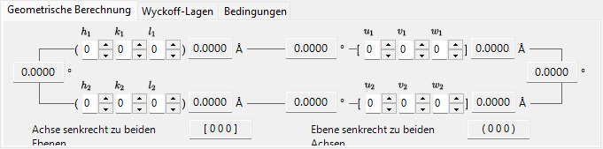
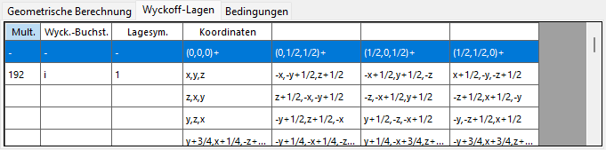
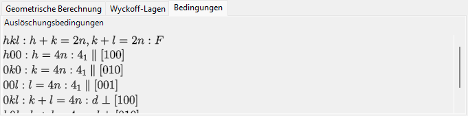
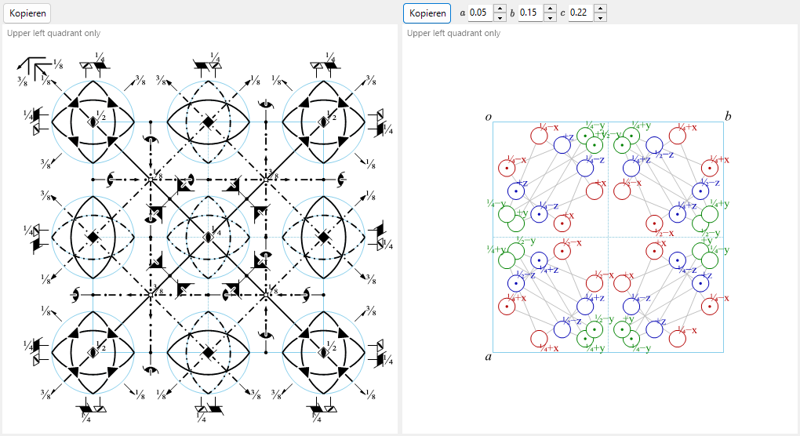

# Symmetrieinformationen

**Symmetrieinformationen** zeigt detaillierte Informationen über die Raumgruppensymmetrie des ausgewählten Kristalls an und stellt zusätzlich schematische Diagramme der Symmetrieelemente und der allgemeinen Lagen im Stil der *International Tables for Crystallography* Vol. A dar.

Das Fenster ist unterteilt in einen Bereich zur Raumgruppen-Identität (oben links), einen Berechnungs-/Tabellenbereich mit Registerkarten (oben rechts) und zwei schematische Diagramme (unten).

---

## Tastatur- & Maus-Kurzbefehle

Dieses Fenster hat keine besonderen Tasten- oder Mauskombinationen. <kbd>F1</kbd> öffnet diese Handbuchseite, und die beiden **Copy**-Schaltflächen legen das Symmetrieelement-Diagramm und das Diagramm der allgemeinen Lagen in die Zwischenablage (als Bitmap oder als Vektor-EMF, wenn **EMF** angekreuzt ist).

→ Siehe **[21. Tastatur- & Maus-Kurzbefehle](21-shortcuts.md)** für jedes Fenster auf einen Blick.

---

## Raumgruppen-Identität

Das Feld oben links listet für die aktuelle Raumgruppe:

- **Number** (1–230) und den Setting-Index
- **Crystal System**
- **Point Group** : Hermann–Mauguin- (HM) und Schoenflies- (SF) Symbole
- **Space Group** : HM-Kurzsymbol, HM-Vollsymbol, SF-Symbol und **Hall symbol**

---

## Geometrische Berechnung

Geben Sie zwei Kristallebenen \((h_1, k_1, l_1)\), \((h_2, k_2, l_2)\) oder zwei Richtungsindizes \([u_1, v_1, w_1]\), \([u_2, v_2, w_2]\) ein, um Folgendes zu erhalten:

- den Netzebenenabstand jeder Ebene / die Länge jeder Achse,
- den Winkel zwischen den beiden Ebenen (oder den beiden Achsen),
- **den zu beiden Ebenen normalen Richtungsindex** und **den zu beiden Achsen normalen Ebenenindex**.

Diese Berechnungen berücksichtigen die Metrik der aktuellen Elementarzelle.

---

## Wyckoff-Positionen

Listet jede Wyckoff-Position mit ihrer Multiplizität, ihrem Wyckoff-Buchstaben, ihrer Lagesymmetrie und der Angabe, ob es sich um eine allgemeine oder spezielle Lage handelt. Bei zentrierten Gittern werden die Gittertranslationsvektoren in der Kopfzeile angezeigt.

---

## Auslöschungsbedingungen

Die Reflexbedingungen, die sich aus der Gitterzentrierung und aus den Gleit-/Schraubensymmetrieoperatoren ergeben.

---

## Diagramme der Symmetrieelemente & der allgemeinen Lagen

Die beiden Felder unten geben die schematischen Symmetriediagramme der Raumgruppe in der Notation der *International Tables for Crystallography* Vol. A wieder.

- **Symmetrieelemente (links)**: Dreh-/Schraubenachsen, Spiegel-/Gleitebenen sowie Inversionszentren/Drehinversionspunkte werden mit den konventionellen graphischen Symbolen dargestellt.
  - Für das \(F\)-Gitter des kubischen Systems wird nur ein Achtel der Elementarzelle (nur der obere linke Quadrant) gezeigt.
  - Diese Symmetrieelemente können auch direkt auf das 3D-Modell in der [Strukturansicht](5-structure-viewer.md) gezeichnet werden.
- **Allgemeine Lagen (rechts)**: Die allgemeinen äquivalenten Lagen werden als Kreise dargestellt (ein Komma bezeichnet ein Spiegelbild) und mit ihren fraktionellen Koordinaten beschriftet.
  - Nur für das kubische System verbinden Hilfslinien die drei Kreise, die durch eine dreizählige Drehachse miteinander verknüpft sind.

Bedienelemente unterhalb der Diagramme:

- **Direction** (`a` / `b` / `c`) : Wählen Sie die Kristallachse, entlang der projiziert werden soll.
- **Copy** jedes Diagramm als Vektorbild (**EMF**) oder Rasterbild (**BMP**) in die Zwischenablage; EMF kann in PowerPoint gruppiert aufgelöst und bearbeitet werden.

---

## Siehe auch

- [Kristalldatenbank](1-crystal-database.md)
- [Strukturansicht](5-structure-viewer.md)
- [Stereonetz](6-stereonet.md)
- [Rotationsgeometrie](4-rotation-geometry.md)
- [Hauptfenster](0-main-window.md)
