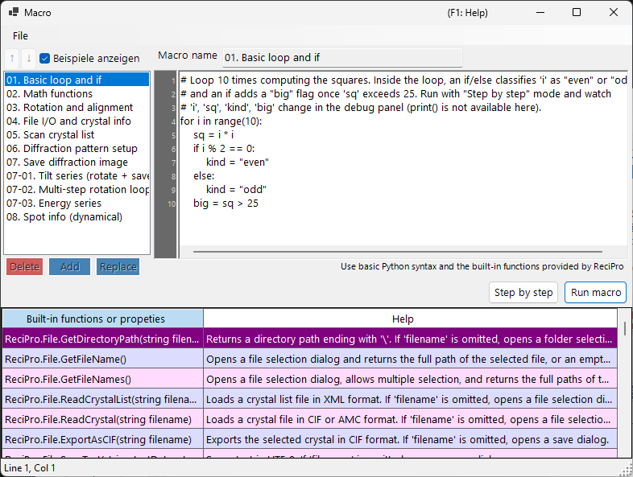

# Makro

ReciPro enthält ein **IronPython**-basiertes Makrosystem, um Kristalloperationen, Beugungssimulationen und Bildsimulationen über Skripte zu automatisieren.



Im obigen Screenshot ist **Show samples** aktiviert, sodass die integrierten Beispielmakros angezeigt werden. Die Makroliste befindet sich links, der Code-Editor rechts und eine Hilfetabelle der integrierten Funktionen unten.

---

## Tastatur- & Maus-Kurzbefehle

| Kurzbefehl | Aktion |
|----------|--------|
| <kbd>F1</kbd> | Diese Seite des Online-Handbuchs öffnen |
| <kbd>CTRL</kbd>+<kbd>S</kbd> | Den Editortext zurück in den ausgewählten Eintrag der Makroliste speichern |
| <kbd>F10</kbd> | Einen Schritt weiter (während der schrittweisen Ausführung) |
| Doppelklick auf eine Zeile in der Funktionshilfe-Liste | Die Signatur dieser Funktion an der Einfügemarke einfügen |
| Eine `.mcr`-Datei auf das Fenster ziehen | In den Editor laden |

**Run**, **Step** und **Stop** sind Schaltflächen (kein Tastaturkürzel).

→ Siehe **[21. Tastatur- & Maus-Kurzbefehle](../21-shortcuts.md)** für alle Fenster auf einen Blick.

---

## Überblick

Makros werden in Python-Syntax geschrieben. Mit den integrierten Klassen und Funktionen von ReciPro können Sie dieselben Operationen, die über die GUI verfügbar sind, programmgesteuert ausführen.

- **Sprache**: Python 3 (IronPython 3.4)
- **Speicherung**: Komprimiertes Binärformat in der Windows-Registry (bleibt über Sitzungen hinweg erhalten)
- **Zugriff**: Klicken Sie im Hauptfenster auf die Schaltfläche Makro, um den Makro-Editor zu öffnen

---

## Editorfenster

Der Makro-Editor hat vier Hauptbereiche:

| Bereich | Zweck |
|------|---------|
| **Makroliste** (links) | Gespeicherte Makros. `Add` fügt ein neues Makro hinzu, `Replace` überschreibt das ausgewählte, `Delete` entfernt es. Up/Down ändern die Reihenfolge. |
| **Namensfeld** (oben) | Bezeichner des gerade bearbeiteten Makros. |
| **Codebereich** (rechts) | Python-Code-Editor mit Zeilennummern-Leiste, automatischer Einrückung und Syntax-Hilfe-Popup. |
| **Tabelle der integrierten Funktionen** (unten) | Liste der von ReciPro bereitgestellten integrierten Funktionen/Eigenschaften, jeweils mit einer Hilfe-Beschreibung. Eine Referenz beim Schreiben von Code. |
| **Statusleiste** (ganz unten) | Zeigt die aktuelle Position der Einfügemarke als `Line N, Col M` an. |
| **Debug-Panel** (während der Step-Ausführung sichtbar) | Listet die lokalen Variablen in der aktuellen Zeile auf. |

Die Titelleiste zeigt **`Macro*`** (mit Sternchen), solange es ungespeicherte Änderungen gibt, und kehrt nach Add / Replace / <kbd>CTRL</kbd>+<kbd>S</kbd> zu **`Macro`** zurück.

### Beispielmakros

Wenn Sie **Show samples** (oben links) aktivieren, wird Ihre Makroliste vorübergehend durch die integrierten Beispielmakros ersetzt (einfache Schleifen und Bedingungen, mathematische Funktionen, Rotation/Ausrichtung, Durchlaufen der Kristallliste, Beugungs-/Bildsimulation, Kipp-/Energieserien, Reflex-Informationen und mehr). Die Beispiele sind schreibgeschützt und werden in der aktuellen UI-Sprache angezeigt; nutzen Sie sie zum Lernen oder als Ausgangspunkt zum Kopieren. Beim Deaktivieren werden Ihre eigenen Makros wiederhergestellt.

---

## Bearbeitungsfunktionen

- **Automatische Einrückung**: Wenn Sie <kbd>ENTER</kbd> drücken, übernimmt die nächste Zeile die führenden Leerzeichen der aktuellen Zeile. Endet die Zeile mit `:` (nach `def`/`if`/`for`/usw.), wird automatisch eine zusätzliche Einrückungsebene (4 Leerzeichen) hinzugefügt.
- **Intelligente Rücktaste**: Innerhalb der führenden Leerzeichen entfernt <kbd>BACKSPACE</kbd> eine vollständige Einrückungsebene (4 Leerzeichen) statt eines einzelnen Zeichens.
- **<kbd>TAB</kbd> / <kbd>SHIFT</kbd>+<kbd>TAB</kbd>**:
  - Ohne Auswahl: eine Einrückungsebene an der Einfügemarke einfügen / entfernen.
  - Mehrzeilige Auswahl: alle ausgewählten Zeilen auf einmal ein-/ausrücken.
- **Autovervollständigung**: Während der Eingabe listet ein Popup passende Funktionsnamen und Sprach-Schlüsselwörter auf. Pfeiltasten navigieren, <kbd>ENTER</kbd> oder <kbd>TAB</kbd> übernimmt, <kbd>ESC</kbd> bricht ab.
- **Tooltip-Hilfe**: Beim Überfahren eines ausgewählten Autovervollständigungs-Eintrags wird dessen Dokumentation angezeigt.

### Tastenkürzel

| Kurzbefehl | Aktion |
|----------|--------|
| <kbd>CTRL</kbd>+<kbd>S</kbd> | Den aktuellen Code in den ausgewählten Makro-Eintrag speichern (an Ort und Stelle) |
| <kbd>F10</kbd> | Zur nächsten Zeile springen (während der Step-Ausführung) |
| <kbd>ENTER</kbd> | Neue Zeile mit automatischer Einrückung einfügen |
| <kbd>TAB</kbd> / <kbd>SHIFT</kbd>+<kbd>TAB</kbd> | Einrücken / Ausrücken |
| <kbd>BACKSPACE</kbd> | Eine Einrückungsebene löschen, wenn innerhalb der führenden Leerzeichen |
| <kbd>CTRL</kbd>+<kbd>↑</kbd> / <kbd>CTRL</kbd>+<kbd>↓</kbd> | Entfällt — verwenden Sie die Up/Down-Schaltflächen, um Makros umzuordnen |

---

## Makros ausführen

Zwei Ausführungsmodi:

- **Run macro**: Führt den Code bis zum Ende aus. Bei Fehlern erscheint ein Dialog mit dem Python-Traceback und die betreffende Zeile wird im Editor hervorgehoben.
- **Step by step**: Pausiert vor jeder Zeile. Das Debug-Panel zeigt die lokalen Variablen. Verwenden Sie <kbd>F10</kbd> (oder die Schaltfläche **Next step (F10)**), um fortzufahren, oder **Stop**, um abzubrechen.

**Stop** funktioniert nur im Step-Modus (die normale Ausführung von Run macro kann nicht unterbrochen werden, da IronPython `CancellationToken` nicht beachtet und alles im UI-Thread läuft).

---

## Python-Sprachunterstützung

Diese Makro-Umgebung ist **IronPython 3.4**. Nicht alle Python-Funktionen sind hier sinnvoll.

### Vorab importiert

- **`math`** wird beim Start importiert. Verwenden Sie `math.sqrt(x)`, `math.sin(x)`, `math.pi`, `math.radians(deg)` usw. direkt.

### Verwendbar

- Kontrollfluss: `if`/`elif`/`else`, `for`, `while`, `def`, `class`, `return`, `try`/`except`/`finally`, `pass`, `break`, `continue`, `lambda`
- Literale: `True`, `False`, `None`
- Integrierte Funktionen: `len`, `range`, `abs`, `min`, `max`, `sum`, `sorted`, `enumerate`, `zip`, `int`, `float`, `str`, `list`, `dict`, `tuple`, `type`, `isinstance`
- Module der Standardbibliothek, die reines Python sind: `random`, `datetime`, `time`, `re`, `json`, `itertools`, `functools`, `collections`

Diese Grundlagen sind im Autovervollständigungs-Popup vorab registriert, sodass Sie sie durch Eingabe der ersten Buchstaben entdecken können.

### NICHT verwendbar

- **`print()`** : es gibt kein Konsolenfenster; die Ausgabe verschwindet. Verwenden Sie **Step by step** und sehen Sie sich das Debug-Panel an, um Werte zu prüfen.
- **`input()`** : kein stdin.
- **Datei-E/A** (`open`, `with open`) : nicht für Makros vorgesehen. Verwenden Sie stattdessen die `ReciPro.File.*`-Hilfsfunktionen.
- **C-Erweiterungspakete**: `numpy`, `scipy`, `pandas`, `matplotlib` — nicht mit IronPython kompatibel.

---

## API-Zugriff

Die ReciPro-Makro-API wird unter dem Namen der obersten Ebene **`ReciPro`** bereitgestellt. Jede integrierte Klasse ist ein Feld von `ReciPro`:

```python
ReciPro.File.*         # File I/O helpers
ReciPro.Crystal.*      # Currently selected crystal
ReciPro.CrystalList.*  # Manage the crystal list
ReciPro.Dir.*          # Crystal orientation (Euler, zone-axis, rotation)
ReciPro.DifSim.*       # Diffraction simulator
ReciPro.HRTEM.*        # HRTEM simulation
ReciPro.STEM.*         # STEM simulation
ReciPro.Potential.*    # Potential simulation
ReciPro.Sleep(ms)      # Pause execution (milliseconds)
```

Das Autovervollständigungs-Popup zeigt immer die vollständige Form `ReciPro.Class.Member` an und fügt sie wörtlich ein, sodass Sie das Präfix selten von Hand eintippen müssen.

Siehe [20.1. Integrierte Funktionen](1-built-in-functions.md) für die vollständige API-Referenz.

---

## Fehlermeldungen

Wenn ein Makro fehlschlägt, zeigt ein Dialog den Python-Traceback im Standardformat:

```
Traceback (most recent call last):
  File "<string>", line 5, in <module>
NameError: name 'abc' is not defined
```

Der Editor wählt automatisch die im Traceback gemeldete Zeile aus (den innersten Frame), sodass Sie das Problem sofort beheben können. Syntaxfehler werden ebenfalls mit Zeilennummern gemeldet, bevor die Ausführung beginnt.

---

## Siehe auch

- [20.1. Integrierte Funktionen](1-built-in-functions.md)
- [20.2. Beispiele](2-examples.md)
