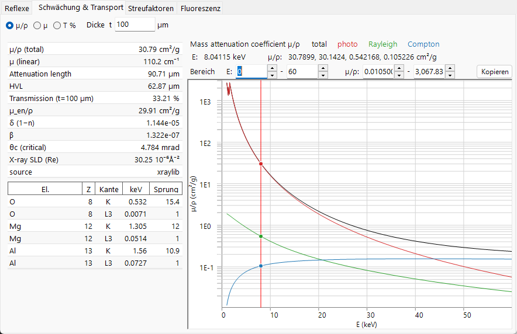
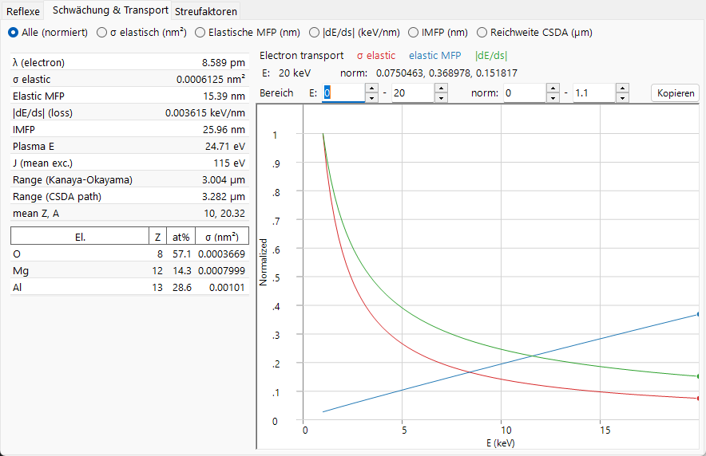
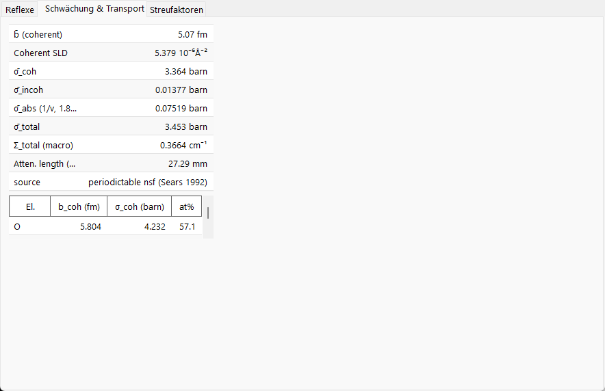
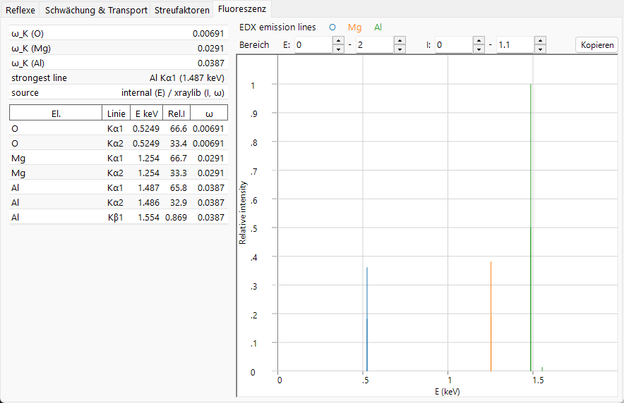

# Strahl-Wechselwirkung

Die **Strahl-Wechselwirkung** beschreibt, wie der ausgewählte Kristall mit einem einfallenden Strahl aus **Röntgenstrahlen, Elektronen oder Neutronen** wechselwirkt. Für eine gewählte Strahlung berechnet sie die erlaubten Reflexe und deren Strukturfaktoren, die Abschwächung und den Transport des Strahls durch das Material, die Atomformfaktoren jedes Elements sowie (bei Röntgenstrahlen) die charakteristischen Fluoreszenzlinien. Ein Umschalten des Strahlungstyps oben berechnet alles neu, sodass derselbe Kristall über Beugungs- und Spektroskopietechniken hinweg verglichen werden kann.

Der einfallende Strahl wird im Band am oberen Rand des Fensters ausgewählt; die vier Registerkarten darunter — **Reflexe**, **Schwächung & Transport**, **Streufaktoren** und **Fluoreszenz** — zeigen die verschiedenen Aspekte der Wechselwirkung. Jeder Registerkarten-Abschnitt unten zeigt die Registerkarte unter den Strahlen **X-ray / Electron / Neutron** (verwenden Sie die Registerkarten in jeder Abbildung); der Inhalt ändert sich deutlich mit dem Strahl.

!!! tip "Festkörperphysikalischer Hintergrund (Anhang A2)"
    Die Streuung und Festkörperphysik hinter diesen vier Registerkarten — Atomformfaktoren, der Strukturfaktor, die Strahlabschwächung und der Transport sowie die Fluoreszenz — werden in **[Anhang A2. Strahl-Wechselwirkung (festkörperphysikalischer Hintergrund)](appendix/a2-beam-interaction/index.md)** erläutert.

!!! note "Röntgendaten und die mitgelieferte xraylib-Bibliothek"
    Viele der Röntgengrößen (anomale Dispersion $f'/f''$, die $F(q)+S(q)$-Streuaufteilung, die Photo- / Rayleigh- / Compton-Aufschlüsselung der Massenschwächung, Absorptionskanten-Sprünge und Fluoreszenzausbeuten) werden mit der mitgelieferten Bibliothek **[xraylib](https://github.com/tschoonj/xraylib)** ausgewertet. Ist xraylib nicht verfügbar, greift ReciPro auf seine internen Tabellen zurück (nur Photoabsorptions-Schwächung, nur charakteristische Linienenergien), und die betroffenen Zellen zeigen **N/A**. Die **source**-Zeile jeder Tabelle gibt an, welcher Datensatz verwendet wurde.

---

## Tastatur- & Maus-Kurzbefehle

Dieses Fenster hat keine speziellen Tastenkombinationen. <kbd>F1</kbd> öffnet diese Handbuchseite. Auf der Registerkarte **Streufaktoren** kann die vertikale Cursorlinie **gezogen** werden, um den Streufaktor jedes Elements an dieser Position abzulesen, und jede Registerkarte besitzt eine **Copy**-Schaltfläche, die ihre Tabelle als in Tabellenkalkulationen einfügbaren Text exportiert.

→ Siehe **[21. Tastatur- & Maus-Kurzbefehle](21-shortcuts.md)** für jedes Fenster auf einen Blick.

---

## Strahl und Wellenlänge {#reflections-tab}

Das obere Band ist ein **Wave Length Control**, das mit den anderen Simulatoren geteilt wird.

- **X-ray / Electron / Neutron** : Die Atomformfaktoren und die Wechselwirkungsphysik unterscheiden sich je nach Typ des einfallenden Strahls, daher werden sie hier umgeschaltet.
- Bei **X-ray** legt die Wahl des **Element** (Anodenmaterial) und der charakteristischen Linie (Kα usw.) automatisch die Wellenlänge dieser charakteristischen Röntgenstrahlung fest.
- **Energy (keV)** und **Wavelength (Å)** sind verknüpft; das Setzen des einen aktualisiert das andere, und beide bestimmen das 2θ, das in der Tabelle **Reflexe** verwendet wird.
- **Unit (Å / nm)** schaltet die Längeneinheit um, die für d-Abstände und ähnliche Größen verwendet wird.

Der gewählte Strahl entscheidet auch, welche Registerkarten und Kurven sinnvoll sind:

| Strahl | Reflexe | Schwächung & Transport | Streufaktoren | Fluoreszenz |
|------|------|------|------|------|
| **X-ray** | Strukturfaktoren inkl. anomaler Dispersion | µ/ρ, µ, Transmission + Absorptionskanten (gegen Energie) | $f(s)$ oder $F(q)+S(q)$ | charakteristische Linien + EDX-Striche |
| **Electron** | Elektronen-Strukturfaktoren | σ, MFP, \|dE/ds\|, IMFP, Reichweite (gegen Energie) | Peng / Kirkland / 8-Gaussians | — (ausgeblendet) |
| **Neutron** | nukleare Strukturfaktoren | Streulängen & Wirkungsquerschnitte (keine Energiekurve) | Streulängen (keine *s*-Abhängigkeit) | — (ausgeblendet) |

Die Registerkarte **Fluoreszenz** gilt nur für Röntgenstrahlen und verschwindet bei Elektronen- und Neutronenstrahlen. Bei Neutronen werden die energieabhängigen Diagramme in **Schwächung & Transport** und **Streufaktoren** durch Elementtabellen ersetzt, da die nukleare Streulänge nicht vom Streuwinkel oder der Energie abhängt.

---

## Registerkarte Reflexe

Listet die erlaubten Kristallebenen (Reflexe) des Kristalls sowie den **Strukturfaktor** und die Beugungsintensität jedes Reflexes auf. Bei Röntgenstrahlen enthält der Strukturfaktor nun die Terme der **anomalen Dispersion** $f'/f''$ bei der aktuellen Energie, sodass `F_inv` (der Imaginärteil) in der Nähe einer Absorptionskante im Allgemeinen ungleich null ist. Das Layout ist für jeden Strahl gleich; nur die Strukturfaktor-Werte und das 2θ jedes Reflexes ändern sich.

=== "X-ray"
    

=== "Electron"
    

=== "Neutron"
    

**Options**

- **Powder Diffraction Intensities (Bragg-Brentano Optics)** : berechnet die relative Intensität als Pulverbeugungs-Intensität (Bragg–Brentano), einschließlich Multiplizität und Lorentz–Polarisations-Faktor. Wenn deaktiviert, wird die Strukturfaktor-Intensität angezeigt. Das Aktivieren erzwingt zudem *Hide equivalent planes* und *Hide prohibited planes*.
- **Hide equivalent planes** : fasst kristallographisch äquivalente Ebenen zu einem einzelnen Eintrag zusammen.
- **Hide prohibited planes** : schließt Ebenen aus, deren Intensität durch die Auslöschungsregeln null ist.
- **d-Spacing Cutoff >** : schließt Reflexe mit einem d-Abstand kleiner als dieser Wert aus (die Längeneinheit folgt der Auswahl unter **Unit**).

Jede Zeile ist ein Reflex (oder eine Gruppe symmetrieäquivalenter Ebenen):

| Spalte | Bedeutung |
|------|------|
| **h, k, l** | Miller-Indizes |
| **Multi.** | Multiplizität (Anzahl symmetrieäquivalenter Ebenen) |
| **d (Å)** | Netzebenenabstand |
| **q (2π/d)** | Betrag des Streuvektors |
| **2θ (°)** | Beugungswinkel für die gewählte Wellenlänge |
| **F_real** | Realteil des Strukturfaktors |
| **F_inv** | Imaginärteil des Strukturfaktors (ungleich null bei anomaler Röntgendispersion) |
| **\|F\|** | Strukturfaktor-Amplitude ($= \sqrt{F_\text{real}^2 + F_\text{inv}^2}$) |
| **F^2** | Strukturfaktor-Intensität ($\lvert F\rvert^2$) |
| **Rel. Int. (%)** | relative Intensität, wobei der stärkste Reflex auf 100 gesetzt ist |

**Beugungspeak-Diagramm.** Unter der Tabelle werden dieselben Reflexe als Strichmuster gezeichnet, wobei die stärksten Peaks durch ihr *hkl* beschriftet sind.

- Die Auswahl der horizontalen Achse wählt zwischen **2θ** (Streuwinkel in Grad), **d** (Netzebenenabstand) und **Q** ($= 4\pi\sin\theta/\lambda$, dem Streuvektor / Impulsübertrag). Die drei Optionen beschreiben dieselben Reflexe; nur die horizontale Skala ändert sich.
- **Log I** schaltet die Intensitätsachse zwischen linear und logarithmisch um. Beugungsintensitäten erstrecken sich über viele Größenordnungen, daher dehnt eine logarithmische Skala den unteren Bereich, um die schwachen Peaks sichtbar zu machen, die eine lineare Skala gegen die Grundlinie abflacht.
- Die **Range**-Felder legen den dargestellten horizontalen Bereich und Intensitätsbereich fest.

---

## Registerkarte Schwächung & Transport

Wie tief der Strahl in das Material eindringt und wie er Energie verliert. Der Inhalt hängt vom Strahl ab.

=== "X-ray"
    

=== "Electron"
    

=== "Neutron"
    

### X-ray

Die Optionsfelder wählen den dargestellten Koeffizienten gegen die Photonenenergie (1–60 keV, logarithmische Achse):

- **µ/ρ** — der **Massen**-Schwächungskoeffizient (cm²/g): wie stark das Material Röntgenstrahlen pro Gramm entfernt, unabhängig davon, wie dicht es gepackt ist (dies ist der Wert, der sich in Referenztabellen findet). Das Diagramm zeigt den **total**-Wert zusammen mit seinen Komponenten **photo**, **Rayleigh** und **Compton**.
- **µ** — der **lineare** Schwächungskoeffizient $\mu = (\mu/\rho)\cdot\rho$ (cm⁻¹): die Abschwächung pro Zentimeter des tatsächlichen Materials bei seiner realen Dichte. Die transmittierte Intensität folgt $I = I_0\,e^{-\mu t}$, und $1/\mu$ ist die Strecke, über die die Intensität auf etwa 37 % (1/e) abfällt.
- **T %** — die **Transmission** $T = e^{-\mu t}$ in Prozent für die Probendicke **t**, die im Feld **Thickness t** (µm) eingestellt ist. 100 % = durchlässig, 0 % = vollständig blockiert; verwenden Sie dies, um eine sinnvolle Probendicke bei der aktuellen Energie zu beurteilen.

Die vertikalen Linien markieren die aktuelle Energie und die **Absorptionskanten** jedes Elements. Die Skalartabelle links listet bei der aktuellen Energie auf: **µ/ρ (total)**, **µ (linear)**, **Attenuation length** ($1/\mu$), **HVL** (Halbwertsschichtdicke, $\ln 2/\mu$), **Transmission** bei Dicke *t*, **µ_en/ρ** (Massen-Energieabsorptionskoeffizient), die Röntgenbrechungsindex-Dekremente **δ** und **β** ($n = 1-\delta+i\beta$), den **θc (critical)**-Winkel für Totalreflexion an der Außenfläche sowie die reelle **X-ray SLD** (Streulängendichte). Die untere Tabelle listet die Energien der Absorptions-**edge** **K** und **L3** sowie deren **Jump**-Verhältnisse für jedes Element auf.

### Electron

Die Größenauswahl bestimmt, was gegen die Strahlenergie (1–30 keV) dargestellt wird:

- **All (normalized)** — überlagert die drei untenstehenden Kurven, jeweils auf ihr eigenes Maximum neu skaliert, sodass die Formen in einem Diagramm verglichen werden können (Absolutwerte aus der Tabelle ablesen).
- **σ elastic (nm²)** — elastischer Streuquerschnitt: wie wahrscheinlich ein einzelnes Atom das Elektron ablenkt.
- **Elastic MFP (nm)** — mittlere freie Weglänge: die durchschnittliche Strecke, die das Elektron zwischen elastischen Streuereignissen zurücklegt.
- **|dE/ds| (keV/nm)** — Betrag des Bremsvermögens: die Energie, die das Elektron pro Nanometer Weg verliert.
- **IMFP (nm)** — inelastische mittlere freie Weglänge: die durchschnittliche Strecke zwischen energieverlierenden Stößen.
- **Range CSDA (µm)** — die gesamte Weglänge, die das Elektron zurücklegt, bevor es zur Ruhe kommt.

Die Skalartabelle listet die Elektronen-**wavelength**, **σ elastic**, **Elastic MFP**, **|dE/ds|**, **IMFP**, die **Plasma E** und die mittlere Anregungsenergie **J**, zwei Elektronen-**ranges** (die Kanaya–Okayama-Eindringtiefe-Schätzung und die CSDA-integrierte Weglänge) sowie das mittlere **Z, A** auf. Die Tabelle pro Element gibt für jedes Element den Atomanteil und den elastischen Streuquerschnitt σ an. Die elastischen Streuquerschnitte verwenden die **NIST Mott**-Daten (50 eV–36 keV) und greifen oberhalb von 36 keV auf **screened Rutherford** zurück.

### Neutron {#scattering-factors-tab}

Die Neutronenwechselwirkung wird durch nukleare Wirkungsquerschnitte und nicht durch eine energieabhängige Kurve bestimmt, daher zeigt diese Registerkarte nur Tabellen. Die Skalartabelle listet die mittlere kohärente Streulänge **b̄**, die **Coherent SLD**, die gemittelten kohärenten / inkohärenten / Absorptions- / Gesamt-Wirkungsquerschnitte (**σ̄_coh**, **σ̄_incoh**, **σ̄_abs**, **σ̄_total**), den makroskopischen Gesamtwirkungsquerschnitt **Σ_total** und die zugehörige **attenuation length** auf. Der Absorptionsquerschnitt wird mit dem 1/v-Gesetz bei der aktuellen Wellenlänge ausgewertet; Nuklide, bei denen dies ungültig ist (Cd, Sm, Eu, Gd als resonante Absorber), werden gekennzeichnet. Die Tabelle pro Element listet **b_coh**, **σ_coh** und den Atomanteil auf.

---

## Registerkarte Streufaktoren {#fluorescence-tab}

Der Atomformfaktor jedes beteiligten Elements, dargestellt gegen $s = \sin\theta/\lambda$ (Å⁻¹). Jedes Element wird in seiner eigenen Farbe gezeichnet, und die **vertikale Cursorlinie** kann gezogen werden, um den Streufaktor jedes Elements an dieser Position in die Tabelle links abzulesen.

=== "X-ray"
    

=== "Electron"
    

=== "Neutron"
    

- **X-ray** bietet zwei **Model**-Modi: **f(s)** stellt den konventionellen Röntgen-Atomformfaktor dar (in Elektroneneinheiten); **F(q)+S(q)** stellt den Rayleigh-**kohärenten** Formfaktor $F(q)$ zusammen mit der Compton-**inkohärenten** Streufunktion $S(q)$ dar (aus xraylib). Die Tabelle listet außerdem die anomalen Dispersionsterme **f'(E)** und **f''(E)** bei der aktuellen Energie auf.
- **Electron** bietet drei Parametrisierungen des Elektronen-Streufaktors: **Peng**, **Kirkland** und **8-Gaussians**. Die Tabelle zeigt $f_e(s)$ (nm) und welches **model** ihn erzeugt hat.
- **Neutron**-Streulängen hängen nicht von $s$ ab, daher wird keine Kurve gezeichnet; die Tabelle listet für jedes Element die kohärente Streulänge **b_coh** und dessen kohärente / inkohärente Wirkungsquerschnitte auf.
- **Debye-Waller** multipliziert jeden Faktor mit der thermischen Dämpfung $e^{-B s^2}$ unter Verwendung des isotropen Auslenkungsparameters jedes Atoms.

---

## Registerkarte Fluoreszenz

Für einen Röntgenstrahl die charakteristische **Fluoreszenz**-Emission der Probe. (Diese Registerkarte ist bei Elektronen- und Neutronenstrahlen ausgeblendet.)

Das Diagramm **EDX emission lines** zeichnet die charakteristischen Linien (Kα1, Kα2, Kβ1, Lα1, Lα2, Lβ1) jedes Elements als Striche bei ihren Photonenenergien, wobei die Höhe proportional zu Atomanteil × Strahlungsrate × Fluoreszenzausbeute ist (eine qualitative Vorschau im EDX-Stil; Anregungsquerschnitt und Detektoreffizienz werden nicht modelliert). Die untere Tabelle listet pro Linie das Element, den Liniennamen, die Energie **E keV**, die relative Intensität **Rel.I** und die Fluoreszenzausbeute **ω** auf. Die Skalartabelle gibt die K-Schalen-Ausbeute **ω_K** jedes Elements und die **strongest line** im Spektrum an.

---

## In die Zwischenablage kopieren

Jede Registerkarte besitzt eine **Copy**-Schaltfläche, die ihre Tabelle als Text in die Zwischenablage kopiert, der in eine Tabellenkalkulation wie Excel eingefügt werden kann.

---

## Siehe auch

- [Kristalldatenbank](1-crystal-database.md) — Definition des Kristalls, dessen Wechselwirkung berechnet wird.
- [Beugungssimulator](7-diffraction-simulator/index.md) — Simulation von Beugungsmustern anhand der Strukturfaktoren.
- [Anhang A2. Strahl-Wechselwirkung (festkörperphysikalischer Hintergrund)](appendix/a2-beam-interaction/index.md) — die Streuung und Festkörperphysik hinter jeder Registerkarte.
