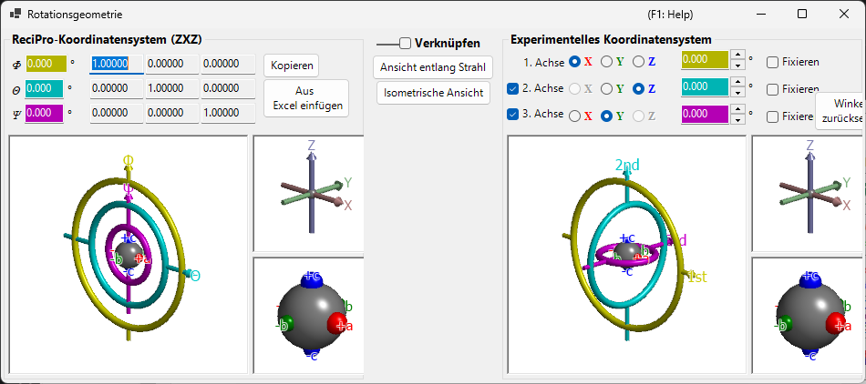

# Rotationsgeometrie

Dieses Fenster stellt den Rotationszustand eines Kristalls als 3×3-Matrix dar und rechnet zwischen verschiedenen Eulerschen Koordinatensystemen um.

ReciPro verwendet drei Eulerwinkel — **Ψ**, **θ** und **Φ** — die in der Reihenfolge **Z–X–Z** angewendet werden. Diese Konvention stimmt jedoch nicht zwangsläufig mit den Goniometerachsen Ihres tatsächlichen Geräts überein. Das Fenster **Rotationsgeometrie** ermöglicht es Ihnen, die Eulerwinkel von ReciPro in ein beliebig definiertes Koordinatensystem umzurechnen, und unterstützt so die Goniometereinstellung im Labor.

---

## Tastatur- & Maus-Kurzbefehle

Alle sechs 3D-Ansichten (die Felder für ReciPro und für das experimentelle Goniometer / die Achsen / die Objekte) sind **verknüpft** — wird eine davon gedreht, drehen sich alle sechs gemeinsam. Sie teilen sich die Standard-[OpenGL-Ansichtsnavigation](21-shortcuts.md) von ReciPro.

| Kurzbefehl | Aktion |
|----------|--------|
| <kbd>F1</kbd> | Diese Seite des Online-Handbuchs öffnen |
| Linksziehen in einer Ansicht | Modell drehen (alle sechs Ansichten drehen sich gemeinsam) |
| Mausrad oder Rechtsziehen nach oben/unten | Zoomen (die großen Goniometeransichten) |
| Mittelziehen | Verschieben (die großen Goniometeransichten) |
| <kbd>CTRL</kbd> + Rechtsziehen nach oben/unten | Kameraabstand ändern (nur im perspektivischen Modus) |
| <kbd>CTRL</kbd> + Rechtsdoppelklick | Zwischen orthografischer und perspektivischer Projektion umschalten |

In den kleinen Ansichten *Axes* und *Objects* sind Zoomen und Verschieben deaktiviert. Es gibt keine Tastenkürzel außer <kbd>F1</kbd>.

---

## ReciPro-Koordinatensystem (ZXZ)

Die obere Hälfte des Fensters zeigt den Rotationszustand im "ReciPro-Koordinatensystem".

- Die Werte **Φ, θ, Ψ** sind mit den im Hauptfenster eingestellten Eulerwinkeln synchronisiert.
- **Rotationsmatrix** zeigt die 3×3-Matrix an, die dem aktuellen Rotationszustand entspricht.

### Φ, θ, Ψ (Z–X–Z-Eulerwinkel)

Die Kristallorientierung wird durch drei Rotationen parametrisiert, die in dieser Reihenfolge angewendet werden:

1. **Φ** — erste Rotation um die **Z**-Achse.
2. **θ** — Rotation um die **X**-Achse des einmal gedrehten Bezugssystems.
3. **Ψ** — zweite Rotation um die **Z**-Achse des zweimal gedrehten Bezugssystems.

Jedes Zahlenfeld ist editierbar; eine Wertänderung hier aktualisiert das Hauptfenster und jeden verknüpften Simulator.

### Rotationsmatrix

Die 3 × 3-Matrix, die aus dem aktuellen (Φ, θ, Ψ) erzeugt wird. Verwenden Sie **Kopieren** / **Aus Excel einfügen**, um die Matrix über eine Tabellenkalkulation hin und zurück zu übertragen.

### OpenGL-Fenster

Die 3D-Ansicht zeigt die aktuelle Rotation mithilfe von drei farbigen Tori (Donuts):

| Farbe | Eulerwinkel | Goniometerebene |
|--------|------------|-----------------|
| **Gelb** | Φ | 1. (obere) Achse |
| **Hellblau** | θ | 2. (mittlere) Achse |
| **Rosa** | Ψ | 3. (untere) Achse |

Die Pfeile in **Rot**, **Grün** und **Blau** stellen die X-, Y- und Z-Achse in kartesischen Realraumkoordinaten dar. Diese sind *nicht* identisch mit den im Hauptfenster gezeigten Kristallachsen.

Die graue Kugel im Zentrum stellt die Probe dar; die roten/grünen/blauen Kugeln zeigen, wie sich das Objekt aus seiner Ausgangsorientierung gedreht hat (bei Φ = θ = Ψ = 0 sind sie jeweils an +X, +Y, +Z ausgerichtet).

> **Hinweis**: Das Ziehen im OpenGL-Fenster ändert nur die *Projektionsrichtung* dieser Ansicht, nicht die Kristallorientierung selbst. Um den Kristall zu drehen, verwenden Sie das Hauptfenster.

### Schaltflächen

| Schaltfläche | Aktion |
|--------|--------|
| Kopieren | Die 3×3-Rotationsmatrix im tabulatorgetrennten Format kopieren |
| Aus Excel einfügen | Rotationsmatrix aus der Zwischenablage setzen (tabulatorgetrennt 3×3) |
| Ansicht entlang Strahl | An die Projektion des Hauptfensters anpassen (Z-Achse senkrecht zum Bildschirm) |
| Isometrische Ansicht | Zur isometrischen Projektion wechseln |

---

## Experimentelles Koordinatensystem

Die untere Hälfte definiert Eulerwinkel auf einem beliebigen Satz von Rotationsachsen und liest bzw. setzt den Goniometerzustand. Dies wird als **Experimentelles Koordinatensystem** bezeichnet.

### 1., 2., 3. Achse

Wählen Sie die Rotationsachsen des Goniometers aus **±X**, **±Y** und **±Z** für jede Ebene (oben, Mitte, unten). Die Grafik wird entsprechend aktualisiert.

Die Eulerwinkel für jede Achse werden in den zugehörigen farbigen Textfeldern (gelb, hellblau, rosa) angezeigt. Sie können die Werte auch direkt eingeben.

---

## Verknüpfen

Wenn **Verknüpfen** aktiviert ist, sind das ReciPro-Koordinatensystem und das experimentelle Koordinatensystem gekoppelt: Ihre Eulerwinkel werden so angepasst, dass die Objektorientierung zwischen beiden Systemen konsistent bleibt.

### Beispiel-Arbeitsablauf

1. Stellen Sie im Labor ein Goniometer so ein, dass die *a*-Achse eines Kristalls mit der Einfallsrichtung der Röntgenstrahlung ausgerichtet ist und die *b*-Achse horizontal liegt.
2. Geben Sie die Eulerwinkel des Labor-Goniometers im experimentellen Koordinatensystem ein.
3. Drehen Sie den Kristall im Hauptfenster so, dass die *a*-Achse zur Bildschirmnormalen und die *b*-Achse horizontal weist.
4. Aktivieren Sie **Verknüpfen** — jetzt werden, sobald Sie den Kristall im Hauptfenster auf eine andere Orientierung ausrichten, automatisch die erforderlichen Goniometerwinkel angezeigt.

---

## Siehe auch

- [Hauptfenster](0-main-window.md)
- [Stereonetz](6-stereonet.md)
- [Grundlegendes Koordinatensystem & Kristallorientierung](appendix/a1-coordinate-system/1-orientation.md)
- [Tastatur- & Maus-Kurzbefehle](21-shortcuts.md)
