# Strukturansicht

Die **Strukturansicht** zeichnet die Struktur des ausgewählten Kristalls als dreidimensionales Bild mit OpenGL.

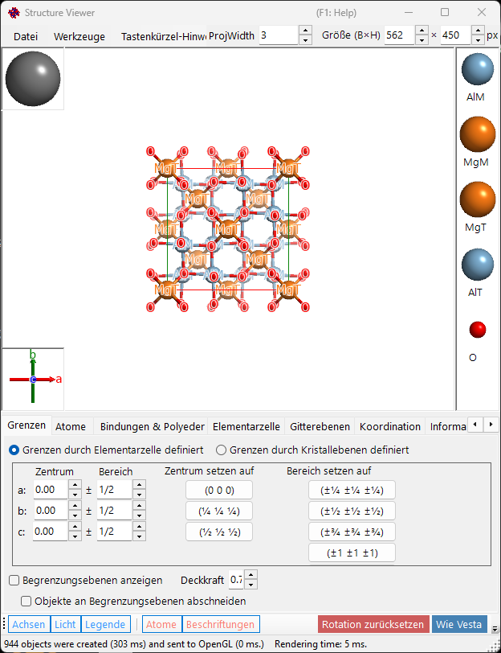

---

## Tastatur- & Maus-Kurzbefehle

Das Fenster besitzt eine große 3-D-Ansicht sowie zwei kleine Gizmos — die **Kristallachsen**-Box (unten links) und die **Lichtrichtungs**-Box (oben links) — und jede reagiert unterschiedlich auf ein Linksziehen. Die Hauptansicht verwendet ReciPros standardmäßige [OpenGL-Ansichtsnavigation](21-shortcuts.md).

| Kurzbefehl | Aktion |
|----------|--------|
| <kbd>F1</kbd> | Diese Seite des Online-Handbuchs öffnen |
| <kbd>CTRL</kbd>+<kbd>SHIFT</kbd>+<kbd>C</kbd> | Das gerenderte Bild in die Zwischenablage kopieren |
| Linksziehen in der Hauptansicht | Das Modell drehen |
| Linker Doppelklick auf ein Atom | Seine Koordinaten, Abstände zu den nächsten Nachbarn und Bindungswinkel anzeigen |
| Rechtsziehen nach oben/unten oder Mausrad | Zoomen |
| Mittelziehen | Verschieben |
| <kbd>CTRL</kbd> + Rechtsziehen nach oben/unten | Den Kameraabstand ändern (nur im Perspektivmodus) |
| <kbd>CTRL</kbd> + rechter Doppelklick | Zwischen orthografischer und perspektivischer Projektion umschalten |
| Linksziehen am **Kristallachsen**-Gizmo | Das Modell drehen (keine Drehung in der Ebene) |
| Linksziehen am **Licht**-Gizmo | Die Beleuchtungsrichtung ändern |

Die anwendungsweiten <kbd>CTRL</kbd>+<kbd>SHIFT</kbd>-Kurzbefehle aus dem [Hauptfenster](0-main-window.md#keyboard-mouse-shortcuts) funktionieren ebenfalls, solange dieses Fenster den Fokus hat.

→ Siehe **[21. Tastatur- & Maus-Kurzbefehle](21-shortcuts.md)** für eine Übersicht über alle Fenster.

---

## Hauptbereich

3D-Kristallstruktur mit Lichtquelle, Kristallachsen und Atomlegende.
> Die Box **Größe (B×H)** oben rechts im Fenster legt die Pixelgröße fest, die beim Speichern oder Kopieren des gerenderten Bildes verwendet wird.
> Die Box **ProjWidth** daneben zeigt die Breite der projizierten Ansicht in nm an. Bearbeiten Sie den Wert, um numerisch zu zoomen — er bleibt mit dem Zoomen per Rechtsziehen / Mausrad in der Ansicht synchronisiert.

---

## Menüleiste

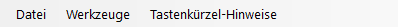

### Menü „Datei“

Bild speichern, in die Zwischenablage kopieren (Ctrl+Shift+C), Film speichern (MP4).

**Film speichern** öffnet den unten gezeigten Dialog zur Filmeinstellung. Ein Film kann die Ansicht drehen, das Projektionszentrum verschieben oder beides gleichzeitig tun — aktivieren Sie **Rotation** und/oder **Translation**:

- **Rotation**: dreht die Ansicht mit **Speed** (°/s; negative Werte kehren die Richtung um) um die darunter gewählte Achse — **Aktuelle Projektion** (Kipprichtung, mit den Pfeil-Schaltflächen gewählt), ein **Richtungsindex** [uvw] oder die Normale einer **Gitterebene** (hkl).
- **Translation**: verschiebt das Projektionszentrum entlang des Richtungsindex [uvw] mit **Speed** (Gitterperioden pro Sekunde). Diese Option erscheint nur, wenn der Dialog aus der Strukturansicht geöffnet wurde, und solange sie aktiviert ist, ist **Richtungsindex** der einzige Richtungsmodus.

Legen Sie die Filmlänge (**Duration**), die Bildrate (**FPS**, 1–120) und die Encoder-Qualität (**Quality**, 1–100; höhere Werte verwenden eine höhere Bitrate und ergeben eine größere Datei) fest, wählen Sie den Codec (**H264** / **H265**) und drücken Sie **OK**, um eine MP4-Datei zu erzeugen. **Include final frame** hängt einen zusätzlichen Frame bei t = Duration an, sodass der Film exakt mit der endgültigen Orientierung/Position endet. (Die Liste der Encodiergeschwindigkeit beschriftet nur noch die Fortschrittsanzeige und beeinflusst die eigentliche Encodierung nicht mehr.)

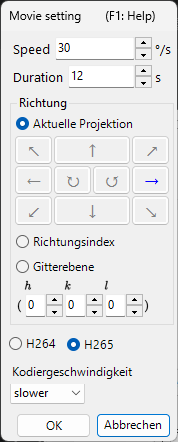

### Menü „Werkzeuge“

---

## Tab-Menü

### Durch Zelle definierte Grenzen

Legt den Zeichenbereich des Kristalls fest. Es gibt zwei Modi, die mit den Optionsfeldern oben umgeschaltet werden.

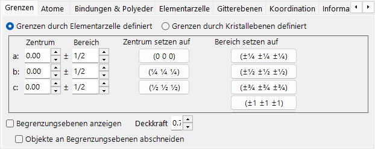

In diesem Modus sind die Achsen *a*, *b*, *c* der Elementarzelle die Einheit des Zeichenbereichs.

- **Center**: zentrale fraktionelle Koordinate des Zeichenvolumens.
- **Range**: obere/untere Grenze für jede der Achsen *a*, *b*, *c*.
- **Voreinstellungs-Schaltflächen** rechts liefern häufig verwendete Werte (z. B. 1×1×1-Zelle, 2×2×2-Zelle).

### Durch Kristallebenen definierte Grenzen

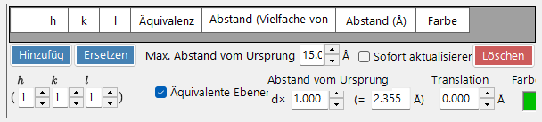

In diesem Modus wird der Zeichenbereich durch eine Reihe von Kristallebenen begrenzt. Wenn die Ebenen keinen räumlich abgeschlossenen Bereich definieren, fällt ReciPro automatisch auf eine Begrenzung von einer Elementarzelle zurück.

#### Grenzenliste

Alle für den aktuellen Kristall registrierten Begrenzungsebenen. Verwenden Sie **Hinzufügen / Ersetzen / Löschen**, um die Liste zu bearbeiten; das Kontrollkästchen ganz links deaktiviert eine Ebene vorübergehend, ohne sie zu löschen.

> Um die Änderungen dauerhaft zu speichern, müssen Sie außerdem **Add** oder **Replace** im **Hauptfenster** drücken. Andernfalls gehen die Änderungen verloren, sobald Sie die Auswahl in der Hauptkristallliste das nächste Mal ändern.

#### H-k-l-Indizes

Legt die Begrenzungsebene über ihren Miller-Index fest. Das Kontrollkästchen schließt kristallografisch äquivalente Ebenen ein, die aus dem ausgewählten (*hkl*) erzeugt werden.

#### Abstand vom Ursprung

Der Abstand vom Zentrum des Kristalls zur Begrenzungsebene. Die Einheit ist zwischen **d** und **Å** wählbar. Bei **d** ist der Abstand der Eingabewert multipliziert mit dem *d*-Wert (Netzebenenabstand) des ausgewählten (*hkl*). Bei **Å** ist der Wert der absolute Abstand. Eine Änderung des einen aktualisiert automatisch den anderen.

#### Begrenzungsebenen anzeigen / Deckkraft

Blendet die Begrenzungsebenen selbst ein oder aus. Wenn sie angezeigt werden, legt **Opacity** die Transparenz fest (0 = transparent, 1 = undurchsichtig).

#### Objekte an Begrenzungsebenen abschneiden

Wenn aktiviert, wird nur der durch die Grenzen definierte Innenbereich gerendert; Atome, Bindungen und Polyeder, die die Grenzen schneiden, werden abgeschnitten.

#### Atome ausblenden

Wenn aktiviert, werden alle Atome, Bindungen und Polyeder ausgeblendet — nützlich, wenn nur die Zelle oder die Netzebenen dargestellt werden sollen.

### Atome

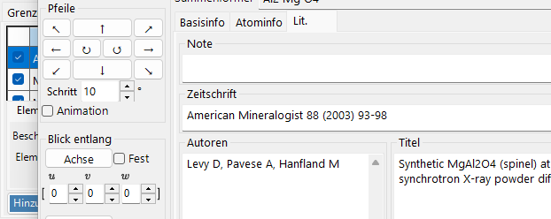

Koordinaten, Element, Besetzung, Radius, Farbe, Material. **Auf gleiches Element anwenden**.

#### Atomliste

Die Liste der Atome im Kristall. Verwenden Sie **Add / Replace / Delete**, um die Liste zu bearbeiten; das Kontrollkästchen ganz links blendet ein Atom vorübergehend aus.

> Um Änderungen dauerhaft zu speichern, klicken Sie ebenfalls im **Hauptfenster** auf **Add** oder **Replace**.

#### Element & Position

- **Label**: Freitext-Beschriftung für das Atom (wird in Legenden und Tooltips verwendet).
- **Element**: chemisches Element / Ionisierungszustand.
- **X, Y, Z**: fraktionelle Koordinaten. Reelle Zahlen von 0–1 oder Brüche wie `1/2` oder `2/3`.
- **Occ**: Besetzung, eine reelle Zahl von 0–1.

#### Ursprungsverschiebung

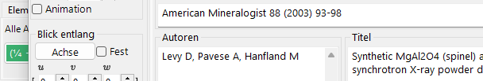

Verschiebt jedes Atom um denselben fraktionellen Versatz. Drücken Sie eine Voreinstellungs-Schaltfläche (zum Beispiel, um zwischen Ursprungswahl 1 / 2 für dieselbe Raumgruppe zu wechseln) oder geben Sie ein benutzerdefiniertes (Δx, Δy, Δz) ein und drücken Sie **Apply custom shift**.

#### Darstellung

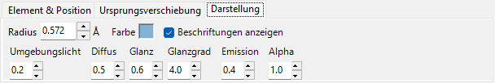

Radius, Farbe und Material pro Atom.

- **Radius**: gezeichneter Atomradius.
- **Farbe**: Oberflächenfarbe.
- **Material**: Textur- / Materialeigenschaften, die vom OpenGL-Shader verwendet werden.
- **Auf gleiches Element anwenden**: wendet den aktuellen Radius und die aktuelle Farbe auf jedes Atom derselben Elementart an.

### Bindungen & Polyeder

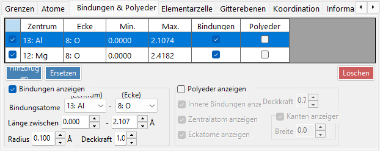

Schwellenwerte für die Bindungslänge, Polyederdarstellung, Kanten.

#### Bindungsliste

Alle für den Kristall registrierten Bindungs-/Polyederregeln. Verwenden Sie **Add / Replace / Delete**; das Kontrollkästchen ganz links deaktiviert einen Eintrag vorübergehend. Wie bei Atomen und Grenzen ist **Add** / **Replace** im **Hauptfenster** erforderlich, um die Änderung dauerhaft zu machen.

#### Bindungseigenschaft

- **Bindungsatome (Zentrum)**: Elementart, die als Zentralatom der Bindung / des Polyeders verwendet wird.
- **Bindungsatome (Ecke)**: Elementart, die als Eckpunkt (das andere Ende) verwendet wird.
- **Länge zwischen … und …**: untere und obere Abstandsschwelle. Atompaare außerhalb dieses Bereichs werden nicht gezeichnet.
- **Bond Radius**: gezeichnete Bindungsdicke (Zylinderradius).
- **Alpha**: Bindungstransparenz (0 = transparent, 1 = undurchsichtig).

#### Polyedereigenschaft

- **Polyeder anzeigen**: wenn aktiviert, wird das durch die aktuelle Bindung definierte Polyeder gezeichnet (nur wenn der Zentrum/Eckpunkt-Satz geometrisch gültig ist).
- **Innere Bindungen anzeigen**: blendet die Bindungen innerhalb des Polyeders ein/aus.
- **Zentralatom anzeigen**: blendet das Zentralatom ein/aus.
- **Eckatome anzeigen**: blendet die Eckatome ein/aus.
- **Color** / **Alpha**: Flächenfarbe und Transparenz.
- **Kanten anzeigen**: zeichnet die Kanten, die die Eckpunkte verbinden.
- **Edge Color** / **Width**: Farbe und Linienbreite der Kanten.

### Elementarzelle

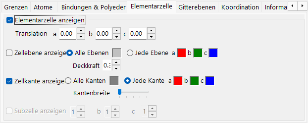

Translation, Zellebenen, Kanten.

#### Translation

Jede Raumgruppe hat einen Standardursprung. Um das Zentrum der gezeichneten Elementarzelle von diesem Ursprung wegzubewegen, stellen Sie die Translation entlang *a*, *b*, *c* ein.

#### Zellebene anzeigen

Ob die sechs Flächen gezeichnet werden, die die Elementarzelle begrenzen. Wenn aktiviert, können Sie die Flächenfarbe und Transparenz einstellen.

#### Kanten anzeigen

Ob die Kanten der Elementarzelle gezeichnet werden. Die Kantenfarbe ist konfigurierbar.

### Gitterebenen

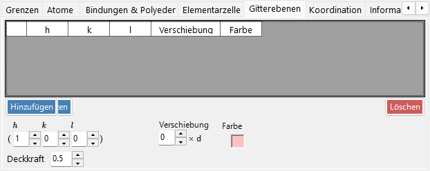

Angabe des Miller-Index mit kristallografischen Äquivalenten.

#### H-k-l-Indizes

Legt die Netzebene über ihren Miller-Index fest. Das Kontrollkästchen schließt optional kristallografisch äquivalente Ebenen ein, die aus (*hkl*) erzeugt werden.

#### Translation

Verschiebt die gezeichnete Netzebene um ein ganzzahliges Vielfaches ihres *d*-Werts (Netzebenenabstand) — nützlich, um aufeinanderfolgende Ebenen derselben Schar darzustellen.

### Koordination

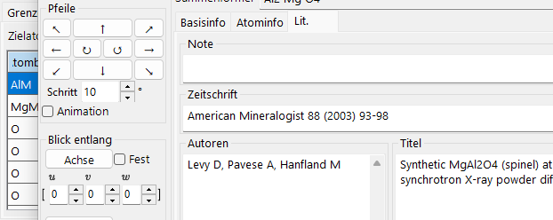

Koordinationstabelle und -graph um das Zielatom.

#### Tabelle (linke Seite)

Listet auf, welche Atome das ausgewählte Zielatom umgeben und in welchem Abstand. Das Zielatom wird aus dem Dropdown-Menü oberhalb der Tabelle ausgewählt.

#### Graph (rechte Seite)

Histogramm der Nachbaranzahl in Abhängigkeit vom Abstand, abgeleitet aus denselben Daten wie die Tabelle. Passen Sie **Bar Width** an, bis sich die Balken sauber in die Koordinationsschalen trennen — dies liefert eine visuelle Abschätzung der Koordinationszahl.

### Information

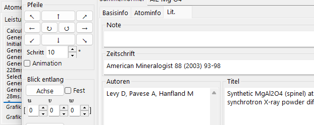

Rendering-Protokoll (Bildzeit, GPU-Informationen) und grundlegende Informationen über das ausgewählte Atom. In Arbeit — die Felder können mit der Zeit erweitert werden.

### Projektion

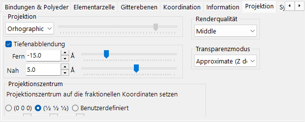

Projektionsmodus (orthografisch/perspektivisch), Tiefenausblendung, Renderqualität, Transparenzmodus.

#### Projektion

- **Orthographic**: perfekte Parallelprojektion (Betrachtungspunkt im Unendlichen).
- **Perspective**: perspektivische Projektion vom Betrachtungsabstand, der mit dem Schieberegler eingestellt wird.

#### Tiefenausblendung

Blendet entfernte Objekte in der Tiefenrichtung aus. Objekte weiter als **Far** sind vollständig transparent; Objekte näher als **Near** sind vollständig undurchsichtig; dazwischenliegende Objekte werden linear interpoliert.

#### Projektionszentrum

Setzt das Zentrum der Projektion auf die angegebenen Koordinaten. Aktivieren Sie **Benutzerdefiniert**, um beliebige Koordinaten einzugeben. Jede Koordinate wird in den Bereich −0.5 bis +0.5 (eine Gitterperiode) zurückgefaltet. Ein **Translation**-Film (siehe [Menü „Datei“](#menü-datei)) steuert diese Werte automatisch an.

#### Renderqualität

Zeichenqualität (Mesh-Unterteilung, Kantenglättung). Höhere Qualität ist langsamer — wählen Sie die Einstellung, die zu Ihrer GPU passt.

#### Transparenzmodus

Algorithmus für durchscheinende Atome und Polyeder.

- **Approximate**: schnell, kann aber ungenau sein, wenn sich viele durchscheinende Objekte überlappen.
- **Perfect**: reihenfolgeunabhängige Transparenz — genau, aber sehr langsam, erfordert praktisch eine dedizierte GPU.

### Symmetrieelemente

Der Tab **Sym.-Elem.** zeichnet die Symmetrieoperatoren der Raumgruppe direkt auf das 3D-Modell (umschalten mit der Symbolleisten-Schaltfläche **Sym.-Elem.**). Jede Klasse von Elementen kann unabhängig ein-/ausgeblendet werden:

- **Drehachsen** und **Schraubenachsen**
- **Spiegelebenen** und **Gleitspiegelebenen**
- **Inversionszentren** und **Drehinversionsachsen**

Für jede Klasse können Sie die Symbolgröße, Linienbreite und Farbe anpassen.

### Sonstiges

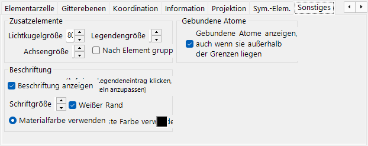

- **Accessory controls**: legt die Anzeigegrößen fest (Lichtkugel, Achsen, Legende). **Group by element** schaltet die Legendenanzeige um.
- **Bonded atoms**: **Show bonded atoms even if they are outside the boundaries** zeichnet weiterhin Atome, die an Atome innerhalb des Zeichenbereichs gebunden sind, auch wenn sie außerhalb davon liegen.
- **Label**: legt die Schriftgröße, Farbe und weitere Eigenschaften der Atombeschriftungen fest.

---

## Symbolleiste

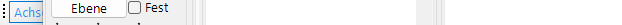

| Schaltfläche | Beschreibung |
|--------|-------------|
| Achsen | Achsenorientierung anzeigen (Größe = Gitterkonstante) |
| Licht | Lichtrichtung einstellen |
| Legende | Atomlegende |
| Atome | Atomobjekte umschalten |
| Beschriftungen | Atombeschriftungen umschalten |
| Elementarzelle | Kanten der Elementarzelle umschalten |
| Sym.-Elem. | Überlagerung der Symmetrieelemente umschalten (siehe oben) |
| Rotation zurücksetzen | Zur Ausgangsorientierung zurückkehren |
| Wie Vesta | Erscheinungsbild im Vesta-Stil |

---

## Siehe auch

- [Hauptfenster](0-main-window.md)
- [Kristalldatenbank](1-crystal-database.md)
- [Symmetrieinformationen](2-symmetry-information.md)
- [Beugungssimulator](7-diffraction-simulator/index.md)
- [Tastatur- & Maus-Kurzbefehle](21-shortcuts.md)
