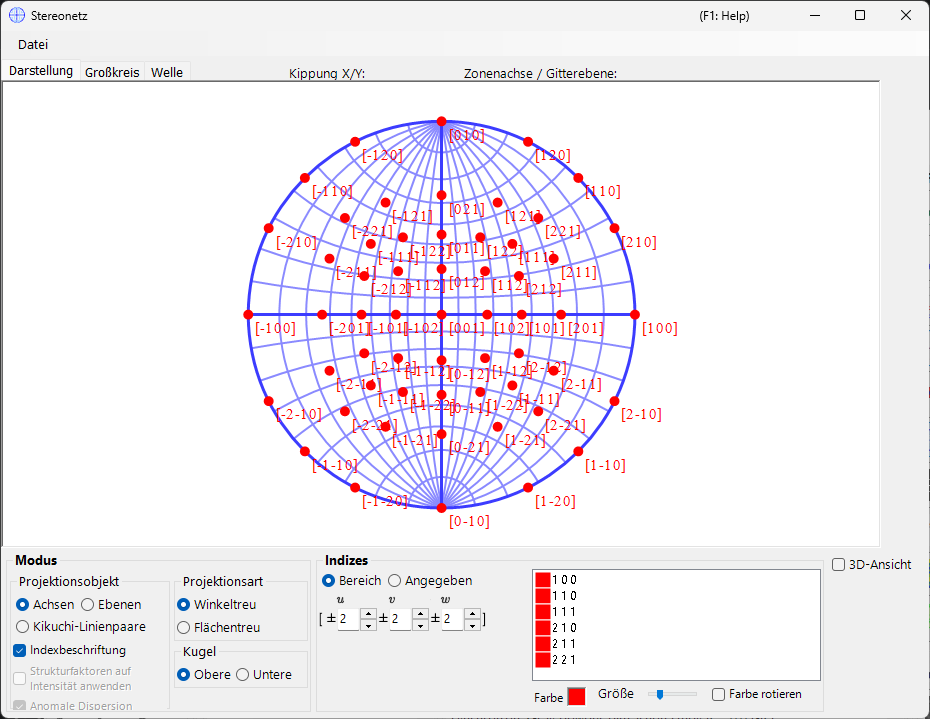
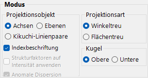
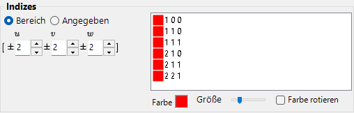
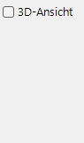
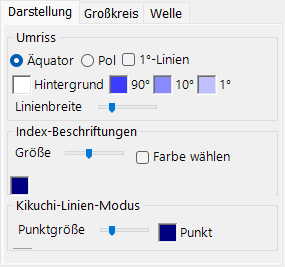
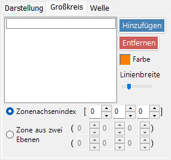
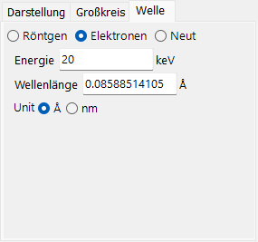

# Stereonetz

Das **Stereonetz** stellt Kristallebenen und Achsenrichtungen mithilfe der stereografischen Projektion dar.

---

## Tastatur- & Maus-Kurzbefehle

Das Stereonetz selbst ist eine 2-D-Projektion; eine optionale 3-D-Kugel kann mit **3D display** eingeblendet werden.

| Kurzbefehl | Aktion |
|----------|--------|
| <kbd>F1</kbd> | Diese Seite des Online-Handbuchs öffnen |
| Linksziehen nahe der Mitte | Den Kristall kippen |
| Linksziehen im äußeren Bereich | Den Kristall um die Blickachse drehen |
| Linksdoppelklick | Zwischen der Projektion **Plane** und **Axis** umschalten |
| Rechtsklick | Herauszoomen |
| Rechtsziehen eines Rahmens | In den ausgewählten Bereich hineinzoomen |
| Mittelziehen | Verschieben |
| Maus bewegen (ohne Taste) | Die (hkl)/[uvw] unter dem Cursor ablesen — nützlich zum Indizieren eines gemessenen Reflexes |

Das Ziehen auf dem Netz dreht den **Kristall**; der Rotationszustand wird über alle Fenster hinweg geteilt.

Das 3-D-Rendering verwendet ReciPros Standard-[OpenGL-Ansichtsnavigation](21-shortcuts.md) (Linksziehen drehen, Rechtsziehen / Mausrad zoomen, <kbd>CTRL</kbd> + Rechtsdoppelklick schaltet die Projektion um) und dreht nur die 3-D-Ansicht, nicht den Kristall selbst.

Die anwendungsweiten <kbd>CTRL</kbd>+<kbd>SHIFT</kbd>-Kurzbefehle aus dem [Hauptfenster](0-main-window.md#keyboard-mouse-shortcuts) funktionieren ebenfalls, während dieses Fenster den Fokus hat.

→ Siehe **[21. Tastatur- & Maus-Kurzbefehle](21-shortcuts.md)** für jedes Fenster auf einen Blick.

---

## Hauptbereich

Hier wird die Stereonetz-Projektion der Kristallebenen, Richtungsindizes und Kikuchi-Linien des ausgewählten Kristalls angezeigt.

---

## Datei-Menü

Speichern oder Kopieren im Raster- oder Vektorformat. Das Vektorformat ermöglicht das Bearbeiten von Schriftart/Linienstärke in PowerPoint oder anderen Vektoreditoren.

---

## Mode

### Projektionsziel

Wählen Sie aus, was auf das Netz projiziert werden soll.

- **Achsen** — projiziert die Richtungsindizes \([uvw]\).
- **Ebenen** — projiziert die Kristallebenennormalen \((hkl)\).
- **Kikuchi-Linienpaare** — projiziert Kikuchi-Linienpaare.

### Projektionsmethode

| Methode | Beschreibung |
|--------|-------------|
| **Wulff** (winkeltreu / stereografisch) | Erhält die Winkelbeziehung zwischen den projizierten Merkmalen, aber nicht den Raumwinkel. Wird von klassischen Kristallographen beim Ablesen von Winkeln zwischen Achsen oder Ebenen verwendet. |
| **Schmidt** (flächentreu / Lambert) | Erhält den Raumwinkel (die Fläche) jeder Region, verzerrt aber die Winkel. Bevorzugt für statistische Polfiguren, bei denen die relative Dichte von Bedeutung ist. |

### Hemisphäre

Wählen Sie die **Obere** oder **Untere** Hemisphäre als Projektionsquelle — dies schaltet um, ob die sichtbare Seite der Kugel diejenige ist, die dem Betrachter am nächsten oder am weitesten von ihm entfernt liegt.

### Anzeigeoptionen

- Indexbeschriftungen anzeigen.
- Wenn **Planes** oder **Kikuchi line pairs** ausgewählt ist, wird jeder Punkt bzw. jede Linie mit dem Strukturfaktor \(|F_{hkl}|\) gewichtet (Wellenquelle und Wellenlänge im [Wave-Tab](#wave) festlegen).

> Für trigonale/hexagonale Kristalle kann die Miller-Bravais-Notation (4-Index) über **Option ▸ Use Miller-Bravais (hkil) index** im Hauptfenster aktiviert werden.

---

## Indices

Legt fest, welche Kristallebenen / Achsen gezeichnet werden.

### Bereichsmodus

Geben Sie einen Bereich von \([uvw]\)- oder \((hkl)\)-Indizes an. ReciPro zählt jeden Index innerhalb der Grenzen auf und projiziert jeden einzelnen.

### Spezifizierter Modus

Legt bestimmte Achsen oder Ebenen einzeln fest. Geben Sie einen Index ein, drücken Sie **Hinzufügen**, um ihn zu registrieren, oder **Entfernen**, um ihn zu löschen. Wenn **Äquivalente Indizes einschließen** aktiviert ist, werden auch alle kristallographisch äquivalenten Indizes gezeichnet.

### Colour / Size

Legen Sie **Farbe** und **Größe** der eingezeichneten Punkte fest. Aktivieren Sie **Farbe rotieren**, um jeden Satz äquivalenter Achsen/Ebenen unterschiedlich farblich zu codieren — nützlich, um Familien in einer Mehrindex-Darstellung zu unterscheiden.

---

## 3D Options

Steuert die 3D-Netz-Überlagerung (Kugel) — Deckkraft der Kugel, Achsenanzeigen usw.

---

## Tab-Menü

### Appearance

#### Outline

Wie der Umriss des Stereonetzes gezeichnet wird — der Begrenzungskreis und das optionale Großkreis-Längen-/Breitengrad-Gitter. Wählen Sie **Äquator** oder **Pol**, schalten Sie **1°-Linien** und die **Hintergrund**-Füllung um, legen Sie die Gitterfarben **90° / 10° / 1°** fest und passen Sie die **Linienbreite** mit dem Schieberegler an.

#### Index labels

- **Size** — Größe der Indexbeschriftungen.
- **Farbe wählen** — verwendet eine einzige feste Farbe für alle Indexbeschriftungen anstelle der punktbezogenen Farbe; nützlich, wenn die Punkte farblich codiert sind, Sie aber alle Beschriftungen zur besseren Lesbarkeit in einer einzigen Farbe wünschen.
- **Trennzeichen** — Zeichen, das zwischen den Indizes jeder Beschriftung gesetzt wird: **Keine** (z. B. 100), **Leerzeichen** (1 0 0) oder **Komma** (1,0,0).

#### Kikuchi line mode

- **Punktgröße** — Größe der eingezeichneten Punkte.
- **Punkt** / **Beschriftung** — Farben der Punkte und ihrer Beschriftungen.

### Great and Small Circle

Zeichnen Sie Großkreise und Kleinkreise. Geben Sie diese entweder über den **zone-axis index** \([uvw]\) an (der Großkreis, der von der Zone dieser Achse gebildet wird) oder über **two crystal-plane indices**, die sich die Zonenachse teilen. Die Linienstärke der Kreise ist ebenfalls über einen Schieberegler konfigurierbar.

### Wave {#wave}

Nur verfügbar, wenn **Planes** oder **Kikuchi line pairs** als Projektionsziel ausgewählt ist. Legt die Wellenquelle (X-ray / electron / neutron) sowie die Wellenlänge oder Energie fest, die zur Berechnung der Kristallstrukturfaktoren benötigt werden, die für die Option **structure-factor weighting** in [Mode](#mode) verwendet werden.

---

## Siehe auch

- [Hauptfenster](0-main-window.md)
- [Rotationsgeometrie](4-rotation-geometry.md)
- [Strukturansicht](5-structure-viewer.md)
- [Beugungssimulator](7-diffraction-simulator/index.md)
- [Grundlegendes Koordinatensystem & Kristallorientierung](appendix/a1-coordinate-system/1-orientation.md)
