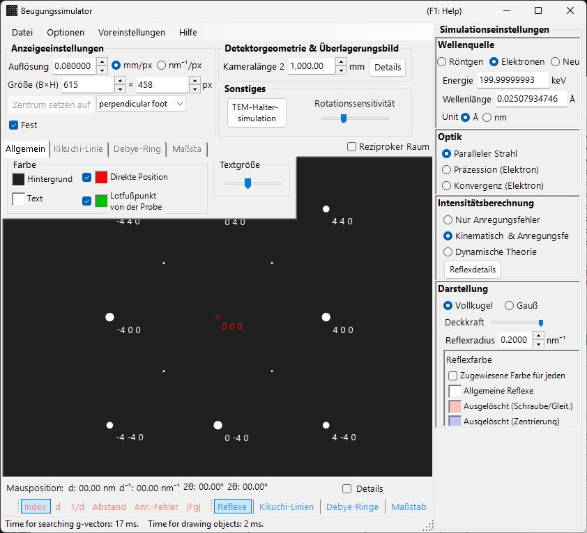
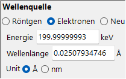
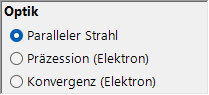
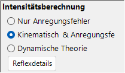
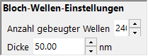
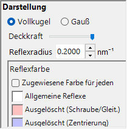

# SAED-Simulation (Selected Area Electron Diffraction)

Die **SAED-Simulation (Selected Area Electron Diffraction)** berechnet Einkristall-Elektronenbeugungsmuster, die durch einen parallelen Elektronenstrahl erzeugt werden. Dies ist der Standardmodus des [Beugungssimulators](index.md).

> Diese Seite listet jede Einstellung auf, die im Bereich **Spot property** rechts erscheint, wenn Sie **Wave Length = Electron** und **Incident beam mode = Parallel** wählen. Fensterweite Operationen wie Zeichnen und Speichern finden Sie auf der [Übersichtsseite](index.md).

GUI-Bedingungen: Wave Length = Electron, Incident beam mode = Parallel, Intensity calculation = Only excitation error / Kinematical / Dynamical.

---

## Überblick

Simuliert das Beugungsmuster, das entsteht, wenn ein paralleler Elektronenstrahl eine dünne Probe durchläuft. Die Spotpositionen werden durch die geometrische Beziehung zwischen der Ewald-Kugel und den reziproken Gitterpunkten festgelegt, und die Helligkeit jedes Spots wird gemäß dem gewählten Intensitätsberechnungsmodus berechnet.

---

## Wave Length

Stellen Sie die Strahlungsquelle auf **Electron**. Geben Sie die Energie (keV) oder die Wellenlänge (nm) ein, und die relativistisch korrigierte Wellenlänge wird berechnet. Für Röntgen- und Neutronenquellen siehe [Röntgenbeugungssimulation](4-x-ray-neutron-diffraction.md).

---

## Modus des einfallenden Strahls

Stellen Sie die Geometrie des einfallenden Strahls auf **Parallel**. Dies ist die übliche ebene-Wellen-Geometrie, die für SAED und Röntgenbeugung verwendet wird.

> **Hinweis**: Für Elektronen können Sie **Parallel / Precession (electron = PED) / Convergence (CBED)** wählen. Die Wahl von **Precession** ergibt eine [PED-Simulation](2-ped-simulation.md), und die Wahl von **Convergence** ergibt eine [CBED-Simulation](3-cbed-simulation.md); in beiden Fällen wechselt die Intensitätsberechnung automatisch zu Dynamical.

---

## Intensitätsberechnung

Legt fest, wie die Spotintensitäten berechnet werden.

### Nur Anregungsfehler

Die Intensität wird ausschließlich aus dem geometrischen Abstand zwischen der Ewald-Kugel und dem reziproken Gitterpunkt (dem Anregungsfehler $s_g$) bestimmt. Je kleiner $\lvert s_g \rvert$ ist, desto höher die Intensität; sie erreicht ihr Maximum bei dem über **Radius** eingestellten Wert und fällt auf null, wenn $\lvert s_g \rvert$ den Radius überschreitet. Da der Strukturfaktor des Kristalls ignoriert wird, ist dies der schnellste Modus und eignet sich zum Überprüfen der Beugungsspotpositionen.

### Kinematisch

Zusätzlich zum Anregungsfehler wird der kinematische Strukturfaktor $\lvert F_{hkl} \rvert^2$ in die Intensität einbezogen. Auslöschungsregeln werden korrekt wiedergegeben, wodurch sich dieser Modus für dünne Proben oder schwache Beugung eignet.

### Dynamisch (Bloch-Wellen-Methode, nur Elektron)

Eine strenge dynamische Berechnung mit der Bloch-Wellen-Methode (Bethe-Methode). Sie reproduziert die Mehrfachstreuung und die dickenabhängige Variation der Intensität und ist für dicke Proben oder starke Beugung erforderlich. Nur verfügbar, wenn Electron gewählt ist. Zur Theorie siehe [Anhang A3. Bloch-Wellen-Methode](../appendix/a3-bloch-wave/calculation.md).

> **Hinweis**: Wenn **Dynamical** gewählt ist, erscheint unten ein Bereich **Bloch-Wellen-Einstellungen**.

---

## Bloch-Wellen-Einstellungen (dynamische Theorie)

Nur aktiv, wenn **Intensity calculation = Dynamical**.

| Parameter | Beschreibung |
|-----------|-------------|
| **Number of diffracted waves** | Anzahl der Bloch-Wellen, die im Eigenwertproblem berücksichtigt werden. Größere Werte ergeben genauere Intensitäten, erhöhen aber die Rechenzeit mit $O(N^3)$ |
| **Thickness** | Probendicke (nm), die in der dynamischen Berechnung verwendet wird |

---

## Darstellung der Spots

Steuert, wie jeder Beugungsspot dargestellt wird.

- **Solid sphere / Gaussian** : das geometrische Modell des reziproken Gitterpunkts. **Solid sphere** zeichnet den Querschnitt (einen Kreis) zwischen einer Kugel mit Radius $R$ und der Ewald-Kugel, wobei die Kreisfläche der Beugungsintensität entspricht; **Gaussian** zeichnet den Querschnitt (eine 2-D-Gaußfunktion) einer 3-D-Gaußfunktion mit $\sigma = R$, deren Integral der Beugungsintensität entspricht.
- **Opacity** : Transparenz des Spots (0 = transparent, 1 = undurchsichtig).
- **Radius (R)** : virtueller Radius des reziproken Gitterpunkts. Die Spotgröße wird durch die Kombination aus dem Modus **Appearance** und der **Intensity calculation** festgelegt (z. B. ergibt Solid sphere + Dynamical einen Radius proportional zu $I_\text{dyn}^{1/2}$).
- **Brightness** : nur im Modus **Gaussian** aktiv. Integrierte Intensität der gezeichneten Gaußfunktion.
- **Color scale** : **Gray scale** oder **Cold-warm**.
- **Log scale** : Intensitäten in logarithmischer Skala anzeigen. Nützlich für Muster mit großem Intensitätskontrast.
- **Spot color** : Spotfarbe, die verwendet wird, wenn keine Farbskala genutzt wird.
- **Use crystal color** : wenn aktiviert, werden die Spots in der jedem Kristall zugewiesenen Farbe gezeichnet.

---

## Reflex-Beschriftungen

Die über den Spots eingeblendeten Beschriftungen werden in der [Symbolleiste](index.md#toolbar) ausgewählt.

| Label | Inhalt |
|-------|---------|
| **Index** | Miller-Indizes $(hkl)$ |
| **d** | Netzebenenabstand $d$ |
| **1/d** | Kehrwert des Netzebenenabstands $1/d$ |
| **Distance** | Spot-zu-Spot-Abstand auf dem Detektor |
| **2θ** | Streuwinkel $2\theta$ (gleiche Definition wie die konzentrischen 2θ-Skalenkreise) |
| **χ** | Azimutwinkel $\chi$, von der 12-Uhr-Richtung aus gemessen, positiv im Uhrzeigersinn (gleiche Definition wie die radialen Azimut-Skalenlinien) |
| **Excit. Err.** | Anregungsfehler $s_g$ |
| **\|Fg\|** | Betrag des Strukturfaktors $\lvert F_{hkl} \rvert$ |

---

## Gemeinsame Operationen

Detektorinformationen, Spiegeln, Anzeige des reziproken Raums, Kikuchi-Linien, Debye-Ringe, Skalenlinien, Farbeinstellungen, Speichern und dergleichen sind allen Modi gemeinsam. Siehe die [Übersichtsseite](index.md). Die aus der dynamischen Berechnung gewonnenen Details pro Reflex können in den [Beugungsspot-Informationen](index.md#diffraction-spot-information) durchsucht werden.

---

## Siehe auch

- [Beugungssimulator (Übersicht)](index.md)
- [SAED-Berechnung mit parallelem Strahl](../appendix/a3-bloch-wave/calculation.md#parallel-beam-saed)
- [Röntgenbeugungssimulation](4-x-ray-neutron-diffraction.md)
- [Simulation der Präzessions-Elektronenbeugung (PED)](2-ped-simulation.md)
- [Definition des Koordinatensystems](../appendix/a1-coordinate-system/1-orientation.md)
