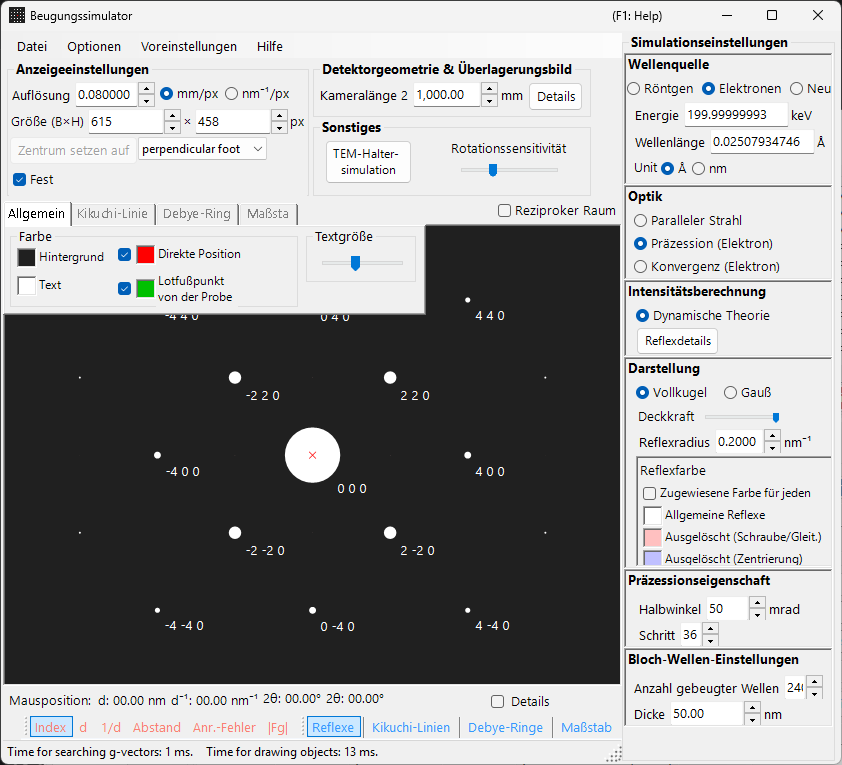
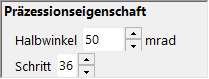

# Simulation der Präzessions-Elektronenbeugung (PED)

Die Simulation der **PED (Precession Electron Diffraction)** berechnet Elektronenbeugungsbilder, die durch Präzession des einfallenden Strahls auf einem Kegel um die optische Achse erhalten werden.

> Diese Seite listet alle Einstellungen auf, die auf der rechten Seite erscheinen, wenn Sie **Wave = Electron beam, Incident beam = Precession (electron), Intensity = Dynamical (automatic)** auswählen. Beachten Sie, dass **die Auswahl von Precession (electron) für den einfallenden Strahl die Intensitätsberechnung automatisch auf Dynamical umschaltet**. Fensterweite Operationen wie Zeichnen und Speichern finden Sie auf der [Übersichtsseite](index.md).

GUI-Bedingungen: **Wave = Electron beam, Incident beam = Precession (electron), Intensity = Dynamical (automatic)**

---

## Übersicht

Bei der PED wird der Elektronenstrahl auf einem Kegel um die optische Achse in Präzession versetzt, und die für jede Strahlrichtung auf dem Präzessionskegel erhaltenen Beugungsbilder werden integriert. Im Vergleich zur konventionellen SAED bietet dies die folgenden Vorteile:

- Dynamische Effekte werden herausgemittelt, wodurch Intensitätsdaten nahe den kinematischen Intensitätsverhältnissen entstehen
- Reflexe höherer Laue-Zonen (HOLZ) werden deutlicher beobachtet
- Es lassen sich für die Strukturanalyse geeignete Intensitätsdaten gewinnen

---

## Wellenlängen-Einstellung

Da es sich bei PED um Elektronenbeugung handelt, wählen Sie als Quelle **Electron beam**. Durch Eingabe der Elektronenenergie (keV) oder der Wellenlänge (nm) wird die relativistisch korrigierte Wellenlänge berechnet.

---

## Einfallender Strahl

Wählen Sie für die Geometrie des einfallenden Strahls **Precession (electron)** (nur verfügbar, wenn der Elektronenstrahl ausgewählt ist).

> **Hinweis** : Die Auswahl von **Precession (electron)** **schaltet die Intensitätsberechnung automatisch auf Dynamical um**, und das Einstellungsfeld der Bloch-Wellen-Methode sowie das Einstellungsfeld der Präzession erscheinen. **Only excitation error** / **Kinematical** können nicht mehr ausgewählt werden.

---

## Präzessions-Einstellungen

Legen Sie die Form und die Abtastung des Präzessionskegels fest.

| Parameter | Beschreibung | Empfohlen |
|-----------|-------------|-------------|
| **Semi-angle** | Halber Öffnungswinkel des Präzessionskegels (mrad) | 10–40 mrad |
| **Step** | Anzahl der auf dem Präzessionskegel abgetasteten Parallelstrahl-Richtungen. Größere Werte ergeben eine glattere Integration, erhöhen aber die Rechenzeit linear | 36–72 |

---

## Intensitätsberechnung und Bloch-Wellen-Einstellungen

Sobald **Precession (electron)** ausgewählt ist, wird **Intensity = Dynamical (automatic)** fest eingestellt. Für den Parallelstrahl in jeder Präzessionsrichtung wird die Beugungsintensität mit der Bloch-Wellen-Methode (dynamische Berechnung) berechnet, und die Integration über alle Richtungen ergibt das PED-Bild.

| Parameter | Beschreibung | Empfohlen |
|-----------|-------------|-------------|
| **No. of diffracted waves** | Anzahl der im Eigenwertproblem berücksichtigten Bloch-Wellen. Größere Werte ergeben genauere Intensitäten, aber die Rechenzeit wächst wie $O(N^3)$ | 50–200 |
| **Thickness** | In der dynamischen Berechnung verwendete Probendicke (nm) | — |

Der Rechenaufwand entspricht ungefähr „Anzahl der Schritte × Bloch-Wellen-Berechnung pro Richtung“. Einzelheiten zur dynamischen Berechnung finden Sie unter [Dynamische Berechnung (Bloch-Wellen-Methode)](../appendix/a3-bloch-wave/calculation.md).

---

## Darstellung der Reflexe

Steuert, wie jeder Beugungsreflex gezeichnet wird.

- **Solid sphere / Gaussian** : Geometrisches Modell der reziproken Gitterpunkte. **Solid sphere** zeichnet den Querschnitt einer Kugel mit Radius $R$ mit der Ewald-Kugel, und **Gaussian** zeichnet den Querschnitt (eine 2D-Gauß-Funktion) einer 3D-Gauß-Funktion mit $\sigma = R$ mit der Ewald-Kugel.
- **Opacity** : Transparenz des Reflexes (0 = transparent, 1 = undurchsichtig).
- **Radius (R)** : Radius der reziproken Gitterpunkte. Für dynamische Intensitäten gilt: Gauß-Integral $=$ Brightness $\times I_\text{dyn}$, und Solid sphere verwendet den Radius $R \times I_\text{dyn}^{1/2}$ (sodass die Fläche proportional zur dynamischen Intensität ist).
- **Brightness** : Nur im Modus **Gaussian** verfügbar. Integrierte Intensität der gezeichneten Gauß-Funktion.
- **Colour scale** : Farbskala **Gray scale** oder **Cold-warm**.
- **Log scale** : Anzeige der Intensität auf einer logarithmischen Skala.
- **Spot colour** : Farbe des Reflexes, wenn keine Farbskala angewendet wird.
- **Use crystal colour** : Zeichnet die Reflexe in der jedem Kristall zugewiesenen Farbe.

---

## Vergleich mit SAED

| Merkmal | SAED | PED |
|---------|------|-----|
| Strahl | Parallel, fest | Präzedierend (Kegelabtastung) |
| Dynamische Effekte | Groß | Gemittelt, kleiner |
| HOLZ-Reflexe | Schwach | Treten stark auf |
| Zuverlässigkeit der Intensität | Für die Strukturanalyse möglicherweise unzureichend | Für die Strukturanalyse geeignet |
| Rechenzeit | Kurz | Lang |

---

## Siehe auch

- [Beugungssimulator (Übersicht)](index.md)
- [Röntgenbeugungssimulation](4-x-ray-neutron-diffraction.md)
- [SAED-Simulation](1-saed-simulation.md)
- [Dynamische Berechnung (Bloch-Wellen-Methode)](../appendix/a3-bloch-wave/calculation.md)
