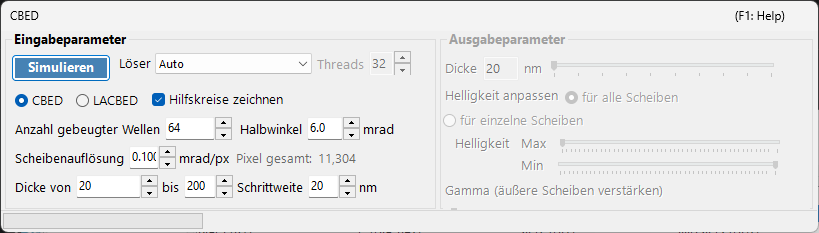
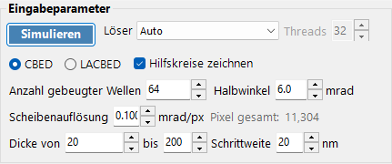
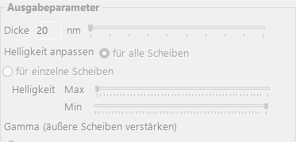

# CBED-Simulation

Die **CBED-Simulation (Convergent-Beam Electron Diffraction)** berechnet und zeigt Beugungsbilder mit konvergenter Beleuchtung mithilfe der Bloch-Wellen-Methode (Bethe) an. CBED-Bilder zeigen Beugungsscheiben statt Reflexpunkten und enthalten reichhaltige Informationen über Kristallsymmetrie, Dicke und Struktur.

> Diese Seite listet alle Einstellungen des speziellen Fensters auf, das sich öffnet, wenn Sie im [Beugungssimulator](index.md) **Wavelength = Electron** und **Incident beam = Convergence (CBED, electron only)** auswählen. Beim Umschalten des einfallenden Strahls auf Konvergenz wird **Intensity calculation** automatisch auf **Dynamical** gesetzt, und dieses CBED-Einstellungsfenster öffnet sich. Zum Zeichnen und Speichern von Beugungsbildern sowie zu weiteren Vorgängen, die für den Beugungssimulator gemeinsam gelten, siehe die [Übersichtsseite](index.md).

GUI-Bedingungen: Wave Length = Electron · Incident beam = Convergence (CBED, electron only) · Intensity calculation = Dynamical (automatisch)

---

## Eingabeparameter

| Parameter | Beschreibung | Standard / Typisch |
|-----------|-------------|-------------------|
| **Mode** | **CBED**: Standardbild mit konvergenter Beleuchtung, bei dem jede Scheibe einem Reflex entspricht, mit der durchgehenden Scheibe (000) im Zentrum. **LACBED** (Large-Angle CBED): Bild mit konvergenter Beleuchtung und großem Winkel, bei dem sich die Scheiben verschiedener Reflexe überlappen. Nützlich zur Beobachtung von HOLZ-Linien (higher-order Laue zone) und Symmetrie | CBED |
| **Convergence semi-angle (mrad)** | Halbwinkel des Konvergenzkegels des Strahls. Bestimmt die Größe jeder Beugungsscheibe (der Scheibendurchmesser im reziproken Raum entspricht $2\alpha$) | 5–30 mrad |
| **Disk resolution (mrad/px)** | Winkelauflösung innerhalb jeder Scheibe. Kleinere Werte ergeben eine höhere Auflösung, aber die Anzahl der berechneten Strahlrichtungen (Pixel) wächst quadratisch, sodass auch die Rechenzeit quadratisch zunimmt. Die resultierende Gesamtpixelzahl (= Gesamtzahl der Strahlrichtungen) wird rechts angezeigt | — |
| **No. of Bloch waves** | Maximale Anzahl der Strahlen, die in die Bloch-Wellen-Berechnung bei jeder einfallenden Strahlrichtung einbezogen werden. Mehr Strahlen ergeben eine höhere Genauigkeit, aber der Aufwand des Eigenwertproblems wächst mit $O(N^3)$ | 100–500 |
| **Thickness range** | Start-, End- und Schrittwerte der Probendicke (nm). Mehrere Dicken werden zusammen berechnet und mit dem Dicken-Schieberegler auf der Ausgabeseite umgeschaltet | — |
| **Solver** | Rechenmaschine für das Eigenwertproblem. **Auto**: wählt automatisch den besten Solver. **Eigenproblem (MKL)**: basiert auf Intel MKL (am schnellsten). **Eigenproblem (Eigen)**: Eigen-C++-Bibliothek. **Managed**: reines verwaltetes .NET (am langsamsten, aber immer verfügbar) | Auto |
| **Thread count** | Anzahl der parallelen Threads für die Berechnung | — |
| **Draw disk outlines** | Wenn aktiviert, wird ein Kreis gezeichnet, der die Grenze jeder Beugungsscheibe anzeigt | — |

---

## Run / Stop

- **Start** : startet die CBED-Simulation mit den aktuellen Eingabeparametern.
- **Stop** : bricht die laufende Berechnung ab.

---

## Ausgabeparameter

Sobald die Berechnung abgeschlossen ist, werden die Ausgabeparameter verfügbar. Alle ändern nur die Anzeige, ohne neu zu rechnen.

| Parameter | Beschreibung |
|-----------|-------------|
| **Sample thickness** | Wählt mit einem Schieberegler die anzuzeigende Probendicke innerhalb des Dickenbereichs der Eingabeparameter aus |
| **Brightness adjustment** | **Common to all disks**: verwendet eine gemeinsame Helligkeitsskala über alle Scheiben hinweg, um das vollständige CBED-Bild anzuzeigen. **Per disk**: zeigt eine einzelne ausgewählte Scheibe in voller Auflösung an, normiert innerhalb dieser Scheibe |
| **Brightness (Max / Min)** | Obere und untere Grenze der angezeigten Intensität. Anpassen, wenn Sie schwache Merkmale hervorheben möchten |
| **γ (emphasis of outer disks)** | Gamma-Korrektur. Wird verwendet, um die dunklen äußeren Scheiben bei großen Winkeln im Vergleich zur zentralen durchgehenden Scheibe besser sichtbar zu machen |
| **Scale** | Wählt die Intensitätsabstufung zwischen **Positive** / **Negative** (schwarz-weiß invertiert) aus |
| **Color** | Für die Anzeige verwendete Farbkarte. Wählen Sie aus **Gray** und anderen |

---

## Physikalischer Hintergrund

Bei CBED wird der einfallende Strahl als ein Kegel ebener Wellen mit unterschiedlichen Richtungen betrachtet. Für jede Richtung (jeden Punkt innerhalb der Konvergenzblende = eine partielle einfallende ebene Welle) löst die Bloch-Wellen-Methode die Elektronen-Schrödinger-Gleichung im Inneren des Kristalls, und die Ergebnisse werden als Beugungsscheiben angeordnet. HOLZ-Linien (higher-order Laue zone) erscheinen als feine dunkle/helle Linien innerhalb der Scheiben und entstehen durch Reflexe in höheren Laue-Zonen. Sie sind empfindlich gegenüber dem Gitterparameter entlang der $c$-Achse und nützlich für die dreidimensionale Strukturanalyse.

Für die theoretischen Einzelheiten siehe [CBED-Berechnung](../appendix/a3-bloch-wave/cbed.md).

---

## Siehe auch

- [Beugungssimulator (Übersicht)](index.md)
- [SAED-Simulation](1-saed-simulation.md)
- [PED-Simulation](2-ped-simulation.md)
- [CBED-Berechnung](../appendix/a3-bloch-wave/cbed.md)
