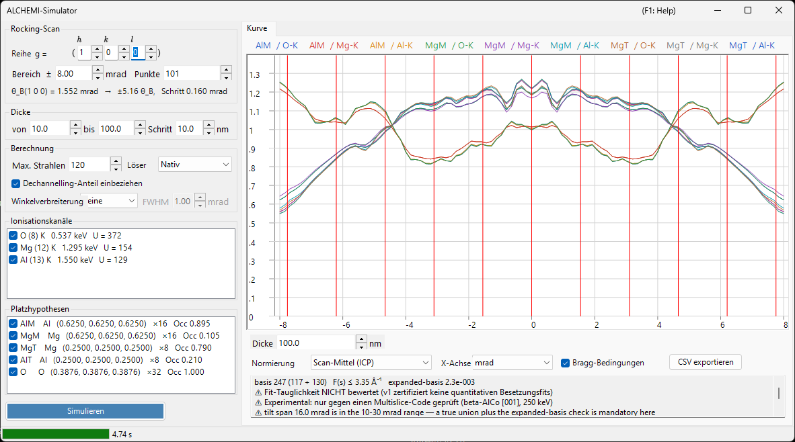

# ALCHEMI-Simulation

**ALCHEMI (Atom Location by CHannelling-Enhanced MIcroanalysis)** bestimmt, **welchen Platz ein Dotierungsatom besetzt**, indem die Ausbeute charakteristischer Röntgenstrahlung gemessen wird, während der Kristall entlang einer systematischen Reihe verkippt wird, und indem die Orientierungsabhängigkeit ausgewertet wird. Der ALCHEMI-Simulator von ReciPro berechnet aus einer Kristallstruktur und einem Satz von Platzhypothesen die **Rocking-Kurve (Ionisationsausbeute in Abhängigkeit von der Orientierung) in Vorwärtsrichtung**.

> **Dies ist eine Preview-Funktion.** v1 führt **ausschließlich eindimensionale Vorwärtsrechnungen** durch; die Anpassung an experimentelle Daten und die 2D-Karte (2D-HARECXS) sind nicht implementiert (diese Registerkarten sind ausgeblendet). **Nach bestem Wissen der Autoren existiert kein anderer öffentlich verfügbarer ALCHEMI-Vorwärtssimulator.** Da es keine Implementierung zum Gegenprüfen gibt, lesen Sie [Geltungsbereich und bekannte Grenzen](#geltungsbereich-und-bekannte-grenzen), bevor Sie die Ergebnisse quantitativ verwenden.

Öffnen über das Menü **Optionen** des [Beugungssimulators](index.md) → **ALCHEMI-Simulator...**

GUI-Bedingungen: Wave Length = Electron (Kristall, Beschleunigungsspannung und Orientierung werden vom übergeordneten Beugungssimulator übernommen)



Das Fenster hat **links die Einstellungen** (Scan, Dicke, Berechnung, Ionisationskanäle, Platzhypothesen) und **rechts das Ergebnis** (Registerkarte Kurve).

---

## Was berechnet wird

Für jede einfallende Orientierung wird das Wellenfeld im Kristall mit der Bloch-Wellen-Methode gelöst, und für jedes Paar aus Platz $s$ und Ionisationskanal $c$ wird die Ionisationsausbeute analytisch bis zur Dicke $t$ integriert.

$$
Y_\text{dyn} = \mathrm{Re} \sum_{jj'} \alpha_j^{*}\,\bigl(C^{\dagger} \mu_{s,c} C\bigr)_{jj'}\, \alpha_{j'}\, F_{jj'}(t),
\qquad F_{jj'}(t) = \frac{e^{\lambda t} - 1}{\lambda}
$$

Die Ionisationsmatrix $\mu$ hängt nur von der Differenz zweier Reflexe ab, $G = \mathbf{g}_h - \mathbf{g}_g$.

$$
\mu_{hg} = \sum_a \mathrm{Occ}_a\, e^{-M_a(G)}\, \sigma_c\, F_c(|G|/2)\, e^{-2\pi i\,G \cdot \mathbf{r}_a}
$$

- $\sigma_c$ : totaler Ionisationsquerschnitt aus dem **Bote–Salvat**-Modell
- $F_c(s)$ : normierter Ionisationsformfaktor aus selbst erzeugten **DHFS**-Tabellen (dieselbe Datenbasis wie [Strahl-Wechselwirkung](../3-beam-interaction.md) und [STEM-EDX](../9-hrtem-stem-simulator/2-stem-simulation.md))
- $e^{-M_a(G)}$ : Debye-Waller-Faktor (anisotrope ADPs werden unterstützt)

Das entspricht der **lokalen Formfaktor-Näherung** von ICSC (Oxley & Allen 2003). Die Zwei-Impuls-MDFF wird nicht verwendet.

### Dechannelling-Anteil

Elektronen, die durch thermisch-diffuse Absorption aus dem kohärenten Bloch-Feld entfernt werden, durchlaufen die restliche Dicke als richtungsmäßig randomisierte Elektronen und ionisieren auch dort.

$$
Y_\text{dech} = \frac{\mu_{00}}{V_c}\,\bigl(t - L_\text{coh}(t)\bigr),
\qquad L_\text{coh}(t) = \int_0^t \sum_g |\psi_g(z)|^2\,dz
$$

Das Abwählen von **Dechannelling-Anteil einbeziehen** im Feld **Berechnung** lässt diesen Term entfallen. Er macht bei typischen Dicken mehrere zehn Prozent der Gesamtausbeute aus; wird er weggelassen, erscheint der Platzkontrast stärker, als er ist.

### Ausgabegröße

Die primäre Größe ist die **Anzahl der pro einfallendem Elektron erzeugten Innerschalen-Löcher**. **Die Umrechnung in Röntgenphotonen (Fluoreszenzausbeute und Linienverzweigung), die Röntgen-Selbstabsorption in der Probe sowie Detektoreffizienz und Raumwinkel sind NICHT berücksichtigt.**

⚠ **Löcher sind keine Zählraten.** Zwischen dieser Größe und einer gemessenen EDX-Intensität liegen drei weitere Stufen — atomar, probenseitig und gerätebedingt —, von denen ReciPro keine ausführt.

1. **Loch → Photon** : Fluoreszenzausbeute und Linienverzweigung der Schale
2. **Photon → Photon, das die Probe verlässt** : Röntgen-Selbstabsorption; sie hängt von der **Tiefe, in der das Photon entstanden ist**, und vom Abnahmewinkel ab
3. **Photon → Zählrate** : Detektoreffizienz, Raumwinkel und die Verarbeitung des Spektrums

Insbesondere Stufe 2 lässt sich nicht nachträglich zurückgewinnen, indem man die fertige Kurve mit einem einzigen Absorptionsfaktor multipliziert — die Ausbeute müsste zuvor tiefenaufgelöst vorliegen. Ein Vergleich dieser Kurven mit gemessenen Intensitäten, k-Faktoren oder Zusammensetzungen erfordert daher, diese Stufen außerhalb von ReciPro auszuführen.

Beachten Sie, welche davon eine Normierung überleben. Die Stufen 1 und 3 sowie jede als Konstante behandelte Absorption sind **multiplikativ und orientierungsunabhängig** und fallen deshalb in der ICP-Normierung (Scan-Mittel) heraus — selbst für zwei Linien sehr unterschiedlicher Energie. **Die Selbstabsorption im Allgemeinen nicht**: Die Kanalisierung verändert die Tiefenverteilung, in der die Löcher entstehen, sodass der absorbierte Anteil selbst über den Scan variiert und die Normierung übersteht. Genau gegen diesen Rest hilft die Wahl von Linien ähnlicher Energie.

---

## Linker Bereich: Einstellungen

### Rocking-Scan

| Eintrag | Beschreibung | Standard |
|---------|--------------|----------|
| **Reihe g = ( h k l )** | Die abzutastende systematische Reihe, angegeben als Reflexindizes $(h\,k\,l)$ ihres reziproken Gittervektors $\mathbf{g} = h\mathbf{a}^* + k\mathbf{b}^* + l\mathbf{c}^*$ — keine Richtung $[u\,v\,w]$. Die Kippachse steht senkrecht sowohl auf dem Strahl als auch auf diesem $\mathbf{g}$, sodass der Scan diese Reihe durch ihre Bragg-Bedingungen führt | (1 0 0) |
| **Bereich ±** | Halbe Breite des Kippscans (mrad). Oberhalb von etwa 10 mrad ist eine feste Vereinigungsbasis nicht mehr garantiert, oberhalb von 30 mrad liegt es außerhalb der v1-Zusicherung | 8 mrad |
| **Punkte** | Anzahl der Scanpunkte (3–1001) | 101 |

Die Zeile darunter zeigt den Bragg-Winkel $\theta_B$ der gewählten Reihe, wie vielen $\theta_B$ die Scanbreite entspricht, und die Kippschrittweite — so sehen Sie schon vor dem Start, wie weit der Scan tatsächlich reicht.

⚠ **Der Vorgabewert ±8 mrad ist ein bequemer Startwert, kein Literaturoptimum.** Die Übersichtsarbeit von Jones (2002) gibt keine zahlenmäßige Rocking-Scan-Breite in mrad vor, und die in der Tabelle oben genannten Obergrenzen sind Grenzen der v1-Numerik, keine Empfehlungen. Beurteilen Sie die Spanne stattdessen in Einheiten von $\theta_B$ (das gibt die Zeile unter der Tabelle an) und wählen Sie sie so, dass die dynamischen Merkmale, die Sie vergleichen wollen, innerhalb des Scans liegen.

⚠ Die Aussage, die Beleuchtung dürfe bis etwa **auf den Bragg-Winkel** geöffnet werden — von Jones für die optimierte Bedingung der systematischen Reihe angegeben —, betrifft den **Konvergenzhalbwinkel des einfallenden Kegels**, also **Winkelverbreiterung** im Kasten **Berechnung** weiter unten. Sie ist **keine** empfohlene halbe Rocking-Scan-Breite. Beides sind verschiedene Größen und dürfen nicht verwechselt werden.

### Dicke

Geben Sie Anfang, Ende und Schritt (nm) an. **Alle Dicken werden in einem Lauf gemeinsam berechnet**; das Ergebnis wird mit dem Feld **Dicke** unter der Kurve umgeschaltet (die Drehknöpfe schalten durch die berechneten Dicken; ein eingetippter Wert springt auf die nächstgelegene). Ergeben Anfang und Ende nur eine einzige Dicke, gibt es nichts umzuschalten und das Feld ist deaktiviert.

Der Platzkontrast ändert sich zwischen dünnen und dicken Proben stark und kann sogar das Vorzeichen wechseln. Prüfen Sie daher mehrere Dicken, bevor Sie Schlüsse ziehen. Deshalb sitzt der Dickenwähler direkt unter der Kurve.

### Berechnung

| Eintrag | Beschreibung | Standard |
|---------|--------------|----------|
| **Max. Strahlen** | Obergrenze der Zahl der Bloch-Wellen pro Orientierung (1–1600). Die Vereinigung über den gesamten Scan ist größer | 120 |
| **Löser** | Rechenkern für das Eigenwertproblem: **Nativ** (Eigen C++) oder **Verwaltet** (.NET). Wo der native Löser nicht verfügbar ist, wird die Auswahl auf Verwaltet festgelegt | Nativ |
| **Dechannelling-Anteil einbeziehen** | Ob $Y_\text{dech}$ (oben) addiert wird | ein |
| **Winkelverbreiterung** | Faltet die Kurve mit der Winkelverbreiterung des einfallenden Strahls: **Keine** oder **Gaussian** mit einer Halbwertsbreite in mrad. Ein Nachbearbeitungsschritt auf der Orientierungsachse, angewendet **vor** der Anzeigenormierung | Keine |

**Die Obergrenze von 1600 Strahlen ist das Gegenstück zum tabellierten Bereich $s \le 16\ \text{Å}^{-1}$ des Ionisationsformfaktors.** In der Praxis erfordern selbst 1600 Strahlen nur etwa 10,5 Å⁻¹, sodass der tabellierte Bereich bei Einhaltung der Obergrenze nie ausgeschöpft wird. Der tatsächlich erreichte Wert steht in der ersten Zeile des Felds [Basisdiagnose](#basisdiagnose) unter dem Diagramm.

### Ionisationskanäle

Die Liste von Element und Schale, die ionisiert werden sollen. Jede Zeile lautet `Element (Z) Schale   Kantenenergie   U = Überspannung`, mit einer Kennzeichnung in Klammern, wo Vorsicht geboten ist.

- Kanäle, die **nicht angeregt werden können** (die Primärenergie liegt unter der Absorptionskante) oder die **außerhalb des tabellierten Bereichs** liegen, werden mit Begründung aufgeführt und lassen sich nicht anwählen
- Kanäle mit einer Überspannung $U = E_0/E_\text{Kante}$ unter 1,2 tragen einen Warnhinweis, weil der Querschnitt dort weniger zuverlässig ist

### Platzhypothesen

Die Liste der Atomplätze, deren Ausbeute getrennt berechnet wird, dargestellt als `Bezeichnung Element (x, y, z) ×Multiplizität Occ Besetzung`.

⚠ **Im Tracer-Bild darf ein Kanal mit jedem beliebigen Platz kombiniert werden.** Der Ionisationskanal eines Dotierungsatoms mit der Geometrie eines Wirtsplatzes (Position, ADP, Besetzung) zu paaren, ist die vorgesehene Verwendung; eine Beschränkung auf übereinstimmende Elemente wäre falsch. Es werden **alle Kombinationen** der angehakten Kanäle und Plätze berechnet.

### Simulieren / Stopp

**Simulieren** startet den Scan. Der Fortschritt wird in der Statusleiste in fünf Stufen gemeldet (Ionisationsdaten werden aufgelöst → Vereinigungsbasis wird aufgebaut → Ionisationsmatrizen werden aufgebaut → Orientierungen werden gelöst → erweiterte Basis wird geprüft); **Stopp** bricht jederzeit ab.

---

## Rechter Bereich: Registerkarte Kurve

Nach Abschluss der Rechnung wird pro Paar aus Platz × Kanal eine Kurve gezeichnet. Die Legende lautet `Platzbezeichnung / Kanal`.

| Eintrag | Beschreibung |
|---------|--------------|
| **Dicke** | Wählt die angezeigte Dicke; die Drehknöpfe schalten durch die berechneten Dicken, ein eingetippter Wert springt auf die nächstgelegene (es wird nichts neu berechnet) |
| **Normierung** | **Scan-Mittel (ICP)** = durch das Mittel über den gesamten Scan teilen (die in ALCHEMI übliche Größe) / **Maximum = 1** / **Roh (pro Elektron)** |
| **X-Achse** | Schaltet zwischen **mrad** und **θ_B** (in Einheiten des Bragg-Winkels der abgetasteten Reihe) um |
| **Bragg-Bedingungen** | Zeichnet senkrechte Linien bei $\theta = n\,\theta_B$ |
| **CSV exportieren** | Schreibt die rohen Kurven für jede Orientierung, Dicke, jeden Platz und Kanal in eine CSV-Datei ([unten](#csv-export)) |

⚠ **Die Normierung ist nur eine Anzeigetransformation.** Die gespeicherte Größe sind stets die pro einfallendem Elektron erzeugten Löcher, und **Maximum = 1 dient nur der Anzeige** — es darf nicht als ICP-Bezug verwendet werden.

### Kontrast und Korrelation

Die letzten Zeilen des schreibgeschützten Diagnosefelds unter der Kurve (für den Rest scrollen; der Text lässt sich markieren und kopieren) nennen je Serie den **Kontrast** $(\max-\min)/\text{Mittel}$ und den **Korrelationskoeffizienten** $r$ gegenüber der ersten Serie. Sie ist eine Zusammenfassung, um auf einen Blick zu beurteilen, welcher Platz wirkt: Zwei Serien mit $r$ nahe $+1$ haben dieselbe Orientierungsabhängigkeit, das heißt, diese Daten können jene Plätze nicht trennen.

### Basisdiagnose

Die ersten Zeilen des Diagnosefelds melden den Zustand der Basis, ein Eintrag je Zeile.

```text
basis 347 (184 + 163)   F(s) ≤ 6.20 Å⁻¹   expanded-basis 6.7e-3
⚠ Fit-Tauglichkeit NICHT bewertet (v1 zertifiziert keine quantitativen Besetzungsfits)
⚠ Experimental: nur gegen einen Multislice-Code geprüft (beta-AlCo [001], 250 keV)
```

- **basis N (nur Zentrum + durch Vereinigung ergänzt)** : Größe der echten Vereinigung der Reflexe über alle Orientierungen des Scans
- **F(s) ≤ … Å⁻¹** : das größte Formfaktor-Argument, das die Basis tatsächlich benötigt hat
- **expanded-basis** : die maximale relative Abweichung, wenn Zentrum und beide Enden des Scans mit einer 1,25-fachen Basis erneut gelöst werden. Das ist ein **Stellvertreter für den Konvergenzfehler**
- **Fit-Tauglichkeit** : v1 meldet stets **NICHT bewertet**. Die Diagnose hat drei bekannte Mängel — ihr Nenner ist das Maximum
  über den gesamten Tensor, ihr Zähler ist die absolute Ausbeute, und sie besteht trivialerweise, wenn die 1,25-fache Basis gar
  nicht wächst — sodass eine Bescheinigung als „tauglich" in die gefährliche Richtung irren würde
- **Experimental** : jeder Lauf trägt diese Kennzeichnung samt verifiziertem Bereich, da nur β-AlCo quantitativ geprüft ist

⚠ **v1 bescheinigt keine quantitativen Besetzungsanpassungen.** Der rohe Diagnosewert wird weiterhin angezeigt und kleiner ist besser, aber behandeln Sie ihn als Anhaltspunkt, nicht als Bestehensmarke. Beachten Sie außerdem: Er ist auf der **absoluten Ausbeute** definiert und fällt daher konservativ aus, wenn Sie nur das ICP betrachten (das durch das Scan-Mittel teilt).

In den folgenden Situationen werden weitere Warnungen als eigene Zeilen (jeweils mit ⚠) im Diagnosefeld ergänzt.

- **Beschleunigungsspannung unter 80 kV** : Bei dieser Spannung kann die Formfaktortabelle $s$ bis $16\ \text{Å}^{-1}$ nicht garantieren. Die Rechnung selbst bleibt korrekt, solange das von der Basis benötigte $s$ im zertifizierten Bereich bleibt — daher ist dies ein **Hinweis, keine Ablehnung**
- **Abschneiden des Formfaktors** : Wo $F(s)$ jenseits des zertifizierten Bereichs auf null gesetzt wurde, **wird die resultierende Fehlerschranke $|F| \le \varepsilon$ numerisch angezeigt**. Es wird nichts stillschweigend extrapoliert

---

## CSV-Export {#csv-export}

**CSV exportieren** schreibt eine Tabelle im Long-Format, der ein Kopf im Format `# key: value` vorangestellt ist (unten gekürzt). Der Kopf ist so gestaltet, dass die Datei allein die zur Reproduktion nötigen Bedingungen nennt.

```text
# generator: ReciPro ALCHEMI, ver 4.947 (2026-08-09)
# model: LocalFormFactor (local form-factor approximation; NOT the two-momentum MDFF)
# quantity: IonizationVacanciesGenerated (PerIncidentElectron)
# crystal: MgAl2O4 (spinel) / F d -3 m
# cell_nm: a 0.808000 b 0.808000 c 0.808000 alpha 90.0000 beta 90.0000 gamma 90.0000 deg
# accelerating_voltage_kV: 200.000
# scan_row_hkl: 1 0 0
# theta_B_mrad: 1.552030
# thicknesses_nm: 10.0000 20.0000 ... 100.0000
# angular_spread: Gaussian1D FWHM 1.0000 mrad (kernel renormalized at the scan ends)
# processing_order: forward yield -> angular spread convolution -> (display normalization, NOT applied to these columns)
# basis: 202 beams (120 centre-only + 82 added by the union), hash 1F3A...
# expanded_basis_max_rel_diff: 9.500e-004
# fit_eligibility: NotEvaluated (v1 does not certify quantitative occupancy fits; raw diagnostic AcceptedForFit=True at tolerance 3e-3)
# occupancy_coupling: Tracer (dilute limit; site responses may be combined linearly). VCA is not implemented
# verification: Experimental. Quantitatively verified only for beta-AlCo [001] at 250 keV (Al-K / Co-K / Co-L). ...
# not_modelled: X-ray self-absorption, detector efficiency and solid angle, fluorescence yield and line branching, background, specimen thickness distribution, specimen bending
# channel[Al-K]: edge 1.5596 keV, sigma 1.95e-007 nm2, sigma_source ... , F(s)_source ... (tabulated to s = 16.0 A^-1), not truncated
# site[AlM]: atom indices 0, occupancy from the crystal
# conventions: tilt is the signed rotation about the axis perpendicular to both the beam and g(scan_row_hkl), positive toward +g; angles in mrad; lengths in nm; ...
tilt_mrad,thickness_nm,site,channel,dynamic,dechannelled,total,dynamic_conv,dechannelled_conv,total_conv
```

`dynamic` / `dechannelled` / `total` werden getrennt gespeichert, sodass **der Beitrag des Dechannelling-Anteils nachträglich beurteilt werden kann**. Die Spalten `*_conv` erscheinen nur bei aktivierter Winkelverbreiterung und enthalten die gefalteten Kurven — die Datei trägt also sowohl das reproduzierbare Rohergebnis als auch das für den Vergleich mit einem Experiment. Die Werte sind roh (pro einfallendem Elektron) und durchlaufen nicht die Anzeigenormierung; das Dezimaltrennzeichen ist immer ein Punkt.

---

## Geltungsbereich und bekannte Grenzen

„Berechenbar" und „quantitativ verifiziert" sind zweierlei. Dieser Abschnitt benennt Letzteres.

### Keine pauschale ±%-Genauigkeit — drei zu trennende Dinge

ReciPro nennt **bewusst** keine allgemeine Genauigkeit wie „Platzbesetzungen auf ±N %". Auch die Übersichtsarbeit von Jones (2002) berichtet keinen universellen Besetzungsfehler, und veröffentlichte Zahlen dieser Art gehören zu einem System, gemessen mit einem Verfahren — sie sind keine Eigenschaft der Methode und erst recht nicht dieses Simulators.

Halten Sie bei der Bewertung eines Ergebnisses drei verschiedene Dinge auseinander.

**Präzision** : wie reproduzierbar die Zahl ist — Zählstatistik, die von einer Regression zurückgegebene Fehlerschranke, die Streuung zwischen Wiederholungen. Ein kleines Anpassungsresiduum oder ein Korrelationskoeffizient nahe 1 belegt für sich genommen nicht, dass das Modell richtig ist. In dem von Jones diskutierten Fall verbesserte eine zusätzliche freie Konstante die Präzision der Anpassung, ohne eine bessere Richtigkeit zu belegen.

**Modellverzerrung** : der systematische Fehler der Vorwärtsrechnung selbst — die fehlende Platzkorrelation des Dechannelling-Terms, die lokale Formfaktor-Näherung, die nicht enthaltene Dickenverteilung und Verbiegung (alle weiter unten). Fehlende Physik dieser Art verschwindet nicht, wenn Sie mehr Zählereignisse sammeln oder mehr Scanpunkte verwenden. (Ein größeres Basissystem ist etwas anderes: Es verringert den **numerischen** Abbruchfehler, den die [Basisdiagnose](#basisdiagnose) getrennt ausweist.)

**Unabhängige Prüfungen** : Übereinstimmung mit etwas, das dieselben Annahmen nicht teilt — und davon gibt es zwei Stufen. Der Vergleich mit einer unabhängig formulierten **Implementierung** (Code gegen Code) prüft Formulierung und Programmierung; das ist es, was hier für ein System getan wurde. Der Vergleich mit dem **Experiment**, der die Physik an der Wirklichkeit prüft, steht aus.

### Quantitativ verifizierter Bereich

**β-AlCo [001] bei 250 keV, Kanäle Al-K / Co-K / Co-L** — und sonst nichts. Verglichen mit einer Multislice-Rechnung mit eingefrorenen Phononen (py_multislice), deren dynamische Formulierung vollständig unabhängig ist:

- **Al-Platz (leichte Säule)** : RMS-Residuum bezogen auf die ICP-Modulation ≤3,2 % bei allen Dicken, ≤0,6 % für $t \ge 10$ nm
- **Co-Platz (schwere Säule)** : ≤3 % für $t \le 4$ nm, aber **6–17 % für $t \gtrsim 10$ nm**

Jedes andere System, Element, jede andere Schale oder Spannung ist „berechenbar", aber nicht „quantitativ verifiziert".

**Ein Vergleich mit experimentellen Daten wurde nicht durchgeführt.** Der obige Vergleich ist ein Vergleich zweier Programme über $t$ = 2–30 nm. Der im nächsten Abschnitt genannte Wert von 10–19 Punkten ist eine *Diagnosegröße* zur Eingrenzung der Ursache der Abweichung — er ist keine Korrektur, die der Simulator anwendet, und die danach erzielte Übereinstimmung wird nicht als Verifikation beansprucht.

### Bekannter systematischer Fehler — der Dechannelling-Term hat keine Platzkorrelation

Der Dechannelling-Term von v1 ist eine von der Orientierung unabhängige Konstante; seine einzige Wirkung auf das ICP ist, es in Richtung 1 zu ziehen. Tatsächlich kanalisiert ein Teil der thermisch gestreuten Elektronen erneut in die Säulen und kehrt, da starke Streuer, **bevorzugt zu den schweren Säulen** zurück. Im obigen Vergleich wurde die effektive Größe dieses Beitrags **an den schweren Säulen um 10–19 Punkte unterschätzt**.

→ **Für leichte oder schwach streuende Plätze oder für $t \lesssim 5$ nm beträgt die Übereinstimmung mit einer unabhängigen Implementierung 1–3 %. Für schwere Säulen mit $t \gtrsim 10$ nm besteht ein systematischer Fehler von 6–17 % der ICP-Modulation.** Ein Wiedereinspeisungsmodell mit Platzkorrelation ist auf v1.1 oder später verschoben.

### Nicht im Vorwärtsmodell enthalten

**Eine Faltung mit der Winkelverbreiterung allein reproduziert kein Experiment.** Nichts davon ist enthalten:

- **Dickenverteilung** und **Verbiegung** der Probe
- Röntgen-**Selbstabsorption**
- **Detektoreffizienz und Raumwinkel**
- **Untergrund** (Bremsstrahlung, überlappende Linien)

Die **Winkelverbreiterung des einfallenden Strahls** (Konvergenzhalbwinkel, Drift) *wird* modelliert — siehe **Winkelverbreiterung** im Feld Berechnung — doch die Faltung damit ersetzt keinen der obigen Punkte.

### Niederenergetische Linien — wo die lokale Näherung am schwächsten ist {#local-approximation}

Die Ionisationsmatrix von v1 ist eine Funktion des einzelnen Vektors $G = \mathbf{g}_h - \mathbf{g}_g$ (lokale Formfaktor-Näherung). ICSC gibt an, dass dies für fest gebundene innere Schalen sinnvoll ist, deren charakteristische Emission **oberhalb von etwa 3–4 keV** liegt (Oxley & Allen 2003, S. 941).

⚠ **Dieser Wert ist ein empirischer, modellabhängiger Anhaltspunkt, kein harter Grenzwert — und ReciPro lehnt damit nichts ab.** Linien darunter werden ganz normal gerechnet, und oft sind gerade sie von Interesse: Al-K liegt bei 1,49 keV und Co-L bei 0,79 keV, und beide gehören zum β-AlCo-Satz, der für den Codevergleich weiter oben verwendet wurde.

Was der Wert markiert, ist die Stelle, an der die Reduktion auf einen **einzigen** Vektor $G$ unzureichend zu werden beginnt. Das Ionisationsereignis findet nicht am Kern statt: Seine Wahrscheinlichkeit ist in einem endlichen Abstand vom Kern maximal, und dieser Abstand wächst, je kleiner die benötigte Energie ist. Beachten Sie, was die Näherung behält und was nicht — $F_c(|G|/2)$ ist impulsabhängig, eine endliche Wechselwirkungsreichweite bleibt also **erhalten**; fallen gelassen wird die getrennte Abhängigkeit von den beiden Impulsüberträgen, d. h. die nichtlokale Struktur der vollständigen MDFF. Mit wachsender Delokalisierung beginnt genau diese weggelassene Struktur ins Gewicht zu fallen.

Die Energie der Linie allein kann ein Ergebnis nicht absichern: Die räumliche Ausdehnung der Schale, die Orientierung, die Dicke und die vom Basissystem tatsächlich benötigten reziproken Vektoren gehen alle ein. Behandeln Sie 3–4 keV als Hinweis auf genaueres Hinsehen, nicht als Bestehensmarke. Wo Sie die Wahl haben, macht der Vergleich von Linien **ähnlicher Energie** die Delokalisierungsverzerrung beider eher vergleichbar; Jones (2002) empfiehlt genau das als ersten praktischen Schritt und als zweiten, eine systematische Reihe einer Zonenachse vorzuziehen — die systematische Reihe ist die Geometrie, die v1 rechnet (eine Zonenachse kanalisiert stärker, benötigt aber eine größere Delokalisierungskorrektur).

⚠ Niedrige Emissionsenergien leiden zudem am stärksten unter der **Röntgen-Selbstabsorption** — wie stark, hängt allerdings von der Zusammensetzung der Probe und ihren Absorptionskanten, der Weglänge und dem Abnahmewinkel ab, nicht allein von der Emissionsenergie. Das ist eine **eigenständige** Fehlerquelle, die überhaupt nicht modelliert ist (siehe [Ausgabegröße](#ausgabegröße) oben), und sie verfälscht den Vergleich mit einem Experiment unabhängig von allem, was die lokale Näherung tut.

### Modellannahmen

- **Nur Tracer-Näherung** : Die lineare Überlagerung von Platzantworten gilt nur im verdünnten Grenzfall, in dem das Dotierungsatom das elastische Wellenfeld nicht stört. VCA bei endlicher Konzentration liegt außerhalb des Umfangs von v1
- **Lokale Formfaktor-Näherung** : $\mu$ ist allein eine Funktion von $G = \mathbf{g}_h - \mathbf{g}_g$, nicht die Zwei-Impuls-MDFF (Modell A von OAR 1999). Die Näherung ist bei K-Schalen leichter Elemente und niederenergetischen Kanten am schwächsten — siehe [oben](#local-approximation)
- **Löcher, keine Röntgenphotonen** : Fluoreszenzausbeute und Linienverzweigung werden nicht angewendet
- **Die untere Grenze der Beschleunigungsspannung liegt bei 80 kV** : Das ist die niedrigste Spannung, bei der $s = 16\ \text{Å}^{-1}$ garantiert werden kann, keine Ablehnungsschwelle

---

## Siehe auch

- [Beugungssimulator (Übersicht)](index.md)
- [CBED-Simulation](3-cbed-simulation.md)
- [Dynamische Berechnung (gemeinsamer Kern)](../appendix/a3-bloch-wave/calculation.md)
- [STEM-Simulation](../9-hrtem-stem-simulator/2-stem-simulation.md) — STEM-EDX, das dieselbe Ionisationsdatenbasis verwendet
- [Strahl-Wechselwirkung](../3-beam-interaction.md) — Daten zu Querschnitten und Absorptionskanten
