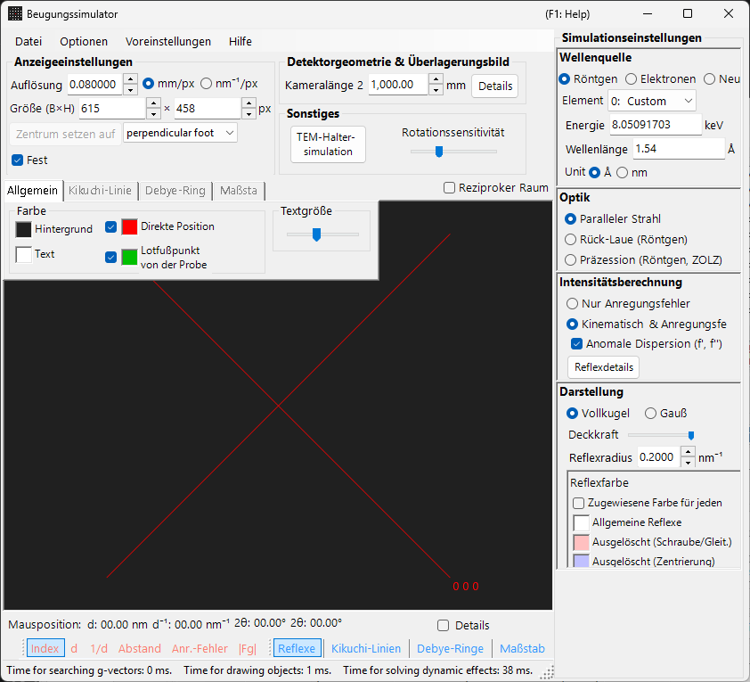
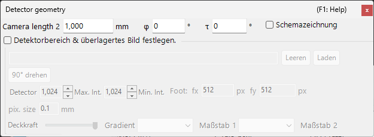

# Simulation der Röntgen-/Neutronenbeugung

Die **Simulation der Röntgen-/Neutronenbeugung** berechnet Einkristall-Beugungsmuster für Röntgenstrahlung und Neutronen. Sie ist einer der Hauptmodi des [Beugungssimulators](index.md).

> Diese Seite listet jede Einstellung auf, die auf der rechten Seite erscheint, wenn Sie **Wave Length = X-ray** (oder Neutron) wählen. Fensterweite Vorgänge wie Zeichnen und Speichern finden Sie auf der [Übersichtsseite](index.md).

GUI-Bedingungen: Wave Length = X-ray / Neutron · Incident beam = Parallel / Precession (X-ray) / Back-Laue · Intensity calculation = Only excitation error / Kinematical

---

## Übersicht

Röntgenstrahlen haben eine größere Wellenlänge als Elektronen (Cu Kα: 0.15406 nm = 1.5406 Å), sodass die Ewald-Kugel stärker gekrümmt ist. Dadurch erfüllen weniger Punkte des reziproken Gitters gleichzeitig die Beugungsbedingung als bei Elektronen. Da die atomare Streukraft klein und die Mehrfachstreuung schwach ist, liefert die kinematische Beugungstheorie eine ausreichende Genauigkeit für die Intensitäten (die dynamische Berechnung wird nur für Elektronen unterstützt).

---

## Wave Length

Wählen Sie **X-ray** als Strahlungsquelle. Röntgenstrahlen können auf zwei Arten angegeben werden: charakteristische Röntgenstrahlung und Synchrotronstrahlung.

### Charakteristische Röntgenstrahlung

Die Wahl eines **Elements** und eines **Übergangs** legt die charakteristische Röntgenwellenlänge fest. Der Übergang wird in Siegbahn-Notation angegeben (Kα₁ / Kα₂ / Kβ usw.). Kα₁-Wellenlängen repräsentativer Elemente:

| Element | Linie | Wellenlänge (Å) | Energie (keV) |
|---------|------|-----------------|--------------|
| Cu | Kα₁ | 1.5406 | 8.048 |
| Mo | Kα₁ | 0.7107 | 17.479 |
| Co | Kα₁ | 1.7890 | 6.930 |
| Cr | Kα₁ | 2.2910 | 5.415 |

### Synchrotronstrahlung

Setzen Sie **Element** auf **0: Custom** und geben Sie die Energie (keV) oder Wellenlänge (Å) direkt ein. Es kann jede beliebige Wellenlänge verwendet werden.

---

## Modus des einfallenden Strahls

Wählt die Geometrie des einfallenden Strahls. Für Röntgenstrahlen sind drei Modi verfügbar.

### Parallel

Die normale ebene Welle. Ein paralleler einfallender Strahl, der für SAED und Einkristall-Röntgenbeugung verwendet wird.

### Precession (X-ray) — Präzessionskamera

Simuliert eine Röntgen-Präzessionskamera. Dies ist eine Präzessionsaufnahme, die eine einzelne Schicht des reziproken Gitters erfasst.

### Back-Laue (Rückstrahl-Laue)

Simuliert ein Rückstrahl-Laue-Muster mit weißer (polychromatischer) Röntgenstrahlung. In dieser Rückstrahlgeometrie wird der Detektor auf der Quellenseite platziert und **Monochrome** wird ausgeschaltet. Die Reflexionsgeometrie wird durch **Tau / Phi** in **Detector geometry** vorgegeben (siehe [Detector geometry](index.md#detector-geometry)).

> **Hinweis**: Die Optionen für den einfallenden Strahl richten sich nach der Wellenlänge. **Precession (electron)** und **Convergence (CBED)** erscheinen nur, wenn Elektronenstrahlung gewählt ist, während die obigen Optionen **Precession (X-ray)** und **Back-Laue** nur erscheinen, wenn Röntgenstrahlung gewählt ist. Für Neutronen ist nur **Parallel** verfügbar. Je nach Zustand zum Zeitpunkt der Aufnahme zeigt der Screenshot die röntgenspezifischen Optionen möglicherweise nicht.

---

## Intensitätsberechnung

Wählt die Methode zur Berechnung der Spot-Intensitäten. Für Röntgenstrahlen sind zwei Modi verfügbar.

### Only excitation error

Die Intensität wird ausschließlich durch den geometrischen Abstand zwischen der Ewald-Kugel und dem Punkt des reziproken Gitters bestimmt (dem Anregungsfehler $s_g$). Ein kleineres $\lvert s_g \rvert$ ergibt eine höhere Intensität, mit einem Maximum bei dem durch **Radius** eingestellten Wert, und fällt auf null, wenn $\lvert s_g \rvert$ den Radius übersteigt. Der Strukturfaktor wird ignoriert.

### Kinematical & excitation error

Zusätzlich zum Anregungsfehler wird der kinematische Strukturfaktor $\lvert F_{hkl} \rvert^2$ in die Intensität einbezogen. Auslöschungsregeln werden streng befolgt. Der Lorentz- und der Polarisationsfaktor werden nicht berücksichtigt (dies ist eine Simulation des geometrischen Musters).

> **Hinweis**: Die **dynamische Theorie** ist für Röntgenstrahlen deaktiviert (nur verfügbar, wenn Elektronenstrahlung gewählt ist).

---

## Darstellung der Spots

Steuert, wie jeder Beugungsspot gerendert wird.

- **Solid sphere / Gaussian** : geometrisches Modell des Punktes im reziproken Gitter. **Solid sphere** verwendet den Querschnitt zwischen einer Kugel mit Radius *R* und der Ewald-Kugel (die Fläche des Kreises entspricht der Beugungsintensität); **Gaussian** verwendet den Querschnitt zwischen einer 3D-Gauß-Funktion mit σ = *R* und der Ewald-Kugel (das Integral der 2D-Gauß-Funktion entspricht der Beugungsintensität).
- **Opacity** : Transparenz des Spots (0 = transparent, 1 = undurchsichtig).
- **Radius (R)** : Radius des Punktes im reziproken Gitter. Die gerenderte Spot-Größe wird durch die Kombination aus **Appearance** und **Intensity calculation** bestimmt.
- **Brightness** : nur im Modus **Gaussian** aktiv. Legt die integrierte Intensität der gerenderten Gauß-Funktion fest.
- **Color scale** : Wahl zwischen den Farbskalen **Gray scale** und **Cold-warm**.
- **Log scale** : Intensitäten auf einer logarithmischen Skala anzeigen.
- **Spot color** : Standardfarbe des Spots, wenn die Farbskala nicht angewendet wird.
- **Use crystal color** : zeichnet die Spots in der dem jeweiligen Kristall zugewiesenen Farbe, wenn aktiviert.

---

## Debye-Ringe (polykristallin)

Debye-Ringe einer polykristallinen Probe können angezeigt werden. Aktivieren Sie **Debye rings** in der Symbolleiste (siehe [Symbolleiste](index.md#toolbar)).

- **Ignore diffraction intensity** : zeichnet alle Ringe in derselben Farbe und Intensität (verwendet für einen rein geometrischen Vergleich, der den Strukturfaktor ignoriert).
- **Show index label** : zeigt den (*hkl*)-Index neben jedem Ring an.

Detaillierte Einstellungen befinden sich auf der Registerkarte Debye rings des [Registerkartenmenüs](index.md#drawing-overlay-tabs).

---

## Neutronenbeugung

Die Wahl von **Neutron** im Steuerelement Wave Length berechnet ein Neutronenbeugungsmuster. Geben Sie die Energie (meV) oder Wellenlänge (nm) ein. Der einfallende Strahl kann nur **Parallel** sein. Die Intensitätsberechnung kann **Only excitation error** oder **Kinematical** sein (Dynamical ist nicht verfügbar). Die kinematische Intensität verwendet die Neutronenstreulänge anstelle des atomaren Streufaktors.

---

## Unterschiede zwischen Röntgen- und Elektronenbeugung

| Merkmal | Röntgenbeugung | Elektronenbeugung |
|---------|-------------------|----------------------|
| Wellenlänge | Lang (0.5–2.5 Å) | Kurz (0.02–0.04 Å) |
| Krümmung der Ewald-Kugel | Groß | Klein (nahezu flach) |
| Gleichzeitige Reflexe | Wenige | Viele |
| Streufaktor | Atomformfaktor $f(s)$ | Elektronenstreufaktor $f_e(s)$ |
| Dynamische Effekte | Meist klein | Groß |
| Auslöschungsregeln | Streng befolgt | Können durch Mehrfachstreuung verletzt werden |

---

## Allgemeine Vorgänge

Fensterweite Vorgänge wie Kameralänge, Detektorgeometrie, Speichern von Mustern und Farbeinstellungen finden Sie auf der [Übersichtsseite](index.md). Die detaillierte Detektorgeometrie wird im unten gezeigten Geometriefenster konfiguriert.

---

## Siehe auch

- [Beugungssimulator (Übersicht)](index.md)
- [SAED-Simulation](1-saed-simulation.md)
- [Präzessions-Elektronenbeugung (PED) — Simulation](2-ped-simulation.md)
- [Konvergente Elektronenbeugung (CBED) — Simulation](3-cbed-simulation.md)
- [Koordinatensystem — Kristallorientierung](../appendix/a1-coordinate-system/1-orientation.md)
