# Crystal Diffraction (Beugungssimulator)

**Crystal Diffraction (Beugungssimulator)** simuliert Einkristall-Röntgen-, Neutronen- und Elektronenbeugungsmuster.

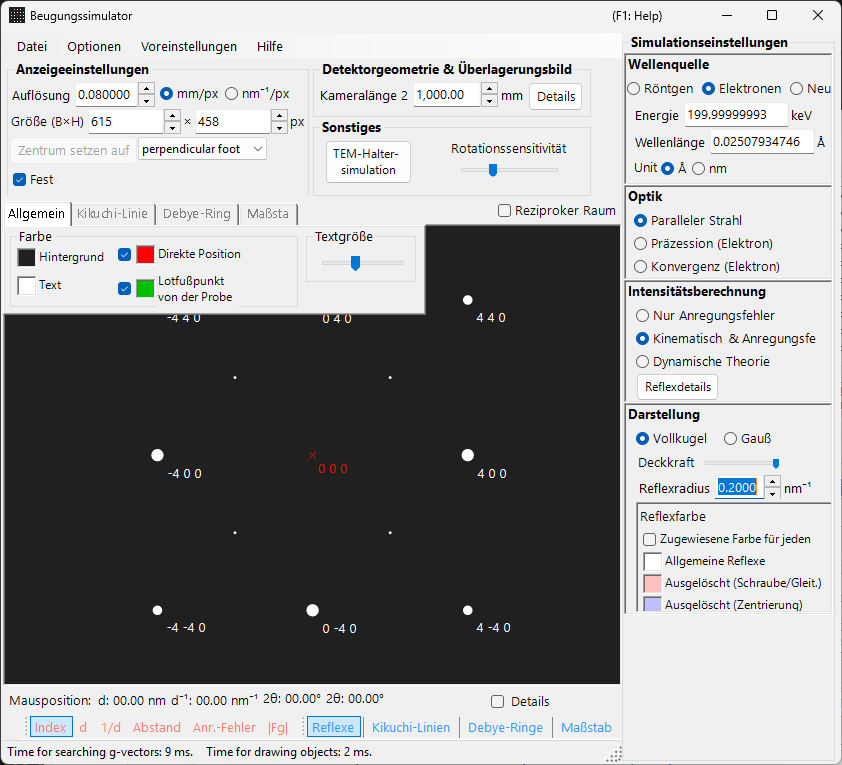

Das Fenster besitzt **links** einen Zeichenbereich für das Beugungsmuster und **rechts** die Einstellungsbereiche für die Reflexeigenschaften (Wellenlänge, einfallender Strahl, Intensitätsberechnung, Darstellung usw.). Die Kombination aus Wellenlänge und einfallendem Strahl bestimmt den Aufnahmemodus (Röntgenbeugung, SAED, PED, CBED), und die rechten Bereiche werden entsprechend neu konfiguriert.

---

## Wie sich diese Seite und die Modus-Seiten die Arbeit aufteilen

- **Diese Seite (Hub)**: fasst die Operationen zusammen, die jedem Modus gemeinsam sind (Kurzbefehle, Menüs, Symbolleiste, Schirm-/Detektorinformationen, Overlay-Registerkarten, Reflexinformationen, Detektorgeometrie, dynamische Kompression).
- **Jede Modus-Seite**: behandelt **jede Einstellung, die rechts erscheint**, wenn dieser Modus ausgewählt ist (Wellenlänge, einfallender Strahl, Intensitätsberechnung, Darstellung, Bloch-Wellen-Einstellungen, Präzessionseinstellungen usw.), sodass jede Seite in sich abgeschlossen ist (zwischen den Modi gibt es einige Überschneidungen).

| Modus | Inhalt | Seite |
|------|----------|------|
| **Röntgenbeugung (und Neutronenbeugung)** | Einkristall-Röntgen-/Neutronenbeugungsmuster (parallel, Präzessions-Röntgen, Back Laue) | [Röntgenbeugungssimulation](4-x-ray-neutron-diffraction.md) |
| **SAED** | Parallelstrahl-Elektronenbeugung (selected-area electron diffraction) | [SAED-Simulation](1-saed-simulation.md) |
| **PED** | Präzessions-Elektronenbeugung | [PED-Simulation](2-ped-simulation.md) |
| **CBED** | Konvergente Elektronenbeugung | [CBED-Simulation](3-cbed-simulation.md) |

---

## Modus-Schnellübersicht

Suchen Sie die benötigte Seite anhand der Kombination aus **Wellenlänge (Quelle)** und **einfallendem Strahl**.

| Wellenlänge | Einfallender Strahl | Modus | Seite |
|------------|--------------------|------|------|
| Elektron | Parallel | SAED | [SAED-Simulation](1-saed-simulation.md) |
| Elektron | Präzession (Elektron = PED) | PED | [PED-Simulation](2-ped-simulation.md) |
| Elektron | Konvergenz (CBED) | CBED | [CBED-Simulation](3-cbed-simulation.md) |
| Röntgen | Parallel | Röntgenbeugung | [Röntgenbeugungssimulation](4-x-ray-neutron-diffraction.md) |
| Röntgen | Präzession (Röntgen) | Präzessions-Röntgen (Präzessionskamera) | [Röntgenbeugungssimulation](4-x-ray-neutron-diffraction.md) |
| Röntgen | Back Laue | Rückstrahl-Laue | [Röntgenbeugungssimulation](4-x-ray-neutron-diffraction.md) |
| Neutron | Parallel | Neutronenbeugung | [Neutronen-Abschnitt der Röntgenbeugungssimulation](4-x-ray-neutron-diffraction.md) |

> **Hinweis**: Die Auswahlmöglichkeiten für den einfallenden Strahl ändern sich mit der Wellenlänge. Für Elektronen: **Parallel, Präzession (Elektron = PED), Konvergenz (CBED)**; für Röntgenstrahlen: **Parallel, Präzession (Röntgen), Back Laue**; für Neutronen: nur **Parallel**. Die Auswahl von **Präzession (Elektron = PED)** oder **Konvergenz (CBED)** schaltet die Intensitätsberechnung automatisch auf **Dynamische Theorie** um.

---

## Tastatur- & Maus-Kurzbefehle

Diese gelten für das Beugungsmuster-Fenster, das von der Röntgen-, SAED- und PED-Simulation gemeinsam genutzt wird. Ziehen auf dem Muster dreht den **Kristall**. Hier gibt es **kein Zoomen mit dem Mausrad** — zoomen Sie mit Rechtsklick / Rechtsziehen.

| Kurzbefehl | Aktion |
|----------|--------|
| <kbd>F1</kbd> | Diese Seite des Online-Handbuchs öffnen |
| Linksziehen nahe der Mitte | Den Kristall kippen |
| Linksziehen im äußeren Bereich | Den Kristall um die Strahlachse drehen |
| Linksdoppelklick auf einen Reflex | Reflexdetails anzeigen (Index, *d*, Strukturfaktor, Anregungsfehler) |
| Mittelziehen | Das Muster verschieben |
| <kbd>CTRL</kbd> + Mittelziehen | Das Detektorzentrum verschieben (wenn der Detektorbereich angezeigt wird) |
| Rechtsklick | Herauszoomen |
| Rechtsziehen eines Rahmens | In den ausgewählten Bereich hineinzoomen |
| Rechtsdoppelklick auf die Statusleiste | Eine Textzusammenfassung der aktuellen Einstellungen kopieren |
| Rechtsdoppelklick auf eine aktive Ebenen-Schaltfläche (Spots / Kikuchi / Debye / Scale) | Diese Ebene ein- und ausblinken lassen |

Die von hier geöffneten Hilfsfenster fügen einige weitere hinzu:

| Kurzbefehl | Aktion |
|----------|--------|
| Linksdoppelklick auf das Stereonetz — **TEM-Halter** | Die Halterkippung auf diesen Punkt setzen |
| Pfeiltasten — **TEM-Halter** | Die Halterkippung schrittweise ändern (zuerst **Arrow keys** anhaken) |
| Eine `.prm`-Datei oder ein Bild ablegen — **Detektorgeometrie** | Detektorgeometrie / Overlay-Bild laden |
| Ein `.txt`-Profil ablegen — **Dynamische Kompression** | Ein Druck-/Zeit-Profil laden (die rote Linie im Diagramm ziehen, um zu scrubben) |

Die anwendungsweiten <kbd>CTRL</kbd>+<kbd>SHIFT</kbd>-Kurzbefehle des Hauptfensters funktionieren ebenfalls, während dieses Fenster fokussiert ist (siehe [Hauptfenster](../0-main-window.md)).

→ Siehe **[21. Tastatur- & Maus-Kurzbefehle](../21-shortcuts.md)** für alle Fenster auf einen Blick.

---

## Schnellwege nach Ziel

| Ziel | Beginnen bei | Referenz |
|------|------------|-----------|
| Parallelstrahl-Elektronenbeugung (SAED) erzeugen | **Incident beam** auf **Parallel** und **Wavelength** auf Elektron setzen | [SAED-Simulation](1-saed-simulation.md), [Parallelstrahl-SAED-Berechnung](../appendix/a3-bloch-wave/calculation.md) |
| Einkristall-Röntgenbeugung erzeugen | **Wavelength** auf Röntgen / Synchrotron umschalten | [Röntgenbeugungssimulation](4-x-ray-neutron-diffraction.md) |
| Präzessions-Elektronenbeugung (PED) erzeugen | **Incident beam** auf **Precession (electron)** setzen, dann Halbwinkel und Schritt festlegen | [PED-Simulation](2-ped-simulation.md) |
| Konvergente Elektronenbeugung (CBED) erzeugen | **Incident beam** auf **Convergence (CBED, electron only)** setzen und die Bedingungen im CBED-Fenster festlegen | [CBED-Simulation](3-cbed-simulation.md), [CBED-Berechnung](../appendix/a3-bloch-wave/cbed.md) |
| Die Reflexliste aus der dynamischen Berechnung prüfen | **Dynamische Theorie** auswählen und **Reflexdetails** oder **Details** öffnen | [Dynamische Berechnung (gemeinsamer Kern)](../appendix/a3-bloch-wave/calculation.md) |
| Die Detektorgeometrie mit einem experimentellen Bild abgleichen | Die Detektorgeometrie-Einstellungen über **Details** öffnen und das Overlay-Bild verwenden | [Detektor-Koordinatensystem](../appendix/a1-coordinate-system/2-diffraction.md) |

---

## Hauptbereich

Das Beugungsmuster wird in der Mitte des Bildschirms simuliert.

### Maussteuerung

Siehe "Tastatur- & Maus-Kurzbefehle" am Anfang dieser Seite.

### Mausposition

Die zur Cursorposition gehörenden Informationen (Cursor-*q*, *d*, 2θ, Azimut usw.) werden in der Statuszeile über dem Muster angezeigt. Das Anhaken von **Details** fügt detailliertere Informationen hinzu (das (*hkl*) des nächstgelegenen Reflexes, Anregungsfehler, Strukturfaktor usw.).

---

## Menü "File"

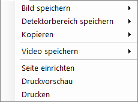

| Menüpunkt | Beschreibung |
|-----------|-------------|
| **Bild speichern** | Das angezeigte Beugungsmuster in einer Datei speichern. |
| **Detektorbereich speichern** | Nur den Ausschnitt des Detektorbereichs speichern. |
| **Kopieren** | Das angezeigte Bild in die Zwischenablage kopieren. |
| **Detektorbereich kopieren** | Nur den Ausschnitt des Detektorbereichs kopieren. |

### Preset {#toolbar}

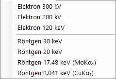

Speichern und Abrufen einer vollständigen Simulator-Konfiguration — Wellenlänge, Detektorgeometrie, Registerkarten-Einstellungen, Reflexeigenschaften usw. — als Preset. Nützlich für den schnellen Wechsel zwischen Geräten / Aufnahmemodi.

---

## Symbolleiste

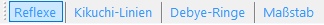

| Schaltfläche | Beschreibung |
|--------|-------------|
| Reflexe | Die Ebene der Beugungsreflexe ein-/ausblenden |
| Kikuchi-Linien | Die Ebene der Kikuchi-Linien ein-/ausblenden |
| Debye-Ringe | Die Ebene der Debye-Ringe ein-/ausblenden |
| Maßstab | Die Ebene der Skalenlinien ein-/ausblenden |
| Index / d / 1/d / Abstand / 2θ / χ / Anregungsfehler / Strukturfaktor | Auswahl der Beschriftung, die an jeden Reflex angehängt wird |

---

## Schirm- und Detektorinformationen

### Schirm

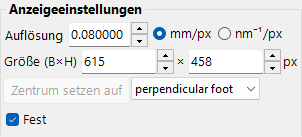

| Element | Beschreibung |
|------|-------------|
| **Auflösung** | Die Größe eines Pixels (mm). Sie muss nicht der tatsächlichen Detektor-Pixelgröße entsprechen; sie wird als Anzeigemaßstab behandelt und automatisch aktualisiert, wenn Sie mit der Maus zoomen. |
| **Size (W×H)** | Pixelbreite und -höhe des Zeichenbereichs. Je nach Bildschirmauflösung sind sehr große Werte möglicherweise nicht einstellbar. |
| **Zentrum setzen / Fixieren** | Das Musterzentrum auf einen beliebigen Pixel im Zeichenbereich setzen und es bei Bedarf fixieren. Wenn fixiert, kann das Zentrum nicht durch Verschieben mit der Maus bewegt werden. |
| **Horizontal spiegeln / Vertikal spiegeln / Negativbild** | Geometrische Spiegelungen (horizontal / vertikal) und Kontrastumkehr des angezeigten Musters. Verwenden Sie diese, um die Orientierung oder den Kontrast eines experimentellen Bildes anzupassen. |
| **Reziproker Raum** | Überlagert die Ewald-Kugel und reziproke Gittervektoren über dem Muster und visualisiert, welche Reflexe angeregt sind. |

### Detektor (Kameralänge)

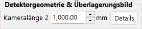

- **Camera length** : Abstand von der Probe zum Detektor (mm).
- **Details** : Öffnet das Fenster der Detektorgeometrie-Einstellungen (siehe [Detektorgeometrie](#detector-geometry) unten).

### Misc

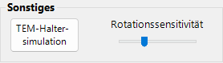

- **Rotationssensitivität** : Betrag der Kristalldrehung pro Pixel des Mausziehens.
- **TEM-Halter-Simulation** : Öffnet das halterverknüpfte Simulationsfenster (siehe unten).

---

## TEM-Halter-Simulation {#drawing-overlay-tabs}

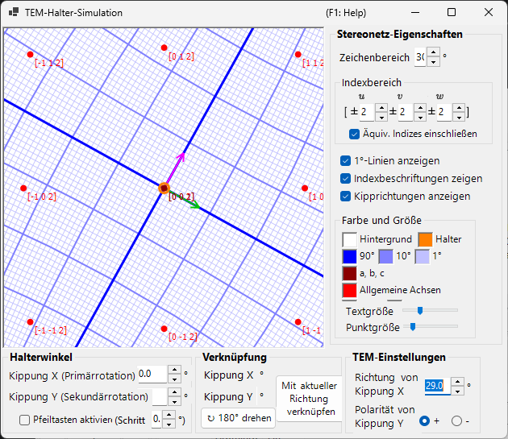

Öffnet ein Fenster, das das Beugungsmuster mit einem Doppelkipp- (oder Rotations-) **TEM-Halter** verknüpft. Das Festlegen der Halterkippwinkel aktualisiert das Muster und die Kristallorientierung, und die erreichbaren Orientierungen können auf einem Stereonetz angezeigt werden (hinzugefügt in v4.914). Ein Linksdoppelklick auf das Stereonetz setzt die Halterkippung auf diesen Punkt, und das Anhaken von **Arrow keys** ermöglicht es den Pfeiltasten, die Kippung schrittweise zu ändern.

---

## Zeichen-Overlay-Registerkarten

### General

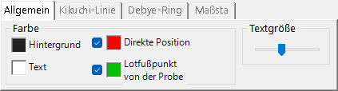

Legt die Farben von Reflexen, Beschriftungen, Kikuchi-Linien, Debye-Ringen und anderen Overlays fest. Die hier vorgenommenen Einstellungen gelten für alle Rendermodi.

### Kikuchi-Linien

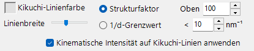

Aktiv, wenn Kikuchi-Linien in der Symbolleiste aktiviert sind.

- **Auswahl der Reflexe** : Wählt aus, welche Reflexe die Kikuchi-Linien erzeugen. Entweder **Strukturfaktor** (die obersten *N* Reflexe nach $\lvert F_{hkl}\rvert$) oder **1/d-Grenzwert** (alle Reflexe, deren 1/d unterhalb des Schwellenwerts (nm⁻¹) liegt).
- **Line appearance** : Legt die Linienbreite, die Farbe der Kikuchi-Linien und **Draw with kinematical intensity** fest (skaliert die Linienhelligkeit mit der kinematischen Intensität des Reflexes).
- **Threshold** : Ein Altparameter. Führt die Kikuchi-Linien-Berechnung nur für Reflexe mit einem *d* größer als der angegebene Wert aus (aus Kompatibilitätsgründen beibehalten).

### Debye-Ringe

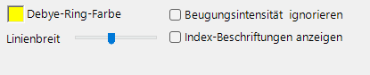

Aktiv, wenn Debye-Ringe in der Symbolleiste aktiviert sind.

- **Beugungsintensität ignorieren** : Falls angehakt, werden alle Debye-Ringe mit derselben Farbe und Intensität gezeichnet (unter Vernachlässigung des Strukturfaktors des Kristalls). Verwenden Sie dies für einen rein geometrischen Vergleich.
- **Index-Beschriftungen anzeigen** : Falls angehakt, erscheint das (*hkl*) in der Nähe jedes Rings.

### Scale

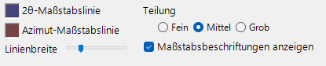

Aktiv, wenn die Skalenlinien in der Symbolleiste aktiviert sind.

- **2θ / Azimuth scale lines** : **2θ** stellt einen konstanten Streuwinkel dar (konzentrische Kreise), **Azimuth** stellt einen konstanten Azimutwinkel dar (radiale Linien vom Zentrum aus). Die Farben sind unabhängig voneinander konfigurierbar.
- **Linienbreite** : Dicke der Skalenlinien.
- **Teilung** : Winkelabstand zwischen benachbarten Skalenlinien.
- **Maßstabsbeschriftungen anzeigen** : Ob numerische Beschriftungen auf die Skalenlinien gezeichnet werden.

### Misc {#diffraction-spot-information}

Verschiedene Einstellungen wie die Mausrotationsempfindlichkeit.

- **Mouse sensitivity** : Betrag der Kristalldrehung pro Pixel des Mausziehens.

---

## Beugungsreflex-Informationen

Listet die per Reflex berechneten Details auf, die mit der Bloch-Wellen-Methode (Dynamical-Berechnung) ermittelt wurden. Öffnen Sie es mit der Schaltfläche **Reflexdetails** (Intensitätsberechnungsbereich) oder dem Kontrollkästchen **Details**.

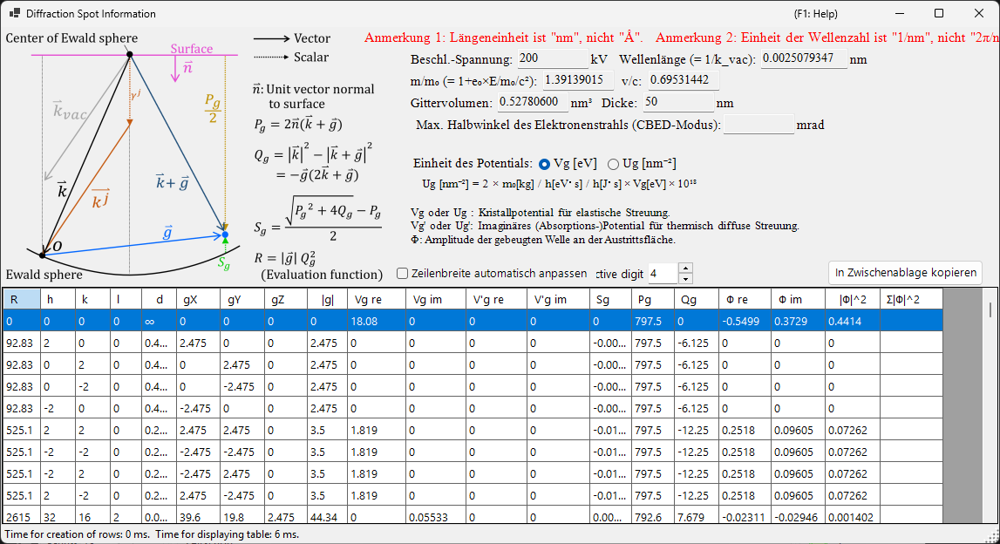

### Schema und Definitionen

Das Schema (oben links) zeigt die Vektoren auf der Ewald-Kugel und definiert die in der Tabelle verwendeten Größen ($\hat{\mathbf{n}}$ ist der Einheitsvektor senkrecht zur Probenoberfläche, $\mathbf{k}$ ist der einfallende Wellenvektor, $\mathbf{g}$ ist der reziproke Gittervektor).

- $P_g = 2\,\hat{\mathbf{n}} \cdot (\mathbf{k} + \mathbf{g})$
- $Q_g = |\mathbf{k}|^2 - |\mathbf{k} + \mathbf{g}|^2 = -\mathbf{g} \cdot (2\mathbf{k} + \mathbf{g})$
- **Anregungsfehler:** $S_g = \dfrac{\sqrt{P_g^2 + 4 Q_g} - P_g}{2}$
- **Bewertungsfunktion:** $R = |\mathbf{g}|\, Q_g^2$ — ordnet Reflexe danach, wie stark sie angeregt sind (kleiner = näher an der Ewald-Kugel = stärker angeregt; der durchgehende Strahl $g=0$ hat $R=0$ und kommt zuerst). Die Tabelle ist nach aufsteigendem $R$ sortiert.

### Tabellenspalten

| Spalte | Bedeutung |
|--------|---------|
| **R** | Bewertungsfunktion $R = \lvert\mathbf{g}\rvert\, Q_g^2$ (oben; verwendet zur Auswahl / Anordnung von Reflexen) |
| **h, k, (i,) l** | Miller-Indizes (*i* ist der redundante hexagonale Index, nur für hexagonale Kristalle angezeigt) |
| **d** | Netzebenenabstand (nm) |
| **gX, gY, gZ** | Komponenten des reziproken Gittervektors *g* (1/nm) |
| **\|g\|** | Betrag von *g* (1/nm) |
| **Vg re / Vg im** | Fourier-Koeffizient des Kristallpotentials für elastische Streuung, $V_g$ (real / imaginär) |
| **V'g re / V'g im** | imaginäres (Absorptions-)Potential für thermisch diffuse Streuung (TDS), $V'_g$ (real / imaginär) |
| **Sg** | Anregungsfehler $S_g$ (oben; 1/nm) |
| **Pg** | Hilfsgröße $P_g = 2\,\hat{\mathbf{n}}\cdot(\mathbf{k}+\mathbf{g})$ (oben) |
| **Qg** | Hilfsgröße $Q_g = -\mathbf{g}\cdot(2\mathbf{k}+\mathbf{g})$ (oben) |
| **Φ re / Φ im** | komplexe Amplitude $\Phi$ der dynamischen gebeugten Welle an der Austrittsoberfläche (real / imaginär) |
| **\|Φ\|^2** | gebeugte Intensität $\lvert\Phi\rvert^2$ dieses Reflexes |
| **Σ\|Φ\|^2** | kumulative Summe von $\lvert\Phi\rvert^2$ (Gesamtsumme über die Reflexe; nützlich als Prüfung der Intensitätserhaltung) |

### Potentialeinheiten und weitere Steuerelemente

- **Unit of potential** : Schaltet das angezeigte Potential zwischen **Vg [eV]** (elektrostatisches Potential, eV) und **Ug [nm⁻²]** um (die skalierte Größe $U_g = (2 m_0/h^2)\, V_g$, die in die Bloch-Wellen-Gleichungen eingeht). Die Spaltenüberschriften wechseln entsprechend zwischen *Vg / V'g* und *Ug / U'g*.
- Über der Tabelle werden die Beschleunigungsspannung, die Wellenlänge ($\lambda = 1/k_\text{vac}$), das relativistische Massenverhältnis $m/m_0$, das Geschwindigkeitsverhältnis $v/c$, das Gittervolumen, die Probendicke und (im CBED-Modus) der maximale Halbwinkel des Elektronenstrahls angezeigt.
- **Note 1:** Die Längeneinheit ist **nm**, nicht Å. **Note 2:** Die Wellenzahleinheit ist **1/nm**, nicht 2π/nm.
- **Effective digit** : Anzahl der in der Tabelle angezeigten signifikanten Stellen. **Auto resize row width** : Spaltenbreiten automatisch anpassen. **Copy to clipboard** : exportiert die Tabelle als Text, der in eine Tabellenkalkulation eingefügt werden kann. (Dieses Formular wird auch unter einer japanischen Oberfläche auf Englisch angezeigt.)

---

## Detektorgeometrie {#detector-geometry}

Ein Fenster für die detaillierte Einrichtung der Detektorgeometrie (Kameralänge, Kippung, Rotation) und die Überlagerung eines experimentellen Bildes. Öffnen Sie es über **Details** im Bereich **Detector geometry**.

### Detektorgeometrie-Einstellungen

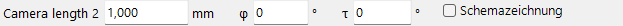

Geben Sie die Reflexionsgeometrie wie die Kameralänge und die Detektorkippung (**Tau / Phi**) an. Für Back Laue (Rückstrahl-Laue) legen Sie hier die Geometrie fest, die den Detektor auf der Quellenseite platziert.

### Detektorbereich und überlagertes Bild

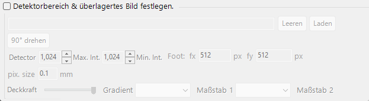

Geben Sie den aktiven Bereich des Detektors an und legen Sie ein experimentelles Bild ab, um es zu überlagern. Verwenden Sie dies, um das simulierte Muster und ein experimentelles Bild zu überlagern und die Detektorgeometrie fein abzustimmen.

Siehe auch [Detektor-Koordinatensystem](../appendix/a1-coordinate-system/2-diffraction.md) für die Definitionen des Koordinatensystems.

---

## Dynamische Kompression

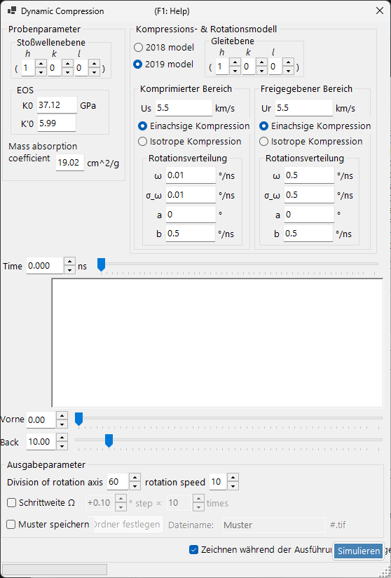

Ein Fenster zum Scrubben des Druck-/Zeit-Profils eines Hochdruck-Experiments (dynamische Kompression). Legen Sie ein `.txt`-Druck-/Zeit-Profil auf dieses Fenster ab, um es zu laden, und ziehen Sie dann die rote Linie im Diagramm, um kontinuierlich durch die Zeit (den Druck) zu fahren, während der entsprechende Zustand im Beugungsmuster widergespiegelt wird.

---

## Verwandte Themen

- [Röntgenbeugungssimulation](4-x-ray-neutron-diffraction.md)
- [SAED-Simulation](1-saed-simulation.md)
- [PED-Simulation](2-ped-simulation.md)
- [CBED-Simulation](3-cbed-simulation.md)
- [Dynamische Berechnung (gemeinsamer Kern)](../appendix/a3-bloch-wave/calculation.md)
- [Detektor-Koordinatensystem](../appendix/a1-coordinate-system/2-diffraction.md)
