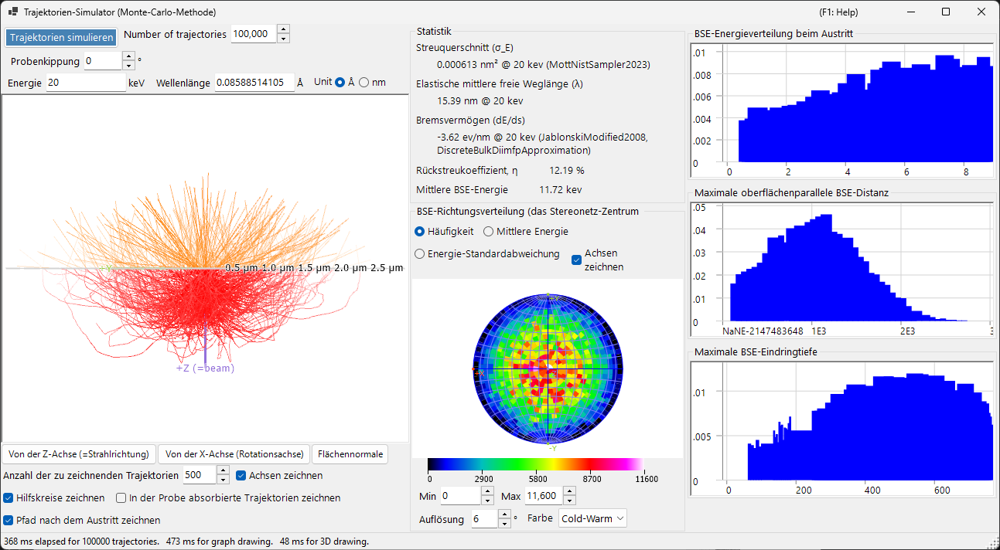
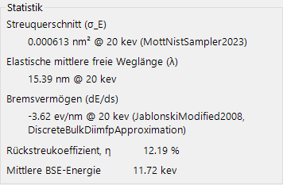
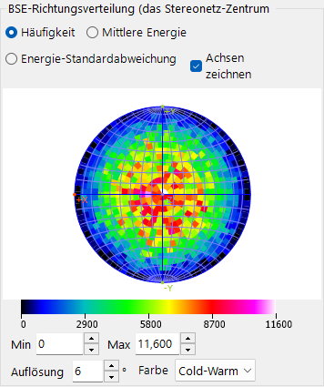
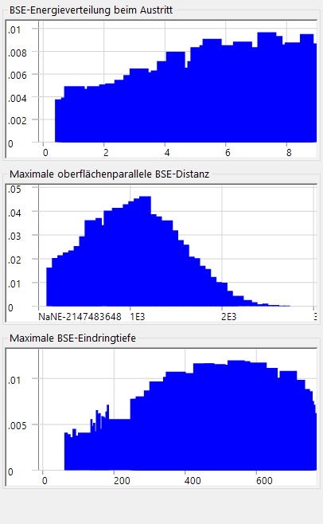

# Elektronenbahnen

Der **Trajektorien-Simulator** berechnet die Elektronenbahnen innerhalb einer Probe mit der **Monte-Carlo-Methode**: Die einfallenden Elektronen erfahren elastische und inelastische Streuung, und die daraus resultierenden Verteilungen der rückgestreuten Elektronen (Richtung, Energie, Eindringtiefe) werden akkumuliert. Diese Verteilungen liefern auch die Winkel-/Energie-/Tiefen-Gewichtung, die von der [12. EBSD-Simulation](12-ebsd-simulation.md) verwendet wird.

---

## Tastatur- & Maus-Kurzbefehle

Die Trajektorien werden in einer 3-D-OpenGL-Ansicht dargestellt. Sie verwendet die Standard-[Ansichtsnavigation](21-shortcuts.md) von ReciPro, aber **das Verschieben ist deaktiviert** — verwenden Sie die Ansichts-Voreinstellungstasten, um zu den Standardorientierungen zu springen.

| Kurzbefehl | Aktion |
|----------|--------|
| <kbd>F1</kbd> | Diese Seite des Online-Handbuchs öffnen |
| Linksziehen | Modell drehen |
| Rechtsziehen nach oben/unten oder Mausrad | Zoomen |
| <kbd>CTRL</kbd> + Rechtsdoppelklick | Zwischen orthografischer / perspektivischer Projektion umschalten |

→ Siehe **[21. Tastatur- & Maus-Kurzbefehle](21-shortcuts.md)** für eine Übersicht aller Fenster.

---

## Berechnungsbedingungen

Strahlenergie, Anzahl der einfallenden Elektronen, Probe/Material und weitere Monte-Carlo-Parameter (siehe den Übersichts-Screenshot oben).

### Strahlenergie

Beschleunigungsspannung des einfallenden Elektronenstrahls (keV). Legt die kinetische Energie fest, die sowohl für die elastischen (Mott) als auch für die inelastischen (dielektrische Antwort) Streumodelle verwendet wird.

### Anzahl der einfallenden Elektronen

Wie viele Elektronen simuliert werden sollen. Mehr Elektronen verringern das statistische Rauschen, erhöhen aber die Laufzeit linear.

### Probe / Material

Zusammensetzung und Dichte der Probe. Standardmäßig wird der aktuell im Hauptfenster ausgewählte Kristall verwendet, dies kann aber für reine Trajektorien-Studien überschrieben werden.

### Probenkippung

Probenkippwinkel. Wird verwendet, wenn die Trajektoriendaten in den [EBSD-Simulator](12-ebsd-simulation.md) einfließen (typischerweise 70° für EBSD).

### Wirkungsquerschnitt-Modell

Das Modell für den elastischen Streu-Wirkungsquerschnitt (Mott / Bethe / NIST). Verschiedene Modelle wägen Geschwindigkeit gegen Genauigkeit bei großen Kippwinkeln oder nahe Absorptionskanten ab.

---

## Stereonetz-Optionen

Anzeigeoptionen für die Winkelverteilung, die auf die stereografische Projektion gezeichnet wird (siehe den Übersichts-Screenshot oben).

### Projektionsmethode

**Wulff**-Projektion (winkeltreu) oder **Schmidt**-Projektion (flächentreu). Schmidt wird üblicherweise bevorzugt, wenn statistische Dichten abgelesen werden.

### Hemisphäre

Stellt die obere (rückgestreute) oder untere (transmittierte) Hemisphäre dar.

### Auflösung / Farbskala

Klassenbreite des Winkelhistogramms und die für die Dichteanzeige verwendete Farbskala.

---

## Statistik

Zusammenfassung des Laufs.

- **Rückstreuausbeute** — Anteil der einfallenden Elektronen, die durch die Eintrittsfläche austreten.
- **Mittlere freie Weglänge** — durchschnittliche Distanz zwischen Streuereignissen.
- **Mittlere Eindringtiefe** — durchschnittliche maximale Tiefe, die ein Elektron erreicht, bevor es entweder austritt oder absorbiert wird.
- **Verstrichene Zeit / Durchsatz** — Rechenaufwand des Laufs in Echtzeit.

---

## BSE-Richtungsverteilung

Winkelverteilung der rückgestreuten Elektronen (das Zentrum des Stereonetzes entspricht der Richtung der Oberflächennormalen). Die gelbe/orange Umrandung (sofern vorhanden) markiert den vom EBSD-Detektor erfassten Bereich.

---

## Profile

Tiefen- und Energieprofile der simulierten Elektronen.

### Tiefenprofil

Histogramm der finalen Austrittstiefe (nm) der rückgestreuten Elektronen. Wird vom EBSD-Simulator verwendet, um die Tiefenintegration des Master-Pattern zu gewichten.

### Energieprofil

Histogramm des Energieverlusts ΔE (keV) der rückgestreuten Elektronen. Wird vom EBSD-Simulator verwendet, um die Energieintegration zu gewichten.

---

## Siehe auch

- [EBSD-Simulation](12-ebsd-simulation.md)
- [EBSD-Berechnung](appendix/a3-bloch-wave/ebsd.md)
- [Dynamische Beugung (Bloch-Welle)](appendix/a3-bloch-wave/index.md)
- [HRTEM/STEM-Simulator](9-hrtem-stem-simulator/index.md)
- [Beugungssimulator](7-diffraction-simulator/index.md)
