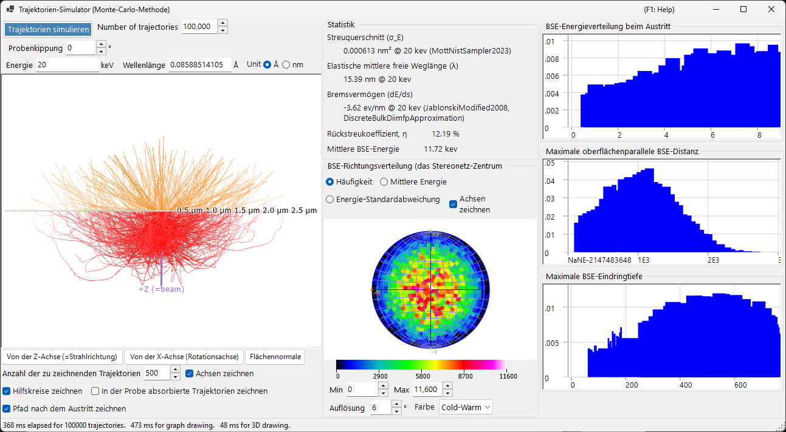
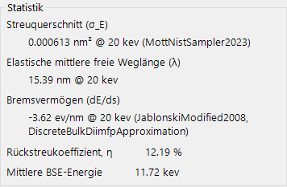
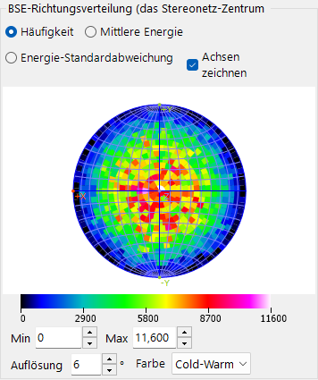
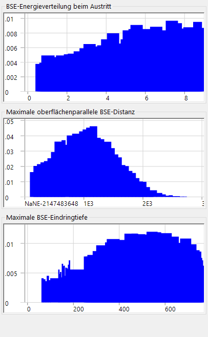

# Elektronenbahnen

Der **Trajektorien-Simulator (Monte-Carlo-Methode)** berechnet die Elektronenbahnen innerhalb einer Probe mit der **Monte-Carlo-Methode**: Die einfallenden Elektronen erfahren elastische und inelastische Streuung, und die daraus resultierenden Verteilungen der rückgestreuten Elektronen (BSE) — Richtung, Energie beim Austritt, Eindringtiefe und laterale Ausbreitung — werden akkumuliert. Diese Verteilungen liefern auch die Winkel-/Energie-/Tiefen-Gewichtung, die von der [12. EBSD-Simulation](12-ebsd-simulation.md) verwendet wird.

Das Fenster besteht aus drei Spalten: links die **3-D-Trajektorienansicht**, in der Mitte die **Statistik** und das Stereonetz der **BSE-Richtungsverteilung**, rechts drei **Histogramme**. Zusammensetzung und Dichte der Probe stammen von dem im Hauptfenster ausgewählten Kristall; hier werden nur die Strahlenergie, die Probenkippung und die Anzahl der Trajektorien eingestellt.

---

## Tastatur- & Maus-Kurzbefehle

Die Trajektorien werden in einer 3-D-OpenGL-Ansicht dargestellt. Sie verwendet die Standard-[Ansichtsnavigation](21-shortcuts.md) von ReciPro, aber **das Verschieben ist deaktiviert** — verwenden Sie die Ansichts-Voreinstellungstasten, um zu den Standardorientierungen zu springen.

| Kurzbefehl | Aktion |
|----------|--------|
| <kbd>F1</kbd> | Diese Seite des Online-Handbuchs öffnen |
| Linksziehen | Modell drehen |
| Rechtsziehen nach oben/unten oder Mausrad | Zoomen |
| <kbd>CTRL</kbd> + Rechtsdoppelklick | Zwischen orthografischer / perspektivischer Projektion umschalten |

→ Siehe **[21. Tastatur- & Maus-Kurzbefehle](21-shortcuts.md)** für eine Übersicht aller Fenster.

---

## Berechnungsbedingungen

Die Bedienelemente am oberen Fensterrand legen den Lauf fest:

- **Trajektorien simulieren** : startet den Monte-Carlo-Lauf. Die Statusleiste am unteren Rand meldet die verstrichene Zeit für die Trajektorienberechnung, das Zeichnen der Diagramme und das 3-D-Rendering getrennt.
- **Number of trajectories** : wie viele einfallende Elektronen verfolgt werden. Mehr Elektronen verringern das statistische Rauschen aller unten beschriebenen Verteilungen; die Laufzeit wächst dabei linear.
- **Probenkippung** (°) : Kippung der Probenoberfläche um die *X*-Achse. Für senkrechten Einfall bei 0 belassen; mit **−70°** lässt sich die Geometrie des [EBSD-Simulators](12-ebsd-simulation.md) nachbilden, bei der die starke Kippung die Rückstreuausbeute erhöht.
- **Energy** (keV) / **Wavelength** / **Unit** : die Beschleunigungsspannung des einfallenden Strahls und die damit verknüpfte, relativistisch korrigierte Elektronenwellenlänge. Die Energie legt die kinetische Energie fest, die sowohl vom elastischen (NIST-Mott) als auch vom inelastischen (Bremsvermögen / IMFP) Modell verwendet wird.

Die Streumodelle selbst sind nicht wählbar: Die elastischen Wirkungsquerschnitte stammen aus der mitgelieferten NIST-Mott-Tabelle (außerhalb ihres Gültigkeitsbereichs wird auf die abgeschirmte Rutherford-Formel zurückgegriffen), das Bremsvermögen aus der modifizierten Jablonski-Form (2008). Das tatsächlich verwendete Modell wird in der **Statistik** neben jedem Wert angegeben. Was diese Modelle sind, erläutert [Abschwächung & Transport](appendix/a2-beam-interaction/attenuation-transport.md).

### 3-D-Trajektorienansicht

Rote Trajektorien sind in der Probe absorbierte Elektronen, orangefarbene sind solche, die als rückgestreute Elektronen austreten. Die konzentrischen Hilfskreise sind in nm (bzw. µm) beschriftet, und **+X**, **+Y**, **+Z (=beam)** kennzeichnen die Achsen.

- **Von der Z-Achse (=Strahlrichtung)** / **Von der X-Achse (Rotationsachse)** / **Flächennormale** : richten die Ansicht auf die Standardrichtungen aus.
- **Anzahl der zu zeichnenden Trajektorien** : wie viele der berechneten Trajektorien dargestellt werden (alle 100.000 zu zeichnen wäre unübersichtlich und langsam).
- **Achsen zeichnen** / **Hilfskreise zeichnen** : die Achsenpfeile und der Entfernungsmaßstab.
- **In der Probe absorbierte Trajektorien zeichnen** : auch die Elektronen einbeziehen, die nie austreten.
- **Pfad nach dem Austritt zeichnen** : den Weg eines rückgestreuten Elektrons auch nach dem Verlassen der Oberfläche weiterzeichnen.

---

## Statistik

Werte für die aktuelle Strahlenergie; das Modell, das den jeweiligen Wert geliefert hat, ist in Klammern angegeben.

- **Streuquerschnitt (σ_E)** (nm²) — gesamter elastischer Wirkungsquerschnitt pro Atom.
- **Elastische mittlere freie Weglänge (λ)** (nm) — mittlere Strecke zwischen elastischen Streuereignissen.
- **Bremsvermögen (dE/ds)** (eV/nm, negativ) — Energieverlust pro Weglängeneinheit.
- **Rückstreukoeffizient, η** (%) — der Anteil der einfallenden Elektronen, die die Probe wieder durch die Eintrittsfläche verlassen. Auf dieser Größe beruht der BSE-Bildkontrast.
- **Mittlere BSE-Energie** (keV) — mittlere Energie der rückgestreuten Elektronen im Moment ihres Austritts.

---

## BSE-Richtungsverteilung

Winkelverteilung der rückgestreuten Elektronen, dargestellt in einem Stereonetz, dessen Zentrum der Richtung der Oberflächennormalen entspricht.

- **Häufigkeit** / **Mittlere Energie** / **Energie-Standardabweichung** : die farbkodierte Größe — wie viele Elektronen in die jeweilige Richtung austreten, ihre mittlere Energie oder die Streuung dieser Energie.
- **Achsen zeichnen** : blendet die Richtungen +X / ±Y / ±Z ein.
- **Min** / **Max**, **Resolution**, **Color** : die Grenzen der Farbskala, die Winkel-Klassenbreite des Histogramms und die Farbpalette.

---

## Histogramme

Drei Verteilungen der rückgestreuten Elektronen, jeweils auf die Fläche 1 normiert.

### BSE-Energieverteilung beim Austritt

Histogramm der **Energie, die die rückgestreuten Elektronen beim Verlassen der Probe noch besitzen** (keV) — nicht ihres Energieverlusts. Der EBSD-Simulator verwendet es, um die Energieintegration des Master-Musters zu gewichten.

### Maximale oberflächenparallele BSE-Distanz

Histogramm der Strecke, die jedes rückgestreute Elektron vor dem Austritt **lateral** (parallel zur Oberfläche, nm) zurückgelegt hat. Sie entspricht der lateralen Ausdehnung des Wechselwirkungsvolumens und damit der intrinsischen Grenze der Ortsauflösung einer BSE- oder EBSD-Messung.

### Maximale BSE-Eindringtiefe

Histogramm der größten Tiefe **senkrecht zur Oberfläche** (nm), die jedes rückgestreute Elektron vor dem Austritt erreicht hat. Der EBSD-Simulator verwendet es, um die Tiefenintegration des Master-Musters zu gewichten.

---

## Siehe auch

- [EBSD-Simulation](12-ebsd-simulation.md)
- [EBSD-Berechnung](appendix/a3-bloch-wave/ebsd.md)
- [Abschwächung & Transport](appendix/a2-beam-interaction/attenuation-transport.md) — die hier verwendeten elastischen Wirkungsquerschnitte, das Bremsvermögen und die Reichweiten.
- [Dynamische Beugung (Bloch-Welle)](appendix/a3-bloch-wave/index.md)
- [HRTEM/STEM-Simulator](9-hrtem-stem-simulator/index.md)
- [Beugungssimulator](7-diffraction-simulator/index.md)
