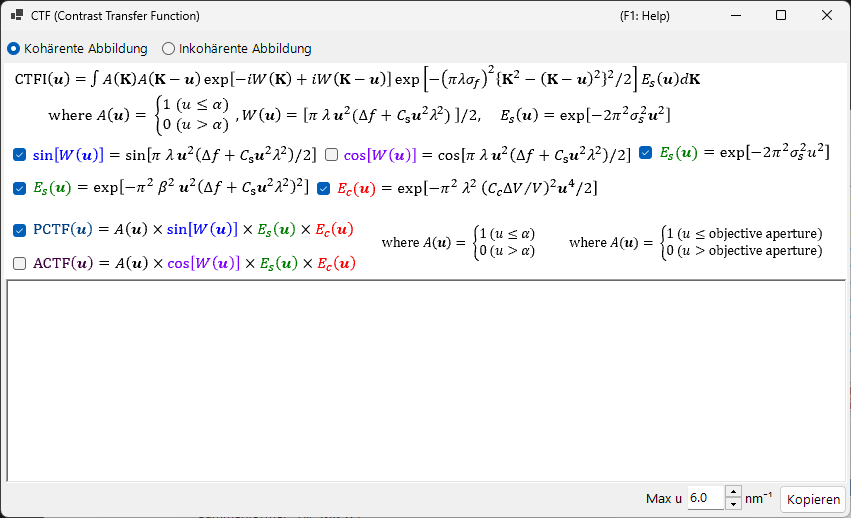

# HRTEM-Simulation

Simuliert hochauflösende TEM-Gitterstreifenbilder. Der primäre Modus des [HRTEM/STEM-Simulators](index.md).

---

## Berechnungsablauf

1. **Bloch-Wellen-Methode**: Berechnet die Ausbreitung der Elektronenwelle durch das Kristallpotential; liefert Amplitude und Phase der austretenden Welle
2. **Linsenfunktion**: Wendet die Aberrationen der Objektivlinse an (sphärische Aberration $C_s$, Defokus $\Delta f$)
3. **Partielle Kohärenz**: Berücksichtigt die endliche Quellengröße (räumliche Kohärenz) und die Energiebreite (zeitliche Kohärenz)
4. **Bildentstehung**: Berechnet die Intensität $|\psi(\mathbf{r})|^2$

---

## Probenparameter

| Parameter | Beschreibung |
|-----------|-------------|
| **Thickness** | Probendicke (nm). HRTEM-Bilder hängen stark von der Dicke ab |

---

## Optische Parameter

### TEM-Bedingungen

| Parameter | Beschreibung |
|-----------|-------------|
| **Acc. Vol.** | Beschleunigungsspannung (kV). Die relativistisch korrigierte Wellenlänge wird daneben angezeigt |
| **Defocus** | Defokuswert (nm). Der Scherzer-Defokus wird als Referenz angezeigt |

### Intrinsische Parameter

| Parameter | Beschreibung | Typisch |
|-----------|-------------|---------|
| **Cs** | Sphärische Aberration (mm) | 0.5–1.0 (konventionell); < 0.01 (Cs-korrigiert) |
| **Cc** | Chromatische Aberration (mm) | 1.0–2.0 |
| **β** | Beleuchtungs-Halbwinkel (mrad) | 0.1–1.0 |
| **ΔE** | Energiebreite 1/*e*-Breite (eV) | 0.5–2.0 |

---

## Phasenkontrast-Übertragungsfunktion (PCTF)

Im Registerkartenbereich der Linsenfunktion angezeigt:

- $\sin\chi(u)$: Phasenkontrast-Übertragungsfunktion ($\chi(u)$ ist die Linsen-Aberrationsfunktion)
- $E_\text{s}(u)$: Einhüllende der räumlichen Kohärenz
- $E_\text{c}(u)$: Einhüllende der zeitlichen Kohärenz

Scherzer-Defokus: $\Delta f = -\sqrt{\tfrac{4}{3}\,C_s \lambda}\ (\approx -1.155\,\sqrt{C_s \lambda})$, die Bedingung, die ein breites negatives PCTF-Band ergibt (dunkler Kontrast = Atompositionen). ReciPro verwendet diesen ursprünglichen Scherzer-Wert — abgeleitet, indem das Minimum der Aberrationsphase $\chi$ auf $-2\pi/3$ gesetzt wird — und der in der GUI angezeigte Wert folgt dieser Formel; manche Quellen verwenden stattdessen den *erweiterten Scherzer*-Wert $-1.2\sqrt{C_s\lambda}$.

---

## Objektivblende

Legen Sie Blendengröße (mrad) und Position fest. **Open aperture** entfernt sie. Die Anzahl der berücksichtigten Bloch-Wellen hängt von den Blendenbedingungen ab.

---

## Modelle der partiellen Kohärenz

| Modell | Beschreibung |
|-------|-------------|
| **Quasi-coherent (linear image)** | Schnell. Gültig unter der Schwachphasen-Näherung |
| **TCC (Transmission Cross Coefficient)** | Genauer; längere Rechenzeit |

---

## Simulationsmodi

| Modus | Beschreibung |
|------|-------------|
| **Single image** | Ein Bild bei aktueller Dicke und Defokus |
| **Serial image** | Matrix von Bildern über Dicken- × Defokusbereiche (Start / Step / Num) |

---

## Bildanpassung

| Einstellung | Beschreibung |
|---------|-------------|
| **Min / Max** | Anzeigebereich (Schieberegler zur Bildanpassung) |
| **Colour** | Graustufen oder Cold-Warm |
| **Gaussian blur (FWHM)** | Wendet einen Gauß-Filter an |
| **Unit cell** | Überlagert ein Elementarzellengitter |
| **Scale** | Zeigt einen Maßstabsbalken an |

---

## Siehe auch

- [HRTEM/STEM-Simulator (Übersicht)](index.md)
- [STEM-Simulation](2-stem-simulation.md)
- [Potential-Simulation](3-potential-simulation.md)
- [Anhang A3.2 — HRTEM-Bildentstehung](../appendix/a3-bloch-wave/hrtem.md)
