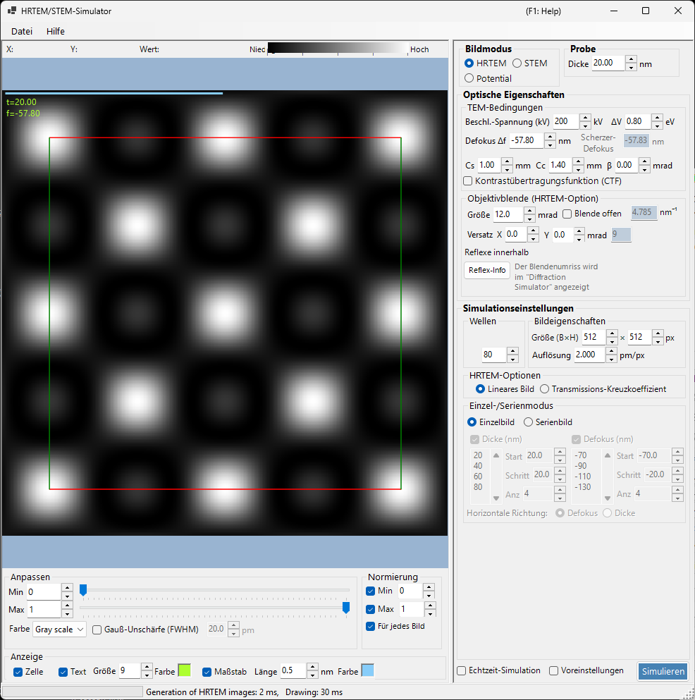
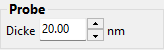
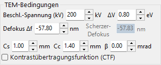
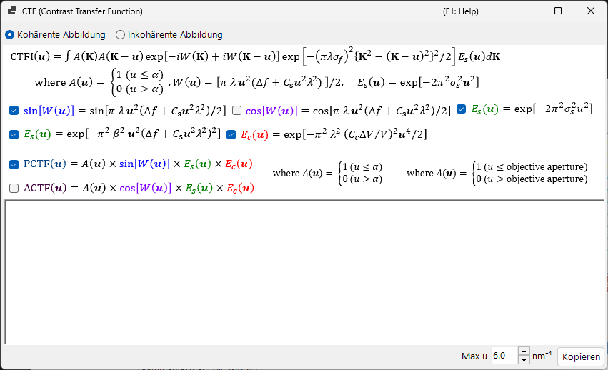
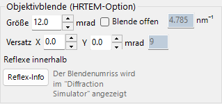
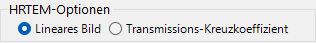
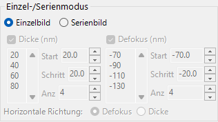
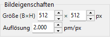
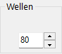

# HRTEM-Simulation

Die **HRTEM-Simulation (High-Resolution Transmission Electron Microscopy)** berechnet hochauflösende TEM-Gitterstreifenbilder. Sie ist der primäre Modus des [HRTEM/STEM-Simulators](index.md).

> Diese Seite listet alle Einstellungen auf, die rechts erscheinen, wenn **Bildmodus = HRTEM** gewählt ist. Für die Steuerelemente links — Anzeige des Ergebnisses und Anpassung seiner Helligkeit — siehe die [Übersichtsseite](index.md#display-settings).

---

## Übersicht

Ein HRTEM-Bild entsteht, wenn die durch die Probe transmittierte Elektronenwelle unter dem Einfluss der Aberrationen der Objektivlinse abgebildet wird. ReciPro berechnet die Ausbreitung der Elektronenwelle in der Probe mit der Bloch-Wellen-Methode (dynamische Berechnung) und erzeugt das HRTEM-Bild über die Phasenkontrast-Übertragungsfunktion (PCTF).

### Berechnungsablauf

1. **Bloch-Wellen-Methode**: Berechnet die Ausbreitung der Elektronenwelle im Kristallpotential und liefert Amplitude und Phase der austretenden Welle
2. **Linsenfunktion**: Wendet die Aberrationen der Objektivlinse an (sphärische Aberration $C_s$, Defokus $\Delta f$)
3. **Partielle Kohärenz**: Berücksichtigt die endliche Quellengröße (räumliche Kohärenz) und die Energiefluktuation (zeitliche Kohärenz)
4. **Bildentstehung**: Berechnet die Intensitätsverteilung $|\psi(\mathbf{r})|^2$

Zur Theorie siehe [Anhang A3.2 — HRTEM-Bildentstehung](../appendix/a3-bloch-wave/hrtem.md).

---

## Probe

- **Dicke** : Probendicke (nm). HRTEM-Bilder hängen stark von der Dicke ab. Im Modus **Serienbild** wird dieser Wert ignoriert und stattdessen die unten beschriebene Dickenliste verwendet.

---

## TEM-Bedingungen

Legt die Abbildungsbedingungen der Objektivlinse fest.

| Parameter | Beschreibung | Standard / typisch |
|-----------|-------------|-------------------|
| **Beschl.-Spannung (kV)** | Beschleunigungsspannung. Die relativistisch korrigierte Elektronenwellenlänge wird rechts daneben angezeigt | 200 kV |
| **Defokus Δf** | Defokus der Objektivlinse (nm). Der Referenzwert des **Scherzer-Defokus** wird darunter angezeigt | −57.8 nm |
| **Cs** | Sphärischer Aberrationskoeffizient (mm). Beeinflusst die CTF und den Scherzer-Defokus | 0.5–1.0 (konventionell), < 0.01 (Cs-korrigiert) |
| **Cc** | Chromatischer Aberrationskoeffizient (mm). Bestimmt die durch die Energiebreite verursachte Bildunschärfe | 1.0–2.0 mm |
| **β** | Beleuchtungs-Halbwinkel (mrad). Beschreibt den Effekt der endlichen Quellengröße (räumliche Kohärenz) | 0.1–1.0 mrad |
| **ΔV** | Halbwertsbreite der Energiebreite der Elektronen (eV). Bestimmt zusammen mit Cc die Fokusstreuung durch chromatische Aberration | 0.5–2.0 eV |

> **Kontextmenü (Rechtsklick)**: Im Bereich TEM-Bedingungen lassen sich **Alle Aberrationen auf Null setzen** / **Defokus auf Scherzer-Wert setzen** / **Defokus auf 0 nm setzen** mit einem Klick anwenden. Bedingungs-Voreinstellungen (300kV ARM300F, 200kV 2100F usw.) sind über **Voreinstellungen** unten links verfügbar.

### Scherzer-Defokus

Der Defokuswert, in dessen Nähe der Phasenkontrast optimal ist, berechnet aus der aktuellen Wellenlänge und der sphärischen Aberration $C_s$ (als Referenz angezeigt).

$$\Delta f_{\text{Scherzer}} = -\sqrt{\tfrac{4}{3}\,C_s \lambda}\quad\left(\approx -1.155\,\sqrt{C_s \lambda}\right)$$

Unter dieser Bedingung ist die PCTF über einen weiten Bereich von Ortsfrequenzen negativ, sodass Atompositionen als dunkler Kontrast erscheinen. ReciPro verwendet diesen ursprünglichen Scherzer-Wert (abgeleitet, indem das Minimum der Aberrationsphase $\chi$ auf $-2\pi/3$ gesetzt wird), und der in der GUI angezeigte Wert folgt dieser Formel. Beachten Sie, dass manche Quellen stattdessen den *erweiterten Scherzer*-Wert $-1.2\sqrt{C_s\lambda}$ verwenden, der das Übertragungsband weiter verbreitert.

---

## Linsenfunktion / Kontrastübertragungsfunktion (CTF)

Durch Aktivieren von **Kontrastübertragungsfunktion (CTF)** öffnet sich ein Fenster, das darstellt, wie Linsenaberrationen und Defokus den Bildkontrast bei jeder Ortsfrequenz übertragen.

- $\sin\chi(u)$ : Phasenkontrast-Übertragungsfunktion ($\chi(u)$ ist die Aberrationsfunktion der Linse)
- $E_\text{s}(u)$ : Einhüllende der räumlichen Kohärenz; die Dämpfung durch die endliche Quellengröße ($\beta$)
- $E_\text{c}(u)$ : Einhüllende der zeitlichen Kohärenz; die Dämpfung durch die Energiefluktuation ($C_c$, $\Delta V$)

Eine Änderung der oberen Grenze der horizontalen Achse $u$ (Ortsfrequenz) ändert den dargestellten Bereich.

---

## Objektivblende (HRTEM-Option)

Beschränkt die gebeugten Wellen, die die Objektivblende passieren. Die Anzahl der von der Blende abgeschnittenen gebeugten Wellen verändert auch die Zahl der in die Bloch-Wellen-Berechnung einbezogenen Reflexe (die Obergrenze ist die in **Wellen** eingestellte maximale Anzahl der Bloch-Wellen).

- **Größe** : Halbwinkel der Objektivblende (mrad). Je kleiner er ist, desto mehr gebeugte Wellen großer Winkel werden abgeschnitten und desto glatter werden die hochaufgelösten Details. Der entsprechende Radius im reziproken Raum $\sin\theta/\lambda$ (nm⁻¹) wird angezeigt.
- **Versatz X** / **Y** : Verschiebung des Mittelpunkts der Objektivblende (mrad). Wird für Dunkelfeld- und Kippabbildung verwendet.
- **Blende offen** : öffnet die Objektivblende (unendlich), sodass alle gebeugten Wellen zur Abbildung beitragen.
- **Reflexe innerhalb** : die Anzahl der gebeugten Strahlen (Reflexe), die innerhalb der Blende liegen (nur lesbar).
- **Reflex-Info** : öffnet eine Tabelle der gebeugten Strahlen innerhalb der Blende (Intensität, komplexe Amplitude usw.).

> Die Größe der Objektivblende wird auch im **Beugungssimulator** angezeigt.

---

## HRTEM-Optionen (Teilkohärenzmodell)

Wählt das Interferenzmodell, das beim Integrieren der Beiträge aus allen Richtungen des einfallenden Strahls verwendet wird.

- **Lineares Bild** : rechnerisch günstig. Geeignet für dünne Proben, bei denen die Näherung des schwachen Phasenobjekts gilt; multipliziert die PCTF mit den Einhüllenden der räumlichen und zeitlichen Kohärenz.
- **Transmissions-Kreuzkoeffizient** : rechnerisch aufwendig, aber genauer. Integriert über den vollständigen Transmissions-Kreuzkoeffizienten und ist das Modell der Wahl für stark streuende Proben, in denen viele starke gebeugte Wellen angeregt werden.

Einzelheiten siehe [Anhang A3.2 — HRTEM-Bildentstehung](../appendix/a3-bloch-wave/hrtem.md).

---

## Einzel-/Serienmodus

- **Einzelbild** : berechnet ein HRTEM-Bild bei der aktuellen Dicke und dem aktuellen Defokus.
- **Serienbild** : erzeugt eine Bildserie mit schrittweise variierter Dicke und variiertem Defokus (Dicken- / Fokusserie). Nützlich, um die Bedingung zu finden, die am besten zu einem experimentellen Bild passt.

Für ein Serienbild legen Sie Folgendes fest.

| Element | Beschreibung |
|------|-------------|
| **Dicke (nm)** / **Defokus (nm)** | Welche Größe variiert wird (beide sind möglich) |
| **Start / Schritt / Anz** | Startwert, Schrittweite und Anzahl der Bilder. Sie werden in das Listenfeld darunter übertragen, das auch direkt bearbeitet werden kann |
| **Horizontale Richtung:** | Wenn Dicke und Defokus beide variiert werden: die Größe, die entlang der horizontalen Richtung des Rasters angeordnet wird (**Defokus** oder **Dicke**) |

Werden Dicke und Defokus beide variiert, entsteht eine Bildmatrix aus Zeilen × Spalten.

---

## Bildeigenschaften

- **Größe (B×H)** : Anzahl der Pixel des simulierten Bildes (Standard 512×512).
- **Auflösung** : Abtastauflösung (pm/px). Ein kleinerer Wert löst feinere Gitterstreifen auf, aber die FFT-Zeit wächst proportional.

---

## Wellen

- Maximale Anzahl der in der Bethe-Methode (dynamische Berechnung) verwendeten Bloch-Wellen, standardmäßig 80. Eine größere Anzahl verbessert die Genauigkeit, aber das Eigenwertproblem benötigt $O(N^3)$ Zeit.

---

## Siehe auch

- [HRTEM/STEM-Simulator (Übersicht)](index.md)
- [STEM-Simulation](2-stem-simulation.md)
- [Potential-Simulation](3-potential-simulation.md)
- [Anhang A3.2 — HRTEM-Bildentstehung](../appendix/a3-bloch-wave/hrtem.md)
