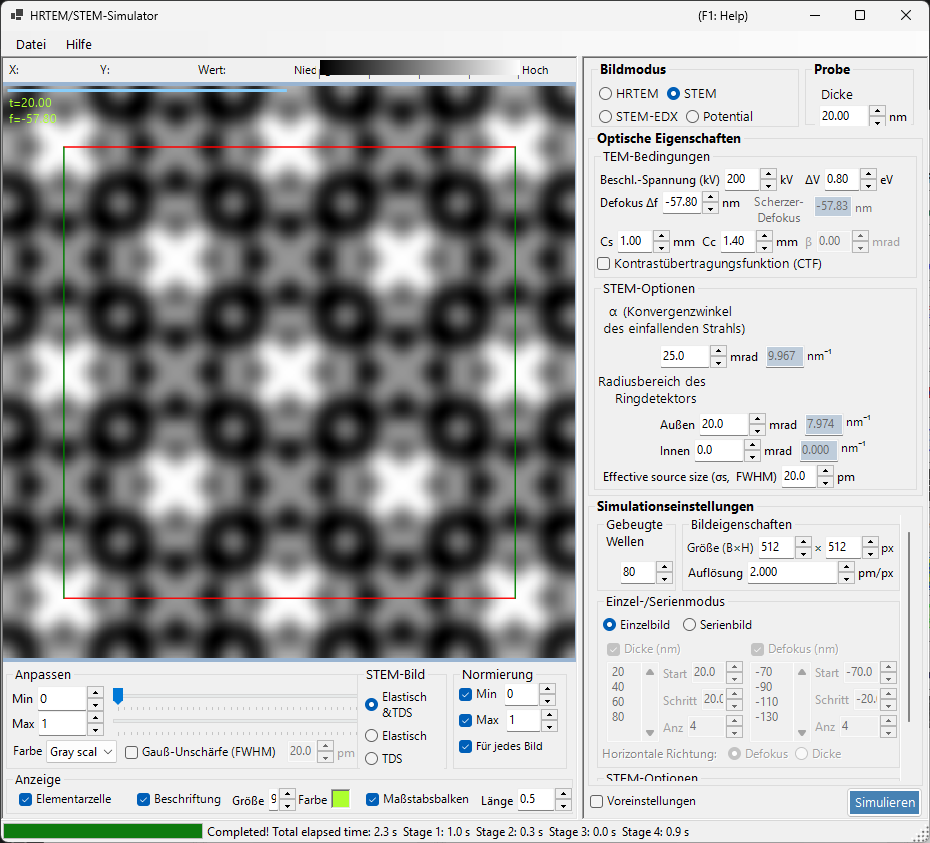
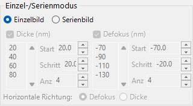

# STEM-Simulation

Die **STEM-Simulation (Scanning Transmission Electron Microscopy)** berechnet Bilder der Raster-Transmissionselektronenmikroskopie mit der Bloch-Wellen-Methode.

> Diese Seite listet alle Einstellungen auf, die rechts erscheinen, wenn **Bildmodus = STEM** gewählt ist. Für die Steuerelemente links zur Ergebnisanzeige, Helligkeit und Normierung siehe die [Übersichtsseite](index.md). Nur das STEM-spezifische **Anzeigeziel** wird unten wiederholt.

---

## Übersicht

Ein konvergenter Elektronenstrahl wird über die Probe gerastert, und die transmittierten und gestreuten Elektronen werden an jeder Rasterposition von Ringdetektoren erfasst. ReciPro berechnet das STEM-Bild mit der Bloch-Wellen-Methode (dynamische Berechnung).

### Berechnungsablauf

1. Berechne an jeder Rasterposition die gebeugten Intensitäten mit der Bloch-Wellen-Methode für jede Einfallsrichtung der konvergenten Sonde.
2. Integriere die gestreute Intensität über den Winkelbereich des Detektors.
3. Sowohl elastische als auch thermisch-diffuse Streubeiträge (TDS) können berechnet werden.

Siehe [Anhang A3.4 — STEM-Berechnung](../appendix/a3-bloch-wave/stem.md) für die Theorie.

---

## Detektortypen

| Detektor | Winkelbereich | Hauptbeitrag | Kontrast |
|----------|-------------|-------------------|----------|
| **BF** (Hellfeld) | 0 – Konvergenzwinkel | Elastisch | Phasenkontrast |
| **ABF** (ringförmiges Hellfeld) | Innerer Teil des Konvergenzwinkels | Elastisch | Empfindlich für leichte Elemente |
| **LAADF** (ringförmiges Dunkelfeld bei kleinem Winkel) | Knapp außerhalb des Konvergenzwinkels | Elastisch + TDS | Empfindlich für Verzerrungen |
| **HAADF** (ringförmiges Dunkelfeld bei großem Winkel) | Deutlich außerhalb des Konvergenzwinkels | TDS (inelastisch) | Z-Kontrast ($\propto Z^2$) |

> **Typische Detektoreinstellungen** (jeweils mit einem Klick aus dem Rechtsklick-Menü der STEM-Optionen verfügbar, alle mit Konvergenzwinkel α = 25 mrad):
> BF (0–5 mrad) / ABF (12–24 mrad) / LAADF (26–60 mrad) / HAADF (80–250 mrad)

---

## Probenparameter

- **Thickness** : Probendicke (nm). Dieser Wert wird im Modus **Serial image** ignoriert.

---

## TEM-Bedingungen

| Parameter | Beschreibung | Standard / typisch |
|-----------|-------------|-------------------|
| **Acc. Vol. (kV)** | Beschleunigungsspannung. Die relativistisch korrigierte Elektronenwellenlänge wird daneben angezeigt | 200 kV |
| **Defocus Δf** | Defokus der Objektivlinse (sondenformenden Linse) (nm) | −57.8 nm |
| **Cs** | Sphärischer Aberrationskoeffizient (mm). Beeinflusst die Sondengröße | 0.5–1.0 mm |
| **Cc** | Chromatischer Aberrationskoeffizient (mm) | 1.0–2.0 mm |
| **ΔV (FWHM)** | Halbwertsbreite der Energiebreite der Elektronen (eV) | 0.5–2.0 eV |

> **β (Beleuchtungs-Halbwinkel) ist im STEM-Modus deaktiviert**, weil der Konvergenzwinkel α seine Rolle übernimmt.

---

## STEM-Optionen (optisch)

Lege die Geometrie der konvergenten Sonde und des Ringdetektors fest. Jeder Winkel wird rechts auch als Radius im reziproken Raum $\sin\theta/\lambda$ (nm⁻¹) umgerechnet angezeigt.

| Parameter | Beschreibung | Standard / typisch |
|-----------|-------------|-------------------|
| **α (convergence angle)** | Halbwinkel der konvergenten Sonde (mrad). Größere Werte ergeben eine feinere Sonde und verändern den Beugungskontrast | 15–25 mrad |
| **(Annular) detector inner angle** | Innerer Erfassungs-Halbwinkel des Ringdetektors (mrad). Signal innerhalb dieses Winkels wird ausgeschlossen | BF: 0, HAADF: 80 |
| **(Annular) detector outer angle** | Äußerer Erfassungs-Halbwinkel des Ringdetektors (mrad). Signal außerhalb dieses Winkels wird ausgeschlossen | BF: 5, HAADF: 250 |
| **Effective source size σs (FWHM)** | Effektive Größe der Elektronenquelle. Größere Werte verschmieren die Sonde und verringern den Kontrast feiner Details | — |

---

## STEM-Optionen (Simulation)

- **Slice thickness for inelastic** : Schichtdicke der Probe (nm), die bei der Berechnung der TDS-Intensität (thermisch-diffus, inelastisch) verwendet wird. Kleinere Werte sind genauer, aber langsamer.
- **Angular resolution** : Winkel-Abtastauflösung der Einfallsrichtungen der Sonde (mrad). Kleinere Werte tasten die Sonde feiner ab, sind aber langsamer.

---

## Bildmodus (single / serial)

- **Einzelbild** : berechnet ein STEM-Bild bei der aktuellen Dicke.
- **Serienbild** : erzeugt eine Bildserie mit schrittweise variierter Dicke / Defokus (festgelegt über **Start / Step / Num**; die Liste darunter kann auch direkt bearbeitet werden).

---

## Bildeigenschaften

- **Größe (B×H)** : Anzahl der Pixel im gerasterten Bild (Standard 512×512). In STEM entspricht dies der Anzahl der Rasterpunkte und skaliert die Rechenzeit linear.
- **Resolution** : Abtastauflösung (pm/px).

---

## Gebeugte Wellen

- **Max Bloch waves** : maximale Anzahl der in der Bethe-Methode verwendeten Bloch-Wellen (Standard 80). Der Aufwand des Eigenwertproblems skaliert mit der dritten Potenz der Wellenanzahl.

---

## STEM-Anzeigeziel (Ergebnisseite)

Der Anzeigeschalter unten links im Fenster wählt aus, welche Streukomponente des bereits berechneten STEM-Bildes angezeigt wird (umschaltbar ohne Neuberechnung).

| Anzeigeziel | Beschreibung |
|----------------|-------------|
| **Elastisch** | Bild nur aus elastischer Streuung |
| **TDS** | Bild nur aus thermisch-diffuser Streuung |
| **Elastisch & TDS** | Summe aus elastisch + TDS |

---

## Rechenaufwand

Die STEM-Simulation ist rechenaufwendig, daher sollten die folgenden Parameter angemessen gewählt werden.

| Faktor | Auswirkung |
|--------|--------|
| **Konvergenzwinkel** | Größer → mehr Überlappung der CBED-Scheiben → höherer Aufwand |
| **Bloch-Wellen** | Aufwand des Eigenwertproblems skaliert mit N³ |
| **Winkelauflösung** | Feiner → genauer, aber Aufwand skaliert mit N² |
| **Bildpixel (Size)** | Lineare Skalierung mit der Anzahl der Rasterpunkte |

---

## Bedeutung des Temperaturfaktors

Für die HAADF-STEM-Simulation müssen die Atome einen von null verschiedenen isotropen Temperaturfaktor (Debye-Waller-Faktor) besitzen. Ist der Wert unbekannt, setze $B \approx 0.5\ \text{Å}^2$. Bei einem Temperaturfaktor von null ist die TDS-Intensität null und das HAADF-Bild wird nicht korrekt berechnet.

| Detektor | Bereich | Hauptbeitrag |
|----------|-------|-------------------|
| BF, ABF | Innerhalb des Konvergenzwinkels | Elastisch |
| LAADF, HAADF | Außerhalb des Konvergenzwinkels | Inelastisch (TDS) |

---

## Vergleich mit Dr. Probe

Es wurde bestätigt, dass die STEM-Simulationen von ReciPro eng mit der weit verbreiteten Dr.-Probe-GUI (v1.10) übereinstimmen. Die folgende Abbildung vergleicht die beiden für BF-, ABF-, LAADF- und HAADF-Detektoren über eine Dickenserie (2.96–60.05 nm), sowohl aberrationsfrei (links) als auch mit Cs = 0.2 mm, Defokus = −25.9 nm (rechts). Die beiden Programme stimmen über alle Detektortypen und Dicken hinweg überein.

Ein ausführlicherer Bericht ist als PDF verfügbar: [Vergleich von STEM-Simulationen durch Dr.-Probe-GUI (v1.10) und ReciPro (v4.854)](https://github.com/seto77/ReciPro/files/10976084/ComparisonSTEMsimulations.pdf).

---

## Siehe auch

- [HRTEM/STEM-Simulator (Übersicht)](index.md)
- [HRTEM-Simulation](1-hrtem-simulation.md)
- [Potential-Simulation](3-potential-simulation.md)
- [Anhang A3.4 — STEM-Berechnung](../appendix/a3-bloch-wave/stem.md)
- [Anhang A3.4 — STEM-Berechnung](../appendix/a3-bloch-wave/stem.md)
