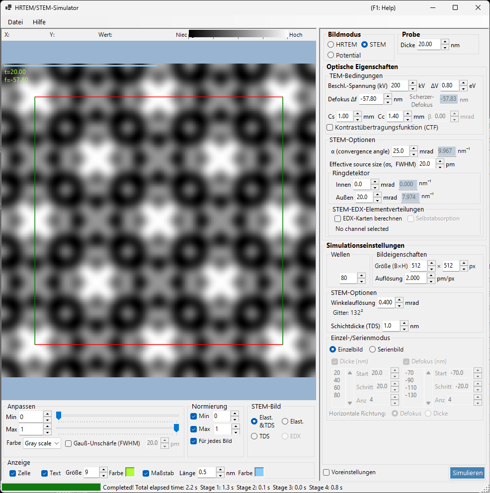
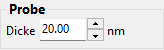
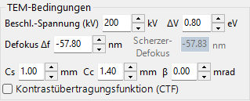
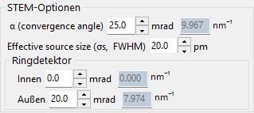
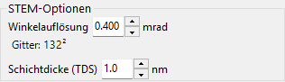
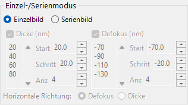
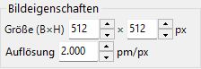
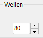
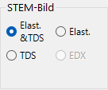
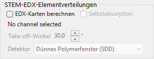

# STEM-Simulation

Die **STEM-Simulation (Scanning Transmission Electron Microscopy)** berechnet Bilder der Raster-Transmissionselektronenmikroskopie mit der Bloch-Wellen-Methode.

> Diese Seite listet alle Einstellungen auf, die rechts erscheinen, wenn **Bildmodus = STEM** gewählt ist. Für die Steuerelemente links zur Ergebnisanzeige, Helligkeit und Normierung siehe die [Übersichtsseite](index.md). Nur das STEM-spezifische **Anzeigeziel** wird unten wiederholt.

---

## Übersicht

Ein konvergenter Elektronenstrahl wird über die Probe gerastert, und die transmittierten und gestreuten Elektronen werden an jeder Rasterposition von Ringdetektoren erfasst. ReciPro berechnet das STEM-Bild mit der Bloch-Wellen-Methode (dynamische Berechnung).

### Berechnungsablauf

1. Berechne an jeder Rasterposition die gebeugten Intensitäten mit der Bloch-Wellen-Methode für jede Einfallsrichtung der konvergenten Sonde.
2. Integriere die gestreute Intensität über den Winkelbereich des Detektors.
3. Sowohl elastische als auch thermisch-diffuse Streubeiträge (TDS) können berechnet werden.

Siehe [Anhang A3.4 — STEM-Berechnung](../appendix/a3-bloch-wave/stem.md) für die Theorie.

---

## Detektortypen

| Detektor | Winkelbereich | Hauptbeitrag | Kontrast |
|----------|-------------|-------------------|----------|
| **BF** (Hellfeld) | 0 – Konvergenzwinkel | Elastisch | Phasenkontrast |
| **ABF** (ringförmiges Hellfeld) | Innerer Teil des Konvergenzwinkels | Elastisch | Empfindlich für leichte Elemente |
| **LAADF** (ringförmiges Dunkelfeld bei kleinem Winkel) | Knapp außerhalb des Konvergenzwinkels | Elastisch + TDS | Empfindlich für Verzerrungen |
| **HAADF** (ringförmiges Dunkelfeld bei großem Winkel) | Deutlich außerhalb des Konvergenzwinkels | TDS (inelastisch) | Z-Kontrast ($\propto Z^2$) |

> **Typische Detektoreinstellungen** (jeweils mit einem Klick aus dem Rechtsklick-Menü der STEM-Optionen verfügbar, alle mit Konvergenzwinkel α = 25 mrad):
> BF (0–5 mrad) / ABF (12–24 mrad) / LAADF (26–60 mrad) / HAADF (80–250 mrad)

---

## Probenparameter

- **Thickness** : Probendicke (nm). Dieser Wert wird im Modus **Serial image** ignoriert.

---

## TEM-Bedingungen

| Parameter | Beschreibung | Standard / typisch |
|-----------|-------------|-------------------|
| **Acc. Vol. (kV)** | Beschleunigungsspannung. Die relativistisch korrigierte Elektronenwellenlänge wird daneben angezeigt | 200 kV |
| **Defocus Δf** | Defokus der Objektivlinse (sondenformenden Linse) (nm) | −57.8 nm |
| **Cs** | Sphärischer Aberrationskoeffizient (mm). Beeinflusst die Sondengröße | 0.5–1.0 mm |
| **Cc** | Chromatischer Aberrationskoeffizient (mm) | 1.0–2.0 mm |
| **ΔV (FWHM)** | Halbwertsbreite der Energiebreite der Elektronen (eV) | 0.5–2.0 eV |

> **β (Beleuchtungs-Halbwinkel) ist im STEM-Modus deaktiviert**, weil der Konvergenzwinkel α seine Rolle übernimmt.

---

## STEM-Optionen (optisch)

Lege die Geometrie der konvergenten Sonde und des Ringdetektors fest. Jeder Winkel wird rechts auch als Radius im reziproken Raum $\sin\theta/\lambda$ (nm⁻¹) umgerechnet angezeigt.

| Parameter | Beschreibung | Standard / typisch |
|-----------|-------------|-------------------|
| **α (convergence angle)** | Halbwinkel der konvergenten Sonde (mrad). Größere Werte ergeben eine feinere Sonde und verändern den Beugungskontrast | 15–25 mrad |
| **(Annular) detector inner angle** | Innerer Erfassungs-Halbwinkel des Ringdetektors (mrad). Signal innerhalb dieses Winkels wird ausgeschlossen | BF: 0, HAADF: 80 |
| **(Annular) detector outer angle** | Äußerer Erfassungs-Halbwinkel des Ringdetektors (mrad). Signal außerhalb dieses Winkels wird ausgeschlossen | BF: 5, HAADF: 250 |
| **Effective source size σs (FWHM)** | Effektive Größe der Elektronenquelle. Größere Werte verschmieren die Sonde und verringern den Kontrast feiner Details | — |

---

## STEM-Optionen (Simulation)

- **Slice thickness for inelastic** : Schichtdicke der Probe (nm), die bei der Berechnung der TDS-Intensität (thermisch-diffus, inelastisch) verwendet wird. Kleinere Werte sind genauer, aber langsamer.
- **Angular resolution** : Winkel-Abtastauflösung der Einfallsrichtungen der Sonde (mrad). Kleinere Werte tasten die Sonde feiner ab, sind aber langsamer. Die Zahl der Richtungen wächst quadratisch mit diesem Verhältnis und ist damit der wichtigste Hebel für die Rechenzeit; gemessene Konvergenzwerte siehe [Winkelabtastung der Sonde](../appendix/a3-bloch-wave/stem.md#angular-sampling).

---

## Bildmodus (single / serial)

- **Einzelbild** : berechnet ein STEM-Bild bei der aktuellen Dicke.
- **Serienbild** : erzeugt eine Bildserie mit schrittweise variierter Dicke / Defokus (festgelegt über **Start / Step / Num**; die Liste darunter kann auch direkt bearbeitet werden).

---

## Bildeigenschaften

- **Größe (B×H)** : Anzahl der Pixel im gerasterten Bild (Standard 512×512). In STEM entspricht dies der Anzahl der Rasterpunkte und skaliert die Rechenzeit linear.
- **Resolution** : Abtastauflösung (pm/px).

---

## Gebeugte Wellen

- **Max Bloch waves** : maximale Anzahl der in der Bethe-Methode verwendeten Bloch-Wellen (Standard 80). Der Aufwand des Eigenwertproblems skaliert mit der dritten Potenz der Wellenanzahl.

---

## STEM-Anzeigeziel (Ergebnisseite) {#stem-display-target}

Der Anzeigeschalter unten links im Fenster wählt aus, welche Streukomponente des bereits berechneten STEM-Bildes angezeigt wird (umschaltbar ohne Neuberechnung).

| Anzeigeziel | Beschreibung |
|----------------|-------------|
| **Elastisch** | Bild nur aus elastischer Streuung |
| **TDS** | Bild nur aus thermisch-diffuser Streuung |
| **Elastisch & TDS** | Summe aus elastisch + TDS |
| **EDX** | Karte der charakteristischen Röntgenstrahlung. Die anzuzeigende Linie (z. B. `O-K`) wird in der Combobox darunter gewählt; **EDX gemeinsam** in *Normierung* legt alle Kanäle auf einen gemeinsamen Anzeigebereich, sodass das Bild beim Kanalwechsel nicht neu skaliert wird |

!!! note
    Alle drei Bilder werden aus dem Realteil der Fourier-Summe rekonstruiert, sodass **Elastisch & TDS** exakt die Summe der beiden anderen ist. Bis Version 4.944 wurde stattdessen der Betrag genommen, was diese Identität zerstörte und die dunklen Pixel leicht aufhellte. Siehe [Rekonstruktion eines reellen Bildes](../appendix/a3-bloch-wave/stem.md#real-image-reconstruction).

---

## STEM-EDX-Elementverteilungen {#stem-edx}

Aktiviere **EDX-Karten berechnen**, um Karten der charakteristischen Röntgenstrahlung zusätzlich zum ADF-artigen Bild zu berechnen. Dies ist kein eigener Modus: Die elastischen, TDS- und EDX-Signale entstammen demselben STEM-Lauf, und zwischen ihnen wird anschließend im [STEM-Anzeigeziel](#stem-display-target) ohne Neuberechnung umgeschaltet.

Es gibt keine Elementauswahl. Ist das Kontrollkästchen aktiviert, wird **jeder Element-/Schalen-Kanal berechnet, der für diesen Kristall bei dieser Beschleunigungsspannung berechenbar ist**, und die Zeile unter dem Kontrollkästchen listet sie auf (z. B. `3 Karte(n): O-K, Mg-K, Al-K`). Ein Kanal ist verfügbar, wenn die Ionisationskante unterhalb der Beschleunigungsspannung liegt und die Schale von den mitgelieferten Daten abgedeckt wird — K: C–Sn (Z = 6–50), L-gesamt: Ca–Rn (Z = 20–86). Die mitgelieferte Tabelle enthält für jeden Kanal voll relativistische Ionisations-Formfaktoren bis zu einem Streuvektor von 8 Å⁻¹, sodass L-Linien schwerer Elemente bis hinauf zum Radon ohne Extrapolation simuliert werden. Ist kein Kanal verfügbar, wird der Lauf mit einer erklärenden Meldung abgelehnt, statt eine leere Karte zu erzeugen.

Die nächste Zeile gibt das Richtungsgitter der Sonde an, z. B. `Gitter: 132² (empfohlen: ≥48²)`. Dieses Gitter wird durch **Winkelauflösung** und den Konvergenzwinkel festgelegt; siehe [Winkelabtastung der Sonde](../appendix/a3-bloch-wave/stem.md#angular-sampling). Unterhalb der empfohlenen Unterteilung kann das hermitesche ±q-Residuum die Toleranz überschreiten und den Lauf abbrechen; der Wert wird daher orange dargestellt, und vor Beginn der Berechnung erscheint ein Bestätigungsdialog.

!!! warning "Was die Werte bedeuten"
    Die Karte zeigt die **Zahl der pro einfallendem Elektron erzeugten Innerschalen-Vakanzen** — eine Modellgröße, keine vorhergesagte Röntgenzählrate. Fluoreszenzausbeute, Selbstabsorption in der Probe, Raumwinkel des Detektors und Detektoreffizienz werden **nicht** berücksichtigt. Verwende die Karten für die räumliche Verteilung und zum Vergleich von Dicke oder Orientierung, nicht zur absoluten Quantifizierung.

### Detektorparameter (reserviert)

**Selbstabsorption**, **Take-off-Winkel** und **Detektor** sind bereits angelegt, aber deaktiviert: Sie gehören zu dem Detektormodell, das noch nicht implementiert ist. Sie werden angezeigt, damit sich das Panel nicht verschiebt, wenn das Modell hinzukommt. Ihre spätere Wirkung unterscheidet sich grundsätzlich:

| Faktor | Pixel-zu-Pixel-Kontrast innerhalb einer Karte | Verhältnis zwischen Elementkarten |
|---|---|---|
| Selbstabsorption (Take-off-Winkel) | **ändert ihn** | **ändert es** |
| Detektorfenster / Totschicht / Effizienz | kein Einfluss | **ändert es stark** |
| Raumwinkel des Detektors, Strahlstrom, Verweilzeit | kein Einfluss | kein Einfluss |

Die letzte Zeile ist der Grund, warum ReciPro Strahlstrom und Verweilzeit gar nicht erst anbietet: Sie multiplizieren jedes Pixel jeder Karte mit derselben Zahl, kürzen sich in jedem Verhältnis heraus und sind nach der Anzeigenormierung unsichtbar.

### Genauigkeit und Aufwand

STEM-EDX setzt keine zusätzliche Grenze für die Wellenanzahl oder die Schichtdicke: Es durchläuft dieselben Berechnungspfade wie das ADF-artige Bild, sodass alle Einstellungen, die für STEM funktionieren, auch für EDX funktionieren.

Die Genauigkeit bleibt dir überlassen, genau wie bei der Wellenanzahl oder der Winkelauflösung. Zur Orientierung: Der Fehler der Tiefenintegration wächst etwa proportional zur **Schichtdicke (TDS)** — rund 2–3 % bei 1 nm, 4–8 % bei 2 nm und 12–23 % bei 4 nm (relativ zum Maximum, SrTiO₃ bei 39 nm). Eine Halbierung der Schichtdicke halbiert den Fehler ungefähr und verdoppelt ungefähr den Aufwand der Tiefenintegration.

---

## Rechenaufwand

Die STEM-Simulation ist rechenaufwendig, daher sollten die folgenden Parameter angemessen gewählt werden.

| Faktor | Auswirkung |
|--------|--------|
| **Konvergenzwinkel** | Größer → mehr Überlappung der CBED-Scheiben → höherer Aufwand |
| **Bloch-Wellen** | Aufwand des Eigenwertproblems skaliert mit N³ |
| **Winkelauflösung** | Feiner → genauer, aber Aufwand skaliert mit N² |
| **Bildpixel (Size)** | Lineare Skalierung mit der Anzahl der Rasterpunkte |

---

## Bedeutung des Temperaturfaktors

Für die HAADF-STEM-Simulation müssen die Atome einen von null verschiedenen isotropen Temperaturfaktor (Debye-Waller-Faktor) besitzen. Ist der Wert unbekannt, setze $B \approx 0.5\ \text{Å}^2$. Bei einem Temperaturfaktor von null ist die TDS-Intensität null und das HAADF-Bild wird nicht korrekt berechnet.

| Detektor | Bereich | Hauptbeitrag |
|----------|-------|-------------------|
| BF, ABF | Innerhalb des Konvergenzwinkels | Elastisch |
| LAADF, HAADF | Außerhalb des Konvergenzwinkels | Inelastisch (TDS) |

---

## Vergleich mit Dr. Probe

Es wurde bestätigt, dass die STEM-Simulationen von ReciPro eng mit der weit verbreiteten Dr.-Probe-GUI (v1.10) übereinstimmen. Die folgende Abbildung vergleicht die beiden für BF-, ABF-, LAADF- und HAADF-Detektoren über eine Dickenserie (2.96–60.05 nm), sowohl aberrationsfrei (links) als auch mit Cs = 0.2 mm, Defokus = −25.9 nm (rechts). Die beiden Programme stimmen über alle Detektortypen und Dicken hinweg überein.

Ein ausführlicherer Bericht ist als PDF verfügbar: [Vergleich von STEM-Simulationen durch Dr.-Probe-GUI (v1.10) und ReciPro (v4.854)](https://github.com/seto77/ReciPro/files/10976084/ComparisonSTEMsimulations.pdf).

---

## Siehe auch

- [HRTEM/STEM-Simulator (Übersicht)](index.md)
- [HRTEM-Simulation](1-hrtem-simulation.md)
- [Potential-Simulation](3-potential-simulation.md)
- [Anhang A3.4 — STEM-Berechnung](../appendix/a3-bloch-wave/stem.md)
