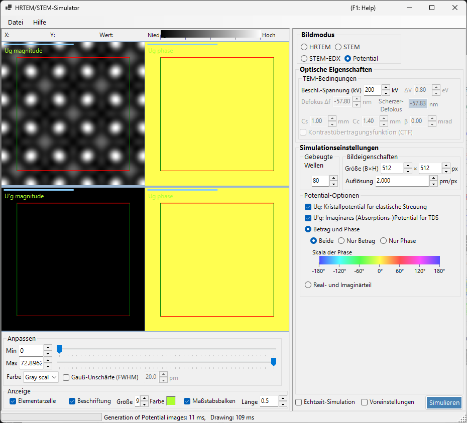

# Potentialsimulation

Die **Potentialsimulation** berechnet und zeigt die 2D-Verteilung des Kristallpotentials. Es werden keine Bildübertragungseffekte (Linsenfehler, Detektor) angewendet: Sie visualisiert das projizierte Kristallpotential selbst.

> Diese Seite behandelt alle Einstellungen, die auf der rechten Seite erscheinen, wenn **Image mode = Potential**. Zur Ergebnisdarstellung, Helligkeitsanpassung und den übrigen Bedienelementen auf der linken Seite siehe die [Übersichtsseite](index.md#display-settings).

---

## Übersicht

Elektronen innerhalb eines Kristalls werden am Kristallpotential gestreut. Seine Verteilung liegt allen Beugungs- und Abbildungsphänomenen zugrunde und ist eine Schlüsselinformation zum Verständnis der Kristallstruktur. Da dieser Modus weder Linsenfehler noch dickenabhängige dynamische Effekte enthält, eignet er sich gut zur Untersuchung der Struktur selbst.

> **Im Potentialmodus werden die Panels für Probendicke, Intensitätsnormierung und Bildmodus (single / serial) nicht angezeigt.** Von den TEM-Bedingungen ist nur die Beschleunigungsspannung aktiv.

---

## TEM-Bedingungen

- **Acc. voltage (kV)** — Beschleunigungsspannung. Sie legt die Elektronenwellenlänge fest und wird zur Berechnung der Fourier-Koeffizienten $U_g$ des Potentials verwendet.

> **Defocus, Cs, Cc, β, ΔE und die PCTF sind im Potentialmodus inaktiv** (es wird keine bildgebende Optik angewendet) und erscheinen ausgegraut.

---

## Potential-Optionen

Wählt, welches Potential angezeigt wird und wie es dargestellt wird.

### Zielpotential

| Typ | Beschreibung |
|------|-------------|
| **$U_g$ — elastic scattering potential** | Das (elektrostatische) Kristallpotential, das für die elastische Streuung verantwortlich ist. Stellt die Streustärke dar |
| **$U'_g$ — absorption potential** | Das imaginäre (Absorptions-)Potential, das aus der thermisch diffusen Streuung (TDS) entsteht. Stellt den Verlust aus dem elastischen Kanal dar |

$U_g$ und $U'_g$ können gleichzeitig angezeigt werden (für jedes angekreuzte wird ein Bereich hinzugefügt).

### Darstellungsmethode

| Modus | Optionen |
|------|---------|
| **Magnitude and phase** | **Both** / **Magnitude only** / **Phase only** (die Phase wird mit einem Farbkreis dargestellt, und darunter wird eine Phasenskala gezeigt) |
| **Real and imaginary part** | **Both** / **Real only** / **Imaginary only** |

---

## Bildeigenschaft

- **Size (W×H)** — Pixelabmessungen des erzeugten Bildes (Standard 512×512).
- **Resolution** — Abtastauflösung (pm/px).

---

## Gebeugte Wellen

- **Max Bloch waves** — maximale Anzahl der Bloch-Wellen (Fourier-Koeffizienten), die in die Fourier-Synthese des Potentials einbezogen werden (Standard 80). Größere Werte beziehen höhere Raumfrequenzen ein und geben feinere Details des Potentials wieder.

---

## Bildanpassung (linke Seite)

Helligkeit (Min / Max), Farbskala und das Elementarzellen-Gitter-Overlay werden auf der linken Seite unter **Adjust** und **Display** eingestellt (siehe die [Übersichtsseite](index.md#display-settings)).

---

## Siehe auch

- [HRTEM/STEM-Simulator (Übersicht)](index.md)
- [HRTEM-Simulation](1-hrtem-simulation.md)
- [STEM-Simulation](2-stem-simulation.md)
