# HRTEM / STEM Simulator

Der **HRTEM/STEM-Simulator** simuliert TEM-Gitterstreifenbilder (HRTEM), STEM-Bilder und projizierte Potentiale. Klicken Sie auf **Simulieren**, um die Berechnung zu starten.

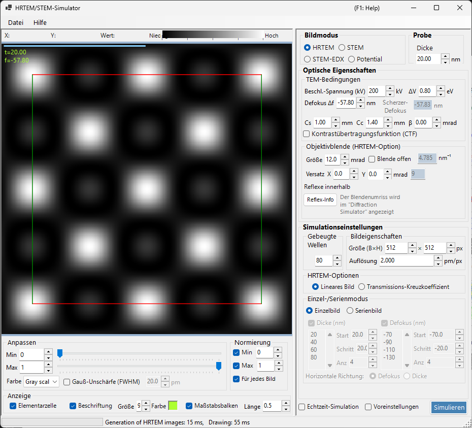

---

## Tastatur- & Maus-Kurzbefehle

Die Ergebnisse werden als ein oder mehrere Bildbereiche angezeigt. Sie verwenden die Standard-[Bildansicht-Navigation](../21-shortcuts.md) von ReciPro, und alle Bereiche werden gemeinsam verschoben und gezoomt.

| Kurzbefehl | Aktion |
|----------|--------|
| <kbd>F1</kbd> | Diese Seite des Online-Handbuchs öffnen |
| <kbd>CTRL</kbd>+<kbd>C</kbd> (Bildraster fokussiert) | Das/die Bild(er) als Metafile in die Zwischenablage kopieren |
| Linke Maustaste ziehen / mittlere Maustaste ziehen | Bild verschieben (alle Bereiche bewegen sich gemeinsam) |
| Mausrad nach oben / unten | Hinein- (×2) / Herauszoomen (×0.5) an der Cursorposition |
| Mit rechter Maustaste ein Rechteck ziehen | In den ausgewählten Bereich hineinzoomen |
| Rechtsklick / Rechter Doppelklick | Herauszoomen (×0.5) |
| <kbd>CTRL</kbd> + mit rechter Maustaste ein Rechteck ziehen | Einen rechteckigen Bereich auswählen |
| Linker Doppelklick auf einen Bereich | Diesen Bereich maximieren / das Raster wiederherstellen (Mehrbereich-Layouts) |
| Maus bewegen (ohne Taste) | Position (pm) und Pixelwert an der Cursorposition ablesen |

→ Siehe **[21. Tastatur- & Maus-Kurzbefehle](../21-shortcuts.md)** für einen Überblick über jedes Fenster.

---

## Schnellwege nach Ziel

| Ziel | Ausgangspunkt | Referenz |
|------|------------|-----------|
| Ein HRTEM-Bild berechnen | **Image mode** auf **HRTEM** setzen, dann Beschleunigungsspannung und Defokus in **TEM conditions** einstellen | [HRTEM-Simulation](1-hrtem-simulation.md), [HRTEM-Bildentstehung](../appendix/a3-bloch-wave/hrtem.md) |
| Ein STEM-Bild berechnen | **Image mode** auf **STEM** setzen, dann Konvergenzwinkel und Detektor in **STEM options** einstellen | [STEM-Simulation](2-stem-simulation.md), [STEM-Berechnung](../appendix/a3-bloch-wave/stem.md) |
| Projiziertes Potential ansehen | **Image mode** auf **Potential** setzen | [Potential-Simulation](3-potential-simulation.md) |
| Eine Dicken-/Defokus-Serie erzeugen | **Single / Serial** und die Bildbedingungen in **HRTEM options** konfigurieren | [HRTEM-Simulation](1-hrtem-simulation.md) |
| HAADF-STEM mit TDS verwenden | Atomare Temperaturfaktoren ungleich null setzen und einen LAADF-/HAADF-Detektor verwenden | [STEM-Berechnung](../appendix/a3-bloch-wave/stem.md) |

---

## Grundlegender Arbeitsablauf

1. Wählen Sie Kristall und Orientierung im Hauptfenster aus und öffnen Sie dann diesen Simulator.
2. Wählen Sie HRTEM, STEM oder Potential in **Image mode**.
3. Stellen Sie Beschleunigungsspannung, Defokus, Aberrationen, Blenden und STEM-Konvergenzeinstellungen in **Optical property** ein.
4. Stellen Sie Dicke, Bildgröße, Auflösung, Bloch-Wellen-Anzahl und Modell der Teilkohärenz in **Simulation property** ein.
5. Klicken Sie auf **Simulate** und passen Sie dann Helligkeit, Normierung, Maßstabsbalken und Beschriftungen in **Display settings** an.

---

## Bildbereich

Die linke Hälfte des Fensters zeigt das simulierte Bild. Die Statusleiste am oberen Rand meldet die Cursorposition (**X:**, **Y:**) und den Bildwert **Value:** (Intensität) unter dem Cursor, neben einer Intensitätsskala **Low → High**, die die aktuelle Farbskala und den Helligkeitsbereich widerspiegelt.

---

## Menü Datei

### Menü Hilfe

---

## Image mode / Sample

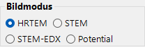{align=left}

HRTEM, Potential oder STEM.

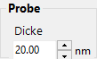{ align=left style="clear: both" }
Legt die Probendicke fest.

## Optical property { style="clear: both" }

### TEM conditions

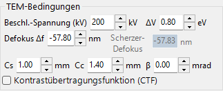

Beschleunigungsspannung, Defokus (Scherzer angezeigt).

#### Acc. voltage

Beschleunigungsspannung des Elektronenmikroskops. Eine Änderung aktualisiert die relativistisch korrigierte Wellenlänge (neben dem Feld angezeigt) und, zusammen mit **Cs**, den vorgeschlagenen Wert für den **Scherzer-Defokus**, der unten angezeigt wird.

#### Defocus

Defokuswert der Objektivlinse. Der Scherzer-Defokus (der Wert, der den Phasenkontrast-Transfer in der Näherung des schwachen Phasenobjekts maximiert) wird unten als Referenz angezeigt.

### Inherent property (HRTEM optical aberrations)

Mikroskopspezifische Aberrationsparameter, die von der Berechnung der Linsenfunktion verwendet werden.

- **Cs** — Koeffizient der sphärischen Aberration.
- **Cc** — Koeffizient der chromatischen Aberration.
- **β** — Beleuchtungs-Halbwinkel (Effekt der endlichen Quelle).
- **ΔE** — 1/e-Breite der Fluktuation der Elektronenenergie.

### Lens function

Diagramme der Linsenfunktion. Eine Anpassung der oberen Grenze von *u* ändert den Zeichenbereich.

- **sin[χ(u)]** — Phasenkontrast-Transferfunktion (PCTF).
- **E_s(u)** — Hüllkurvenfunktion der räumlichen Kohärenz.
- **E_c(u)** — Hüllkurvenfunktion der zeitlichen Kohärenz.

### Objective aperture (HRTEM option)

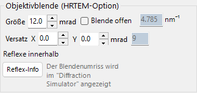

Cs, Cc, beta, delta-E, PCTF, räumliche/zeitliche Kohärenz-Hüllkurven, Objektivblende.

#### Size

Größe der Objektivblende in mrad. Aktivieren Sie **Open aperture**, um die Blende zu entfernen. Die Anzahl der in die Bloch-Wellen-Berechnung einbezogenen Beugungspunkte hängt von der Blende ab; das Maximum wird durch den Wert **Max Bloch waves** in **Simulation property** begrenzt.

#### Shift

Horizontale Verschiebung der Blende in mrad — dient zur Nachbildung einer versetzten Objektivblende im HRTEM.

#### Spot info

Öffnet die detaillierte Reflexliste (Intensität, komplexe Amplitude usw.) für die durch die Blende tretenden Reflexe. Praktisch, wenn der Beugungssimulator zum Vergleich ebenfalls geöffnet ist.

### STEM options (optical)

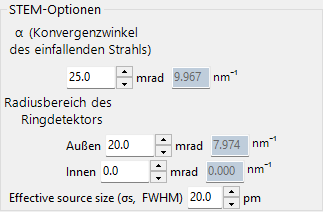

#### Convergence semi-angle

Halbwinkel der konvergenten Sonde (mrad). Steuert die Größe der STEM-Sonde und die räumliche Auflösung des simulierten Bildes.

#### Detector geometry

Innere/äußere Sammelwinkel des Ringdetektors (mrad). Wählen Sie zwischen BF (kleiner innerer Winkel), ABF, LAADF, HAADF (großer innerer Winkel).

#### Scan area / step

Abtastbereich (Sichtfeld) und Pixelgröße für das STEM-Bild.

---

## Simulation property

### HRTEM options

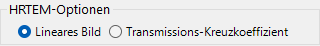

Max Bloch waves, Bildpixel/Auflösung, Teilkohärenz (quasi-coherent / TCC), Single/Serial-Modus.

#### Max Bloch waves

Maximale Anzahl der in der dynamischen Berechnung verwendeten Bloch-Wellen. Eine Erhöhung verbessert die Genauigkeit auf Kosten der Lösungszeit für die Eigenwerte von *O*(*N*³).

#### Image property (pixels & resolution)

Pixelabmessungen und Abtastauflösung des simulierten Bildes. Eine höhere Auflösung ergibt ein feineres Streifenmuster, aber eine proportional längere FFT-Zeit pro Schicht.

#### Partial-coherent model

Wie die Welleninterferenz behandelt wird, wenn die Beiträge aus allen Richtungen des einfallenden Strahls kombiniert werden.

- **Quasi-coherent** — schnelles, näherndes Modell, das die Phasenkontrast-Transferfunktion mit den Hüllkurven der räumlichen und zeitlichen Kohärenz multipliziert.
- **Transmission cross coefficient (TCC)** — genaueres Modell, das über den vollständigen Transmissions-Kreuzkoeffizienten integriert. Langsamer, aber exakt im Regime der linearen Abbildung.

Siehe [Anhang A3.2 — HRTEM-Bildentstehung](../appendix/a3-bloch-wave/hrtem.md).

#### Single / Serial mode

- **Single image** — simuliert ein einzelnes Bild bei der in **Sample property** eingestellten Dicke und dem in **Optical property** eingestellten Defokus.
- **Serial image** — erzeugt eine Dicke-×-Defokus-Matrix gemäß **Start / Step / Num** für jeweils beide. Nützlich, um die am besten passende Bedingung im Vergleich zu einem experimentellen Bild zu finden.

### STEM options (simulation)

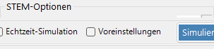

- **Bloch wave count** — gleiche Rolle wie bei HRTEM, angewendet pro Sondenposition.
- **Angular resolution** — Anzahl der Stützstellen bei der Integration über die Sondenrichtung.
- **TDS treatment** — ob die thermisch-diffuse Streuung über Temperaturfaktoren *B* einbezogen wird. Für LAADF/HAADF erforderlich.

### Potential options

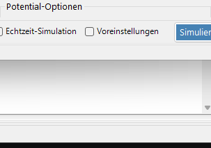

Wird angezeigt, wenn **Image mode = Potential**.

- **Target potential** — wählen Sie **U_g** (elastisch) oder **U′_g** (Absorption / TDS).
- **Display method** — **Magnitude and phase** oder **Real and imaginary part**.

### Image properties

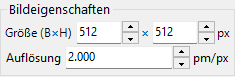

### Diffracted waves

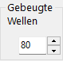

---

## Simulate

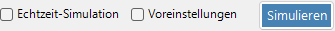

---

## Display settings

### Adjust

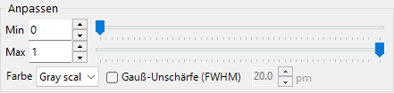

Min-/Max-Helligkeit, Farbskala, Gauß-Unschärfe.

### Normalization

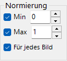

### Display

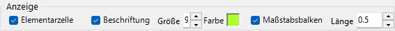

Beschriftung (Dicke/Defokus), Maßstabsbalken, Elementarzellen-Überlagerung.

### STEM image

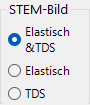

---

## STEM-Simulation

Die Berechnung hängt ab von: Konvergenzwinkel, Bloch-Wellen-Anzahl, Winkelauflösung.

| Detektor | Beitrag |
|----------|-------------|
| BF, ABF | Elastisch |
| LAADF, HAADF | Inelastisch (TDS) |

> Setzen Sie die Temperaturfaktoren ungleich null für TDS (B = 0.5 Ų im Zweifelsfall). HAADF-Intensität $\propto Z^2$.

Ein ausführlicherer Bericht ist als PDF verfügbar: [Vergleich von STEM-Simulationen mit Dr. Probe GUI (v1.10) und ReciPro (v4.854)](https://github.com/seto77/ReciPro/files/10976084/ComparisonSTEMsimulations.pdf). Einzelheiten finden Sie unter [STEM-Simulation](2-stem-simulation.md).

---

## Siehe auch

- [HRTEM-Simulation](1-hrtem-simulation.md)
- [STEM-Simulation](2-stem-simulation.md)
- [Potential-Simulation](3-potential-simulation.md)
- [Dynamische Beugung (Bloch-Welle)](../appendix/a3-bloch-wave/index.md)
- [Beugungssimulator](../7-diffraction-simulator/index.md)
- [Elektronenbahnen](../8-electron-trajectory.md)
