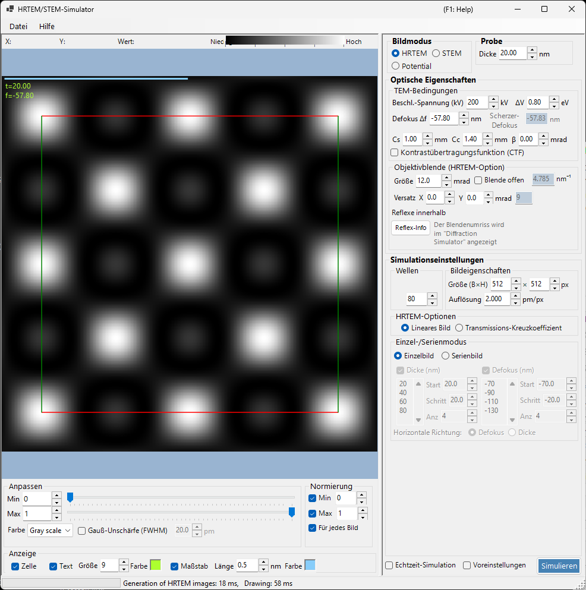
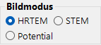
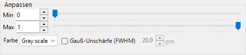
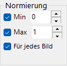
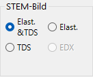
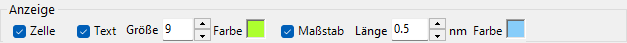
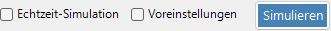
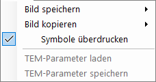
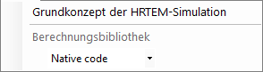

# HRTEM / STEM Simulator

Der **HRTEM/STEM-Simulator** simuliert TEM-Gitterstreifenbilder (HRTEM), STEM-Bilder und projizierte Kristallpotentiale für den ausgewählten Kristall und seine Orientierung. Klicken Sie auf **Simulieren**, um die Berechnung zu starten.

Das Fenster ist in zwei Hälften geteilt. Die **linke Seite** zeigt das Simulationsergebnis und steuert dessen Darstellung (Bildbereiche, Helligkeit, Farbe, Maßstabsbalken usw.); die **rechte Seite** enthält die Berechnungsbedingungen (**Optische Eigenschaften** und **Simulationseinstellungen**).

---

## Diese Seite und die Modusseiten

- **Diese Seite (Übersicht)**: die Bedienvorgänge, die allen Modi gemeinsam sind, zusammen mit den **Steuerelementen zur Anzeige und Anpassung des Ergebnisses auf der linken Seite**.
- **Modusseiten**: alle Einstellungen, die im jeweiligen Modus auf der **rechten Seite** erscheinen, so beschrieben, dass jede Seite für sich allein verständlich ist (einige Einstellungen erscheinen daher auf mehreren Seiten).

| Modus | Inhalt | Seite |
|------|----------|------|
| **HRTEM** | Hochauflösende TEM-Gitterstreifenbilder | [HRTEM-Simulation](1-hrtem-simulation.md) |
| **STEM** | Bilder der Raster-Transmissionselektronenmikroskopie (BF / ABF / LAADF / HAADF) | [STEM-Simulation](2-stem-simulation.md) |
| **Potential** | Projiziertes Kristallpotential ($U_g$ / $U'_g$) | [Potential-Simulation](3-potential-simulation.md) |

---

## Tastatur- & Maus-Kurzbefehle

Die Ergebnisse werden als ein oder mehrere Bildbereiche angezeigt. Sie verwenden die Standard-[Bildansicht-Navigation](../21-shortcuts.md) von ReciPro, und alle Bereiche werden gemeinsam verschoben und gezoomt.

| Kurzbefehl | Aktion |
|----------|--------|
| <kbd>F1</kbd> | Diese Seite des Online-Handbuchs öffnen |
| <kbd>CTRL</kbd>+<kbd>C</kbd> (Bildraster fokussiert) | Das/die Bild(er) als Metafile in die Zwischenablage kopieren |
| Linke Maustaste ziehen / mittlere Maustaste ziehen | Bild verschieben (alle Bereiche bewegen sich gemeinsam) |
| Mausrad nach oben / unten | Hinein- (×2) / Herauszoomen (×0.5) an der Cursorposition |
| Mit rechter Maustaste ein Rechteck ziehen | In den ausgewählten Bereich hineinzoomen |
| Rechtsklick / Rechter Doppelklick | Herauszoomen (×0.5) |
| <kbd>CTRL</kbd> + mit rechter Maustaste ein Rechteck ziehen | Einen rechteckigen Bereich auswählen |
| Linker Doppelklick auf einen Bereich | Diesen Bereich maximieren / das Raster wiederherstellen (Mehrbereich-Layouts) |
| Maus bewegen (ohne Taste) | Position (pm) und Pixelwert an der Cursorposition ablesen |

→ Siehe **[21. Tastatur- & Maus-Kurzbefehle](../21-shortcuts.md)** für einen Überblick über jedes Fenster.

---

## Schnellwege nach Ziel

| Ziel | Ausgangspunkt | Referenz |
|------|------------|-----------|
| Ein HRTEM-Bild berechnen | **Bildmodus** auf **HRTEM** setzen, dann Beschleunigungsspannung und Defokus in **TEM-Bedingungen** einstellen | [HRTEM-Simulation](1-hrtem-simulation.md), [HRTEM-Bildentstehung](../appendix/a3-bloch-wave/hrtem.md) |
| Ein STEM-Bild berechnen | **Bildmodus** auf **STEM** setzen, dann Konvergenzwinkel und Detektor in **STEM-Optionen** einstellen | [STEM-Simulation](2-stem-simulation.md), [STEM-Berechnung](../appendix/a3-bloch-wave/stem.md) |
| Projiziertes Potential ansehen | **Bildmodus** auf **Potential** setzen | [Potential-Simulation](3-potential-simulation.md) |
| Eine Dicken-/Defokus-Serie erzeugen | Im HRTEM-Modus den **Einzel-/Serienmodus** und die Bildbedingungen konfigurieren | [HRTEM-Simulation](1-hrtem-simulation.md) |
| HAADF-STEM mit TDS verwenden | Atomare Temperaturfaktoren ungleich null setzen und den STEM-Detektor auf LAADF / HAADF stellen | [STEM-Berechnung](../appendix/a3-bloch-wave/stem.md) |

---

## Grundlegender Arbeitsablauf

1. Wählen Sie Kristall und Orientierung im Hauptfenster aus und öffnen Sie dann dieses Fenster.
2. Wählen Sie HRTEM, STEM oder Potential im **Bildmodus**.
3. Stellen Sie Beschleunigungsspannung, Defokus, Aberrationen, Blende, STEM-Konvergenzwinkel usw. in **Optische Eigenschaften** ein (siehe die Modusseiten).
4. Stellen Sie Dicke, Bildgröße, Auflösung, Bloch-Wellen-Anzahl, Teilkohärenzmodell usw. in **Simulationseinstellungen** ein (siehe die Modusseiten).
5. Klicken Sie auf **Simulieren** und passen Sie die Darstellung bei Bedarf links mit **Anpassen**, **Normierung** und **Anzeige** an.

---

## Auswahl des Bildmodus

{ align=left }

Der **Bildmodus** oben rechts wählt die Art der Berechnung. Die Bereiche auf der rechten Seite (**Optische Eigenschaften** und **Simulationseinstellungen**) passen sich dem gewählten Modus an.

- **HRTEM** — hochauflösende TEM-Gitterstreifenbilder → [HRTEM-Simulation](1-hrtem-simulation.md)
- **STEM** — Bilder der Raster-Transmissionselektronenmikroskopie → [STEM-Simulation](2-stem-simulation.md)
- **Potential** — projiziertes Kristallpotential → [Potential-Simulation](3-potential-simulation.md)

---

## Bildbereich (linke Seite)

Die linke Hälfte des Fensters zeigt das simulierte Bild. Die Statusleiste am oberen Rand meldet die Cursorposition (**X:**, **Y:**) und den Bildwert **Wert:** (Intensität) unter dem Cursor, neben einer Intensitätsskala **Niedrig → Hoch**, die die aktuelle Farbskala und den Helligkeitsbereich widerspiegelt.

Werden mehrere Bilder erzeugt (ein Serienbild oder Betrag/Phase eines Potentials), werden sie in einem Raster angeordnet, und alle Bereiche werden gemeinsam gezoomt und verschoben.

---

## Anzeige und Anpassung der Ergebnisse (linker Bereich) {#display-settings}

Der Bereich unten links passt die Darstellung des Ergebnisses an — Helligkeit, Farbe, Normierung und Überlagerungen. Diese Einstellungen gelten für alle Modi und wirken ohne Neuberechnung.

### Anpassen

- **Min** / **Max** : unteres (schwarzes) und oberes (weißes) Ende des angezeigten Intensitätsbereichs. Mit den Schiebereglern wird der Kontrast eingestellt.
- **Farbe** : Farbskala des Bildes — **Gray scale** (Graustufen) oder **Cold-Warm** (blau bis rot).
- **Gauß-Unschärfe (FWHM)** : wenn aktiviert, wird eine Gaußsche Unschärfe mit der rechts angegebenen Halbwertsbreite (pm) angewendet, die eine endliche Auflösung (Punktspreizfunktion) nachbildet.

### Normierung

- **Für jedes Bild** : wenn aktiviert, wird jedes Bild einzeln normiert (wenn deaktiviert, teilt sich die gesamte Serie eine gemeinsame Skala).
- **Min** / **Max** : legt das untere / obere Ende der Normierung auf den rechts angegebenen Wert fest, statt auf das Minimum / Maximum des Bildes.

### STEM-Bild

Nur im STEM-Modus sichtbar. Wählt, welche Streukomponente des berechneten STEM-Bildes angezeigt wird (**Elast.**, **TDS** oder **Elast. & TDS**). Wurden im selben Lauf auch [STEM-EDX-Elementverteilungen](2-stem-simulation.md#stem-edx) berechnet, steht **EDX** als vierte Option zur Verfügung. Da diese Einstellung STEM-spezifisch ist, wird sie auch auf der Seite [STEM-Simulation](2-stem-simulation.md) beschrieben.

### Anzeige

Legt fest, welche Elemente über das Bild gelegt werden.

- **Zelle** : blendet den Umriss der projizierten Elementarzelle ein, sodass sich der Bildkontrast dem Kristallgitter zuordnen lässt.
- **Text** : blendet Beschriftungen wie Dicke, Defokus und Indizes ein. **Größe** (Schriftgröße) und **Farbe** lassen sich festlegen.
- **Maßstab** : blendet einen Maßstabsbalken ein. **Länge** (nm) und **Farbe** lassen sich festlegen.

---

## Ausführen der Simulation

- **Simulieren** : führt die Berechnung mit dem aktuellen Kristall, den Mikroskopbedingungen, der Dicke, dem Defokus und den Anzeigeeinstellungen aus.
- **Stopp** : bricht die laufende Berechnung ab (nur während der Berechnung sichtbar).
- **Echtzeit-Simulation** : wenn aktiviert, wird beim Drehen des Kristalls sofort neu berechnet (im STEM-Modus ausgeblendet).
- **Voreinstellungen** : blendet das Voreinstellungsfenster ein oder aus, in dem TEM-Abbildungsbedingungen gespeichert und wieder aufgerufen werden.

---

## Menü Datei

- **Bild speichern** : speichert **als Bild (PNG-Format)**, **als Bild (TIFF-Format)** oder **als Metadatei (EMF)**. **Einzeln speichern im Serienbildmodus** schreibt die Bilder eines Serienlaufs einzeln.
- **Bild kopieren** : kopiert in die Zwischenablage **als Bild** oder **als Metadatei (EMF)**.
- **Symbole überdrucken** : brennt Elementarzelle, Beschriftungen und Maßstabsbalken in das gespeicherte Bild ein.
- **TEM-Parameter laden** / **TEM-Parameter speichern** : speichert die optischen Bedingungen (Beschleunigungsspannung, Aberrationen usw.) in einer Datei und stellt sie wieder her.

## Menü Hilfe

- **Grundkonzept der HRTEM-Simulation** : öffnet die Erläuterung der HRTEM-Bildentstehung ([Anhang A3.2](../appendix/a3-bloch-wave/hrtem.md)).
- **Berechnungsbibliothek** : wählt die Berechnungsbibliothek — **Native code** (schnelles C++/Eigen) oder **Managed code** (.NET). Native ist normalerweise schneller.

---

## Siehe auch

- [HRTEM-Simulation](1-hrtem-simulation.md)
- [STEM-Simulation](2-stem-simulation.md)
- [Potential-Simulation](3-potential-simulation.md)
- [Dynamische Beugung (Bloch-Welle)](../appendix/a3-bloch-wave/index.md)
- [Beugungssimulator](../7-diffraction-simulator/index.md)
- [Elektronenbahnen](../8-electron-trajectory.md)
