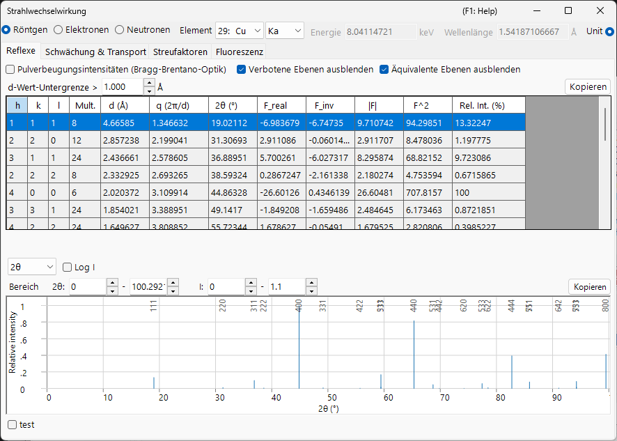

# Anhang A2. Strahl-Wechselwirkung (festkörperphysikalischer Hintergrund)

Das Kapitel zum Hauptfenster [3. Beam interaction](../../3-beam-interaction.md) ist eine Anleitung zur GUI: Es erklärt, welche Schaltflächen zu drücken sind und was jede Spalte bedeutet. Dieser Anhang versammelt die **Festkörper- und Streuphysik** hinter diesen Zahlen — warum ein Atom Röntgenstrahlen, Elektronen und Neutronen so unterschiedlich streut, woher der Strukturfaktor und sein Imaginärteil kommen, wie ein Strahl in einem Festkörper abgeschwächt und verlangsamt wird, und was die Fluoreszenz-Vorschau darstellt und was nicht.

Das Fenster hat vier Registerkarten, und die Theorie liest sich am besten in der Reihenfolge, in der eine Größe in die nächste einfließt:

1. **[Atomic scattering factors](scattering-factor.md)** — wie ein *einzelnes Atom* jede Art von Strahl streut.
2. **[Structure factor](structure-factor.md)** — wie die Atome in einer *Elementarzelle* interferieren, einschließlich des Debye–Waller-Faktors und der Auslöschungsregeln.
3. **[Attenuation & transport](attenuation-transport.md)** — wie der Strahl beim Durchlaufen des Materials *entfernt und verlangsamt* wird.
4. **[Fluorescence](fluorescence.md)** — die charakteristische Röntgenemission, die der Ionisation einer inneren Schale folgt.

---

## Streugeometrie und die Variable $s$

Jede Streugröße in diesem Fenster ist eine Funktion davon, wie stark sich die Strahlrichtung ändert. Schreibt man $\mathbf k_i$ und $\mathbf k_s$ für die einfallenden und gestreuten Wellenvektoren (elastisch, also $|\mathbf k_i|=|\mathbf k_s|=1/\lambda$), so sind der **Streuvektor** und sein Betrag

$$\mathbf Q = 2\pi(\mathbf k_s - \mathbf k_i), \qquad Q = |\mathbf Q| = \frac{4\pi\sin\theta}{\lambda} = 4\pi s .$$

- $\theta$ : der Bragg-Winkel — die *Hälfte* des gesamten Streuwinkels. Die Reflextabelle führt den vollen Winkel $2\theta$ auf.
- $s = \dfrac{\sin\theta}{\lambda}$ (Å⁻¹) : die Variable, gegen die die Registerkarte **Scattering factors** aufgetragen wird. Sie ist das natürliche Argument jedes Atomformfaktors.
- $d$ : der Netzebenenabstand. Bei der Bragg-Bedingung $\lambda = 2d\sin\theta$ gilt $s = \dfrac{1}{2d} = \dfrac{|\mathbf g|}{2}$, wobei $\mathbf g$ der reziproke Gittervektor mit $|\mathbf g| = 1/d$ ist.

Diese drei Konventionen beschreiben dieselbe Geometrie; nur die Skala unterscheidet sich. Es lohnt sich, die Entsprechung klar zu halten, da das Fenster mehr als eine davon verwendet:

| Im Fenster | Symbol | Beziehung |
|---|---|---|
| Reflextabelle | $q = 2\pi/d$ | $q = 2\pi\lvert\mathbf g\rvert = Q = 4\pi s$ |
| Reflextabelle | $2\theta$ | voller Streuwinkel, $\sin\theta = \lambda s$ |
| Registerkarte Scattering factors | $s = \sin\theta/\lambda$ | $s = q/4\pi = 1/(2d)$ |
| Beugungspeak-Diagramm | $Q = 4\pi\sin\theta/\lambda$ | $Q = q = 4\pi s$ |

!!! note "Einheiten"
    Die veröffentlichten Parametrisierungen der Formfaktoren verwenden $s$ in Å⁻¹ (also $s^2$ in Å⁻²), während ReciPro intern $s^2$ in nm⁻² führt. Die beiden unterscheiden sich um einen Faktor $100$ in $s^2$; die Kurven und Tabellen werden in den Einheiten dargestellt, die in der Kopfzeile jeder Tabelle angegeben sind. Ein Modell — **Kirkland** — ist gegen $q = 2s = 1/d$ statt gegen $s$ tabelliert; siehe [Atomic scattering factors](scattering-factor.md).

### Bragg, Laue und die Ewald-Kugel {#phase-convention}

Die Bragg-Bedingung ist eine Facette einer einzigen geometrischen Anforderung. Konstruktive Interferenz (die **Laue-Bedingung**) verlangt, dass der Streuvektor gleich einem reziproken Gittervektor ist,

$$\mathbf k_s = \mathbf k_i + \mathbf g, \qquad |\mathbf k_i + \mathbf g|^2 = |\mathbf k_i|^2 ,$$

was sich mit $|\mathbf k_i|=|\mathbf k_s|=1/\lambda$ reduziert auf

$$2\,\mathbf k_i\cdot\mathbf g + |\mathbf g|^2 = 0 \qquad\Longleftrightarrow\qquad |\mathbf g| = \frac{1}{d} = \frac{2\sin\theta}{\lambda},$$

d. h. das **Bragg'sche Gesetz** $\lambda = 2d\sin\theta$. Geometrisch ist dies die **Ewald-Kugel**-Konstruktion: ein Reflex wird angeregt, wenn sein reziproker Gitterpunkt auf der Kugel mit Radius $1/\lambda$ liegt. (Hier ist $\mathbf g$ in Einheiten von $1/d$, also $\mathbf Q = 2\pi\mathbf g$.)

---

## Phasenkonvention

ReciPro bildet Strukturfaktoren mit der kristallographischen Phasenkonvention

$$F_{\mathbf g} = \sum_j \dots \exp\!\left(-2\pi i\,\mathbf g\cdot\mathbf r_j\right),$$

d. h. einem **Minus**-Zeichen im Exponenten. Diese Wahl legt das Vorzeichen des Imaginärteils des Strukturfaktors (`F_inv` in der Reflextabelle) fest sowie die Beziehung zwischen Friedel-Paaren, sobald die anomale Dispersion eingeschaltet ist. Sie wird hier einmal festgelegt und im gesamten Anhang vorausgesetzt; die Konsequenzen werden in [Structure factor](structure-factor.md) ausgearbeitet.

---

## Kinematische vs. dynamische Streuung

Dieser Anhang behandelt **Einfach- (kinematische) Streuung**: der einfallende Strahl wird einmal gestreut, und die gebeugte Amplitude ist der Strukturfaktor der nächsten Seite. Das ist das richtige Bild, wenn die Wechselwirkung schwach ist — Röntgenstrahlen und Neutronen in fast allen Proben, und Elektronen in *sehr dünnen* Präparaten.

Wenn die Wechselwirkung stark ist — Elektronen in allen außer den dünnsten Kristallen — wird der Strahl vielfach gestreut, bevor er austritt, die Intensität wird unter den Reflexen umverteilt, und $\lvert F\rvert^2$ liefert nicht mehr die gemessene Intensität. Dieses Regime erfordert die **dynamische** Theorie aus [Appendix A3](../a3-bloch-wave/index.md). Die hier hergeleiteten Streufaktoren und Strukturfaktoren sind die *Eingabe* für beide Bilder.

Selbst im kinematischen Grenzfall ist die gebeugte Amplitude nicht allein der Strukturfaktor: das Aufsummieren der gestreuten Welle durch eine Platte der Dicke $t$ ergibt

$$A_{\mathbf g}(t) \;\propto\; F_{\mathbf g}\int_0^t e^{\,2\pi i S_{\mathbf g} z}\,dz = F_{\mathbf g}\, t\, e^{\,\pi i S_{\mathbf g} t}\,\operatorname{sinc}(\pi S_{\mathbf g} t),$$

wobei $S_{\mathbf g}$ der **Anregungsfehler** ist — der Abstand des reziproken Gitterpunkts von der Ewald-Kugel. Die Intensität erreicht ihr scharfes Maximum bei $S_{\mathbf g}=0$ und oszilliert mit der Dicke (der Ursprung der Dickenstreifen); die dynamische Theorie aus [Appendix A3](../a3-bloch-wave/index.md) ersetzt dieses Einstrahlergebnis durch ein gekoppeltes Mehrstrahlverhalten.

---

## Die drei Sonden im Überblick

| | Röntgen | Elektron | Neutron |
|---|---|---|---|
| Wechselwirkt mit | Elektronendichte $\rho_e$ | elektrostatischem Potential $V$ | Kernen (und ungepaarten Spins) |
| Wechselwirkungsstärke | schwach | stark | sehr schwach |
| Typische Eindringtiefe | µm – mm | nm – µm | mm – cm |
| Einfachstreuung gültig? | fast immer | nur dünne Folien | fast immer |
| Empfindlichkeit für leichte Atome | gering ($\propto Z$) | mäßig | oft ausgezeichnet |

Diese Gegensätze kehren auf den folgenden Seiten immer wieder, jeder zurückführbar auf den Streumechanismus in [Atomic scattering factors](scattering-factor.md).

---

## Siehe auch

- [3. Beam interaction](../../3-beam-interaction.md) — die GUI, die dieser Anhang erklärt.
- [Atomic scattering factors](scattering-factor.md) · [Structure factor](structure-factor.md) · [Attenuation & transport](attenuation-transport.md) · [Fluorescence](fluorescence.md)
- [Appendix A1. Coordinate systems](../a1-coordinate-system/1-orientation.md)
- [Appendix A3. Dynamical diffraction (Bloch-wave method)](../a3-bloch-wave/index.md) — die Mehrfachstreutheorie, die diese Streufaktoren verwendet.
