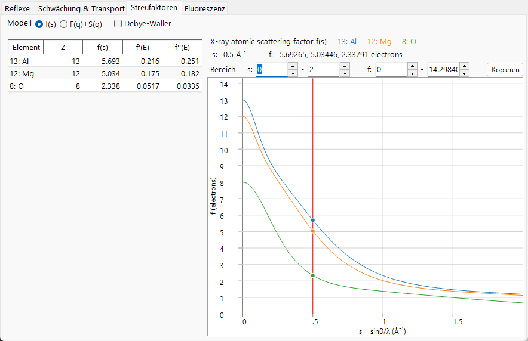
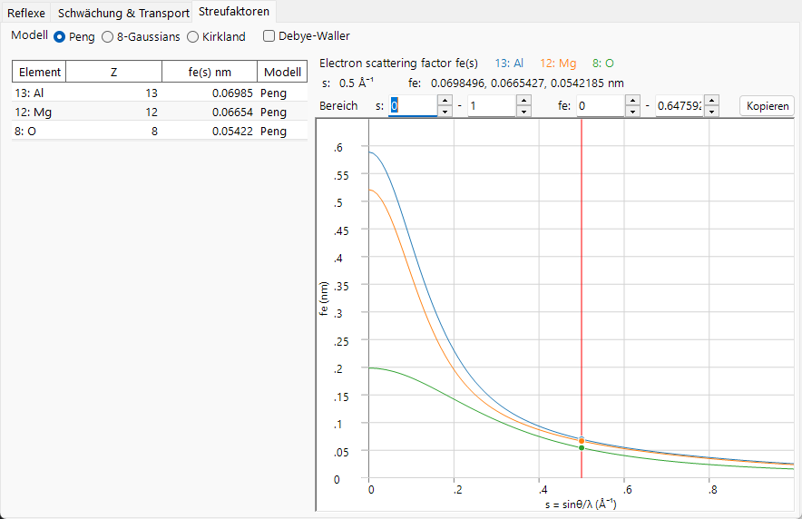
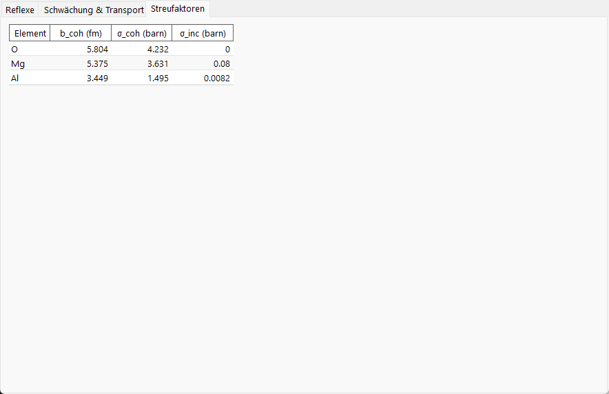

# Atomformfaktoren

Der **Atomformfaktor** (oder *Streufaktor*) misst, wie stark ein einzelnes Atom den einfallenden Strahl als Funktion der Streuvariablen $s=\sin\theta/\lambda$ streut. Die drei Strahlungsarten wechselwirken mit völlig unterschiedlichen Teilen des Atoms, sodass ihre Streufaktoren unterschiedliche Größenordnungen, Einheiten und Winkelabhängigkeiten aufweisen. Dies ist der wichtigste Grund dafür, dass die Registerkarte **Scattering factors** zwischen Röntgen-, Elektronen- und Neutronenstrahl so unterschiedlich aussieht.

=== "X-ray"
    

=== "Electron"
    

=== "Neutron"
    

---

## Röntgenstrahlen — Streuung an der Elektronenhülle

Röntgenstrahlen werden an den **Elektronen** des Atoms gestreut. Ein einzelnes freies Elektron streut mit dem klassischen differentiellen **Thomson**-Wirkungsquerschnitt, der durch den klassischen Elektronenradius $r_e = e^2/(4\pi\varepsilon_0 m_e c^2) \approx 2.82\times10^{-5}\ \text{Å}$ bestimmt ist:

$$\left(\frac{d\sigma}{d\Omega}\right)_e = r_e^2\,\frac{1+\cos^2 2\theta}{2}.$$

Die Elektronen des Atoms sind im Raum mit der Anzahldichte $\rho_e(\mathbf r)$ verteilt, und der Atomformfaktor ist die **Fourier-Transformierte** dieser Dichte. Der atomare Wirkungsquerschnitt ist dann der Einelektron-Wirkungsquerschnitt, skaliert mit $|f_0|^2$:

$$f_0(\mathbf Q) = \int \rho_e(\mathbf r)\, e^{\,i\mathbf Q\cdot\mathbf r}\, d^3r ,
\qquad
\left(\frac{d\sigma}{d\Omega}\right)_\text{atom} = r_e^2\,\frac{1+\cos^2 2\theta}{2}\,|f_0(s)|^2 .$$

- In Vorwärtsrichtung ($s\to 0$) streut jedes Elektron in Phase, sodass $f_0(0) = Z$, die Ordnungszahl. Der Faktor wird in **Elektroneneinheiten** ausgedrückt (Vielfache der Thomson-Amplitude — die zweite Gleichung oben macht dies explizit).
- Mit zunehmendem $s$ geraten die Streuanteile verschiedener Teile der Hülle außer Phase und $f_0(s)$ fällt ab. Eine diffuse (äußere, Valenz-)Elektronenverteilung lässt $f_0$ schnell abfallen; fest gebundene Rumpfelektronen tragen bis zu hohen $s$ bei.

In der Praxis wird $f_0(s)$ als Summe von Gaußfunktionen tabelliert (die analytische **Waasmaier–Kirfel**-Form, die ReciPro verwendet, eine Erweiterung der älteren Cromer–Mann-Tabellen),

$$f_0(s) = \sum_{i} a_i\, e^{-b_i s^2} + c ,$$

was ReciPro für die Kurve auswertet. Die Koeffizienten sind für $s$ in Å⁻¹ tabelliert, sodass jedes $b_i$ Einheiten von Ų hat; ReciPro führt $s^2$ intern in nm⁻² und wendet die im [Index](index.md) erwähnte Umrechnung mit dem Faktor 100 an.

### Anomale (resonante) Dispersion

Das Bild der Fourier-Transformation setzt voraus, dass die Elektronen wie frei streuen. Wenn sich die Photonenenergie einer **Absorptionskante** nähert, reagieren die gebundenen Elektronen resonant und es treten zwei energieabhängige Korrekturterme auf:

$$f(s,E) = f_0(s) + f'(E) + i\,f''(E) \qquad \text{(textbook, } e^{+i\phi}\ \text{convention).}$$

- $f'(E)$ : reelle Dispersionskorrektur (verringert die effektive Elektronenzahl nahe einer Kante).
- $f''(E)$ : Imaginärteil, am größten direkt oberhalb einer Kante.
- Die beiden sind durch die **Kramers–Kronig**-Relationen verknüpft, sodass ein Peak in der Absorption ($f''$) von einer dispersiven Auslenkung in $f'$ begleitet wird.

Dies sind keine freien Parameter. Die Kausalität (Kramers–Kronig) koppelt $f'$ an $f''$, und das **optische Theorem** koppelt $f''$ direkt an den Photoabsorptions-Wirkungsquerschnitt:

$$f'(E) = \frac{2}{\pi}\,\mathcal{P}\!\!\int_0^\infty \frac{E'\,f''(E')}{E'^2 - E^2}\,dE',
\qquad
f''(E) = \frac{\sigma_\text{abs}(E)}{2\,r_e\,\lambda}.$$

Hier ist $\sigma_\text{abs}$ im Wesentlichen der **Photoabsorptions**-Anteil der Abschwächung (nicht die Rayleigh-/Compton-Terme) — dieselbe Kantenstruktur, die auf der Seite [Abschwächung & Transport](attenuation-transport.md) zu sehen ist.

ReciPro wertet $f'$ und $f''$ bei der aktuellen Energie mit der mitgelieferten **xraylib**-Bibliothek aus und listet sie in der Tabelle auf (mit $f'' > 0$). Zwei Vorzeichenpunkte sind wichtig. Erstens liefert xraylib $F_{ii}$ mit dem entgegengesetzten Vorzeichen zur kristallographischen Konvention, sodass ReciPro es negiert, um ein **positives $f''$** anzugeben. Zweitens ist unter ReciPros Phasenkonvention $\exp(-2\pi i\,\mathbf g\cdot\mathbf r)$ der komplexe Faktor, der tatsächlich in den Strukturfaktor eingeht, $f_0 + f' - i f''$ — das oben geschriebene $+i f''$ gehört zur entgegengesetzten ($e^{+2\pi i}$) Konvention. Deshalb wird `F_inv` (der Imaginärteil des Strukturfaktors) nahe einer Kante von null verschieden — siehe [Strukturfaktor](structure-factor.md).

---

## Elektronen — Streuung am elektrostatischen Potential

Ein schnelles Elektron ist geladen, daher wird es am **elektrostatischen Potential** $V(\mathbf r)$ des Atoms gestreut — der Kombination aus dem positiven Kern und der negativen Elektronenhülle. Der Elektronenstreufaktor $f_e$ ist daher die Fourier-Transformierte des Potentials, was ihn über die Poisson-Gleichung mit dem Röntgenfaktor verknüpft. Das Ergebnis ist die **Mott–Bethe-Relation**:

$$f_e(s) = C_\text{MB}\,\frac{Z - f_0(s)}{s^2} \;\;\propto\; \frac{Z - f_X(Q)}{Q^2}.$$

Der Vorfaktor $C_\text{MB}$ ist aus Fundamentalkonstanten aufgebaut und hängt vom Einheitensystem sowie davon ab, ob $s$ oder $Q$ verwendet wird. ReciPro wertet diese Relation nicht direkt aus — es verwendet die unten angegebenen angepassten Peng-/Kirkland-/8-Gauß-Formen — sie wird hier daher eher zum physikalischen Verständnis als zur Berechnung angegeben. Ausgeschrieben mit den Konstanten (für $s$ und $f_e$ in Å),

$$f_e(s)\,[\text{Å}] = \frac{m_e e^2}{8\pi\varepsilon_0 h^2}\,\frac{Z - f_0(s)}{s^2} \simeq 0.023934\,\frac{Z - f_0(s)}{s^2}, \qquad s\ \text{in Å}^{-1},$$

mit einem zusätzlichen $\times 0.1$, wenn ReciPro $f_e$ in nm angibt, und einem zusätzlichen relativistischen $\gamma$-Faktor (unten) im dynamischen Potential.

Die Physik steckt im Zähler $Z - f_0$: Das Elektron sieht die **Differenz** zwischen der Kernladung $Z$ und der abschirmenden Elektronenhülle $f_0$, d. h. das effektive atomare Potential.

- **Größenordnung.** Aufgrund des Faktors $1/s^2$ ist $f_e$ stark zu kleinen Winkeln hin gepeakt und weit größer (in seinen eigenen Einheiten) und stärker vorwärtsgerichtet als $f_0$. Deshalb wird die Elektronenbeugung von niedrig indizierten Reflexen dominiert und deshalb ist die dynamische (Mehrfach-)Streuung relevant — siehe [Anhang A3](../a3-bloch-wave/index.md).
- **Kleinwinkel-Grenzfall.** Für ein *neutrales* Atom gehen sowohl $Z-f_0\to 0$ als auch $s^2\to 0$, sodass $f_e(0)$ endlich ist (ein $0/0$-Grenzwert, der durch den mittleren quadratischen Atomradius festgelegt wird). Für ein **Ion** hebt die Hülle $Z$ nicht mehr auf, und der langreichweitige Coulomb-Ausläufer lässt $f_e$ für $s\to 0$ divergieren; tabellierte ionische Elektronenfaktoren müssen bei den kleinsten Winkeln mit Vorsicht behandelt werden.
- **Relativistische Korrektur.** Bei TEM-Energien sind Elektronenmasse und Wellenlänge relativistisch. Die Wellenlänge verwendet die relativistische Form $\lambda = h/\sqrt{2 m_0 e U\,(1 + e U/2 m_0 c^2)}$, und das Wechselwirkungspotential trägt den relativistischen Faktor $\gamma = 1 + eU/m_0c^2$. ReciPro wendet diese Korrektur beim Bilden des dynamischen Potentials an.

ReciPro bietet drei Parametrisierungen von $f_e(s)$:

- **Peng** : eine Fünf-Gauß-Anpassung, $f_e(s)=\sum_i a_i e^{-b_i s^2}$, praktisch und weit verbreitet für die elastische Elektronenstreuung.
- **Kirkland** : eine gemischte Lorentz- + Gauß-Anpassung, $f_e(q)=\sum_i \dfrac{a_i}{q^2+b_i} + \sum_i c_i\,e^{-d_i q^2}$. **Ihre unabhängige Variable ist $q = 2s = 1/d$, nicht $s$** — eine häufige Quelle von Faktor-zwei-Fehlern beim Vergleich von Modellen ($q$ in Å⁻¹, mit den angepassten Koeffizienten $a_i,b_i,c_i,d_i$ in den entsprechenden Einheiten).
- **8-Gaussians** : eine Anpassung mit acht Termen, gültig über einen größeren $s$-Bereich.

**Auswahl eines Modells.** Alle drei passen denselben zugrunde liegenden $f_e(s)$ an und stimmen bei niedrigem $s$ eng überein; sie unterscheiden sich hauptsächlich im Bereich und darin, wie der Atomrumpf dargestellt wird. **Peng** (neutrale Atome und gängige Ionen, genau bis $s\approx2\text{–}6$ Å⁻¹) ist der übliche Standard für SAED-/CBED-Strukturfaktoren; **Kirkland** reicht mit einem Lorentz-Rumpfterm bis zu höheren $s$ und ist für HRTEM/STEM geeignet (beachte $q=2s$); **8-Gaussians** ist für Reflexe gedacht, die sehr hohe $s$ erreichen. Für ein leichtes Element sind die drei nahezu ununterscheidbar; die Unterschiede treten bei schweren Elementen bei großem Winkel auf.

---

## Neutronen — Streuung am Kern

Thermische Neutronen sind ungeladen und wechselwirken mit Materie hauptsächlich über die **starke Kernkraft**, deren Reichweite (Femtometer) gegenüber der Neutronenwellenlänge (Ångström) völlig vernachlässigbar ist. Die Wechselwirkung wird durch das **Fermi-Pseudopotential** dargestellt, eine Punktquelle, deren Stärke die Streulänge $b$ ist:

$$V(\mathbf r) = \frac{2\pi\hbar^2}{m_n}\,b\,\delta(\mathbf r)
\qquad\Longrightarrow\qquad
\frac{d\sigma}{d\Omega} = |b|^2 .$$

Da der Streuer punktförmig ist, ist $b$ **unabhängig von $s$** — es gibt keinen Formfaktor-Abfall, weshalb die Registerkarte **Scattering factors** für Neutronen keine Kurve zeichnet und stattdessen eine Tabelle der Streulängen zeigt.

- $b$ ist eine Eigenschaft des **Nuklids**, nicht der Elektronenkonfiguration. Sie variiert unregelmäßig von Element zu Element (und zwischen Isotopen), kann **negativ** sein (z. B. ¹H, Ti, Mn) und steht in keinem monotonen Zusammenhang mit $Z$. Dies ist die Grundlage des Neutronenkontrasts (leichte Atome nahe schweren, Isotopenmarkierung).
- **Kohärent vs. inkohärent.** Ein reales Element ist eine Mischung aus Isotopen und Kernspinzuständen mit unterschiedlichem $b$. Die Aufspaltung $b = \langle b\rangle + \delta b$ ergibt einen kohärenten Anteil (aus dem Mittelwert) und einen inkohärenten Anteil (aus der Streuung):

$$\sigma_\text{coh} = 4\pi\,|\langle b\rangle|^2, \qquad \sigma_\text{inc} = 4\pi\big(\langle |b|^2\rangle - |\langle b\rangle|^2\big), \qquad \sigma_s = \sigma_\text{coh} + \sigma_\text{inc}.$$

  Der kohärente Anteil erzeugt Bragg-Beugung (er ist das, was in den Strukturfaktor eingeht); der inkohärente Anteil ist ein flacher, isotroper Untergrund (groß für ¹H, der Grund für die Deuterierung).

!!! note "Tabellierte Werte"
    ReciPro liest $b_\text{coh}$ und die Wirkungsquerschnitte aus einer Nuklidtabelle, anstatt sie zu berechnen. Für resonante Nuklide muss das aufgelistete $\sigma_\text{coh}$ nicht gleich dem naiven $4\pi b^2$ sein, daher sind die Tabellenwerte maßgeblich. Magnetische Neutronenstreuung (an ungepaarten Elektronenspins, die *tatsächlich* einen $s$-abhängigen Formfaktor besitzt) wird hier nicht modelliert.

---

## Auf einen Blick

| | X-ray | Electron | Neutron |
|---|---|---|---|
| Gestreut durch | Elektronenhülle $\rho_e(\mathbf r)$ | elektrostatisches Potential $V(\mathbf r)$ | Kern (Punkt) |
| $s$-Abhängigkeit | fällt ab (FT der Hülle) | $\propto (Z-f_0)/s^2$, stark vorwärts | keine ($b$ konstant) |
| Vorwärtswert | $f_0(0)=Z$ | endlich (neutral) / divergent (Ion) | $b$ |
| Energieabhängigkeit | $f',f''$ nahe Kanten | relativistisch $\lambda,\gamma$ | $\sigma_\text{abs}\propto 1/v$ (nicht $b$) |
| Typische Größenordnung | $\propto Z$ | vorwärtsgepeakt, wächst mit $Z$ | unregelmäßig, kann $<0$ sein |

---

## Siehe auch

- [Index — Geometrie und die Variable $s$](index.md)
- [Strukturfaktor](structure-factor.md) — wie sich diese Faktoren über eine Elementarzelle kombinieren.
- [3. Strahl-Wechselwirkung → Registerkarte Scattering factors](../../3-beam-interaction.md#scattering-factors-tab)
