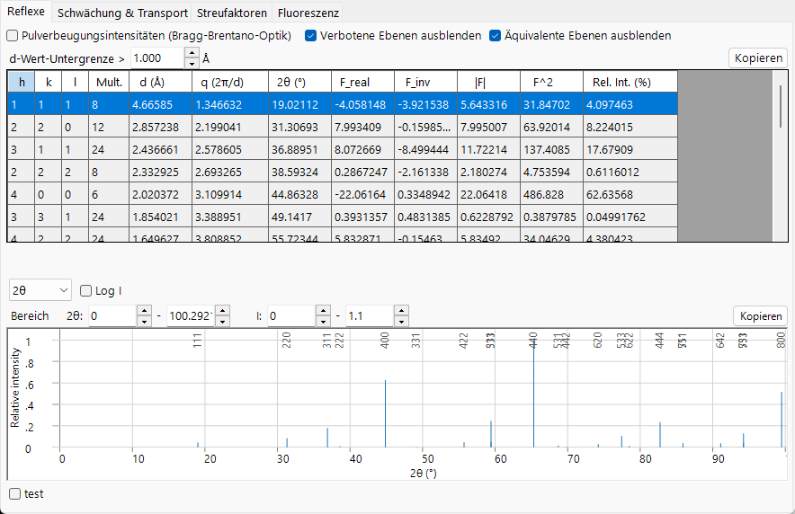
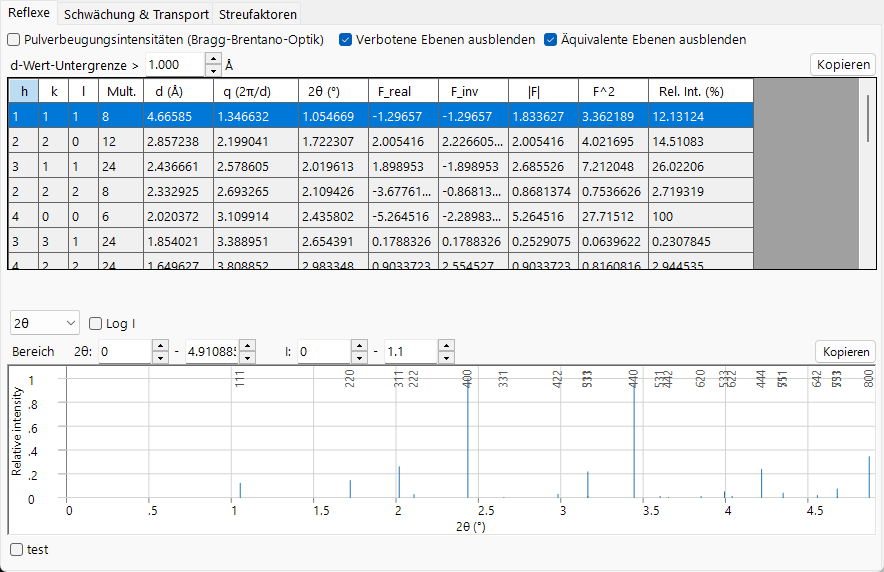
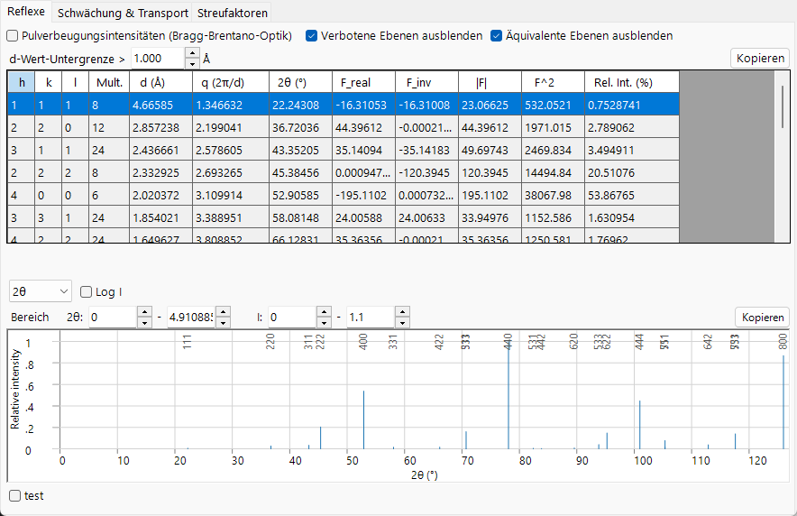

# Strukturfaktor

Der Atomformfaktor beschreibt ein einzelnes Atom; der **Strukturfaktor** beschreibt, wie alle Atome der Elementarzelle *gemeinsam* streuen. Es ist die Größe, die die Registerkarte **Reflexe** tabelliert (`F_real`, `F_inv`, $\lvert F\rvert$, $F^2$), und sie ist das Bindeglied zwischen der atomaren Physik der vorigen Seite und den gebeugten Intensitäten.

=== "X-ray"
    

=== "Electron"
    

=== "Neutron"
    

---

## Interferenz über die Elementarzelle

Der Strukturfaktor des Reflexes $\mathbf g = (hkl)$ ist die kohärente Summe der Atomformfaktoren, jeweils gewichtet mit der Phase aus der fraktionellen Position $\mathbf r_j = (x_j,y_j,z_j)$ des Atoms:

$$F_{\mathbf g} = \sum_{j} o_j\, f_j(s,E)\, T_j(\mathbf g)\, \exp\!\left(-2\pi i\,(h x_j + k y_j + l z_j)\right).$$

- $o_j$ : Besetzung des Platzes (**occupancy**, fraktionell, für teilweise oder gemischte Besetzung).
- $f_j(s,E)$ : der Atomformfaktor des Atoms $j$ für den aktuellen Strahl — $f_0+f'-if''$ für Röntgenstrahlen in ReciPros [Phasenkonvention](index.md#phase-convention), $f_e$ für Elektronen, $b$ für Neutronen.
- $T_j(\mathbf g)$ : der Debye-Waller-Faktor (siehe unten).
- Die $-2\pi i$ Phase folgt ReciPros [Konvention](index.md#phase-convention).

Die Intensität ist das Betragsquadrat,

$$I_{\mathbf g} \;\propto\; \lvert F_{\mathbf g}\rvert^2 = F_\text{real}^2 + F_\text{inv}^2 ,$$

was der Spalte $F^2$ der Tabelle entspricht. `F_real` und `F_inv` sind der Real- und der Imaginärteil des komplexen Strukturfaktors. Selbst bei rein reellen Atomformfaktoren ist $F_{\mathbf g}$ für eine nicht-zentrosymmetrische Struktur (oder einen verschobenen Ursprung) im Allgemeinen komplex; die anomale Dispersion bei Röntgenstrahlen (komplexes $f$) und komplexe Neutronenstreulängen fügen einen weiteren imaginären Beitrag hinzu. `F_inv` verschwindet für *jeden* Reflex nur dann, wenn die Struktur zentrosymmetrisch mit dem Ursprung in einem Symmetriezentrum ist und alle Faktoren reell sind.

---

## Der Debye-Waller-Faktor

Atome schwingen um ihre Gleichgewichtslagen, wodurch die Streudichte verschmiert und die Faktoren bei hohen Winkeln verringert werden. Für isotrope Bewegung gilt

$$T_j = \exp\!\left(-B_j\, s^2\right), \qquad B_j = 8\pi^2\langle u_j^2\rangle,$$

wobei $\langle u_j^2\rangle$ die mittlere quadratische Auslenkung entlang der Streurichtung ist und $B_j$ der isotrope Auslenkungsparameter (Ų) ist. Anisotrope Bewegung verallgemeinert dies zu

$$T_j = \exp\!\left(-2\pi^2\,\mathbf g^{\mathsf T}\!\mathbf U_j\,\mathbf g\right),$$

mit $\mathbf U_j$ als Auslenkungstensor und $\mathbf g$ als reziprokem Gittervektor ($|\mathbf g|=1/d$, nicht $Q=2\pi\lvert\mathbf g\rvert$). Für einen Debye-Festkörper ist die mittlere quadratische Auslenkung selbst eine Funktion der Temperatur $T$, der Atommasse $M$ und der Debye-Temperatur $\Theta_D$,

$$\langle u^2\rangle = \frac{3\hbar^2}{M k_B \Theta_D}\left[\frac14 + \left(\frac{T}{\Theta_D}\right)^2\!\int_0^{\Theta_D/T}\frac{x}{e^x-1}\,dx\right],$$

sodass $B$ mit der Temperatur ansteigt und für schwere Atome abnimmt. ReciPro verwendet die tabellierten oder eingegebenen $B_j$ direkt, anstatt diese zu berechnen. Da $T_j$ den Streufaktor multipliziert, kann die Registerkarte **Streufaktoren** dieselbe $e^{-Bs^2}$-Dämpfung auf die dargestellten Kurven anwenden. Die Dämpfung wächst mit der Temperatur und mit $s$, weshalb die thermisch diffuse Streuung (Intensität, die den kohärenten Bragg-Strahlen entzogen und in einen diffusen Untergrund umverteilt wird) das absorptive Potential in der dynamischen Theorie speist ([Anhang A3](../a3-bloch-wave/index.md)).

---

## Auslöschungen: systematisch vs. zufällig

Ein Reflex kann aus zwei verschiedenen Gründen **fehlen**:

- **Systematische (raumgruppenbedingte) Auslöschungen.** Gitterzentrierung und Symmetrieelemente mit einer translatorischen Komponente (Schraubenachsen, Gleitspiegelebenen) lassen ganze Klassen von Reflexen *exakt* verschwinden, für jeden Kristall dieser Raumgruppe, unabhängig vom atomaren Inhalt. Dies sind die Regeln hinter **Hide prohibited planes**.
- **Zufällige Beinahe-Auslöschungen.** Wenn sich die atomaren Beiträge für eine bestimmte Struktur zufällig aufheben, ist die Intensität klein, aber nicht symmetrieverboten, und sie kann wieder auftauchen, wenn sich die Zusammensetzung oder die Positionen ändern. Diese werden *nicht* durch die Auslöschungsregeln entfernt.

Eine systematische Auslöschung ist eine Phasenauslöschung zwischen den symmetrieverwandten Kopien der Zelle. Für Zentrierungstranslationen $\mathbf t_\alpha$ trägt der Strukturfaktor einen gemeinsamen Faktor

$$F_{\mathbf g} \propto \sum_\alpha e^{-2\pi i\,\mathbf g\cdot\mathbf t_\alpha},$$

der für bestimmte $hkl$ null ist. Für die Innenzentrierung ($\mathbf t = \tfrac12,\tfrac12,\tfrac12$),

$$1 + e^{-\pi i (h+k+l)} = 0 \quad\Longleftrightarrow\quad h+k+l \ \text{odd}.$$

Die häufigsten systematischen Auslöschungen sind:

| Symmetrieelement | Bedingung für Auslöschung | Betroffene Reflexe |
|---|---|---|
| $I$ (innenzentriert) | $h+k+l$ ungerade | alle $hkl$ |
| $F$ (flächenzentriert) | $h,k,l$ gemischte Parität | alle $hkl$ |
| $C$ (C-zentriert) | $h+k$ ungerade | alle $hkl$ |
| $2_1$ Schraubenachse $\parallel b$ | $k$ ungerade | $0k0$ |
| $a$-Gleitspiegelebene $\perp b$ | $h$ ungerade | $h0l$ |
| $c$-Gleitspiegelebene $\perp b$ | $l$ ungerade | $h0l$ |

Zentrierungsbedingungen gelten für jeden Reflex; Schrauben- und Gleitspiegelbedingungen gelten nur für die entsprechende Axialreihe oder Zone, was sie gerade zu Diagnosemerkmalen der Raumgruppe macht.

---

## Friedelsches Gesetz und sein Zusammenbruch

Für eine Struktur mit reellen (nicht-resonanten) Streufaktoren zeigt das Konjugieren der Summe und das Umkehren des Vorzeichens von $\mathbf g$ direkt, dass (wobei die reellen Gewichte $o_j T_j$ zur besseren Übersicht unterdrückt werden)

$$F_{-\mathbf g} = \sum_j f_j\, e^{+2\pi i\,\mathbf g\cdot\mathbf r_j} = \left(\sum_j f_j\, e^{-2\pi i\,\mathbf g\cdot\mathbf r_j}\right)^{*} = F_{\mathbf g}^{*}, \qquad\text{hence}\qquad \lvert F_{hkl}\rvert = \lvert F_{\bar h\bar k\bar l}\rvert \quad\text{(Friedel's law).}$$

Die Beugung erscheint dann zentrosymmetrisch, selbst wenn der Kristall es nicht ist. **Anomale Dispersion kann dies aufbrechen.** Schreibt man den Strukturfaktor als einen normalen Teil (der sauber konjugiert) plus einen anomalen Teil, $F_{\mathbf g} = A_{\mathbf g} - i B_{\mathbf g}$ und $F_{-\mathbf g} = A_{\mathbf g}^{*} - i B_{\mathbf g}^{*}$ in ReciPros $f = f_0 + f' - i f''$ Konvention, so ist die **Bijvoet-Differenz**

$$\lvert F_{\mathbf g}\rvert^2 - \lvert F_{-\mathbf g}\rvert^2 = -4\,\operatorname{Im}\!\left(A_{\mathbf g}\, B_{\mathbf g}^{*}\right),$$

nur dann von null verschieden, wenn der normale und der anomale Teil unterschiedliche Phasen haben — das heißt, wenn chemisch verschiedene anomale Streuer nicht-zentrosymmetrische Plätze einnehmen. (Die Differenz verschwindet für eine zentrosymmetrische Struktur, ein einzelnes Element oder jeden Fall, in dem jedes Atom denselben komplexen Faktor trägt.) Dies ist es, was die Bestimmung der absoluten Struktur (Händigkeit) eines nicht-zentrosymmetrischen Kristalls ermöglicht, und es ist der physikalische Grund, weshalb ReciPro einen von null verschiedenen `F_inv` und unterschiedliche $\lvert F\rvert$ für Friedel-Paare meldet, sobald eine Röntgenenergie nahe einer Kante gewählt wird.

---

## Vom Strukturfaktor zur Pulverintensität

Das Einschalten von **Powder Diffraction Intensities (Bragg–Brentano)** wandelt $\lvert F\rvert^2$ in eine relative Pulverintensität um, indem die Geometrie eines regellos orientierten Polykristalls eingerechnet wird:

$$I_{hkl} \;\propto\; m_{hkl}\, \lvert F_{hkl}\rvert^2\, L p(\theta),$$

- $m_{hkl}$ : **Multiplizität** — die Anzahl der symmetrieäquivalenten Ebenen, die bei demselben $2\theta$ überlappen (die Spalte *Multi.* der Tabelle).
- $Lp(\theta)$ : der **Lorentz-Polarisations**-Faktor für die Bragg-Brentano-Optik, $Lp = \dfrac{1+\cos^2 2\theta}{\sin^2\theta\,\cos\theta}$, der die Peaks bei kleinen Winkeln stark verstärkt.

Da äquivalente Ebenen in diesem Modus zu einer einzigen Linie zusammengefasst werden, erzwingt ReciPro außerdem *Hide equivalent planes* und *Hide prohibited planes*.

---

## Siehe auch

- [Atomare Streufaktoren](scattering-factor.md) — die $f_j$, die in die Summe eingehen.
- [Abschwächung & Transport](attenuation-transport.md) — was mit dem Strahl zwischen den Streuereignissen geschieht.
- [3. Strahl-Wechselwirkung → Registerkarte Reflexe](../../3-beam-interaction.md#reflections-tab)
- [Anhang A3. Dynamische Beugung](../a3-bloch-wave/index.md) — wenn $\lvert F\rvert^2$ (kinematisch) nicht mehr ausreicht.
