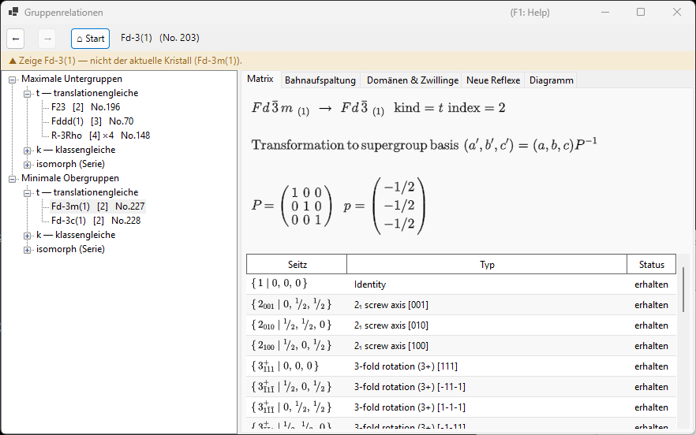
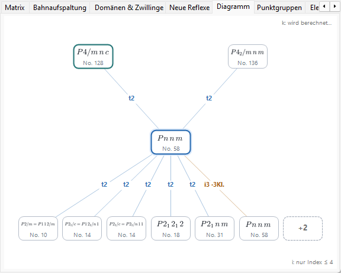
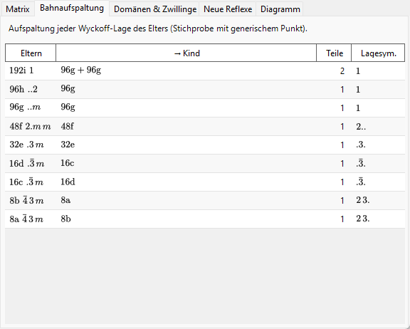
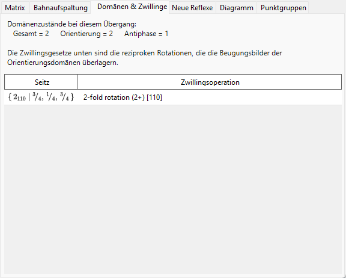

# A4.2. Gruppe-Untergruppe-Beziehungen

**Gruppenrelationen...** ist ein Browser für die Beziehungen der 230 Raumgruppentypen zu ihren maximalen Untergruppen / minimalen Obergruppen, geöffnet aus dem Bereich **Optionen** von [Symmetrieinformationen](../../2-symmetry-information.md). Anders als bei einer statischen Tabelle wird jede angezeigte Beziehung zur Laufzeit direkt aus den Symmetrieoperationen der aktuellen Raumgruppe selbst berechnet (siehe [A4.1](symbols-and-diagrams.md#symmetrieoperationen-registerkarte-operationen)), sodass sie Operation für Operation gegengeprüft werden kann, statt nur als Abschrift der *International Tables*, Vol. A1, geglaubt werden zu müssen.

Diese Seite erklärt das gruppentheoretische Vokabular des Browsers und geht anschließend jede seiner Registerkarten durch.

---

## Der Satz von Hermann: *t*-, *k*- und isomorphe Untergruppen

Eine Untergruppe $H<G$ ist **maximal**, wenn keine Untergruppe von $G$ strikt zwischen $H$ und $G$ liegt. Ein Satz von Carl Hermann (1929) besagt, dass für die hier tabellierten dreidimensionalen Raumgruppen jede maximale Untergruppe einer Raumgruppe $G$ von einer von zwei Arten ist:

- **translationengleiche (*t*-) Untergruppe** — $H$ behält *alle* Translationen von $G$ (dasselbe Gitter, dieselbe Zelle), aber eine kleinere Punktgruppe. Der Index $[G:H]$ (die Zahl der Nebenklassen von $H$ in $G$) ist gleich dem Punktgruppenindex $[P_G:P_H]$.
- **klassengleiche (*k*-) Untergruppe** — $H$ behält dieselbe *geometrische Kristallklasse* (denselben Punktgruppentyp) wie $G$, aber nur ein Untergitter der Translationen von $G$ — eine größere konventionelle Zelle und/oder weniger Zentrierungsvektoren. Der Index ist gleich dem Index des Translationsgitters $[T_G:T_H]$.

**Isomorphe Untergruppen** sind der besondere, wichtige Fall von *k*-Untergruppen, bei dem $H$ zusätzlich vom *selben Raumgruppentyp* wie $G$ selbst ist (nur mit größerer Zelle — eine Beziehung, die sich beliebig oft wiederholt, sodass isomorphe Untergruppen eine unendliche, nach Zellgröße indizierte Serie bilden, anders als die endlich vielen *t*- und nicht-isomorphen *k*-Untergruppen eines gegebenen $G$). Für eine *maximale* isomorphe Untergruppe ist der Index stets eine Primzahlpotenz ($p$, in drei Dimensionen gelegentlich $p^2$ oder $p^3$); welche Potenz auftritt, hängt davon ab, wie das endliche Quotientengitter als Modul unter der Punktgruppe zerfällt. Man beachte außerdem, dass der Basiswechsel zu einem Untergitter einen echten Wechsel der Basisvektoren und eine Ursprungsverschiebung mit sich bringen kann, nicht bloß eine gleichmäßige Vergrößerung der Zelle entlang einer Achse.

Da jede Untergruppenbeziehung von endlichem Index (maximal oder nicht) über eine Kette maximaler Schritte erreichbar ist, genügt die Auflistung allein der maximalen Untergruppen (und in der Gegenrichtung der minimalen Obergruppen), um das vollständige Netz der Untergruppenbeziehungen endlichen Indexes zu beschreiben — genau deshalb tabellieren die ITA Vol. A1 und dieser Browser nur maximale/minimale Beziehungen.

!!! note "Nur zwei Arten — isomorph ist eine Unterklasse, keine dritte"
    Es ist eine verbreitete Kurzform, von „*t*-, *k*- und isomorphen Untergruppen“ zu sprechen, als gäbe es drei gleichrangige Arten, und der Baum in diesem Browser ist der Übersichtlichkeit halber tatsächlich in drei Zweige gegliedert. Formal ist der Satz von Hermann jedoch eine **Zwei**teilung (*t* vs. *k*); isomorphe Untergruppen sind einfach diejenigen *k*-Untergruppen, die zufällig den Raumgruppentyp von $G$ selbst reproduzieren.

### Der Index als Nebenklassenzahl

Weil Raumgruppen unendlich sind (sie enthalten Translationen), bedeutet „Index“ hier immer **die Zahl der Nebenklassen von $H$ in $G$**, nicht ein Ordnungsverhältnis $|G|/|H|$ (beide Ordnungen sind unendlich) — für endliche Gruppen fallen beide Begriffe zusammen, aber für Raumgruppen ergibt nur die Nebenklassen zählende Definition Sinn. Der Baum und die Registerkarte Matrix zeigen diesen Index z. B. als `t, index 2` oder `k, index 3` an.

### Konjugierte Untergruppen und Konjugationsklasse

Eine gegebene abstrakte Untergruppenbeziehung lässt sich innerhalb von $G$ oft auf mehr als eine geometrisch verschiedene Weise realisieren — verwandt durch Orientierung oder Lage statt durch den Typ —, etwa als Spiegelbild einer Spiegelebene oder als Schraubenachse entlang einer anders orientierten, aber symmetrieäquivalenten Richtung. Zwei solche Realisierungen $H$ und $H'$ sind **innerhalb von $G$** konjugiert, wenn $H' = gHg^{-1}$ für ein $g\in G$ gilt; der Browser fasst alle derartigen $G$-konjugierten Kopien einer Beziehung zu einem einzigen Eintrag zusammen und gibt ihre Anzahl als Größe der *Konjugationsklasse* an. Das ist ein strikt feinerer Begriff als die Zusammenfassung von Untergruppen nach der (gröberen) Äquivalenz unter dem euklidischen oder affinen Normalisator von $G$ — einer Klassifikation, die die ITA selbst manchmal stattdessen verwendet —, sodass Untergruppen mit demselben Typ und Index nicht automatisch einer einzigen Konjugationsklasse angehören; sie können in mehrere zerfallen.

---

## Navigation im Browser

- Der **Baum** (linker Bereich) hat zwei Wurzeln, **Maximale Untergruppen** und **Minimale Obergruppen**, jeweils gegliedert in einen Zweig **`t — translationengleiche`**, einen Zweig **`k — klassengleiche`** und einen Zweig **`isomorph (Serie)`**. Nicht-konjugierte Klassen mit demselben Kindtyp und Index bekämen sonst identische Beschriftungen und werden daher durch ein Suffix `· Klasse n` unterschieden. Im Zweig **isomorph** der Maximalen Untergruppen werden Konjugationsklassen, die unter dem *affinen Normalisator* von $G$ äquivalent sind, zusätzlich unter einer Bahn-Zeile gruppiert (*„… — m Klassen (Normalisator-äquivalent)“*) — dieselbe Granularität wie die IIc-Einträge der ITA Vol. A1 —, und die Aufzählungsgrenze wird mit dem Drehfeld **Isomorphe Untergruppen: Index ≤** in der Symbolleiste eingestellt (2–27, standardmäßig 4; höhere Grenzen werden im Hintergrund berechnet).
- Die Registerkarte **Diagramm** zeichnet ein vereinfachtes Gerüst im Stil eines Bärnighausen-Stammbaums: die aktuelle Gruppe in der Mitte (hervorgehoben), ihre minimalen Obergruppen darüber und ihre maximalen Untergruppen darunter — ***t*-, *k*- und isomorphe Beziehungen gleichermaßen**, denn jede ist ein „maximaler Schritt“. Jede Kante trägt Art und Index als Beschriftung (`t2`, `k3`, `i3`) und ist farbkodiert: Blau für *t*, Blaugrün für *k* und Orange für isomorph. Die Knotensymbole sind als korrekte kristallographische Symbole gesetzt — tiefgestellte Indizes für Schraubenachsen, Überstriche für Drehinversionen. Nicht-konjugierte Klassen mit demselben Zieltyp, derselben Art und demselben Index werden zu einem einzigen Knoten verschmolzen, dessen Kantenbeschriftung eine Klassenzahl trägt (z. B. `k2 ·2 Kl.`) — der Baum bleibt der Ort, um jede Klasse einzeln zu inspizieren. Enthält eine Zeile mehr Beziehungen, als in die Fensterbreite passen, schrumpfen die Knoten um eine Stufe, und ein etwaiger Rest wird in einem gestrichelten `+N`-Knoten gesammelt (nicht anklickbar — die vollständige Liste steht im Baum); ein kleiner Hinweis `i: nur Index ≤ 4` erscheint in der Ecke, wann immer isomorphe Kanten gezeigt werden, und `k: wird berechnet…`, solange die Rückwärtssuche der *k*-Obergruppen noch aufgebaut wird. Wenn Sie sich per Doppelklick durch die Untergruppen hinabbewegen, wird die Kette der durchlaufenen Gruppen (Ihr *ausgewählter Zweig*) als violette vertikale Säule über der aktuellen Gruppe gezeichnet — ein mehrstufiger Bärnighausen-Stammbaum Ihres eigenen Übergangspfads (z. B. $Pm\bar3m \rightarrow P4/mmm \rightarrow Pmmm \rightarrow \ldots$), wobei jede Kante mit der genommenen Beziehung beschriftet ist; beim Aufsteigen oder Drücken von **Zurück** wird der Zweig entsprechend gekürzt, und Ketten mit mehr als drei Vorfahren werden mit einem abgeblendeten `⋮ +N` abgekürzt. Gezeigt wird nur das gruppentheoretische Gerüst — ein vollständiger Bärnighausen-Stammbaum im Sinne struktureller Verwandtschaften führt an jeder Kante zusätzlich Zelltransformationen, Wyckoff-Aufspaltungen und Korrelationen der Atomkoordinaten mit; diese stehen in den unten beschriebenen anderen Registerkarten und nicht im Diagramm selbst.
- **Ein Einfachklick** (auf einen Baumknoten oder einen Diagrammknoten) wählt eine Beziehung aus und füllt die Detail-Registerkarten darunter. **Ein Doppelklick** *navigiert*: Er verankert den ganzen Browser neu bei dieser Raumgruppe, sodass Sie Schritt für Schritt von Gruppe zu Untergruppe zu Untergruppe wandern können.
- **Zurück / Vor / Start** durchlaufen Ihren Navigationsverlauf; **Start** kehrt immer zur Raumgruppe des Kristalls zurück, aus dem Sie den Browser tatsächlich geöffnet haben.
- Die **Pfadleiste** (oben) zeigt die aktuell dargestellte Raumgruppe (`HM-Symbol (No. n)`); das **Kontextbanner** darunter wird grün („Zeigt die Raumgruppe des aktuellen Kristalls.“), wenn sie mit Ihrem Kristall übereinstimmt, oder bernsteinfarben („Zeige … — nicht der aktuelle Kristall (…).“), wenn Sie anderswohin navigiert haben — eine Erinnerung daran, dass das Durchstöbern einer Untergruppe Ihren Kristall *nicht* ändert.

---

## Registerkarte Matrix

Zeigt den Basiswechsel und die Ursprungsverschiebung zwischen der Elternaufstellung und der Kindaufstellung nach der ITA-Konvention: Die neuen Basisvektoren sind $(\mathbf a',\mathbf b',\mathbf c')=(\mathbf a,\mathbf b,\mathbf c)\cdot P$, und die Koordinaten eines Punktes in der Elternaufstellung sind $\mathbf x_{\text{parent}} = P\,\mathbf x_{\text{child}} + \mathbf p$. Die $3\times3$-Matrix $P$ und die Ursprungsverschiebung $\mathbf p$ werden als Brüche ausgegeben.

- Haben Sie diese Beziehung über **Maximale Untergruppen** erreicht, werden $P$ und $\mathbf p$ direkt gezeigt (Richtung Eltern → Kind).
- Haben Sie sie stattdessen über **Minimale Obergruppen** erreicht, zeigt die Registerkarte $P^{-1}$ (und die entsprechend invertierte Verschiebung), beschriftet mit *„aus der eigenen Untergruppentabelle der Obergruppe abgeleitet“* — der Browser speichert eine Beziehung immer aus der Sicht der größeren Gruppe und invertiert sie bei Bedarf, statt zwei unabhängige Kopien zu pflegen.
- **Konjugierte Untergruppen dieser Klasse: $n$** gibt die Größe der oben beschriebenen Konjugationsklasse an.
- Eine Generatorentabelle listet jeden Nebenklassenvertreter, markiert als **erhalten** (in $H$ noch vorhanden) oder **verloren** (in $G$ vorhanden, aber nicht in $H$ — genau diese Operationen sind für den Symmetriebruch verantwortlich), jeweils mit seinem Seitz-Symbol und der Beschreibung des geometrischen Typs aus [A4.1](symbols-and-diagrams.md#symmetrieoperationen-registerkarte-operationen).
- Konnte der Ziel-Raumgruppentyp einer Kandidatenbeziehung nicht gegen ReciPros Katalog identifiziert werden, sagt die Registerkarte das offen, statt zu raten, und zeigt nur das Punktgruppensymbol.

---

## Registerkarte Bahnaufspaltung

Zeigt, wie sich jede Wyckoff-Lage der *Eltern*gruppe aufspaltet, wenn die Symmetrie auf $H$ erniedrigt wird: eine Zeile pro Elternlage, mit Multiplizität/Buchstabe/Lagesymmetrie der Elterngruppe, den resultierenden Kind-Multiplizitäten/-Buchstaben (mit `+` verbunden, wenn die Bahn in mehr als ein Stück zerfällt), der Zahl der entstandenen Stücke und den verschiedenen Kind-Lagesymmetrien.

Berechnet wird dies, indem tatsächlich **ein fester, generischer Probenpunkt** in die Operationen beider Gruppen eingesetzt wird und die resultierenden Bahnen verglichen werden — eine numerisch *gesampelte* Aufspaltung, nicht der vollsymbolische Wyckoff-Aufspaltungsformalismus (wie ihn Werkzeuge wie WYCKSPLIT verwenden); genau deshalb heißt die Registerkarte bewusst „Bahnaufspaltung“ und nicht „Wyckoff-Aufspaltung“ — eine vollsymbolische Behandlung könnte im Prinzip jedes Zusammenfallen bei speziellen Parameterwerten verfolgen, während dieser gesampelte Ansatz nur die an einem generischen Punkt beobachtete Aufspaltung berichtet und ein Zusammenfallen, das nur für spezielle Werte von $x,y,z$ eintritt, von sich aus nicht anzeigen würde.

Für eine ***k*- oder isomorphe Beziehung** wird derselbe gesampelte Ansatz auf das vergröberte Translationsgitter angewendet: Die Registerkarte zeigt, wie jede Elternbahn beim Verlust von Gittertranslationen zerfällt, und die Kind-Multiplizitäten werden **in der vergrößerten Untergruppenzelle** gezählt (bei einer Zellvergrößerung vom Index $n$ summieren sich die Multiplizitäten der Stücke also auf das $n$-Fache der Eltern-Multiplizität).

---

## Registerkarte Domänen & Zwillinge

Wenn ein Kristall von $G$ in eine Untergruppe $H$ übergeht, entspricht jede der $[G:H]$ Nebenklassen von $H$ in $G$ einem möglichen **Domänenzustand**: Der Referenzzustand ist die Identitätsnebenklasse, und jede weitere Nebenklasse — vertreten durch je eine „verlorene“ Operation von der Registerkarte Matrix — erzeugt einen weiteren Domänenzustand, der mit dem Referenzzustand durch diese Operation verknüpft ist.

Speziell bei einer ***t*-Untergruppe** bleibt das Translationsgitter unverändert ($T_G=T_H$), sodass es hier gruppentheoretisch so etwas wie eine **Antiphasen- (Translations-)Domäne** nicht gibt — jeder Domänenzustand unterscheidet sich vom Referenzzustand durch eine echte Punktgruppenoperation, nie durch eine bloße Verschiebung. Die Registerkarte meldet daher stets `Antiphase = 1` und `Orientierung = Gesamt`, d. h. alle $[G:H]$ Domänenzustände sind **Orientierungsdomänen**.

Bei einem ***k*- oder isomorphen** Übergang ist die Lage genau umgekehrt: Die Punktgruppe bleibt unverändert, es gibt also nur **einen Orientierungszustand**, und die verlorenen Gittertranslationen erzeugen **Antiphasen- (Translations-)Domänen** — die Registerkarte meldet `Orientierung = 1` und `Antiphase = Gesamt`. Jede verlorene Translation wird als rein translatorisches Seitz-Symbol aufgeführt, zusammen mit dem zugehörigen Antiphasenvektor in Koordinaten der Untergruppenzelle. Weil alle Antiphasendomänen dieselbe Orientierung teilen, fallen ihre Grundreflexe exakt zusammen; nur die Überstrukturreflexe (siehe die Registerkarte **Neue Reflexe**) tragen über eine Antiphasengrenze hinweg einen Phasenunterschied.

Das **Zwillingsgesetz** für ein Paar von Orientierungsdomänen ist der Matrixteil der verlorenen Operation — eine Drehung oder Spiegelung, ausgedrückt als Wirkung auf das direkte oder reziproke Gitter —, der die Gitterorientierung der einen Domäne auf die der anderen abbildet. Bei einem Übergang in eine *t*-Untergruppe ist diese Operation konstruktionsbedingt eine Symmetrieoperation des Gitters der *Eltern*gruppe $G$; behält die tatsächliche Metrik der niedersymmetrischen Struktur diese Gittersymmetrie bei, fallen die reziproken Gitter der beiden Domänen nach der Zwillingsoperation exakt zusammen und ihre Beugungsbilder überlappen vollständig — der idealisierte Fall der *meroedrischen* Verzwillingung, den diese Registerkarte beschreibt. Bei einem realen Übergang entwickelt die niedersymmetrische Phase typischerweise eine kleine spontane Verzerrung, die die Metrik der Elterngruppe nur näherungsweise bewahrt, sodass die Überlappung in der Praxis oft nur näherungsweise gilt (*pseudomeroedrische* Verzwillingung); diese Registerkarte gibt das gruppentheoretische Zwillingsgesetz bei exakter Metrik an, keine Messung dessen, wie nahe ein bestimmter realer Kristall ihm kommt.

Ein entarteter Fall mit leerer Nebenklassenliste wird als `(Einzeldomäne)` gemeldet (Index 1 wird nie als Beziehung angezeigt).

---

## Registerkarte Neue Reflexe

Listet für einen Übergang in eine *t*-Untergruppe die Reflexe, die in $H$ symmetrieerlaubt werden, obwohl sie in $G$ systematisch ausgelöscht waren — d. h. Reflexe, die die Reflexionsbedingungen der Elterngruppe (von der Registerkarte [Bedingungen](../../2-symmetry-information.md)) verbieten, die von $H$ aber nicht. Das Suchfenster wird mit dem **Suchfenster**-Drehfeld auf der Registerkarte eingestellt: standardmäßig $|h|,|k|,|l|\le4$, einstellbar von 2 bis 8 (größere Grenzen können deutlich mehr Reflexe auflisten).

Weil eine *t*-Untergruppe die Elementarzelle nie vergrößert, sind dies **keine** Überstruktur-/Bruchindex-Reflexe — sie bleiben ganzzahlige $(h,k,l)$ der Elternzelle und werden nur deshalb *erlaubt*, weil eine Gleitspiegelebene oder Schraubenachse, die sie bisher zum Verschwinden zwang, nicht mehr vorhanden ist. (Echte Überstrukturreflexe bei gebrochenen Elternindizes sind erst möglich, wenn sich die Zelle selbst vergrößert, was bei einer *k*-Untergruppe geschieht, nicht bei einer *t*-Untergruppe.) Ein hier erscheinender Reflex ist nur symmetrie*erlaubt*; ob er tatsächlich beobachtet wird, hängt weiterhin vom Strukturfaktor der realen, niedersymmetrischen Struktur ab.

Für eine ***k*- oder isomorphe Beziehung** listet die Registerkarte die neuen Reflexe **indiziert auf die vergrößerte Untergruppenzelle** (wieder innerhalb des Suchfensters) und klassifiziert jeden in der letzten Spalte:

- **Überstrukturreflexe** entsprechen *gebrochenen* Elternindizes, die in Klammern gezeigt werden (z. B. `(1/2 0 1)`) — sie erscheinen allein deshalb, weil die Zelle vergrößert wurde;
- **freigegebene Reflexe** sind in der Elternzelle ganzzahlig, waren aber durch eine Reflexionsbedingung der Elterngruppe verboten, die die Untergruppe aufhebt — stattdessen wird die aufgehobene Elternregel gezeigt (das schließt den Verlust von Zentrierungstranslationen ein, z. B. wenn eine $I$-zentrierte Elterngruppe ihre Bedingung „$h+k+l$ gerade“ verliert).

Reflexe, die in Eltern- und Kindgruppe gleichermaßen erlaubt sind (Grundreflexe), werden nicht aufgeführt. Konnte der Raumgruppentyp des Kindes nicht identifiziert werden, sind dessen Reflexionsbedingungen unbekannt, und die Registerkarte teilt mit, dass die Vorhersage nicht möglich ist.

---

## Aktuelle Einschränkungen

Die *t*- und *k*-Untergruppen-Engines des Browsers, die Rückwärtssuchen der *t*- und *k*-Obergruppen und die isomorphe (IIc-)Klassifikation sind vollständig implementiert und unabhängig gegen die Operationstabellen der Raumgruppen verifiziert, und die Registerkarten **Bahnaufspaltung**, **Domänen & Zwillinge** und **Neue Reflexe** sind für jede Beziehungsart aktiv. Die verbleibenden Einschränkungen werden als solche angezeigt statt stillschweigend weggelassen:

- **Isomorphe Untergruppen werden bis zur Drehfeld-Grenze aufgezählt (standardmäßig Index ≤ 4, höchstens 27).** Eine isomorphe Serie setzt sich unbegrenzt zu höheren Indizes fort, daher nennt der ausgegraute Hinweis am Zweig stets die aktuelle Grenze, statt Vollständigkeit der Liste vorzutäuschen. Die Gruppierung in Normalisator-Bahnen beruht auf einer beschränkten Suche nach Normalisator-Erzeugern; sie ist für die getesteten Fälle gegen ITA A1 verifiziert, ein formaler Vollständigkeitsbeweis für jede Gruppe steht jedoch noch aus — schlimmstenfalls könnte eine Bahn auf mehrere Zeilen aufgeteilt angezeigt werden, niemals fälschlich zusammengelegt.
- ***k*-Obergruppen** werden bei der ersten Verwendung im Hintergrund berechnet (die Rückwärtssuche benötigt die *k*-Untergruppentabellen jedes Typs derselben Kristallklasse); der Baum zeigt kurzzeitig einen ausgegrauten Knoten *„wird berechnet…“* (und das Diagramm den Eckhinweis *„k: wird berechnet…“*), bis sie bereitstehen.

---

## Glossar

| Begriff | Bedeutung |
|---|---|
| Maximale Untergruppe / minimale Obergruppe | Eine Untergruppe (Obergruppe), zwischen der und $G$ keine weitere Untergruppenbeziehung strikt liegt |
| Index $[G:H]$ | Die Zahl der Nebenklassen von $H$ in $G$ |
| *translationengleiche* (*t*-) | Gleiches Translationsgitter, kleinere Punktgruppe; Index = Punktgruppenindex |
| *klassengleiche* (*k*-) | Gleicher Punktgruppentyp, Untergitter der Translationen (größere Zelle); Index = Gitterindex |
| Isomorphe Untergruppe | Eine *k*-Untergruppe, die zusätzlich vom selben Raumgruppentyp wie $G$ ist |
| Konjugationsklasse (innerhalb von $G$) | Die Menge der $G$-konjugierten ($gHg^{-1}$) Realisierungen einer Untergruppenbeziehung |
| Orientierungsdomäne | Ein Domänenzustand, der mit dem Referenzzustand durch eine Punktgruppenoperation verknüpft ist |
| Antiphasen- (Translations-)Domäne | Ein Domänenzustand, der mit dem Referenzzustand nur durch eine verlorene Translation verknüpft ist (möglich bei *k*-, nicht bei *t*-Übergängen) |
| Zwillingsgesetz | Der Matrixteil einer verlorenen Operation; bildet das Gitter einer Orientierungsdomäne auf das einer anderen ab |

---

## Siehe auch

- [2. Symmetrieinformationen](../../2-symmetry-information.md) — der GUI-Leitfaden, den dieser Anhang erläutert.
- [A4.1. Raumgruppensymbole und Symmetriediagramme](symbols-and-diagrams.md) — das Vokabular aus Seitz-Symbolen und geometrischen Typen, das in den Registerkarten Matrix und Domänen & Zwillinge durchgehend verwendet wird.
- [Anhang A4. Symmetrie und Raumgruppen](index.md)
