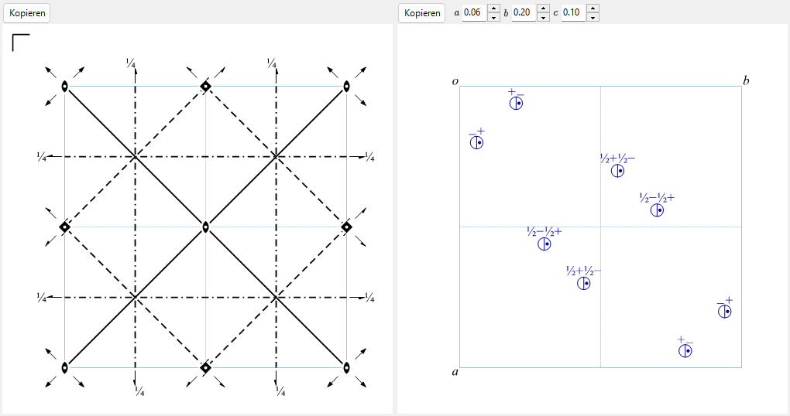

# A4.1. Raumgruppensymbole und Symmetriediagramme

Diese Seite erklärt alles, was in der oberen Hälfte von [Symmetrieinformationen](../../2-symmetry-information.md) angezeigt wird (der Bereich zur Raumgruppen-Identität sowie die Registerkarten **Operationen**/**Eigenschaften**/**Aufstellungen**), und die beiden schematischen Diagramme am unteren Rand des Fensters. Die gesamte Notation folgt den *International Tables for Crystallography* (ITA), Vol. A.

---

## Hermann–Mauguin-Symbole (HM)

Ein Hermann–Mauguin-Symbol hat zwei Ebenen: Das **Punktgruppensymbol** (oberes Feld, *Punktgruppe*) beschreibt allein die makroskopische Symmetrie des Kristalls, und das **Raumgruppensymbol** (unteres Feld, *Raumgruppe*) fügt die Gitterzentrierung und etwaige Schrauben-/Gleitkomponenten hinzu.

### Gitterbuchstabe

Das Raumgruppensymbol beginnt mit einem der sieben Standard-Gitterbuchstaben:

| Buchstabe | Bedeutung |
|---|---|
| `P` | Primitiv |
| `A`, `B`, `C` | Einseitig flächenzentriert (Zentrierung auf der *bc*-, *ac*- bzw. *ab*-Fläche) |
| `I` | Innenzentriert |
| `F` | Allseitig flächenzentriert |
| `R` | Rhomboedrisch (ein eigenes trigonales Gitter; oft in *hexagonalen Achsen* beschrieben, wobei die Zelle dann drei Gitterpunkte enthält) |

### Symmetrierichtungen

Nach dem Gitterbuchstaben steht jede weitere Position im Symbol für eine **Symmetrierichtung** — eine Richtung im Kristall, entlang derer eine Dreh-/Schraubenachse liegt und/oder senkrecht zu der eine Spiegel-/Gleitspiegelebene liegt. Auf welche physikalischen Richtungen sich diese Positionen beziehen und in welcher Reihenfolge, legt das Kristallsystem fest:

| Kristallsystem | 1. Position | 2. Position | 3. Position |
|---|---|---|---|
| Triklin | *(keine — nur `1` oder `-1`)* | | |
| Monoklin | $[010]$ (eindeutige Achse $b$, ReciPros Konvention) | | |
| Orthorhombisch | $[100]$ | $[010]$ | $[001]$ |
| Tetragonal | $[001]$ | $[100],[010]$ | $[110],[1\bar 10]$ |
| Trigonal / Hexagonal | $[001]$ | $[100],[010],[\bar 1\bar 1 0]$ | $[1\bar 10],[120],[\bar 2\bar 1 0]$ |
| Kubisch | $[100],[010],[001]$ | $[111]$ *(und die anderen 3 Raumdiagonalen)* | $[1\bar 10],[110]$ *(und die anderen 4 Flächendiagonalen)* |

Eine einzelne Position wird nach folgenden Regeln gefüllt:

- Eine bloße Zahl $n$ ($n=1,2,3,4,6$) : eine $n$-zählige **Drehachse** entlang dieser Richtung.
- Eine Schraubenachse $n_p$ (z. B. $2_1$, $4_2$, $6_3$) : eine Drehung um $360°/n$, *kombiniert mit* einer Translation um $p/n$ der Gitterperiode entlang der Achse. So bedeutet $2_1$ (eine „zweizählige Schraube“) Drehen um $180°$ **und** Verschieben um die halbe Zellkante entlang der Achse; $6_3$ bedeutet Drehen um $60°$ und Verschieben um die halbe Zellkante entlang $c$.
- Ein bloßer Buchstabe ($m,a,b,c,n,d$) ohne vorangestellte Drehzahl : eine **Spiegel- oder Gleitspiegelebene** senkrecht zu dieser Richtung (die Bedeutung des Buchstabens ist dieselbe wie bei den Diagrammen weiter unten).
- $n/m$ oder $n_p/m$ : eine Dreh-/Schraubenachse **mit** einer dazu senkrechten Spiegelebene (beide Elemente teilen dieselbe Richtung, das eine entlang der Achse, das andere quer dazu).
- $-n$ (z. B. $-1,-3,-4,-6$) : eine **Drehinversionsachse** (Drehen um $360°/n$, dann Invertieren durch einen Punkt auf der Achse). $-1$ allein bezeichnet ein reines Inversionszentrum; eine „$-2$“-Achse gibt es nicht, weil eine zweizählige Drehinversion mit einer Spiegelung identisch ist und daher stets $m$ geschrieben wird.

### Kurz- vs. Vollsymbol

Das **Kurzsymbol** (das üblicherweise zitierte HM-Symbol) lässt Symmetrieelemente weg, die durch die hingeschriebenen bereits impliziert sind; das **Vollsymbol** schreibt jede Richtung aus. Zum Beispiel lautet die Raumgruppe No. 62 in Kurzform $Pnma$ und in Vollform $P\,2_1/n\,2_1/m\,2_1/a$ — die drei $2_1$-Schraubenachsen sind durch die drei Gleitspiegel-/Spiegelebenen zusammen mit der Punktgruppe $mmm$ der Raumgruppe bereits impliziert, weshalb das Kurzsymbol sie weglässt. ReciPros Felder *HM-Symbol (kurz)* und *HM-Symbol (voll)* zeigen beide; für die meisten Raumgruppen stimmen sie überein.

### Schoenflies- (SF) und Hall-Symbole

Das **Schoenflies-Symbol** (z. B. $D_{2h}^{16}$) benennt den Punktgruppentyp ($D_{2h}$) und fügt einen hochgestellten Index hinzu, der lediglich durchzählt, *welche* Raumgruppe dieser Punktgruppenfamilie gemeint ist — anders als beim HM-Symbol trägt der Hochindex für sich genommen keine direkte geometrische Bedeutung; man muss ihn nachschlagen. ReciPro zeigt das Schoenflies-Symbol sowohl für die Punktgruppe als auch für die Raumgruppe.

Das **Hall-Symbol** ist eine andere, generatorbasierte Notation für die eindeutige maschinelle Verarbeitung: Es listet einen minimalen Satz erzeugender Operationen zusammen mit einem expliziten Ursprung auf, sodass ein Programm den exakten Koordinatensatz rekonstruieren kann, ohne in einer Tabelle nachzuschlagen, „welche Aufstellung/Ursprungswahl dieses HM-Symbol impliziert“. Ein Hall-Symbol ist nicht die *einzige* mögliche Kodierung eines gegebenen Operationssatzes (verschiedene Generatorwahlen ergeben verschiedene, gleichermaßen gültige Hall-Strings für dieselbe Gruppe), aber jedes ist für sich vollständig explizit und umkehrbar. ReciPro zeigt ein systematisch erzeugtes Hall-Symbol für die aktuelle Aufstellung; die Registerkarte **Aufstellungen** (unten) listet jede tabellierte Ursprungs-/Aufstellungswahl, die die aktuelle Raumgruppennummer teilt, jeweils mit eigenem HM- und Hall-Symbol.

---

## Symmetrieoperationen (Registerkarte Operationen)

Die Registerkarte **Operationen** listet jede Symmetrieoperation der allgemeinen Lage für die aktuelle Aufstellung (Gitterzentrierungstranslationen bereits eingerechnet), in drei parallelen Notationen:

| Spalte | Beispiel | Bedeutung |
|---|---|---|
| Koordinaten | `-y, x-y, z+1/3` | Das Koordinatentripel $(x,y,z)\mapsto(x',y',z')$, d. h. die affine Abbildung $x'=Rx+t$ algebraisch ausgeschrieben (ITA-/CIF-Konvention). |
| Seitz | `3+ [111]` | Ein kompaktes Symbol: Ordnung und Drehsinn der Dreh-/Schraubenoperation (`3+`), Achsenrichtung (`[111]`) und — falls vorhanden — die Translation der Operation, z. B. `2₁ [001] 0,0,1/2`. Eine reine Spiegelung ist `m`, die Identität `1`, die Inversion `-1`. |
| Typ | `3-fold rotation (3+) [111]` | Eine Klartext-Klassifikation der Operation: `Identity`, `Inversion centre at …`, eine `n-fold rotation`, eine `nₚ screw axis`, eine `Mirror plane m`, eine `a/b/c/n/d`-`glide plane` oder eine `n`-zählige `rotoinversion`, jeweils mit ihrer Richtung (und, beim Inversionszentrum, mit ihrer Lage). |

Die Schaltfläche **Kopieren (CIF)** legt die vollständige Operationsliste als CIF-Schleife `_space_group_symop_operation_xyz` in die Zwischenablage. Dieses Vokabular — Seitz-Symbol und geometrischer Typ — kehrt überall in [A4.2](group-subgroup-relations.md) wieder, wo jeder erhaltene/verlorene Generator einer Untergruppenbeziehung auf dieselbe Weise beschrieben wird.

---

## Gruppentheoretische Klassifikation (Registerkarte Eigenschaften)

Die Registerkarte **Eigenschaften** berichtet einen Satz von Standardklassifikationen der aktuellen Raumgruppe. Einige davon — zentrosymmetrisch, Sohncke und polar (und daraus abgeleitet die untenstehenden Zulässigkeiten physikalischer Eigenschaften) — folgen direkt aus dem **Matrixteil** $R$ jeder Operation (dem linearen, drehenden oder spiegelnden Anteil), bei „zentrosymmetrisch“ zusammen mit dem Translationsanteil. Die anderen — symmorph, enantiomorpher Partner, Kristallfamilie/Gittersystem/Bravais-Typ, arithmetische Kristallklasse und Patterson-Symmetrie — sind Eigenschaften des Raumgruppen*typs* als Ganzem (seiner IT-Nummer, seines Gittertyps und seiner Laue-Klasse) und nicht einer einzelnen Operation. Nichts davon benötigt eine Metrik (Zellform) — alles hängt allein vom abstrakten Symmetriegehalt und von der Klassifikation des Raumgruppentyps ab.

**Zentrosymmetrisch** — der Operationssatz enthält eine Operation der Form $\{-I \mid t\}$ (eine Inversion durch den Punkt $t/2$, der nicht der Ursprung sein muss). Die Eigenschaften Sohncke und polar (unten) schließen sich mit dieser gegenseitig aus: Ein Inversionszentrum kehrt jede Richtung um, sodass eine zentrosymmetrische Gruppe nie polar sein kann, und $-I$ hat die Determinante $-1$, sodass eine zentrosymmetrische Gruppe nie eine Sohncke-Gruppe sein kann.

**Sohncke-Gruppe (orientierungserhaltend)** — der Matrixteil *jeder* Operation hat $\det R=+1$: Die Gruppe enthält nur eigentliche Drehungen und Schraubendrehungen, nie eine Spiegelung, Gleitspiegelung, Inversion oder Drehinversion. 65 der 230 Raumgruppentypen sind Sohncke-Gruppen. Eine Sohncke-Gruppe zu sein ist die Symmetriebedingung dafür, dass eine Struktur mit Objekten definierter Händigkeit (chirale Moleküle, Proteine, Quarz, …) verträglich ist, ohne zugleich deren Spiegelbilder zu enthalten. Das ist ein weiterer Begriff, als Mitglied eines echt verschiedenen Spiegelbild-*Paares* von Raumgruppentypen zu sein — siehe **Enantiomorpher Partner**, gleich im Anschluss.

**Enantiomorpher Partner** — unter den 65 Sohncke-Typen sind 11 Paare (22 Typen) *nur* durch eine orientierungsumkehrende Transformation aufeinander bezogen und durch keine eigentliche (orientierungserhaltende): Wendet man auf einen Kristall in einer dieser Raumgruppen eine Spiegelung an, wird er zum anderen Mitglied des Paares — und unter keiner Umbenennung der Achsen wieder zu sich selbst. Die 11 Paare sind die auf gegenläufigen Schraubenachsen aufgebauten:

$$P4_1 / P4_3,\ \ P4_122 / P4_322,\ \ P4_12_12 / P4_32_12,\ \ P3_1/P3_2,\ \ P3_112/P3_212,\ \ P3_121/P3_221,$$
$$P6_1/P6_5,\ \ P6_2/P6_4,\ \ P6_122/P6_522,\ \ P6_222/P6_422,\ \ P4_332/P4_132.$$

Die übrigen $65-22=43$ Sohncke-Typen sind ihr eigenes Spiegelbild (achiral *als Raumgruppentypen*, auch wenn jede einzelne Struktur in ihnen weiterhin händig ist).

**Symmorph** — einer der 73 Raumgruppentypen, für die sich ein Ursprung so wählen lässt, dass *jeder* Nebenklassenvertreter (modulo der Gittertranslationen) eine verschwindende intrinsische (Schrauben-/Gleit-)Translationskomponente hat — äquivalent: Irgendein Punkt der Zelle hat eine Lagesymmetriegruppe, die zur vollen Punktgruppe isomorph ist. (Zentrierungstranslationen bleiben natürlich bestehen; „symmorph“ ist eine Aussage über die nichtprimitiven Anteile der *Punktgruppen*operationen, nicht über das Gitter.) Eine symmorphe Raumgruppe lässt sich, in diesem speziellen Ursprung beschrieben, stets allein aus ihrer Punktgruppe und ihrem Gitter erzeugen, ohne dass Schraubenachsen oder Gleitspiegelebenen nötig wären — und genau diesen Ursprung tabelliert die ITA selbst für einen symmorphen Typ, sodass dessen Standard-Kurz-/Vollsymbol bereits frei von Schrauben-/Gleitbuchstaben ist. (Beschreibt man die Operationen derselben Gruppe an einem verschobenen oder um eine Zentrierungstranslation versetzten Ursprung, kann eine einzelne Operation so aussehen, als trüge sie eine Schrauben-/Gleittranslation, ohne dass sich dadurch die symmorphe Klassifikation des Typs änderte — die Klassifikation fragt nur, ob überhaupt ein translationsfreier Ursprung existiert, und für diese 73 Typen tut er das.)

**Polar** — ob eine Richtung vom Matrixteil *jeder* Operation invariant gelassen wird, $Rv=v$ (nicht $\pm v$: Eine echte polare Richtung muss exakt erhalten bleiben, nicht bloß umgekehrt oder als zweizählige Achse belassen). Die möglichen Fälle sind: **keine** (keine solche Richtung) &nbsp;/&nbsp; eine einzelne Achse $[uvw]$ &nbsp;/&nbsp; eine ganze Ebene (jede Richtung darin) &nbsp;/&nbsp; **jede** beliebige Richtung (nur bei Punktgruppe $1$). Eine polare Achse ist die Richtung, entlang derer eine spontane elektrische Polarisation symmetrieerlaubt ist (siehe die Tabelle der physikalischen Eigenschaften unten).

**Kristallfamilie, Gittersystem, Bravais-Typ** — die Standard-IUCr-Klassifikationshierarchie oberhalb des Kristallsystems: insgesamt 6 **Kristallfamilien**, 7 **Kristallsysteme**, 7 **Gittersysteme** und 14 **Bravais-Gittertypen**. Die Feinheit steckt in der **hexagonalen Kristallfamilie**: Als **Kristallsysteme** spaltet sie sich in *trigonal* und *hexagonal*, als **Gittersysteme** jedoch anders, nämlich in *hexagonal* und *rhomboedrisch* — eine trigonale Raumgruppe fällt in das hexagonale Gittersystem, wenn ihr Gitter $P$-Typ ist, oder in das rhomboedrische Gittersystem, wenn es $R$-zentriert ist, unabhängig davon, zu welchem der beiden Kristallsysteme sie gehört.

**Arithmetische Kristallklasse** — die Paarung eines (gegebenenfalls richtungsaufgelösten) Punktgruppensymbols mit einem Bravais-Gitterbuchstaben, z. B. `4mmP`; insgesamt gibt es 73 arithmetische Kristallklassen. Da einige Punktgruppensymbole (`3m1` vs. `31m`, für die beiden inäquivalenten Arten, wie eine $3m$-Punktgruppe relativ zu einem hexagonalen Gitter liegen kann) ihre Orientierung relativ zum Gitter bereits kodieren, genügt die Angabe des orientierten Punktgruppensymbols zusammen mit dem Gitterbuchstaben, um die Klasse eindeutig zu benennen.

**Patterson-Symmetrie** — der Gittertyp zusammen mit der *Laue-Klasse* (der zentrosymmetrischen Punktgruppe, die man durch Hinzufügen von $-1$ zur Punktgruppe der Raumgruppe erhält), unter Weglassen aller Schrauben-/Gleitinformation, z. B. `Pmmm` für jede der 30 orthorhombischen $P$-Gitter-Raumgruppen, gleichgültig, welche von ihnen Gleitspiegelebenen besitzt. Das ist die Symmetrie der aus den Beugungs*intensitäten* $|F|^2$ berechneten Patterson-Funktion in kinematischer Näherung, denn $|F|^2$ ist unempfindlich gegenüber der Phasenverschiebung, die eine Gleit-/Schraubentranslation einführt (auch wenn die von ihr verursachten systematischen Auslöschungen und die Harker-Peaks in der Patterson-Karte ihre Anwesenheit noch indirekt verraten können). Für die dynamische Elektronenbeugung gilt dieses kinematische Bild nicht exakt; siehe [Anhang A3](../a3-bloch-wave/index.md).

### Zulässigkeit physikalischer Eigenschaften

Die letzten Zeilen der Registerkarte Eigenschaften geben an, ob eine gegebene makroskopische physikalische Eigenschaft für die aktuelle Punktgruppe **symmetrieerlaubt** ist — eine notwendige Bedingung, keine Garantie, dass der Effekt in einem realen Kristall groß oder überhaupt vorhanden ist (die Konvention von Nyes „Physical Properties of Crystals“):

| Eigenschaft | Symmetriebedingung | Punktgruppen |
|---|---|---|
| Pyroelektrisch / ferroelektrisch | Polar (ein polarer Vektor 1. Stufe — die spontane Polarisation — ist erlaubt) | die 10 polaren Punktgruppen |
| Piezoelektrisch | Nicht zentrosymmetrisch **und** Punktgruppe $\ne 432$ | 20 der 21 nicht zentrosymmetrischen Punktgruppen |
| Frequenzverdopplung (SHG; elektrisch-dipolares Volumen-$\chi^{(2)}$) | Dieselbe Bedingung wie die Piezoelektrizität (ein polarer Tensor 3. Stufe) | dieselben 20 Punktgruppen |
| Optische Aktivität (natürliche Gyrotropie) | Die 11 Punktgruppen mit ausschließlich eigentlichen Drehungen, plus 4 weitere, die gyrotrop sind, ohne rein Sohncke zu sein | $1,2,3,4,6,222,32,422,622,23,432$ und $m,mm2,\bar4,\bar42m$ — insgesamt 15 Punktgruppen |

$432$ ist die eine azentrische Punktgruppe *ohne* piezoelektrische/SHG-Antwort: Sie hat zu viel Rotationssymmetrie (alle eigentlichen Drehungen, kubisch), als dass irgendeine Komponente eines polaren Tensors 3. Stufe überleben könnte, obwohl sie nicht zentrosymmetrisch ist.

!!! note "Symmetrieerlaubt heißt nicht notwendig beobachtet"
    Diese Zeilen geben an, was die Punktgruppe *zulässt*. Ob ein realer Kristall seine Polarisation tatsächlich umschaltet (echte Ferroelektrizität) oder eine praktisch nutzbare piezoelektrische bzw. SHG-Antwort zeigt, hängt von Chemie und Strukturdetails jenseits der reinen Symmetrie ab.

### Registerkarte Aufstellungen

Listet jede tabellierte Ursprungs-/Achsenaufstellung, die die IT-Nummer der aktuellen Raumgruppe teilt (z. B. die zwei Ursprungswahlen von $Fd\bar 3m$ oder die verschiedenen Zellwahlen einer monoklinen Gruppe), jeweils mit ihrem HM- und Hall-Symbol; die Zeile der aktuell angezeigten Aufstellung ist markiert. Diese Registerkarte dient nur dem Durchsehen der Alternativen — die Auswahl einer Zeile ändert den Kristall nicht.

---

## Symmetrieelement-Diagramm {#symmetry-element-diagram}

Das linke Diagramm gibt das schematische Symmetriediagramm der ITA Vol. A für die aktuelle Aufstellung wieder, projiziert entlang der mit **Richtung** (`a`/`b`/`c`) gewählten Achse.

**Achsen senkrecht zur Zeichenebene** werden als gefüllte Punktsymbole gezeichnet, deren Form die Drehordnung kodiert, mit kleinen Fortsätzen („Flügeln“) für eine Schraubenachse (deren Anzahl und Anordnung kodieren sowohl die Schraubensteigung $p$ als auch ihre Händigkeit, sodass z. B. $3_1$ und $3_2$ — gegenläufige Schrauben derselben Ordnung — als spiegelbildliche Flügelmuster gezeichnet werden, nicht bloß mit unterschiedlicher Flügelzahl):

| Symbol | Element |
|---|---|
| Gefüllte Linse (spitzes Oval) | Zweizählige Drehachse |
| Gefüllte Linse mit Flügel | $2_1$-Schraubenachse |
| Gefülltes Dreieck | Dreizählige Drehachse |
| Gefülltes Dreieck mit Flügeln | $3_1$-/$3_2$-Schraubenachse |
| Gefülltes Quadrat | Vierzählige Drehachse |
| Gefülltes Quadrat mit Flügeln | $4_1$-/$4_2$-/$4_3$-Schraubenachse |
| Gefülltes Sechseck | Sechszählige Drehachse |
| Gefülltes Sechseck mit Flügeln | $6_1 \ldots 6_5$-Schraubenachse |
| Kleiner offener Kreis | Inversionszentrum ($-1$) |
| Kombiniertes offen-gefülltes Symbol | Drehinversionsachse ($-3,-4,-6$) |

Achsen, die schräg oder innerhalb der Zeichenebene verlaufen (das kommt nur bei speziellen Richtungen wie den kubischen $\langle 111\rangle$-Raumdiagonalen oder $\langle 110\rangle$-Flächendiagonalen vor), werden nach derselben ITA-Konvention als Pfeil mit dem Punktsymbol an seinem Fuß gezeichnet.

**Ebenen** werden als Linien gezeichnet, deren Stil den Gleittyp benennt — der Buchstabe gibt an, entlang welcher Gitterrichtung der Gleitvektor verläuft (oder dass er diagonal bzw. eine Viertelzelle lang ist), während es von der gewählten Projektionsachse abhängt, ob diese Translation gerade *in* der Zeichenebene liegt oder aus ihr *heraus* verläuft:

| Linienstil | Ebene |
|---|---|
| Durchgezogene Linie | Spiegelebene $m$ |
| Lange Striche | Axiale Gleitspiegelebene $a$ oder $b$ |
| Punktierte Linie | Axiale Gleitspiegelebene $c$ (im üblichen Fall, dass ihre Translation aus der Zeichenebene herausläuft) |
| Strichpunktlinie | Diagonale Gleitspiegelebene $n$ |
| Strichpunktlinie mit Pfeil | Diamantgleitspiegelebene $d$ (eine Viertelzellen-Translation; kommt nur in zentrierten Zellen vor) |
| Doppellinie | „Doppelgleitspiegelebene“ $e$ — zwei unabhängige Gleitvektoren fallen auf derselben Ebene zusammen (kommt nur in zentrierten Zellen vor, wo eine Gleitspiegelung und ihr um die Zentrierungstranslation versetzter Partner durch dieselbe Ebene gehen) |

Ein gebrochenes Höhenlabel (z. B. `1/4`) neben einem Symbol gibt dessen Koordinate entlang der Projektionsachse an, wann immer das Element nicht in der Ebene bei Höhe 0 liegt.

!!! note "Kubische F-Gitter-Gruppen: nur ein Oktant wird gezeichnet"
    Für die $F$-zentrierten kubischen Raumgruppen zeichnet ReciPro nur den oberen linken Quadranten eines Achtels der Zelle (das Diagramm wäre sonst zu dicht, um lesbar zu sein); die volle Zelle wiederholt ihn durch die Zentrierungstranslationen und durch die gezeichneten Symmetrieelemente selbst. Dieselben Symmetrieelemente lassen sich auch direkt dem 3D-Modell in der [Strukturansicht](../../5-structure-viewer.md) überlagern.

---

## Diagramm der allgemeinen Lagen

Das rechte Diagramm trägt die allgemeinen äquivalenten Lagen auf — die Bahn eines generischen Punktes $(x,y,z)$ unter allen Operationen der Raumgruppe —, wiederum im ITA-Stil:

- Jeder **Kreis** ist die Projektion einer symmetrieäquivalenten Kopie des Punktes.
- Ein **Komma** in einem Kreis markiert eine Kopie, die von einer Operation *zweiter Art* (Spiegelung, Gleitspiegelung, Inversion oder Drehinversion) erzeugt wurde — sie hat die entgegengesetzte Händigkeit eines am ursprünglichen Punkt platzierten chiralen Testobjekts, genau wie die Paare aus gespiegelter und ungespiegelter Hand in der ITA selbst.
- Ein **geteilter Kreis** (halb leer, halb mit Komma) markiert eine Lage, auf die eine Kopie aus einer eigentlichen und eine Kopie aus einer uneigentlichen Operation auf denselben Punkt projiziert werden.
- Ein Höhenlabel neben einem Kreis (`+`, `−`, `½+`, …) gibt die Koordinate dieser Kopie entlang der Projektionsachse *relativ zum* Referenzpunkt an — `+` heißt „bei $z$“, `−` heißt „bei $-z$“, `½+` heißt „bei $z+\tfrac12$“ und so weiter; es ist keine absolute Höhe.
- (Nur bei kubischen Raumgruppen) verbinden dünne Hilfslinien drei Kreise, die durch eine dreizählige Achse entlang der Raumdiagonale $\langle111\rangle$ verknüpft sind.
- Im Allgemeinen entspricht ein Kreis (oder eine Hälfte eines geteilten Kreises) einer äquivalenten Lage, sodass die Zahl der Kreise mit der **Multiplizität** der allgemeinen Lage auf der Registerkarte [Wyckoff-Lagen](../../2-symmetry-information.md) übereinstimmt — eine schnelle Plausibilitätsprüfung beim Lesen beider Diagramme. Lässt die gewählte Projektionsachse mehrere Kopien gleicher Händigkeit exakt zusammenfallen, werden sie an einer Stelle übereinandergelegt (nur durch getrennte Höhenlabels unterschieden) statt als getrennte Kreise nebeneinander gezeichnet, sodass die sichtbare Kreiszahl dann kleiner als die Multiplizität sein kann.

Die `numericBox`-Felder unter **Richtung** erlauben es, den Testpunkt $(x,y,z)$ von der Standardposition der Raumgruppe für diese Punktgruppe wegzubewegen — gelegentlich nützlich, um ein Diagramm zu entzerren, in dem sonst mehrere Kreise zusammenfielen.

---

## Siehe auch

- [2. Symmetrieinformationen](../../2-symmetry-information.md) — der GUI-Leitfaden, den dieser Anhang erläutert.
- [A4.2. Gruppe-Untergruppe-Beziehungen](group-subgroup-relations.md) — verwendet das hier eingeführte Vokabular aus Seitz-Symbolen und geometrischen Typen weiter.
- [Anhang A4. Symmetrie und Raumgruppen](index.md)
