# Main Window

When ReciPro launches, the main window appears. From this window you select the crystal, control its rotation, and invoke various functions.

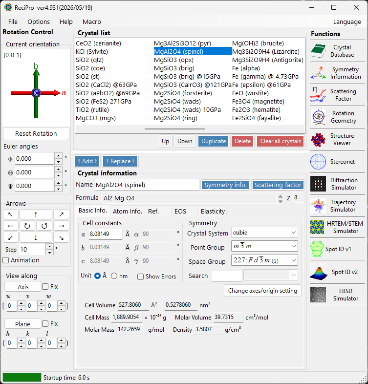

| Area | Location | Description |
|------|----------|-------------|
| **File menu** | Top | File operations, options, help |
| **Rotation control** | Left | View/set crystal orientation |
| **Crystal List** | Upper centre | Select and manage crystals |
| **Crystal Information** | Lower centre | Edit lattice parameters, symmetry, atoms |
| **Functions** | Right | Launch simulation/analysis windows |

---

## Functions panel

The vertical button strip on the right launches the analysis and simulation windows (see the [Functions](#functions) table below).

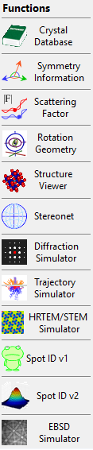

---

## File menu

### File

| Menu item | Description |
|-----------|-------------|
| Read crystal list (as new list) | Load a crystal list file (*.xml), replacing the current list |
| Read crystal list (and add) | Append to the current list |
| Read initial crystal list | Reload the default crystal list |
| Save crystal list | Save the current crystal list |
| Export selected crystal to CIF | Save in CIF format |
| Clear crystal list | Remove all crystals |
| Exit | Close the application |

### Option

| Menu item | Description |
|-----------|-------------|
| Show Tooltips | Toggle tooltip display |
| Use Miller-Bravais (hkil) index | Use 4-index notation for trigonal/hexagonal systems throughout the app |
| Reset registry settings on exit (effective after restart) | Reset settings on next restart |
| Disable Crystallography.Native library (requires restart) | Fall back to managed code if the native (C++) library fails to load |
| Disable all OpenGL rendering (requires restart) | For older GPUs / remote desktop |
| Disable OpenGL text rendering (requires restart) | Workaround for text-rendering issues on some GPUs |
| Use MKL Library | Use Intel MKL for numerical routines |
| Dark mode | Switch between light and dark colour themes |
| Powder diffraction function (under development) | Enable the polycrystalline (powder) diffraction window |
| Capture GUI Components… | Developer tool for saving GUI screenshots |

> **Miller–Bravais index** — enabling **Option ▸ Use Miller-Bravais (hkil) index** switches plane indices to 4-index *hkil* notation for trigonal/hexagonal crystals throughout the program.

### Help

Check for updates, hints, version history, license, GitHub repository, bug/feature reports, and online help — **Help (Web)** and **Help (Wiki)**. Language is switched from the separate **Language** menu (English/Japanese, requires restart).

### Language

### Macro

---

## Rotation control

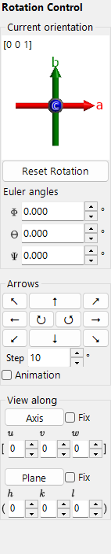

### Current direction

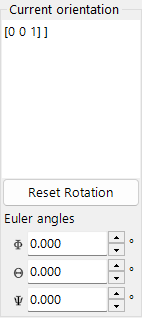

Shows crystal orientation. Drag to rotate. Axes: red = *a*, green = *b*, blue = *c*.

### Reset rotation
Resets to initial: *c*-axis perpendicular to screen, *b*-axis upward.

### Zone axis
Displays closest zone axis to screen normal (e.g., *u*+*v*+*w* < 30).

### Euler angles (Z-X-Z)
- **Psi**: Z-axis rotation, **Theta**: X-axis rotation, **Phi**: Z-axis rotation
- See [3. Rotation Geometry](../4-rotation-geometry.md) and [Appendix A1. Coordinate System](../appendix-a1-coordinate-system.md).

### Arrow buttons / Animation

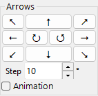

Rotate by angle Step. Check Animation for continuous rotation.

### Project along...

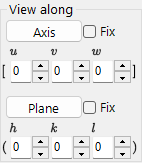

Align a zone axis [*uvw*] or crystal plane (*hkl*) perpendicular to the screen.

---

## Crystal List

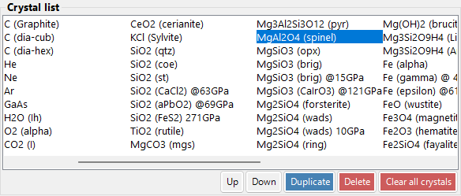

~80 crystals in default installation. Select to view details and set for calculations.

| Button | Action |
|--------|--------|
| Up / Down | Reorder |
| Duplicate | Copy the selected crystal |
| Delete / All clear | Remove crystals |
| Add / Replace | Add to list or replace the selected entry |

---

## Crystal Information

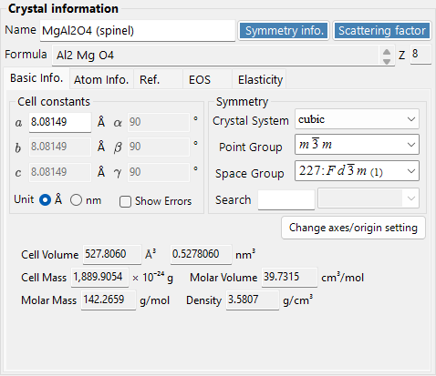

Edit lattice parameters, symmetry, and atoms. Drag & drop CIF/AMC files.

> **Important**: Press **Add** or **Replace** to save changes.

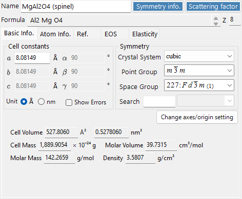

### Basic Info tab

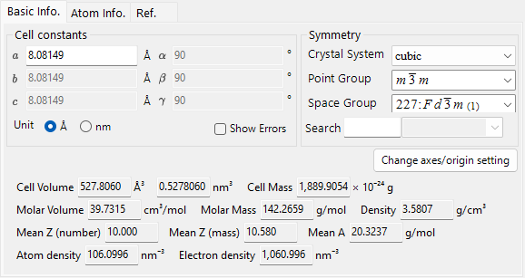

### Atom tab

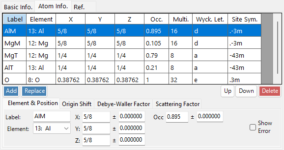

### Reference tab

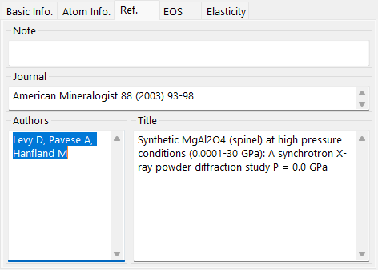

### EOS tab

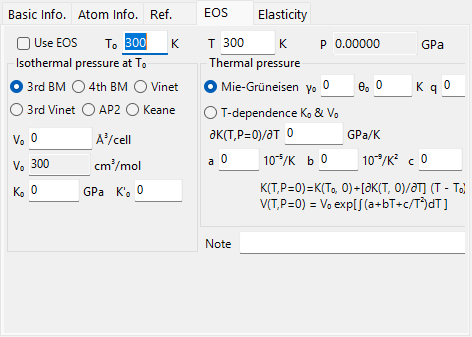

### Elasticity tab

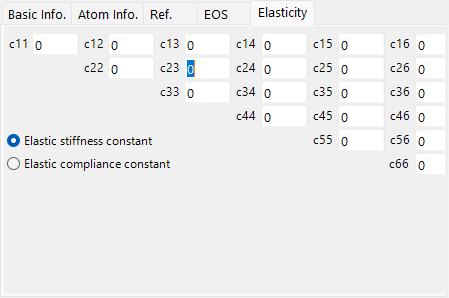

---

## Functions

| Button | Description | Details |
|--------|-------------|---------|
| Crystal Database | Search and import crystals from the bundled / online databases | [1. Crystal database](../1-crystal-database.md) |
| Symmetry Information | Space-group info and ITC Vol. A symmetry diagrams | [11. Symmetry information](../2-symmetry-information.md) |
| Scattering Factor | Crystal planes & structure factors | [12. Scattering factor](../3-scattering-factor.md) |
| Rotation Geometry | 3D rotation matrix / goniometer angles | [3. Rotation Geometry](../4-rotation-geometry.md) |
| Structure Viewer | 3D crystal structure | [5. Structure viewer](../5-structure-viewer.md) |
| Stereonet | Stereographic projection | [6. Stereonet](../6-stereonet.md) |
| Diffraction Simulator | Single-crystal X-ray / electron diffraction | [7. Diffraction simulator](../7-diffraction-simulator/index.md) |
| Trajectory Simulator | Monte-Carlo electron-trajectory simulation | [13. Electron trajectory](../8-electron-trajectory.md) |
| HRTEM/STEM Simulator | HRTEM / STEM image simulation | [8. HRTEM/STEM simulator](../9-hrtem-stem-simulator/index.md) |
| Spot ID v1 | SAED pattern indexing (formerly "TEM ID") | [10. Spot ID v1](../10-spot-id.md) |
| Spot ID v2 | Spot detection & indexing | [10.1 Spot ID v2](../11-spot-id-v2.md) |
| EBSD Simulator | EBSD pattern simulation | [14. EBSD simulation](../12-ebsd-simulation.md) |
| Powder Diffraction | Polycrystalline (powder) diffraction — enable via **Option ▸ Powder diffraction function** | - |

> **Right-click a crystal** in the Crystal List for a context menu: *Rename*, *Export as CIF*, *Duplicate*, *Delete*.
