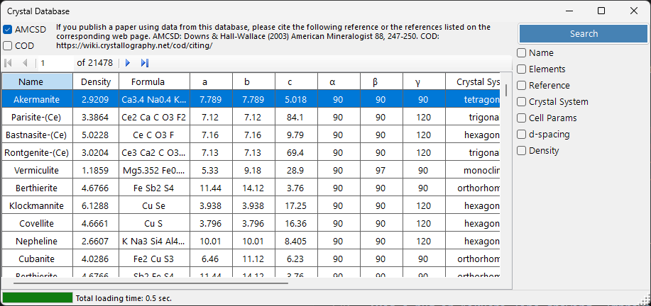
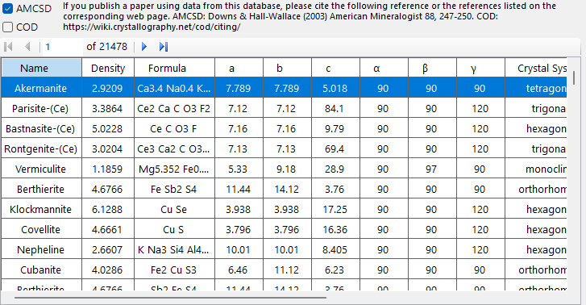
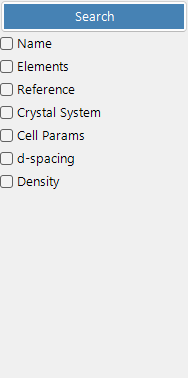

# Crystal Database

The **Crystal Database** provides functions to search and import crystal structures from two sources, selectable with the **AMCSD** and **COD** check boxes:

- **AMCSD** : the bundled [American Mineralogist Crystal Structure Database](https://www.rruff.net/) (more than 20,000 structures).
- **COD** : the [Crystallography Open Database](https://www.crystallography.net/cod/). Because the file is large it is not bundled with the installer; the database file is downloaded automatically on first use. When the file is updated on the server, you are prompted to download it again.

Please cite the following references when using these databases.

When using **AMCSD**:

> Downs, R.T. and Hall-Wallace, M. (2003) The American Mineralogist Crystal Structure Database. *American Mineralogist* **88**, 247-250.

When using **COD**:

> Gražulis, S. et al. (2009) Crystallography Open Database – an open-access collection of crystal structures. *Journal of Applied Crystallography* **42**, 726-729.
>
> Gražulis, S. et al. (2012) Crystallography Open Database (COD): an open-access collection of crystal structures and platform for world-wide collaboration. *Nucleic Acids Research* **40**, D420-D427.

---

## Keyboard & mouse shortcuts

This window has no modifier-key combinations; it is driven by ordinary clicks. The only non-obvious inputs are:

| Shortcut | Action |
|----------|--------|
| <kbd>F1</kbd> | Open this page of the online manual |
| <kbd>ENTER</kbd> in any search field | Run the database search (same as the **Search** button) |
| Click a row in the result table | Load that crystal into the main window |
| Click an element in the **Periodic table** popup | Cycle its filter: *ignore* → *must include* → *must exclude* |

→ See **[21. Keyboard & mouse shortcuts](21-shortcuts.md)** for every window at a glance.

---

## Table

Displays crystals matching search criteria. Select a crystal to transfer to Main window's Crystal Information. Press **Add** or **Replace** to add to Crystal List.

---

## Search options

Enter the search criteria below and press the **Search** button or the **Enter** key.

| Criterion | Description |
|-----------|-------------|
| **Name** | Crystal name |
| **Element** | Periodic table selector (may/must/must-not include) |
| **Reference** | Title, journal, author |
| **Crystal system** | Select crystal system |
| **Cell Param** | Lattice constants and error |
| **d-spacing** | Strongest reflection d-values and error |
| **Density** | Density and error |

### Name

Free-text match against the crystal name. Partial matches are allowed.

### Element

Press the **Periodic Table** button to open the element selector. Each element button cycles between three states:

- **May or may not include** (default — grey)
- **Must include** (green)
- **Must exclude** (red)

The three buttons at the top of the window reset every element to one of the three states in one click.

### Reference

Free-text match against the publication metadata: paper title, journal name, and author list.

### Crystal system

Restrict the search to a specific crystal system (Cubic, Tetragonal, Orthorhombic, Hexagonal, Trigonal, Monoclinic, Triclinic).

### Cell parameter search

Enter target lattice constants *a*, *b*, *c*, *α*, *β*, *γ* and acceptable errors. Empty fields are treated as wildcards.

### d-spacing

Enter the *d*-spacing of the strongest reflection (or several strong reflections) and an acceptable error. Useful when only the diffraction peak positions are known from an experiment.

### Density

Filter by mass density (g/cm³) within an acceptable error band.

---

## See also

- [Main window](0-main-window.md)
- [Symmetry information](2-symmetry-information.md)
- [Beam interaction](3-scattering-factor.md)
- [Structure viewer](5-structure-viewer.md)
