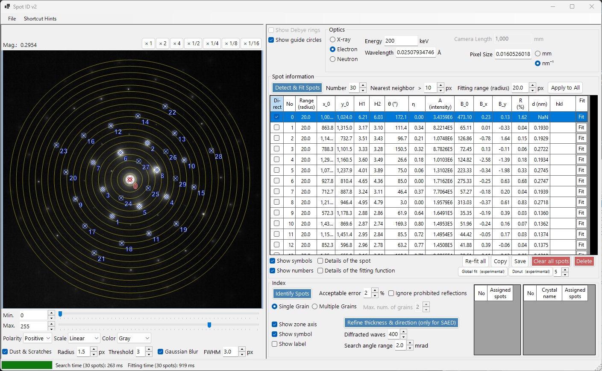
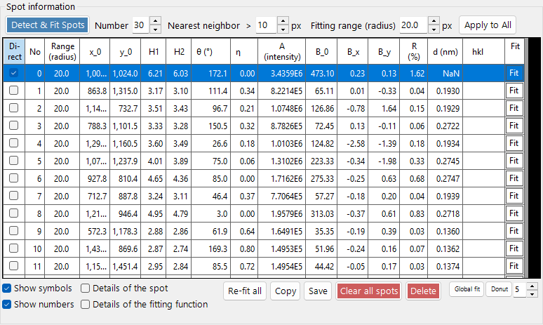
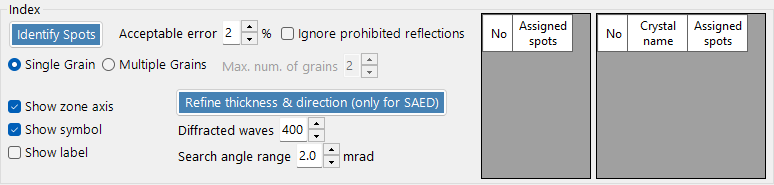
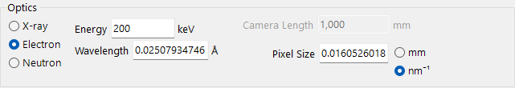

<!-- nav -->

[← 10. Spot ID v1](10-spot-id.md)  |  [🏠 Home](../index.md)  |  [12. EBSD simulation →](14-ebsd-simulation.md)

# Spot ID v2

**Spot ID v2** is the enhanced version of [Spot ID](10-spot-id.md) with improved spot detection, fitting algorithms, and a more powerful indexing engine.

---

## File menu

---

## Spot detection and manipulation

- **Find spots**: Automatic spot detection with advanced peak-finding using local maxima and background subtraction.
- **Donut filter**: Applies a donut-shaped (annular) filter to enhance ring-shaped diffraction features and suppress the central beam.
- **Delete spot / Clear spots**: Remove individual or all detected spots.
- **Reset range for all spots**: Reset the fitting range for all spots to default.
- **Copy to clipboard**: Copy spot positions and intensities to the clipboard for external analysis.

---

## Indexing panel

- **Crystal selection**: Choose which crystals from the crystal list to use as candidates for indexing.
- **Search**: Run the indexing algorithm to find the best-matching crystal and zone axis.
- **Tolerance**: Set the acceptable deviation in d-spacing and angle for a match.
- **Results**: The best matches are displayed with crystal name, zone axis [uvw], and individual spot indices (hkl).

---

## Optics panel

---

## Improvements over v1

- Better noise handling in spot detection.
- More robust fitting algorithms with multiple profile shapes.
- Faster indexing with optimized search algorithms.
- Support for overlapping spots and satellite reflections.

---

[← 10. Spot ID v1](10-spot-id.md)  |  [🏠 Home](../index.md)  |  [12. EBSD simulation →](14-ebsd-simulation.md)
