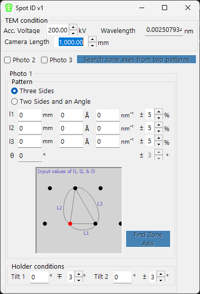

<!-- nav -->

🌐 **English**  |  [日本語](../ja/10-spot-id.md)

[← 9.3. Potential simulation](8-3-potential-simulation.md)  |  [🏠 Home](../index.md)  |  [11. Spot ID v2 →](10-1-spot-id-v2.md)

# Spot ID v1

**Spot ID v1** detects, fits, and indexes diffraction spots from experimental electron diffraction images. It also supports manual zone-axis search from a numerically entered spot geometry (the former **TEM ID**).

---

## Main area

Displays the diffraction image. Load images by drag & drop or from the **File** menu. Right-click or right-drag to zoom.

### Mouse operations

| Operation | Action |
|-----------|--------|
| Single left click | Select a spot |
| Double left click | Add a spot |
| Ctrl + left double-click | Add direct spot |
| Ctrl + right single click | Remove spot |

### Image adjustments

| Setting | Description |
|---------|-------------|
| Min / Max | Brightness range (also adjustable via track bar) |
| Gradient | Positive or Negative |
| Scale | Linear or Log |
| Colour | Grey scale or Cold-Warm |
| Dust & Scratch | Remove exceptional bright/dark pixels (set range and threshold) |
| Gaussian blur | Apply blur (range in pixels) |

---

## Optics

Enter the incident source, energy/wavelength, camera length, and detector pixel size.

> If a dm3/dm4 file (Gatan Digital Micrograph) is loaded, these values are set automatically.

---

## Spot detection and fitting

Press **Detect & fit spots** to automatically detect diffraction spots and fit them with a 2D Pseudo-Voigt function. Results appear in the table.

### Detection options

| Parameter | Description |
|-----------|-------------|
| Number | Maximum number of spots to detect |
| Nearest neighbour | Minimum distance between detected spots |
| Fitting range | Radius (pixels) around each spot for fitting |

### Table controls

| Button | Action |
|--------|--------|
| Reset range | Re-set fitting range for all spots |
| Show label/symbol | Overlay labels/symbols on the image |
| Clear all spots | Remove all spots |
| Save / Copy | Export table in tab-separated (Excel) format |
| Re-fit all | Re-fit all spots |

### Spot detail window

Check the box to open a detail window showing the selected spot (left) and profiles in four directions (right). Blue = observed data, red = fit.

---

## Index

Press **Identify spots** to index detected spots against the crystal selected in the Main window.

| Setting | Description |
|---------|-------------|
| Acceptable error | Tolerance for indexing |
| Single grain / Multi grains | Index as single crystal or multiple grains (set max grain count) |
| Show label/symbol | Overlay indexed labels on image |
| Refine thickness and direction | Apply dynamical theory (Bethe method) to refine sample thickness and crystal orientation that best matches the detected intensities |

---

## Zone-axis search from spot geometry (former TEM ID)

When you do not have an image to load, you can still search for candidate zone axes by entering the geometry of a selected-area electron diffraction (SAED) pattern by hand. Enter the TEM observation conditions and the spot geometry, then press **Search zone axes** to find candidate crystal orientations.

### TEM condition

Enter the TEM observation conditions (acceleration voltage, camera length, etc.).

### Photo 1, 2, 3

Enter the geometry of the diffraction spots.

- To enter spot-to-spot distance on the detector, use the **mm** box.
- If you know the *d*-value, enter it in **Å** or **nm⁻¹** units.

**Three sides mode** — Enter the lengths of the three sides of a triangle with the direct spot as one vertex.

**Two sides and an angle mode** — Enter the lengths of two sides (including the direct spot) and the angle between them.

---

[← 9.3. Potential simulation](8-3-potential-simulation.md)  |  [🏠 Home](../index.md)  |  [11. Spot ID v2 →](10-1-spot-id-v2.md)
