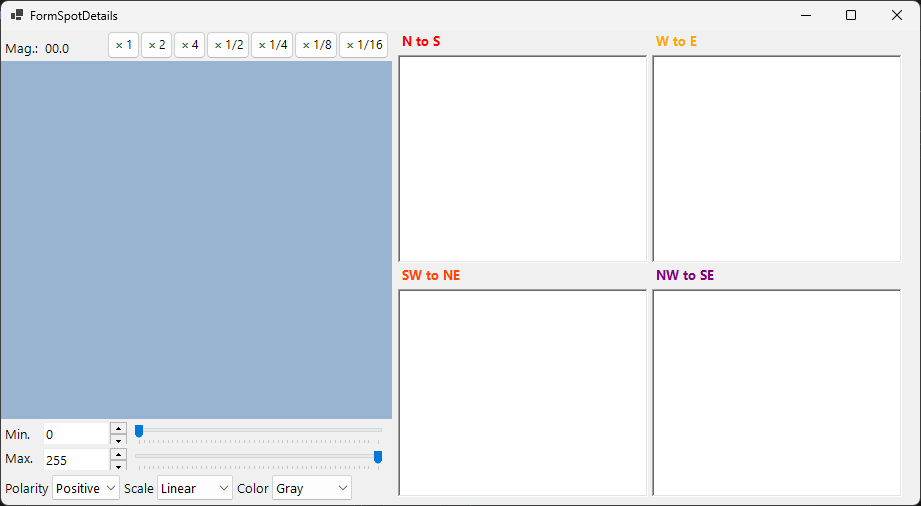

# Spot ID v2

**Spot ID v2** is the enhanced version of [Spot ID](10-spot-id.md) with improved spot detection, fitting algorithms, and a more powerful indexing engine.

---

## Keyboard & mouse shortcuts

You build the spot list directly on the loaded image. The image pane uses ReciPro's standard [image-view navigation](21-shortcuts.md) for pan/zoom; spot editing adds the combinations below.

| Shortcut | Action |
|----------|--------|
| <kbd>F1</kbd> | Open this page of the online manual |
| Left double-click the image | Add a spot at that point (peak-fitted) |
| <kbd>CTRL</kbd> + Left double-click | Add a spot and mark it as the direct (000) beam |
| Left-click a spot | Select the nearest spot |
| <kbd>CTRL</kbd> + Right-click a spot | Delete the nearest spot |
| <kbd>CTRL</kbd> + arrow keys | Nudge the selected spot by one pixel |
| Left-drag / Middle-drag (empty area) | Pan the image |
| Mouse wheel | Zoom in / out at the cursor |
| Right-drag a box | Zoom in to the selected region |
| Right double-click | Zoom out |
| Double-click a spot's row header (table) | Zoom to that spot (×2) |

The main-window <kbd>CTRL</kbd>+<kbd>SHIFT</kbd>+<kbd>T</kbd> opens/closes this window.

→ See **[21. Keyboard & mouse shortcuts](21-shortcuts.md)** for every window at a glance.

---

## File menu

Open / save a diffraction image. The same drag-and-drop loading as [Spot ID v1](10-spot-id.md) is supported, and Gatan DM3/DM4 metadata (camera length, wavelength, pixel size) is honoured automatically.

---

## Optics

### Incident source

Select the radiation type (X-ray / electron / neutron) and set the energy or wavelength.

### Camera length / Pixel size

The camera length (mm) and detector pixel size (mm or nm⁻¹). When a Gatan DM file is loaded, these values are populated from the file header.

---

## Spot information

- **Detect & Fit Spots**: Automatic spot detection using local maxima and background subtraction.
- **Number**: The maximum number of spots to detect.
- **Nearest neighbor**: The minimum separation (px) allowed between detected spots. Peaks closer than this are merged, preventing double-detection of the same spot.
- **Fitting range (radius)**: The radius (px) of the circular region used to fit each spot's peak. Pixels inside this circle are fitted with a pseudo-Voigt function.
- **Apply to All**: Sets the fitting radius of every spot to the current **Fitting range (radius)** value.
- **Delete spot / Clear spots**: Remove individual or all detected spots.
- **Copy to clipboard**: Copy spot positions and intensities to the clipboard.
- **Details of the spot**: When checked, opens a window showing detailed information about the currently selected spot.

---

## Index

- **Identify Spots**: Run the indexing algorithm to find the best-matching crystal and zone axis.
- **Acceptable error**: Set the acceptable deviation in d-spacing and angle for a match.
- **Ignore prohibited reflections**: When checked, reflections forbidden by screw axes and glide planes are treated as not necessarily satisfied while searching for the zone axis.
- **Single Grain / Multiple Grains**: Search for a single orientation (single crystal), or for several orientations (a polycrystalline / multi-grain region). For multiple grains, **Max. num. of grains** sets the upper limit on the number of grains to search for.
- **Results**: The best matches are displayed with crystal name, zone axis [uvw], and individual spot indices (hkl).

---

## Improvements over v1

- Better noise handling in spot detection.
- More robust fitting algorithms with multiple profile shapes.
- Faster indexing with optimized search algorithms.
- Support for overlapping spots and satellite reflections.
