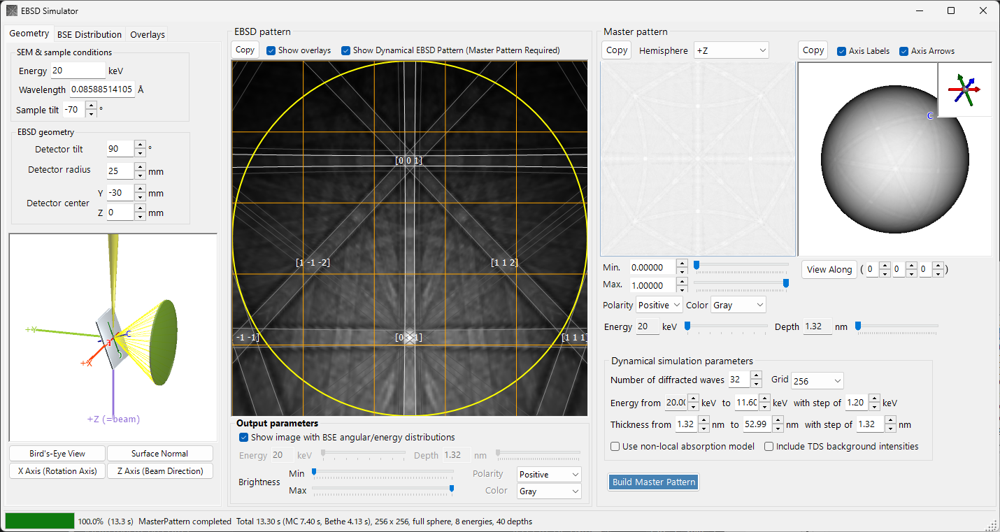
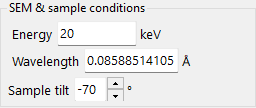
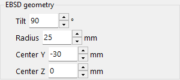
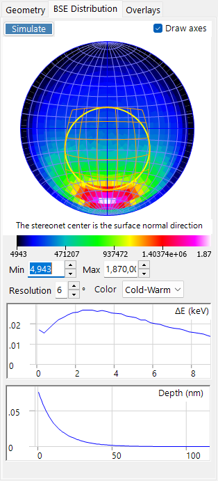
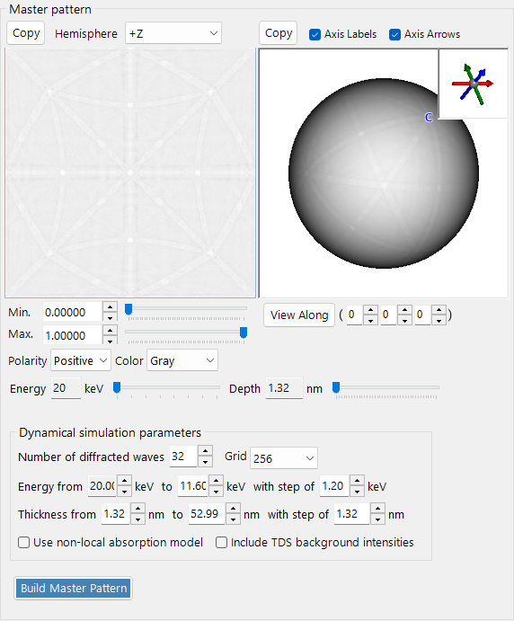
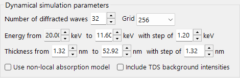
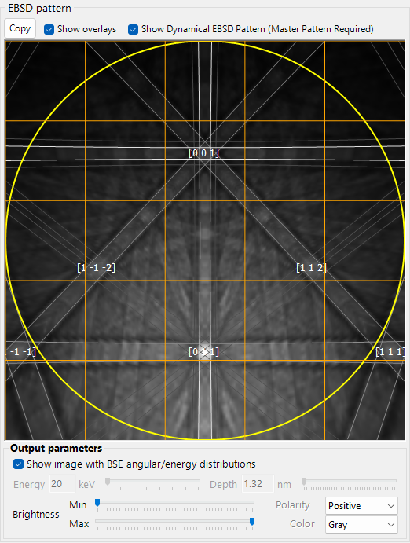
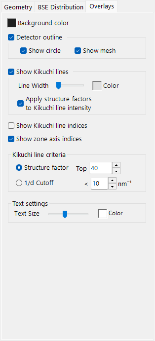

# EBSD Simulation

**EBSD Simulator** simulates the electron backscatter diffraction (EBSD) patterns — Kikuchi patterns — obtained in a scanning electron microscope (SEM), from first principles. It computes the angular/energy/depth distribution of backscattered electrons (BSE) by a Monte-Carlo simulation, builds a dynamical (Bloch-wave) **master pattern** of the crystal, and projects it onto the detector for the current crystal orientation.

The window has three columns.

- **Left** — simulation conditions. The tabs select **Geometry** (sample/detector geometry and a 3D view), **BSE Distribution** (backscattered-electron distributions), and **Overlays** (Kikuchi lines and other annotations).
- **Centre** — the EBSD (Kikuchi) pattern for the current crystal orientation.
- **Right** — the orientation-independent master pattern (2D projection and 3D sphere).

---

## Workflow

Pressing **Build Master Pattern** runs the following steps in order.

1. **Monte-Carlo BSE simulation** — using the current crystal composition, density, accelerating voltage and sample tilt, about 2.5 million electrons are tracked inside the sample (elastic scattering: Mott/NIST cross-sections; inelastic scattering: dielectric-response model). This yields the joint distribution of *penetration depth × exit direction × exit energy* of the backscattered electrons.
2. **Automatic range selection** — from that distribution, the energy range (from the incident energy down to about the 80th percentile of energy loss) and depth range (to about the 99th percentile of penetration depth) used in the dynamical calculation are set automatically.
3. **Master-pattern build** — for each energy and depth, the dynamical diffraction (Bloch-wave) problem is solved and integrated over the sphere of directions, weighted by the Monte-Carlo distribution, to give the backscatter diffraction intensity in every direction. The result is stored on an equal-area (Rosca–Lambert) grid.
4. **Projection onto the detector, with weighting** — for the current crystal orientation, the intensity for the direction subtended by each detector pixel is looked up in the master pattern and drawn as the Kikuchi pattern, optionally weighted by the BSE angular/energy distribution.

The energy and depth ranges are set automatically in steps 1–2, but can be adjusted manually before building.

---

## SEM & sample conditions

- **Energy** — accelerating voltage of the incident beam (keV).
- **Wavelength** — electron wavelength (Å), linked to Energy.
- **Sample tilt** — sample tilt angle (typically 70°). The large tilt in EBSD increases the backscattered-electron yield.

---

## Detector geometry

- **Detector tilt** — tilt of the detector (phosphor screen).
- **Detector radius** — radius of the detector (mm); sets the angular field of view of the drawn pattern.
- **Detector center** — position (Y, Z) of the detector centre relative to the beam-impact point (mm).

The geometry can be inspected in the 3D view on the **Geometry** tab.

The grey plate is the sample, the green cylinder/cone is the detector, and the purple **+Z (=beam)** is the incident beam. The crystal **a / b / c** axes (fixed to the sample) are also shown. The buttons **Bird's-Eye View**, **Surface Normal**, **X Axis (Rotation Axis)** and **Z Axis (Beam Direction)** snap the view to standard directions. See [Appendix A2. Detector Coordinate System](appendix-a2-detector-coordinate-system.md) for the coordinate-system definitions.

---

## Backscattered-electron (BSE) distribution

The **BSE Distribution** tab shows the Monte-Carlo backscattered-electron distributions. Use **Simulate** to recompute them.

- **Stereonet** — angular distribution (histogram of exit directions) of the backscattered electrons. The centre is the surface-normal direction, and the yellow/orange outline marks the region subtended by the detector. **Draw axes** overlays the crystal axes, and the colour scale (Min/Max, resolution, colour) is adjustable.
- **ΔE (keV)** — energy-loss distribution of the backscattered electrons.
- **Depth (nm)** — distribution of the final exit depth of the backscattered electrons.

These distributions are computed by the same Monte-Carlo engine as [Electron trajectory](8-electron-trajectory.md) and are used to weight the master pattern.

---

## Master pattern

The master pattern is the orientation-independent backscatter diffraction intensity over all directions, computed by the dynamical theory with **Build Master Pattern**.

- **2D view** (left) — equal-area projection of a hemisphere. **Hemisphere** selects the projected hemisphere (+Z / −Z).
- **3D view** (right) — a sphere with the intensity mapped onto it. It can be rotated with the mouse, and an inset at the top-right shows the synchronised crystal axes (a/b/c). **Axis Labels** / **Axis Arrows** toggle the labels/arrows, and **View Along** looks down a chosen zone axis [u v w].
- **Min / Max, Polarity, Color** — displayed intensity range, polarity, and colour scale.
- **Energy / Depth** sliders — select the energy/depth slice to display.
- Either view can be sent to the clipboard with **Copy**.

### Dynamical simulation parameters

- **Number of diffracted waves** — number of diffracted beams (waves) included in the Bloch-wave calculation. More waves are more accurate but slower.
- **Grid** — resolution of the master-pattern grid (default 256).
- **Energy from … to … with step of …** — energy range and step integrated over (keV); set automatically from the Monte-Carlo result.
- **Thickness from … to … with step of …** — depth range and step integrated over (nm); likewise set automatically.
- **Use non-local absorption model** — use the non-local absorption form.
- **Include TDS background intensities** — include the thermal-diffuse-scattering (TDS) background.

---

## EBSD pattern

The centre panel shows the EBSD (Kikuchi-band) pattern for the current crystal orientation.

- **Show Dynamical EBSD Pattern (Master Pattern Required)** — projects the built master pattern onto the detector.
- **Show overlays** — draws the overlays (below), such as Kikuchi lines and indices.
- **Output parameters**
  - **Show image with BSE angular/energy distributions** — when checked, the pattern is composited by weighting with the BSE distribution (energy, depth, direction) rather than a single slice.
  - **Energy / Depth** — when the above is off, select the energy/depth slice to display.
  - **Brightness (Min/Max), Polarity, Color** — brightness range, polarity, and colour scale.
- **Copy** — copies the pattern to the clipboard.

---

## Overlays

The **Overlays** tab configures the annotations drawn on the pattern.

- **Background color** — background colour.
- **Detector outline** — the detector outline. **Show circle** (perimeter) / **Show mesh** (grid).
- **Show Kikuchi lines** — draw Kikuchi lines. **Line Width** / **Color**, and **Apply structure factors to Kikuchi line intensity**.
- **Show Kikuchi line indices** — show indices of the Kikuchi lines (bands).
- **Show zone axis indices** — show zone-axis indices.
- **Kikuchi line criteria** — which Kikuchi lines to draw: **Structure factor** (the top *N* by structure factor) or **1/d Cutoff** (those with 1/d below a threshold).
- **Text settings** — **Text Size** / **Color** of the index labels.

---

## See also

- [Electron trajectory](8-electron-trajectory.md) — Monte-Carlo electron-trajectory / BSE simulation used for the angular/energy/depth weighting.
- [Diffraction simulator](7-diffraction-simulator/index.md) — dynamical (Bloch-wave) electron diffraction.
- [Appendix A2. Detector Coordinate System](appendix-a2-detector-coordinate-system.md) — definitions of the sample/detector coordinate systems.
