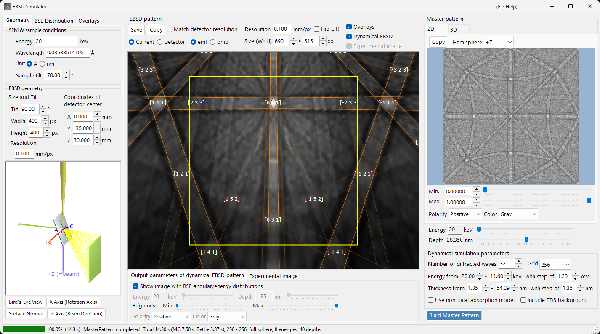
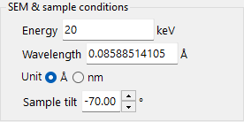
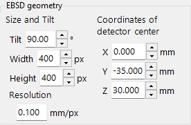
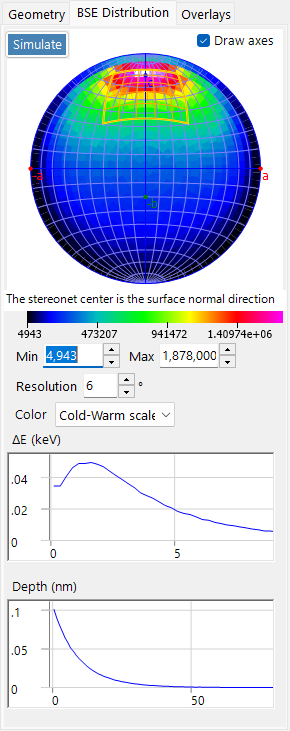
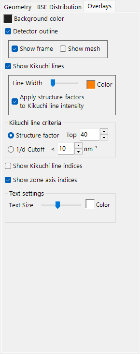
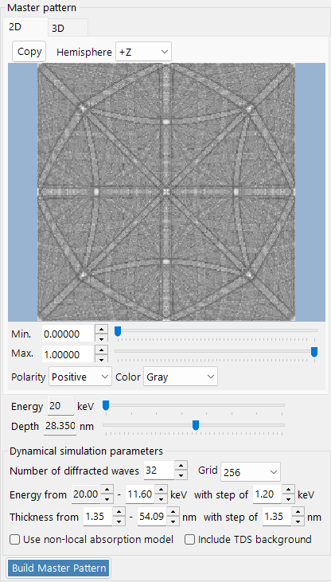
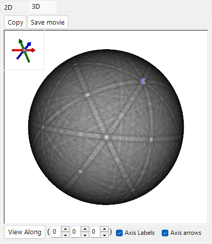
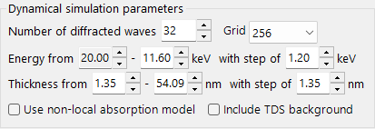
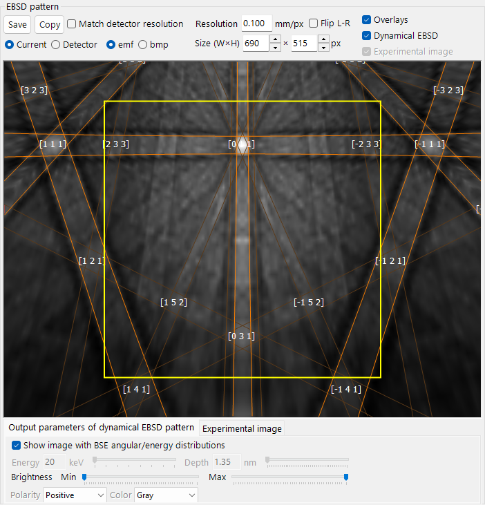
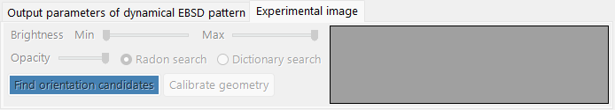

# EBSD Simulation

**EBSD Simulator** simulates the electron backscatter diffraction (EBSD) patterns — Kikuchi patterns — obtained in a scanning electron microscope (SEM), using dynamical-theory calculations. It computes the angular/energy/depth distribution of backscattered electrons (BSE) by a Monte-Carlo simulation, builds a dynamical (Bloch-wave) **master pattern** of the crystal, and projects it onto the detector for the current crystal orientation. An experimental EBSD image can also be loaded and **indexed**: the orientation that best explains it is searched for automatically ([Experimental image](#experimental-image)).

The window has three columns.

- **Left** : simulation conditions. The tabs select **Geometry** (sample/detector geometry and a 3D view), **BSE Distribution** (backscattered-electron distributions), and **Overlays** (Kikuchi lines and other annotations).
- **Centre** : the EBSD (Kikuchi) pattern for the current crystal orientation. Below it, the tabs select **Output parameters of dynamical EBSD pattern** and **Experimental image**.
- **Right** : the orientation-independent master pattern, in the **2D** and **3D** tabs.

The status bar at the bottom shows the progress of the running calculation and a summary of its result.

---

## Keyboard & mouse shortcuts

The centre EBSD (Kikuchi) pattern and the right-hand master-pattern views respond to different mouse actions.

| Shortcut | Action |
|----------|--------|
| <kbd>F1</kbd> | Open this page of the online manual |
| Left-drag the pattern near the centre | Tilt the crystal |
| Left-drag the pattern's outer area | Spin the crystal |
| Double-click the pattern | Pick the detector sub-cell under the cursor and show its statistics |
| Drop an image file on the window | Load it as the experimental EBSD image |
| Left-drag a 3-D view (geometry / master sphere) | Rotate it |
| Right-drag, or Mouse wheel, on a 3-D view | Zoom |
| <kbd>CTRL</kbd> + Right double-click a 3-D view | Toggle orthographic / perspective |
| Drag / wheel on the 2-D master pattern | Pan / zoom the image |

The 3-D views use ReciPro's standard [view navigation](21-shortcuts.md) (panning disabled).

→ See **[21. Keyboard & mouse shortcuts](21-shortcuts.md)** for every window at a glance.

---

## Workflow

Pressing **Build Master Pattern** runs the following steps in order.

1. **Monte-Carlo BSE simulation** : using the current crystal composition, density, accelerating voltage and sample tilt, about 2.5 million electrons are tracked inside the sample (elastic scattering: Mott/NIST cross-sections; inelastic scattering: dielectric-response model). This yields the joint distribution of *penetration depth × exit direction × exit energy* of the backscattered electrons.
2. **Automatic range selection** : from that distribution, the energy range (from the incident energy down to about the 95th percentile of energy loss) and the depth range used in the dynamical calculation are set automatically. The depth here is the master-pattern thickness, i.e. the path length measured along the exit direction (source depth ÷ cos χ, where χ is the angle between the exit direction and the specimen-surface normal). The depth range extends to the 99.9th percentile of that path length for the electrons that reach the detector (rounded up to two significant digits) and is divided into 40 unequal steps that are finer near the surface.
3. **Master-pattern build** : for each energy and depth, the dynamical diffraction (Bloch-wave) problem is solved and integrated over the sphere of directions, weighted by the Monte-Carlo distribution, to give the backscatter diffraction intensity in every direction. The result is stored on an equal-area (Roşca–Lambert) grid.
4. **Projection onto the detector, with weighting** : for the current crystal orientation, the intensity for the direction subtended by each detector pixel is looked up in the master pattern and drawn as the Kikuchi pattern, optionally weighted by the BSE angular/energy distribution.

The energy and depth ranges are set automatically in steps 1–2, but can be adjusted manually before building.

---

## Geometry

### SEM & sample conditions

- **Energy** : accelerating voltage of the incident beam (keV).
- **Wavelength** : electron wavelength, linked to Energy. **Unit** selects Å or nm.
- **Sample tilt** : sample tilt angle (typically −70°). The large tilt in EBSD increases the backscattered-electron yield.

### EBSD geometry

The detector (phosphor screen) is a rectangle defined by a pixel count and a pixel size.

- **Size and Tilt** : **Tilt** is the tilt of the detector plane (°); **Width** and **Height** are the number of detector pixels.
- **Resolution** : the physical size of one detector pixel (mm/px). The physical detector size is therefore Width × Resolution by Height × Resolution.
- **Coordinates of detector center** : position **X**, **Y**, **Z** of the detector centre relative to the beam-impact point (mm). Y and Z, together with the tilt, determine the camera length; X is the left–right offset.

Loading an experimental image sets **Width** and **Height** to the image size, so that one detector pixel corresponds to one image pixel (**Resolution** is left unchanged).

The geometry can be inspected in the 3D view on the **Geometry** tab.

The grey plate is the sample, the green rectangular slab is the detector, and the purple **+Z (=beam)** is the incident beam. The crystal **a / b / c** axes (fixed to the sample) are also shown. The buttons **Bird's-Eye View**, **Surface Normal**, **X Axis (Rotation Axis)** and **Z Axis (Beam Direction)** snap the view to standard directions. See [Appendix A1. Coordinate Systems](appendix/a1-coordinate-system/2-diffraction.md) for the coordinate-system definitions.

---

## BSE Distribution

The **BSE Distribution** tab shows the Monte-Carlo backscattered-electron distributions. Use **Simulate** to recompute them.

- **Stereonet** : angular distribution (histogram of exit directions) of the backscattered electrons. The centre is the surface-normal direction, and the yellow outline marks the rectangular region subtended by the detector. **Draw axes** overlays the crystal axes, and the colour scale (**Min** / **Max**, **Resolution**, **Color**) is adjustable.
- **ΔE (keV)** : energy-loss distribution of the backscattered electrons.
- **Depth (nm)** : distribution of the depth at which the detected backscattered electrons had their last inelastic scattering event — the same depth definition that weights the master pattern.

These distributions are computed by the same Monte-Carlo engine as [Electron trajectory](8-electron-trajectory.md) and are used to weight the master pattern.

---

## Overlays

The **Overlays** tab configures the annotations drawn on the EBSD pattern.

- **Background color** : background colour.
- **Detector outline** : the detector outline. **Show frame** (the yellow rectangle at the detector edge) / **Show mesh** (division grid).
- **Show Kikuchi lines** : draw Kikuchi lines. **Line Width** / **Color**, and **Apply structure factors to Kikuchi line intensity** (each line fades toward the background in proportion to its structure factor).
- **Kikuchi line criteria** : which Kikuchi lines to draw: **Structure factor** (**Top** *N* by structure factor) or **1/d Cutoff** (those with 1/d below a threshold, nm⁻¹).
- **Show Kikuchi line indices** : show indices of the Kikuchi lines (bands).
- **Show zone axis indices** : show zone-axis indices.
- **Text settings** : **Text Size** / **Color** of the index labels.

---

## Master pattern

The master pattern is the backscatter diffraction intensity over all directions, computed in advance by the dynamical theory with **Build Master Pattern** (**Stop** interrupts the running calculation).

- **2D** tab : equal-area (Lambert) projection of a hemisphere. **Hemisphere** selects the projected hemisphere (+Z / −Z).
- **3D** tab : a sphere with the intensity mapped onto it. It can be rotated with the mouse, and an inset at the top-left shows the synchronised crystal axes (a/b/c). **Axis Labels** / **Axis arrows** toggle the labels/arrows, and **View Along** looks down the zone axis [u v w] entered next to it.
- **Energy / Depth** sliders : select the energy/depth slice to preview.
- Either view can be sent to the clipboard with **Copy**.
- **Save movie** (**3D** tab) : saves a movie (MP4) of the spherical master pattern rotating. The rotation direction, speed, duration, fps and quality are set in the same "Movie setting" dialog as in the [Structure Viewer](5-structure-viewer.md). Only this 3D view rotates; the crystal orientation (the Euler angles in the main window) is not changed.

### Dynamical simulation parameters

- **Number of diffracted waves** : number of diffracted beams (waves) included in the Bloch-wave calculation. More waves are more accurate but slower.
- **Grid** : resolution of the master-pattern grid (pixels per side, 64–8192; default 256). 4096 and 8192 need an enormous amount of memory for the intermediate data (with the default 16 energies × 40 depths, about 344 GB at 4096 and 1374 GB at 8192; already about 86 GB at 2048), so the numbers of energy and depth steps must be reduced drastically before they become usable. If memory runs out, the build ends with "MasterPattern failed" (ReciPro itself keeps running).
- **Energy from … to … with step of …** : energy range and step integrated over (keV); set automatically from the Monte-Carlo result.
- **Thickness from … to … with step of …** : depth range and step integrated over (nm); likewise set automatically. The automatic depths are unequally spaced, so the boxes show the shallowest point, the upper end and the first interval as a guide; editing a box by hand switches to equally spaced depths with those values.
- **Use non-local absorption model** : use the non-local absorption form.
- **Non-local source** : replace the local (atom-site) backscatter source with the non-local absorptive-potential form (U'_back integrated over the backward hemisphere). Both use the same physical cross-section, so this is a model switch rather than an additive background.
- **Source depth (MC)** : which Monte Carlo event defines the depth of the coherent backscatter source used for the (energy × depth) weighting: the last inelastic event (default), the last transport event of any kind, or the last decoherence event. In the last case an event resets the source only when it is localized enough to leave which-atom information in the sample: elastic events with the thermal-diffuse probability 1 − exp(−2B s²) from the Debye–Waller factor (coherent Bragg scattering, already in the Bloch waves, does not), inelastic events always for core/high-loss excitations and, for valence excitations, only with the fraction whose momentum transfer exceeds the plasmon cutoff q_c = ω_p/v_F (plasmons and delocalized electron–hole pairs preserve the Bloch state). Shallower sources carry weaker Kikuchi modulation, so the last option sets the diffuse background from transport alone, without a free parameter. Changing it re-bins the stored electrons without re-running the Monte Carlo.
- **Contrast falls with energy loss** (default on, E_c = 0.8 keV) : scales the Kikuchi contrast of each energy slice by A(E) = exp(−(E0 − E)/E_c), where E0 is the beam energy and E the exit energy, and moves the lost part into a flat, direction-averaged pedestal, so the brightness without band contrast is unchanged. The Monte Carlo weights count every backscattered electron, but electrons that have lost much energy carry little sharp Kikuchi contrast; without this correction every slice carries full contrast and the bands come out about 12 % wider than for monochromatic electrons at E0 (Si, 20 kV). The default 0.8 keV was calibrated by matching band widths to one measured Si pattern at 20 kV; whether it holds for other materials and voltages is not known. Changing it only re-weights the existing slices, without recomputing the master pattern or the Monte Carlo.
- **Surface amorphous layer** : thickness (nm) of a non-crystalline surface layer (native oxide, contamination, polishing or ion-milling damage). Electrons whose coherent backscatter source lies inside the layer carry no Kikuchi modulation and are added as a direction-averaged, uniform contribution with the same intensity per electron; sources below the layer are measured from the crystal surface. Transport is computed with the crystal's composition and density, which is adequate for a few nm. 0 disables it; changing it re-bins the stored electrons without re-running the Monte Carlo.
- **Weight by phosphor response** (default on, E_dead = 2 keV) : weight each Monte Carlo electron by the light yield of a phosphor screen, φ(E) = max(0, E − E_dead), instead of counting every electron once. Higher-energy electrons leave the tilted sample more in the forward direction, so the weighting lowers the top-to-bottom intensity gradient of the pattern (for Si at 20 kV from about 2.5 to 1.7 across the detector) and slightly reduces the zone-axis brightness. It applies to the detector-plane binning and to the per-bin energy distribution; changing it re-bins the stored electrons without re-running the Monte Carlo. Turn it off for a direct electron detector that counts electrons. E_dead is the dead-layer (threshold) energy of the phosphor; typical values are 0–3 keV for a P43 screen with an aluminium coating.
- **Re-inject absorbed flux as diffuse background** (default off) : in the Bloch-wave calculation, electrons removed from the coherent channel by absorption (thermal diffuse scattering) simply disappear, although physically they still reach the detector without Kikuchi modulation. This option adds them back as a diffuse background, D(t) = Σσ_n ∫(1 − N(z))dz with N(z) the unit-cell-averaged density of the coherent wave, so that flux is conserved. Absolute intensities rise (about 10 % for Si and 25 % for Fe₃O₄ at 20 kV); the relative brightness of zone axes changes little and depends on the crystal, because the re-injected flux still belongs to the same exit direction. It has no effect when the atomic displacement parameters are zero (no absorption), so set B for crystals that lack it.

---

## EBSD pattern

The centre panel shows the EBSD (Kikuchi-band) pattern for the current crystal orientation. The bar above the pattern controls what is drawn and how it is copied.

- **Dynamical EBSD** : projects the built master pattern onto the detector; unchecked leaves a plain background.
- **Overlays** : draws the Kikuchi lines, indices and detector outline configured in the **Overlays** tab.
- **Experimental image** : overlays the loaded experimental image (see below).
- **Flip L-R** : mirrors the pattern and all its overlays left-right. Unchecked (the default) is the view from the detector towards the sample, i.e. the pattern as an EBSD camera records it; check it only if your experimental image has the opposite handedness.
- **Resolution** (mm/px) and **Size (W×H)** (px) : resolution and size of the displayed view.
- **Save** : saves the pattern to a file, using the range and resolution selected next to it. The format (PNG / TIFF / EMF) is chosen in the save dialog.
  - **Pattern values (\*.csv)** writes the raw intensities on the detector pixel grid instead of an image.
  - A TIFF is written as 16-bit grayscale (not quantised to 256 levels) when the range is **Detector**, **Dynamical EBSD** is shown and **Experimental image** is not. In that case the **Overlays** are left out whatever their checkbox says, and the pixel values are the pattern mapped linearly from its own minimum–maximum onto 0–65535 (the minimum and maximum used are reported in the status bar; use the csv export when absolute values are needed).
- **Copy** : copies the pattern to the clipboard, using the range and format selected next to it.
  - **Current** copies the area currently shown (as panned and zoomed); **Detector** copies only the detector area, in which case the yellow frame is left out so the image ends exactly at the detector edge.
  - **emf** copies an Enhanced Metafile, keeping the Kikuchi lines and index labels as vectors; **bmp** rasterizes everything.
  - **Match detector resolution** copies at one image pixel per detector pixel (the longer side is clamped to 4096 px). Unchecked, the on-screen resolution is used.

### Output parameters of dynamical EBSD pattern

- **Show image with BSE angular/energy distributions** : when checked, the pattern is composited by weighting with the BSE distribution (energy, depth, direction) rather than a single slice.
- **Energy / Depth** : when the above is off, select the energy/depth slice to display.
- **Brightness** (**Min** / **Max**), **Contrast**, **Polarity**, **Color** : the black and white points of the simulated pattern as a percentage of the display range (linear sliders), the width of that range, its polarity and the colour scale. Contrast 0 makes the display range equal to the intensity range of the pattern itself; -1 widens it tenfold (contrast ten times weaker) and +1 narrows it to a tenth, with the centre held fixed.
- **Flatten background** (**FWHM**, px; default off, 100 px) : subtracts a Gaussian-blurred copy of the simulated pattern from itself, removing the slowly varying brightness distribution so that bands and zone axes can be compared with a background-corrected experimental pattern. The FWHM is given in detector pixels and does not depend on the zoom. It affects the displayed image and the PNG/TIFF export; the CSV export keeps the raw values.

### Experimental image

Drop an EBSD image file (TIFF, PNG, BMP or JPEG; 16-bit TIFF is read at full depth) anywhere on the window to load it as the experimental pattern. It is drawn over the detector area — above the simulated pattern and below the Kikuchi-line overlays — so the simulation can be compared with the measurement directly. Loading an image also sets the detector **Width** and **Height** to the image size.

- **Brightness** (**Min** / **Max**), **Contrast** : the black and white points of the overlaid image as a percentage of its display range, and the width of that range (linear sliders, same convention as for the simulated pattern). These act on the experimental image only.
- **Flatten background** (**FWHM**, px; default off, 100 px) : subtracts a Gaussian-blurred copy of the experimental image from itself, removing its slowly varying brightness distribution. The intensity sliders then act on the flattened values.
- **Match to image** : sets **Min**, **Max** and **Contrast** of the simulated pattern so that its 2 % and 98 % intensity levels are shown at the same grey as those of the experimental image. The match uses percentiles, so it does not depend on the orientation solution and is insensitive to a pedestal or to a few bright zone-axis pixels. Polarity, Color and both **Flatten background** settings are left alone, so flatten both sides or neither before pressing it.
- **Opacity** : opacity of the overlaid image, from 0 (invisible) to 100 % (opaque). Lower it to see the simulated pattern underneath.

The orientation that explains the image is then searched for with one of two engines.

- **Radon search** : matches kinematical Kikuchi-band templates against the Radon (line-detection) map of the experimental image. It works without a master pattern; when one exists, the candidates are re-ranked by a robust ZNCC (zero-mean normalized cross-correlation) against the simulated pattern.
- **Dictionary search** : generates dictionary patterns from the dynamical master pattern over all orientations and compares them all by robust ZNCC. It requires the master pattern and takes a few seconds, but is more reliable than Radon search.

**Find orientation candidates** runs the selected engine and lists up to 10 candidates, best first; when a master pattern is available the top candidate is refined to ±0.25°. The columns are:

| Column | Meaning |
|--------|---------|
| **#** | Rank (0 = best) |
| **Score** | Radon band-evidence *z* value |
| **Bands** | Matched bands / predicted bands in the field of view |
| **ZNCC** | Correlation with the simulated pattern |
| **Strong bands (hkl)** | Indices of the matched bands (Radon search only) |

**Clicking a row applies that orientation to the whole program**, so the simulated pattern is redrawn on top of the experimental one and the crystal orientation of every other window follows.

**Calibrate geometry** refines the detector geometry — pattern centre (PC) and detector distance (DD) — alternately with the orientation, by maximizing the ZNCC between the simulated and experimental patterns. It requires the master pattern, keeps the detector tilt fixed, and writes the result back to the **Coordinates of detector center** X/Y/Z boxes. Since the beam scan of an SEM moves the pattern centre by only a fraction of a millimetre, one calibration at the beginning of an experiment is usually enough for a whole series of images.

---

## See also

- [Electron trajectory](8-electron-trajectory.md) — Monte-Carlo electron-trajectory / BSE simulation used for the angular/energy/depth weighting.
- [Diffraction simulator](7-diffraction-simulator/index.md) — dynamical (Bloch-wave) electron diffraction.
- [Appendix A1. Coordinate Systems](appendix/a1-coordinate-system/2-diffraction.md) — definitions of the sample/detector coordinate systems.
