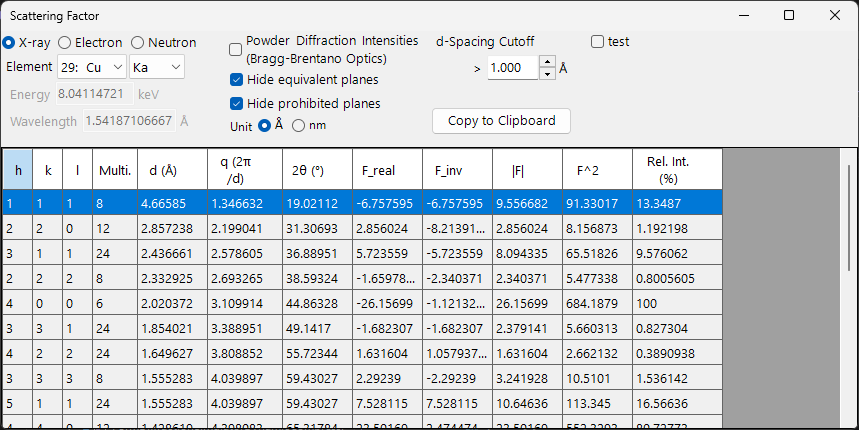
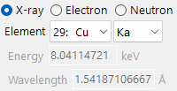

<!-- nav -->

🌐 **English**  |  [日本語](../ja/12-scattering-factor.md)

[← 2. Symmetry information](11-symmetry-information.md)  |  [🏠 Home](../index.md)  |  [4. Rotation Geometry →](3-rotation-geometry.md)

# Scattering Factor

**Scattering Factor** lists the allowed crystal planes (reflections) of the selected crystal and calculates the **structure factor** and diffraction intensity of each. The radiation type (X-ray, electron, or neutron) can be switched, so the structure factors of the same crystal can be compared across diffraction techniques.

The calculation conditions are at the top of the window and the reflection list is at the bottom. The list is recomputed immediately whenever a condition changes.

---

## Radiation type

- **X-ray / Electron / Neutron** — the atomic scattering factors differ by radiation type, so they are switched here.
- For **X-ray**, choosing the **Element** (anode material) and characteristic line (Kα, etc.) sets the wavelength of that characteristic X-ray automatically.

---

## Wave Length Control

- **Energy (keV)** and **Wavelength (Å)** are linked to each other.
- This wavelength is used to compute 2θ (the diffraction angle). For X-ray it can also be set via the element/characteristic-line selection.

---

## Display & calculation options

- **Powder Diffraction Intensities (Bragg-Brentano Optics)** — computes the relative intensity as a powder-diffraction (Bragg–Brentano) intensity, including multiplicity and the Lorentz–polarization factor. When off, the intensity is the structure-factor intensity.
- **Hide equivalent planes** — collapses symmetry-equivalent planes into a single entry.
- **Hide prohibited planes** — excludes planes whose intensity is zero by the extinction rules.
- **Unit (Å / nm)** — length unit for d-spacing, etc.
- **d-Spacing Cutoff** — excludes planes with a d-spacing smaller than this value, dropping the higher-order reflections.

---

## Reflection list

Each row corresponds to one reflection (or a group of symmetry-equivalent planes).

| Column | Meaning |
|------|------|
| **h, k, l** | Miller indices |
| **Multi.** | multiplicity (number of symmetry-equivalent planes) |
| **d (Å)** | interplanar spacing |
| **q (2π/d)** | magnitude of the scattering vector |
| **2θ (°)** | diffraction angle for the selected wavelength |
| **F_real** | real part of the structure factor |
| **F_inv** | imaginary part of the structure factor |
| **\|F\|** | structure-factor amplitude (= √(F_real² + F_inv²)) |
| **F^2** | structure-factor intensity (\|F\|²) |
| **Rel. Int. (%)** | relative intensity, with the strongest reflection set to 100 |

---

## Copy to Clipboard

**Copy to Clipboard** copies the list as text that can be pasted into a spreadsheet.

---

## See also

- [Crystal database](1-crystal-database.md) — defining the crystal whose structure factors are calculated.
- [Diffraction simulator](7-diffraction-simulator.md) — simulating diffraction patterns using the structure factors.

---

[← 2. Symmetry information](11-symmetry-information.md)  |  [🏠 Home](../index.md)  |  [4. Rotation Geometry →](3-rotation-geometry.md)
