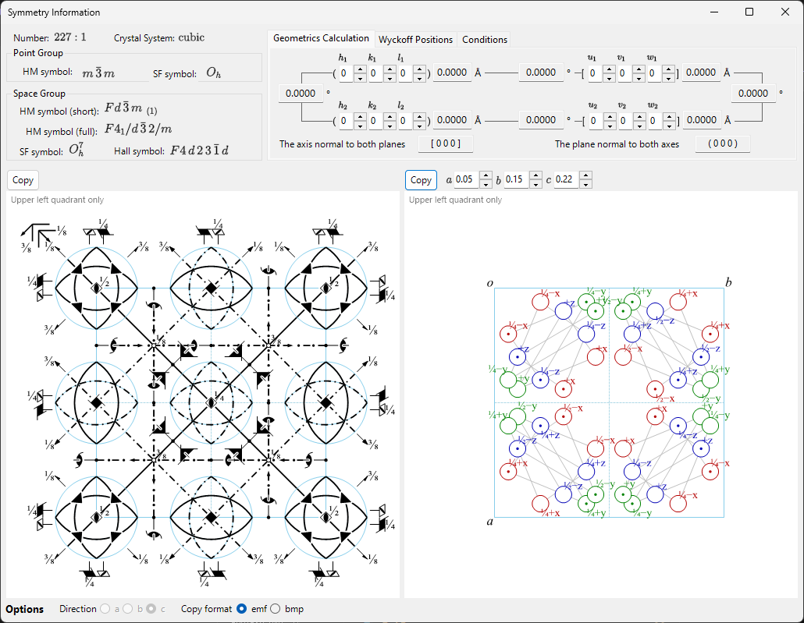
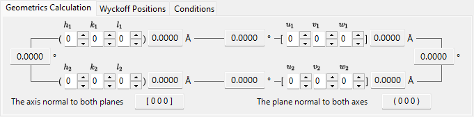
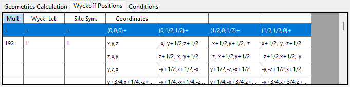
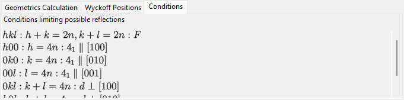

# Symmetry Information

**Symmetry Information** displays detailed information about the space-group symmetry of the selected crystal, and additionally renders schematic diagrams of the symmetry elements and general positions in the style of *International Tables for Crystallography* Vol. A.

The window is divided into a space-group identity area (top left), a calculation/table area with tabs (top right), and two schematic diagrams (bottom).

---

## Keyboard & mouse shortcuts

This window has no special key or mouse combinations. <kbd>F1</kbd> opens this manual page, and the two **Copy** buttons place the symmetry-element diagram and the general-position diagram on the clipboard (as a bitmap, or as a vector EMF when **EMF** is ticked).

→ See **[21. Keyboard & mouse shortcuts](21-shortcuts.md)** for every window at a glance.

---

## Space-group identity

The top-left panel lists, for the current space group:

- **Number** (1–230) and the setting index
- **Crystal System**
- **Point Group** : Hermann–Mauguin (HM) and Schoenflies (SF) symbols
- **Space Group** : HM short symbol, HM full symbol, SF symbol, and **Hall symbol**

---

## Geometrics Calculation

Enter two crystal planes \((h_1, k_1, l_1)\), \((h_2, k_2, l_2)\) or two direction indices \([u_1, v_1, w_1]\), \([u_2, v_2, w_2]\) to obtain:

- the d-spacing of each plane / the length of each axis,
- the angle between the two planes (or two axes),
- **the direction index normal to both planes** and **the plane index normal to both axes**.

These calculations respect the metric of the current unit cell.

---

## Wyckoff Positions

Lists every Wyckoff position with its multiplicity, Wyckoff letter, site symmetry, and whether it is a general or special position. For centred lattices, the lattice translation vectors are shown in the header row.

---

## Conditions

The reflection conditions arising from the lattice centring and from the glide/screw symmetry operators.

---

## Symmetry-element & general-position diagrams

The two panels at the bottom reproduce the schematic symmetry diagrams of the space group in the notation of *International Tables for Crystallography* Vol. A.

- **Symmetry elements (left)**: rotation/screw axes, mirror/glide planes, and inversion centres/rotoinversion points are drawn with the conventional graphical symbols.
  - For the \(F\) lattice of the cubic system, only one-eighth of the unit cell (the upper-left quadrant only) is shown.
  - These symmetry elements can also be drawn directly onto the 3D model in the [Structure Viewer](5-structure-viewer.md).
- **General positions (right)**: the general equivalent positions are plotted as circles (a comma denotes a mirror image), annotated with their fractional coordinates.
  - For the cubic system only, auxiliary lines connect the three circles related by a three-fold rotation axis.

Controls below the diagrams:

- **Direction** (`a` / `b` / `c`) : choose the crystal axis to project along.
- **Copy** each diagram to the clipboard as a vector image (**EMF**) or raster image (**BMP**); EMF can be ungrouped and edited in PowerPoint.

---

## See also

- [Crystal database](1-crystal-database.md)
- [Structure viewer](5-structure-viewer.md)
- [Stereonet](6-stereonet.md)
- [Rotation geometry](4-rotation-geometry.md)
- [Main window](0-main-window.md)
