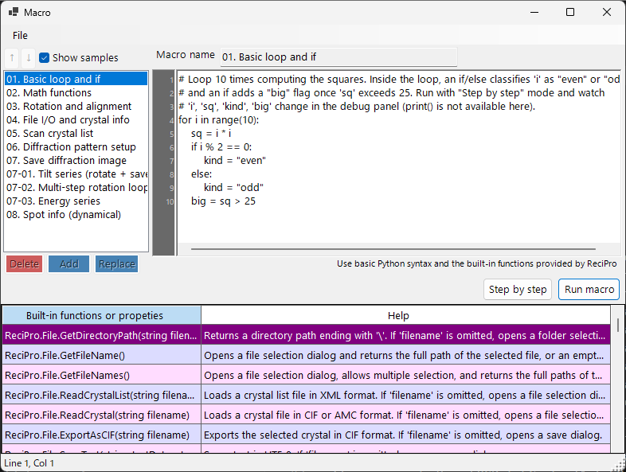

# Macro

ReciPro includes an **IronPython**-based macro system for automating crystal operations, diffraction simulations, and image simulations through scripting.



The screenshot above has **Show samples** turned on, displaying the built-in sample macros. The macro list is on the left, the code editor on the right, and a built-in-function help table at the bottom.

---

## Overview

Macros are written in Python syntax. Using ReciPro's built-in classes and functions, you can programmatically perform the same operations available through the GUI.

- **Language**: Python 3 (IronPython 3.4)
- **Storage**: Compressed binary in Windows Registry (persists across sessions)
- **Access**: Click the Macro button on the main window to open the macro editor

---

## Editor window

The macro editor has four main areas:

| Area | Purpose |
|------|---------|
| **Macro list** (left) | Stored macros. `Add` appends a new macro, `Replace` overwrites the selected one, `Delete` removes it. Up/Down reorder. |
| **Name field** (top) | Identifier of the macro being edited. |
| **Code area** (right) | Python code editor with line-number gutter, auto-indent, syntax help popup. |
| **Built-in function table** (bottom) | List of the built-in functions/properties provided by ReciPro, with a Help description for each. A reference while writing code. |
| **Status bar** (very bottom) | Shows the current caret position as `Line N, Col M`. |
| **Debug panel** (visible during Step execution) | Lists local variables at the current line. |

The title bar shows **`Macro*`** (with an asterisk) while there are unsaved edits, and reverts to **`Macro`** after Add / Replace / Ctrl+S.

### Sample macros

Turning on **Show samples** (top-left) temporarily replaces your macro list with the built-in sample macros (basic loop and conditionals, math functions, rotation/alignment, scanning the crystal list, diffraction/image simulation, tilt/energy series, spot info, and more). The samples are read-only and shown in the current UI language; use them for learning or as a starting point to copy. Turning it off restores your own macros.

---

## Editing features

- **Auto-indent**: When you press Enter, the next line inherits the current line's leading whitespace. If the line ends with `:` (after `def`/`if`/`for`/etc.), one extra indent level (4 spaces) is added automatically.
- **Smart Backspace**: Inside leading whitespace, Backspace removes a full indent level (4 spaces) instead of a single character.
- **Tab / Shift+Tab**:
  - No selection: insert / remove one indent level at the caret.
  - Multi-line selection: indent / outdent every selected line at once.
- **Autocomplete**: As you type, a popup lists matching function names and language keywords. Arrow keys navigate, Enter or Tab accepts, Esc cancels.
- **Tooltip help**: Hovering a selected autocomplete entry shows its documentation.

### Keyboard shortcuts

| Shortcut | Action |
|----------|--------|
| `Ctrl+S` | Save the current code into the selected macro entry (in-place) |
| `F10` | Step to the next line (during Step execution) |
| `Enter` | Insert newline with auto-indent |
| `Tab` / `Shift+Tab` | Indent / outdent |
| `Backspace` | Delete one indent level if inside leading whitespace |
| `Ctrl+↑` / `Ctrl+↓` | N/A — use the Up/Down buttons to reorder macros |

---

## Running macros

Two run modes:

- **Run macro**: Execute the code to the end. Errors pop up a dialog showing the Python traceback and highlight the offending line in the editor.
- **Step by step**: Pause before each line. The debug panel shows local variables. Use `F10` (or the **Next step (F10)** button) to advance, or **Stop** to abort.

**Stop** only works during Step mode (standard Run macro execution cannot be interrupted because IronPython does not honour `CancellationToken` and everything runs on the UI thread).

---

## Python language support

This macro environment is **IronPython 3.4**. Not all Python features are meaningful here.

### Pre-imported

- **`math`** is imported at startup. Use `math.sqrt(x)`, `math.sin(x)`, `math.pi`, `math.radians(deg)`, etc. directly.

### Usable

- Control flow: `if`/`elif`/`else`, `for`, `while`, `def`, `class`, `return`, `try`/`except`/`finally`, `pass`, `break`, `continue`, `lambda`
- Literals: `True`, `False`, `None`
- Built-in functions: `len`, `range`, `abs`, `min`, `max`, `sum`, `sorted`, `enumerate`, `zip`, `int`, `float`, `str`, `list`, `dict`, `tuple`, `type`, `isinstance`
- Standard library modules that are pure Python: `random`, `datetime`, `time`, `re`, `json`, `itertools`, `functools`, `collections`

These basics are pre-registered in the autocomplete popup, so you can discover them by typing the first few letters.

### NOT usable

- **`print()`** — there is no console window; output goes nowhere. Use **Step by step** and look at the debug panel to inspect values.
- **`input()`** — no stdin.
- **File I/O** (`open`, `with open`) — not intended for macros. Use `ReciPro.File.*` helpers instead.
- **C-extension packages**: `numpy`, `scipy`, `pandas`, `matplotlib` — not compatible with IronPython.

---

## API access

The ReciPro macro API is exposed under the top-level name **`ReciPro`**. Every built-in class is a field of `ReciPro`:

```python
ReciPro.File.*         # File I/O helpers
ReciPro.Crystal.*      # Currently selected crystal
ReciPro.CrystalList.*  # Manage the crystal list
ReciPro.Dir.*          # Crystal orientation (Euler, zone-axis, rotation)
ReciPro.DifSim.*       # Diffraction simulator
ReciPro.HRTEM.*        # HRTEM simulation
ReciPro.STEM.*         # STEM simulation
ReciPro.Potential.*    # Potential simulation
ReciPro.Sleep(ms)      # Pause execution (milliseconds)
```

The autocomplete popup always shows the full `ReciPro.Class.Member` form and inserts it verbatim, so you rarely need to type the prefix by hand.

See [20.1. Built-in functions](1-built-in-functions.md) for the complete API reference.

---

## Error messages

When a macro fails, a dialog shows the Python traceback in the standard format:

```
Traceback (most recent call last):
  File "<string>", line 5, in <module>
NameError: name 'abc' is not defined
```

The editor automatically selects the line reported in the traceback (the innermost frame), so you can fix the problem immediately. Syntax errors are reported with line numbers as well, before execution starts.

---

## See also

- [20.1. Built-in functions](1-built-in-functions.md)
- [20.2. Examples](2-examples.md)
