# Beam Interaction

**Beam Interaction** describes how the selected crystal interacts with an incident beam of **X-rays, electrons, or neutrons**. For one chosen radiation it computes the allowed reflections and their structure factors, the attenuation and transport of the beam through the material, the atomic scattering factors of each element, and (for X-rays) the characteristic fluorescence lines. Switching the radiation type at the top recomputes everything, so the same crystal can be compared across diffraction and spectroscopy techniques.

The incident beam is selected in the band at the top of the window; the four tabs below — **Reflections**, **Attenuations & Transport**, **Scattering factors**, and **Fluorescence** — show the different aspects of the interaction. Each tab section below shows the tab under **X-ray / Electron / Neutron** beams (use the tabs in each figure); the content changes markedly with the beam.

!!! note "X-ray data and the bundled xraylib library"
    Many of the X-ray quantities (anomalous dispersion $f'/f''$, the $F(q)+S(q)$ scattering split, the photo / Rayleigh / Compton breakdown of the mass attenuation, absorption-edge jumps, and fluorescence yields) are evaluated with the bundled **[xraylib](https://github.com/tschoonj/xraylib)** library. If xraylib is unavailable, ReciPro falls back to its internal tables (photoabsorption-only attenuation, characteristic-line energies only) and the affected cells show **N/A**. The **source** row of each table states which data set was used.

---

## Keyboard & mouse shortcuts

This window has no special key combinations. <kbd>F1</kbd> opens this manual page. On the **Scattering factors** tab the vertical cursor line can be **dragged** to read off the scattering factor of each element at that position, and every tab has a **Copy** button that exports its table as spreadsheet-pasteable text.

→ See **[21. Keyboard & mouse shortcuts](21-shortcuts.md)** for every window at a glance.

---

## Beam and wavelength

The top band is a **Wave Length Control** shared with the other simulators.

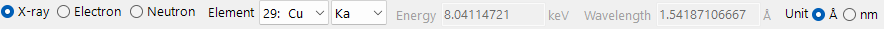

- **X-ray / Electron / Neutron** : the atomic scattering factors and the interaction physics differ by the type of incident beam, so they are switched here.
- For **X-ray**, choosing the **Element** (anode material) and characteristic line (Kα, etc.) sets the wavelength of that characteristic X-ray automatically.
- **Energy (keV)** and **Wavelength (Å)** are linked; setting either updates the other, and both drive the 2θ used in the **Reflections** table.
- **Unit (Å / nm)** switches the length unit used for d-spacing and similar quantities.

The chosen beam also decides which tabs and curves are meaningful:

| Beam | Reflections | Attenuations & Transport | Scattering factors | Fluorescence |
|------|------|------|------|------|
| **X-ray** | structure factors incl. anomalous dispersion | µ/ρ, µ, transmission + absorption edges (vs energy) | $f(s)$ or $F(q)+S(q)$ | characteristic lines + EDX sticks |
| **Electron** | electron structure factors | σ, MFP, dE/ds, IMFP, range (vs energy) | Peng / Kirkland / 8-Gaussians | — (hidden) |
| **Neutron** | nuclear structure factors | scattering lengths & cross sections (no energy curve) | scattering lengths (no *s* dependence) | — (hidden) |

The **Fluorescence** tab is X-ray-only and disappears for electron and neutron beams. For neutrons the energy-dependent graphs in **Attenuations & Transport** and **Scattering factors** are replaced by element tables, because the nuclear scattering length does not depend on scattering angle or energy.

---

## Reflections tab

Lists the allowed crystal planes (reflections) of the crystal and the **structure factor** and diffraction intensity of each. For X-rays the structure factor now includes the **anomalous dispersion** terms $f'/f''$ at the current energy, so `F_inv` (the imaginary part) is generally non-zero near an absorption edge. The layout is the same for every beam; only the structure-factor values and the 2θ of each reflection change.

=== "X-ray"
    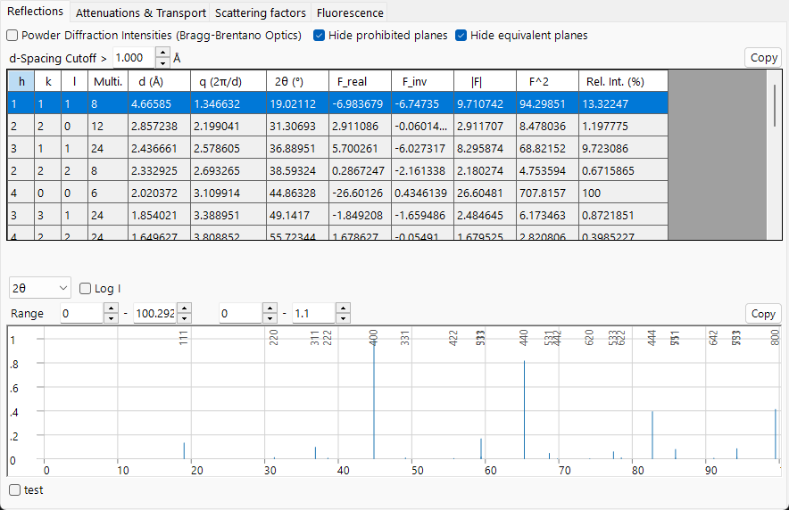

=== "Electron"
    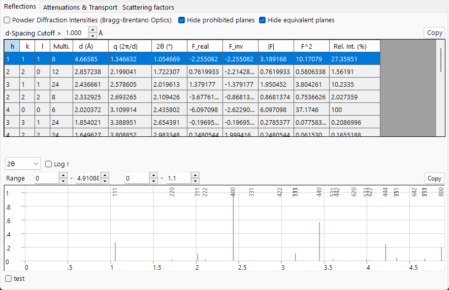

=== "Neutron"
    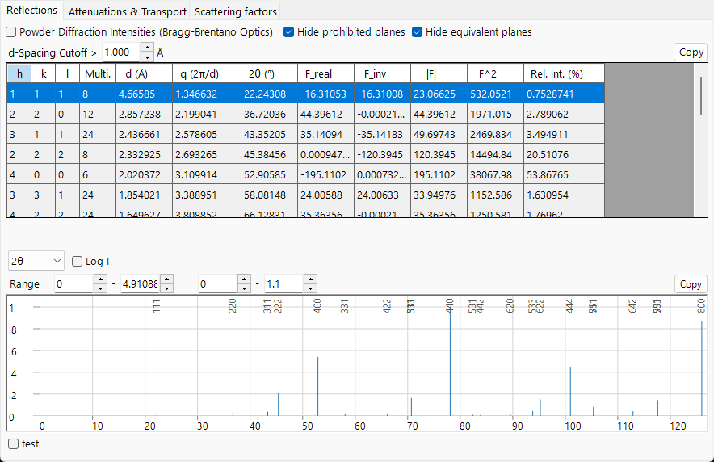

**Options**

- **Powder Diffraction Intensities (Bragg-Brentano Optics)** : computes the relative intensity as a powder-diffraction (Bragg–Brentano) intensity, including multiplicity and the Lorentz–polarization factor. When off, it displays the structure-factor intensity. Turning it on also forces *Hide equivalent planes* and *Hide prohibited planes* on.
- **Hide equivalent planes** : collapses crystallographically equivalent planes into a single entry.
- **Hide prohibited planes** : excludes planes whose intensity is zero by the extinction rules.
- **d-Spacing Cutoff >** : excludes reflections with a d-spacing smaller than this value (length unit follows the **Unit** selection).

Each row is one reflection (or a group of symmetry-equivalent planes):

| Column | Meaning |
|------|------|
| **h, k, l** | Miller indices |
| **Multi.** | multiplicity (number of symmetry-equivalent planes) |
| **d (Å)** | interplanar spacing |
| **q (2π/d)** | magnitude of the scattering vector |
| **2θ (°)** | diffraction angle for the selected wavelength |
| **F_real** | real part of the structure factor |
| **F_inv** | imaginary part of the structure factor (non-zero with X-ray anomalous dispersion) |
| **\|F\|** | structure-factor amplitude ($= \sqrt{F_\text{real}^2 + F_\text{inv}^2}$) |
| **F^2** | structure-factor intensity ($\lvert F\rvert^2$) |
| **Rel. Int. (%)** | relative intensity, with the strongest reflection set to 100 |

**Diffraction-peak plot.** Below the table the same reflections are drawn as a stick pattern, with the strongest peaks labelled by their *hkl*.

- The horizontal-axis selector chooses among **2θ** (scattering angle in degrees), **d** (lattice-plane spacing), and **Q** ($= 4\pi\sin\theta/\lambda$, the scattering vector / momentum transfer). The three options describe the same reflections; only the horizontal scale changes.
- **Log I** switches the intensity axis between linear and logarithmic. Diffraction intensities span many orders of magnitude, so a logarithmic scale stretches the bottom to reveal the weak peaks that a linear scale flattens against the baseline.
- The **Range** boxes set the plotted horizontal and intensity range.

---

## Attenuations & Transport tab

How far the beam penetrates the material and how it loses energy. The content depends on the beam.

=== "X-ray"
    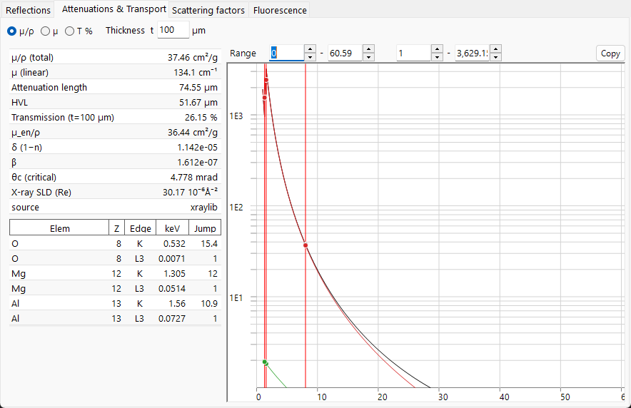

=== "Electron"
    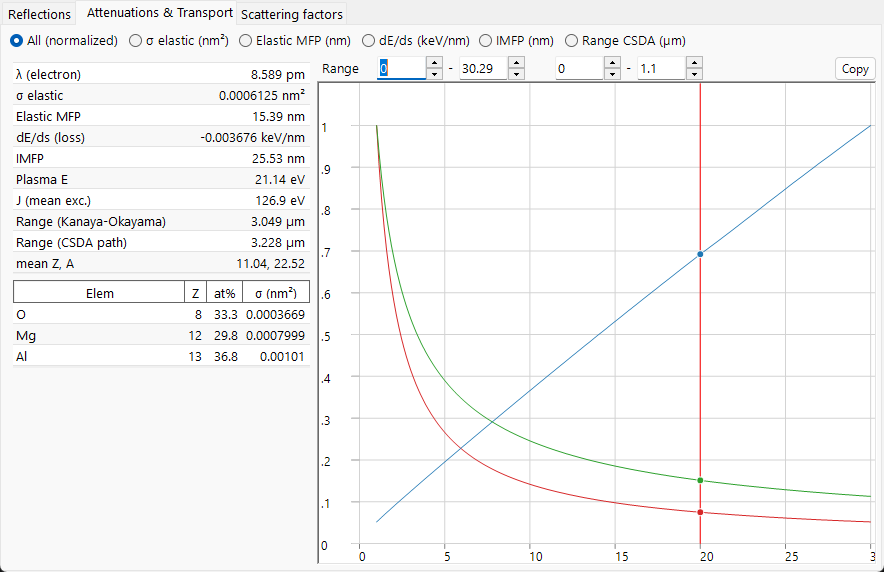

=== "Neutron"
    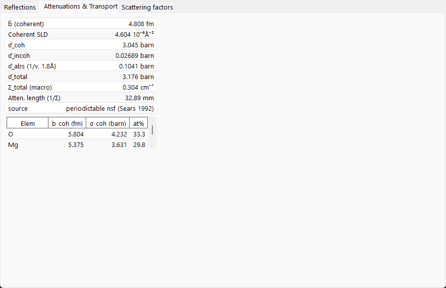

### X-ray

The radio buttons choose the plotted coefficient against photon energy (1–60 keV, logarithmic axis):

- **µ/ρ** — the **mass** attenuation coefficient (cm²/g): how strongly the material removes X-rays per gram, independent of how densely it is packed (this is the value found in reference tables). The graph shows the **total** together with its **photo**, **Rayleigh**, and **Compton** components.
- **µ** — the **linear** attenuation coefficient $\mu = (\mu/\rho)\cdot\rho$ (cm⁻¹): the attenuation per centimetre of the actual material at its real density. The transmitted intensity follows $I = I_0\,e^{-\mu t}$, and $1/\mu$ is the distance over which the intensity falls to about 37 % (1/e).
- **T %** — the **transmission** $T = e^{-\mu t}$ in percent for the sample thickness **t** set in the **Thickness t** box (µm). 100 % = transparent, 0 % = fully blocked; use this to judge a sensible sample thickness at the current energy.

The vertical lines mark the current energy and each element's **absorption edges**. The scalar table on the left lists, at the current energy: **µ/ρ (total)**, **µ (linear)**, **Attenuation length** ($1/\mu$), **HVL** (half-value layer, $\ln 2/\mu$), **Transmission** at thickness *t*, **µ_en/ρ** (mass energy-absorption coefficient), the X-ray refractive-index decrements **δ** and **β** ($n = 1-\delta+i\beta$), the **θc (critical)** angle for total external reflection, and the real **X-ray SLD** (scattering-length density). The lower table lists the **K** and **L3** absorption **edge** energies and their **Jump** ratios for each element.

### Electron

The quantity selector chooses what is plotted against beam energy (1–30 keV):

- **All (normalized)** — overlays the three curves below, each rescaled to its own maximum so the shapes can be compared on one plot (read absolute values from the table).
- **σ elastic (nm²)** — elastic scattering cross section: how likely a single atom is to deflect the electron.
- **Elastic MFP (nm)** — mean free path: the average distance the electron travels between elastic scattering events.
- **dE/ds (keV/nm)** — stopping power: the energy the electron loses per nanometre of travel.
- **IMFP (nm)** — inelastic mean free path: the average distance between energy-losing collisions.
- **Range CSDA (µm)** — the total path length the electron travels before it stops.

The scalar table lists the electron **wavelength**, **σ elastic**, **Elastic MFP**, **dE/ds**, **IMFP**, the **Plasma E** and mean excitation energy **J**, two electron **ranges** (the Kanaya–Okayama penetration estimate and the CSDA integrated path length), and the mean **Z, A**. The per-element table gives each element's atomic fraction and elastic cross section σ. The elastic cross sections use the **NIST Mott** data (50 eV–36 keV) and fall back to **screened Rutherford** above 36 keV.

### Neutron

Neutron interaction is set by nuclear cross sections rather than an energy-dependent curve, so this tab shows tables only. The scalar table lists the mean coherent scattering length **b̄**, the **Coherent SLD**, the averaged coherent / incoherent / absorption / total cross sections (**σ̄_coh**, **σ̄_incoh**, **σ̄_abs**, **σ̄_total**), the macroscopic total cross section **Σ_total** and the corresponding **attenuation length**. The absorption cross section is evaluated with the 1/v law at the current wavelength; nuclides where this is invalid (Cd, Sm, Eu, Gd resonant absorbers) are flagged. The per-element table lists **b_coh**, **σ_coh**, and the atomic fraction.

---

## Scattering factors tab

The atomic scattering factor of each constituent element, plotted against $s = \sin\theta/\lambda$ (Å⁻¹). Each element is drawn in its own colour, and the **vertical cursor line** can be dragged to read off the scattering factor of every element at that position into the table on the left.

=== "X-ray"
    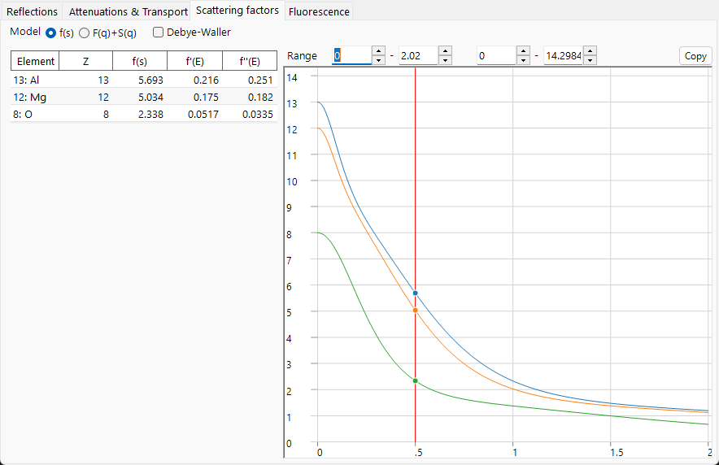

=== "Electron"
    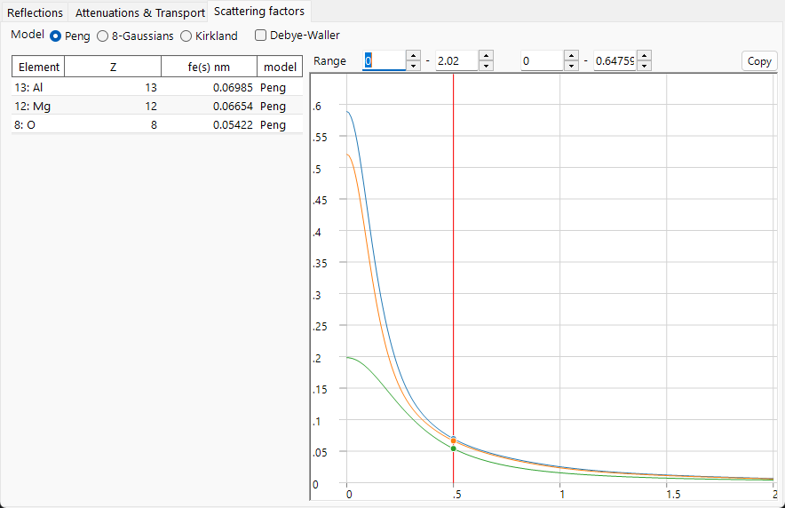

=== "Neutron"
    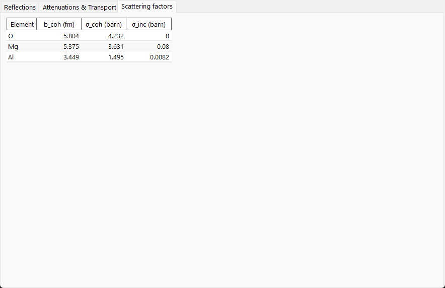

- **X-ray** offers two **Model** modes: **f(s)** plots the conventional X-ray atomic scattering factor (in electron units); **F(q)+S(q)** plots the Rayleigh **coherent** form factor $F(q)$ together with the Compton **incoherent** scattering function $S(q)$ (from xraylib). The table also lists the anomalous-dispersion terms **f'(E)** and **f''(E)** at the current energy.
- **Electron** offers three parametrizations of the electron scattering factor: **Peng**, **Kirkland**, and **8-Gaussians**. The table shows $f_e(s)$ (nm) and which **model** produced it.
- **Neutron** scattering lengths do not depend on $s$, so no curve is drawn; the table lists each element's coherent scattering length **b_coh** and its coherent / incoherent cross sections.
- **Debye-Waller** multiplies each factor by the thermal damping $e^{-B s^2}$ using each atom's isotropic displacement parameter.

---

## Fluorescence tab

For an X-ray beam, the characteristic **fluorescence** emission of the sample. (This tab is hidden for electron and neutron beams.)

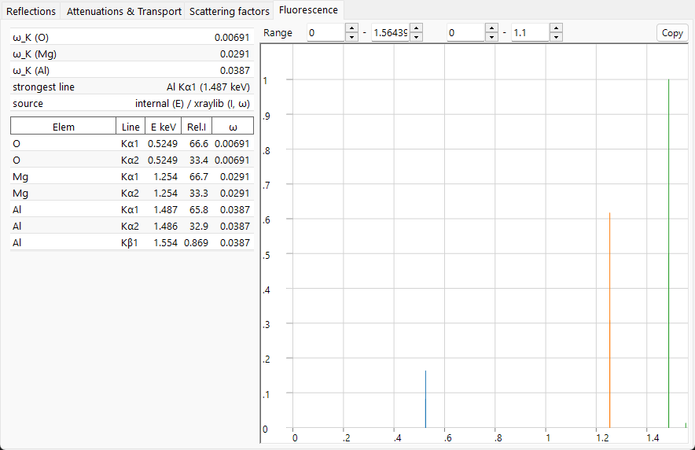

The **EDX emission lines** plot draws the characteristic lines (Kα1, Kα2, Kβ1, Lα1, Lα2, Lβ1) of every element as sticks at their photon energies, with the height proportional to the atomic fraction × radiative rate × fluorescence yield (a qualitative EDX-style preview; excitation cross section and detector efficiency are not modelled). The lower table lists, per line, the element, line name, energy **E keV**, relative intensity **Rel.I**, and the fluorescence yield **ω**. The scalar table reports the K-shell yield **ω_K** of each element and the **strongest line** in the spectrum.

---

## Copy to Clipboard

Each tab has a **Copy** button that copies its table to the clipboard as text that can be pasted into a spreadsheet such as Excel.

---

## See also

- [Crystal database](1-crystal-database.md) — defining the crystal whose interaction is calculated.
- [Diffraction simulator](7-diffraction-simulator/index.md) — simulating diffraction patterns using the structure factors.
