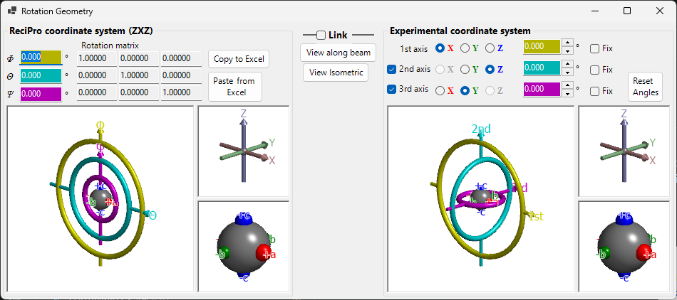

# Rotation Geometry

This window represents the rotational state of a crystal as a 3×3 matrix and converts between different Eulerian coordinate systems.

ReciPro uses three Euler angles — **Ψ**, **θ**, and **Φ** — applied in **Z–X–Z** order. However, this convention does not necessarily match the goniometer axes of your actual instrument. The **Rotation Geometry** window lets you convert ReciPro's Euler angles to an arbitrarily defined coordinate system, supporting goniometer adjustment in the laboratory.

---

## ReciPro coordinate system (ZXZ)

The upper half of the window shows the rotation state in the "ReciPro coordinate system".

- **Φ, θ, Ψ** values are synchronised with the Euler angles set in the Main window.
- **Rotation matrix** displays the 3×3 matrix corresponding to the current rotation state.

### OpenGL windows

The 3D view shows the current rotation using three coloured toruses (doughnuts):

| Colour | Euler angle | Goniometer level |
|--------|------------|-----------------|
| **Yellow** | Φ | 1st (upper) axis |
| **Light blue** | θ | 2nd (middle) axis |
| **Pink** | Ψ | 3rd (lower) axis |

The **red**, **green**, and **blue** arrows represent the X, Y, Z axes in real-space Cartesian coordinates. These are *not* the same as the crystal axes shown in the Main window.

The grey sphere at the centre represents the sample; red/green/blue spheres show how the object has rotated from its initial orientation (when Φ = θ = Ψ = 0, they align with +X, +Y, +Z respectively).

> **Note**: Dragging in the OpenGL window changes only the *projection direction* of this view, not the crystal orientation itself. To rotate the crystal, use the Main window.

### Buttons

| Button | Action |
|--------|--------|
| Copy to Excel | Copy the 3×3 rotation matrix in tab-separated format |
| Paste from Excel | Set rotation matrix from clipboard (tab-separated 3×3) |
| View along beam | Match the Main window projection (Z-axis perpendicular to screen) |
| Isometric | Switch to isometric projection |

---

## Experimental coordinate system

The lower half defines Euler angles on an arbitrary set of rotation axes and gets/sets the goniometer state. This is called the **Experimental coordinate system**.

### 1st, 2nd, 3rd axes

Select the rotation axes of the goniometer from **±X**, **±Y**, and **±Z** for each level (upper, middle, lower). The graphics update accordingly.

The Euler angles for each axis are displayed in the corresponding coloured text boxes (yellow, light blue, pink). You can also enter values directly.

---

## Link

When **Link** is checked, the ReciPro coordinate system and the Experimental coordinate system are coupled: their Euler angles are adjusted so that the object orientation is consistent between the two systems.

### Example workflow

1. In the laboratory, set a goniometer so that the *a*-axis of a crystal is aligned with the X-ray incidence direction and the *b*-axis is horizontal.
2. Enter the laboratory goniometer's Euler angles in the Experimental coordinate system.
3. In the Main window, rotate the crystal so that the *a*-axis faces the screen normal and the *b*-axis faces horizontal.
4. Check **Link** — now, whenever you point the crystal to a different orientation in the Main window, the required goniometer angles are automatically displayed.
