# Structure Viewer

**Structure Viewer** draws the selected crystal as a three-dimensional image using OpenGL.

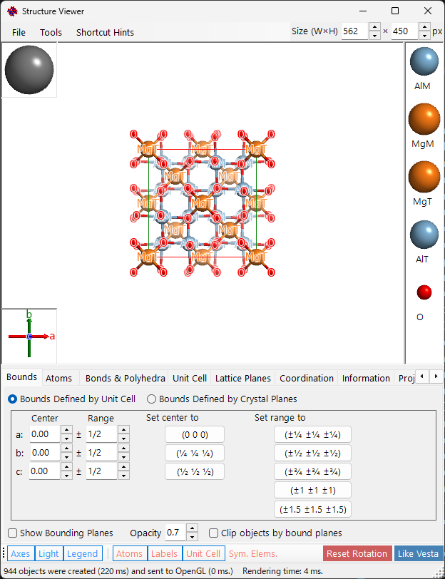

---

## Main area

3D crystal structure with light source, crystal axes, and atom legend.

| Operation | Action |
|-----------|--------|
| Left drag | Rotate |
| Centre drag | Translate |
| Right drag/wheel | Zoom |
| Left double-click | Select/deselect atom |
| Ctrl+Right double-click | Toggle perspective/orthogonal |

---

## Menu bar

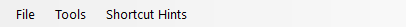

The **Size (W×H)** box at the top right of the window sets the pixel size used when saving or copying the rendered image.

### File menu

Save image, copy to clipboard (Ctrl+Shift+C), save movie (MP4).

**Save movie** opens the Movie setting dialog below: set the rotation speed, recording duration, and direction (current projection, a direction index, or a lattice plane), the codec (H.264 / H.265) and encode speed, then press **OK** to generate an MP4 file.

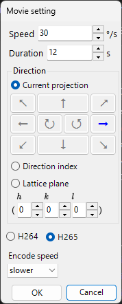

### Tool menu

---

## Tab menu

### Bounds

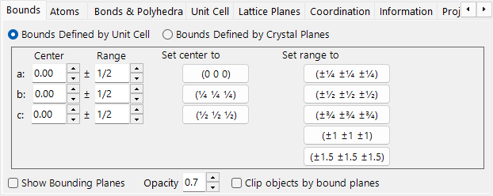

Drawing range by unit cell or crystal planes. Bound planes, clipping, hide atoms. Switch between the two modes with the radio buttons at the top.

#### Bounds defined by cell

In this mode the *a*, *b*, *c* axes of the unit cell are the unit of the drawing range.

- **Center**: central fractional coordinate of the drawing volume.
- **Range**: upper/lower limit for each of the *a*, *b*, *c* axes.
- **Preset buttons** on the right give frequently used values (e.g. 1×1×1 cell, 2×2×2 cell).

#### Bounds defined by crystal planes

In this mode the drawing area is bounded by a set of crystal planes. If the planes do not define a spatially closed region, ReciPro automatically falls back to a one-unit-cell bound.

##### Bound list

All bound planes registered for the current crystal. Use **Add / Replace / Delete** to manipulate the list; the leftmost checkbox temporarily disables a plane without deleting it.

> To save the changes permanently, you must also press **Add** or **Replace** in the **Main Window**. Otherwise the changes are lost the next time you change the selection in the main crystal list.

##### H k l indices

Set the bound plane by its Miller index. The checkbox includes crystallographically equivalent planes generated from the selected (*hkl*).

##### Distance from origin

The distance from the centre of the crystal to the bound plane. The unit is selectable between **d** and **Å**. With **d**, the distance is the input value multiplied by the *d*-spacing of the selected (*hkl*). With **Å**, the value is the absolute distance. Changing one updates the other automatically.

#### Show bound planes / Opacity

Show or hide the bound planes themselves. When shown, **Opacity** sets transparency (0 = transparent, 1 = opaque).

#### Clip objects by bound planes

If checked, only the inside region defined by the bounds is rendered; atoms, bonds, and polyhedra that intersect the bounds are clipped.

#### Hide atoms

If checked, all atoms, bonds, and polyhedra are hidden — useful when only the cell or lattice planes need to be visualised.

### Atoms

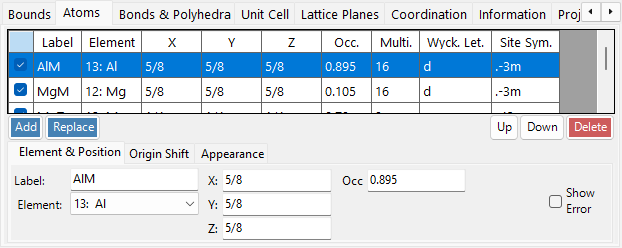

Coordinates, element, occupancy, radius, colour, material. **Apply to same elements**.

#### Atom list

The list of atoms in the crystal. Use **Add / Replace / Delete** to manipulate the list; the leftmost checkbox temporarily hides an atom.

> To save changes permanently, click **Add** or **Replace** in the **Main Window** as well.

#### Element & Position

- **Label**: free-text label for the atom (used in legends and tooltips).
- **Element**: chemical element / ionisation state.
- **X, Y, Z**: fractional coordinates. Real numbers in 0–1, or fractions such as `1/2` or `2/3`.
- **Occ**: occupancy, a real number 0–1.

#### Origin shift

Shifts every atom by the same fractional offset. Press a preset button (for example, to swap origin choice 1 / 2 for the same space group), or enter a custom (Δx, Δy, Δz) and press **Apply custom shift**.

#### Appearance

Per-atom radius, colour, and material.

- **Radius**: drawn atomic radius.
- **Atom color**: surface colour.
- **Material**: texture / material properties used by the OpenGL shader.
- **Apply to same elements**: applies the current radius and colour to every atom of the same element species.

### Bonds & Polyhedra

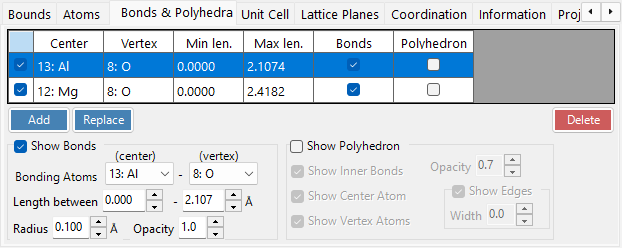

Bond length thresholds, polyhedron display, edges.

#### Bond list

All bond/polyhedron rules registered for the crystal. Use **Add / Replace / Delete**; the leftmost checkbox temporarily disables an entry. As with atoms and bounds, **Add** / **Replace** in the **Main Window** is required to make the change permanent.

#### Bond property

- **Bonding Atom (center)**: element species used as the centre atom of the bond / polyhedron.
- **Bonding Atom (vertex)**: element species used as the vertex (the other end).
- **Length between … and …**: lower and upper distance thresholds. Atom pairs outside this range are not drawn.
- **Bond Radius**: drawn bond thickness (cylinder radius).
- **Alpha**: bond transparency (0 = transparent, 1 = opaque).

#### Polyhedron property

- **Show Polyhedron**: when checked, the polyhedron defined by the current bond is drawn (only if the centre/vertex set is geometrically valid).
- **Inner Bonds**: show/hide the bonds inside the polyhedron.
- **Center Atom**: show/hide the centre atom.
- **Vertex Atoms**: show/hide the vertex atoms.
- **Color** / **Alpha**: face colour and transparency.
- **Show Edge**: draw the edges connecting the vertices.
- **Edge Color** / **Width**: colour and line width of the edges.

### Unit Cell

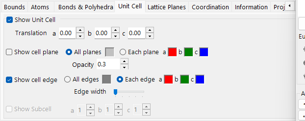

Translation, cell planes, edges.

#### Translation

Every space group has a default origin. To move the centre of the drawn unit cell away from that origin, set the translation along *a*, *b*, *c*.

#### Show cell plane

Whether to draw the six faces that bound the unit cell. When enabled, you can set the face colour and transparency.

#### Show edges

Whether to draw the unit-cell edges. The edge colour is configurable.

### Lattice Planes

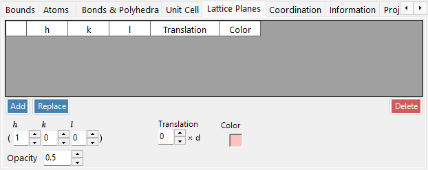

Miller index specification with crystallographic equivalents.

#### H k l indices

Specify the lattice plane by its Miller index. The checkbox optionally includes crystallographically equivalent planes generated from (*hkl*).

#### Translation

Translate the drawn lattice plane by an integer multiple of its *d*-spacing — useful for visualising successive planes of the same family.

### Coordination

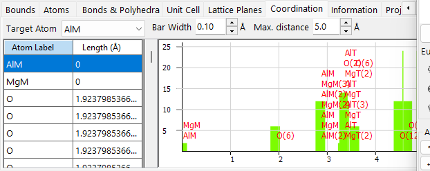

Coordination table and graph around the target atom.

#### Table (left side)

Lists which atoms surround the selected target atom and at what distance. The target atom is selected from the dropdown above the table.

#### Graph (right side)

Histogram of neighbour count versus distance, derived from the same data as the table. Adjust **Bar width** until the bars cleanly separate the coordination shells — this gives a visual estimate of the coordination number.

### Information

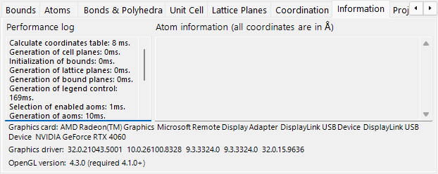

Rendering log (frame time, GPU info) and basic information about the selected atom. Under construction — fields may grow over time.

### Projection

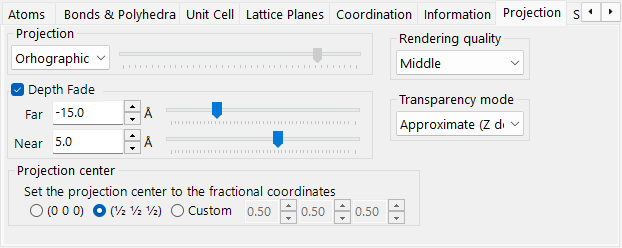

Projection mode (orthographic/perspective), depth fading, rendering quality, transparency mode.

#### Projection

- **Orthographic**: perfect parallel projection (viewpoint at infinity).
- **Perspective**: perspective projection from the viewpoint distance set by the slider.

#### Depth fading out

Fades distant objects in the depth direction. Objects farther than **Far** are fully transparent; objects closer than **Near** are fully opaque; intermediate objects interpolate linearly.

#### Rendering quality

Drawing quality (mesh subdivision, anti-aliasing). Higher quality is slower — choose the setting that matches your GPU.

#### Transparency mode

Algorithm used for translucent atoms and polyhedra.

- **Approximate**: fast but can be inaccurate when many translucent objects overlap.
- **Perfect**: order-independent transparency — accurate but very slow, effectively requires a discrete GPU.

### Symmetry Elements

The **Symmetry Elements** tab draws the space-group symmetry operators directly onto the 3D model (toggle with the **Symmetry Elements** toolbar button). Each class of element can be shown/hidden independently:

- **Rotation axes** and **screw axes**
- **Mirror planes** and **glide planes**
- **Inversion centres** and **rotoinversion axes**

For each class you can adjust the symbol size, line width, and colour.

### Misc.

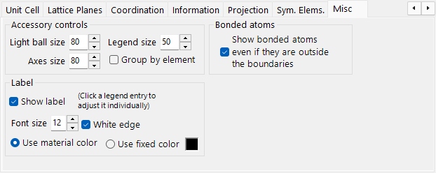

Accessory panel size, label settings, bonded atoms outside boundaries.

---

## Toolbar

| Button | Description |
|--------|-------------|
| Crystal Axes | Show axis orientation (size = lattice constant) |
| Light direction | Set light direction |
| Legend | Atom legend |
| Like Vesta | Vesta-style appearance |
| Reset rotation | Return to the initial orientation |
| Atom / Label | Toggle atom objects / atom labels |
| Unit cell | Toggle unit-cell edges |
| Symmetry Elements | Toggle the symmetry-element overlay (see above) |
