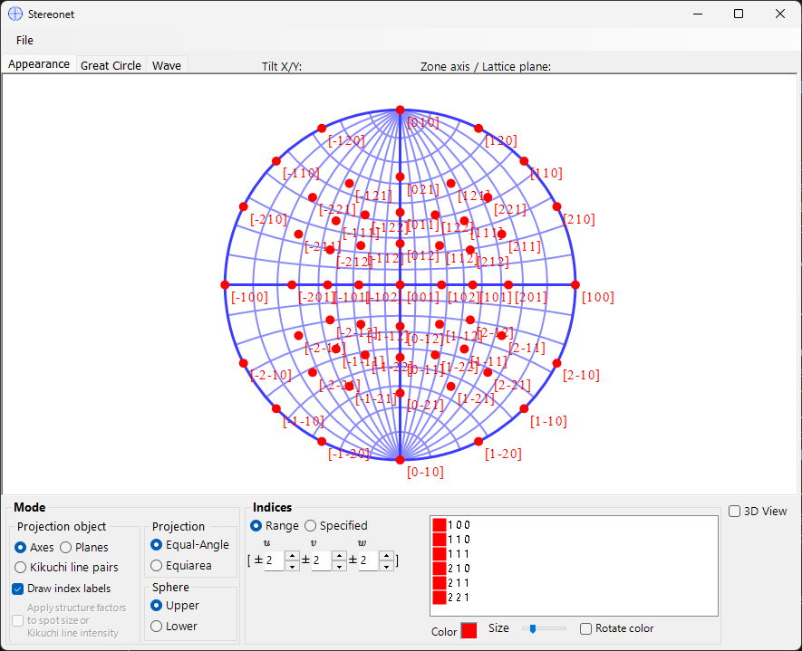
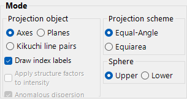
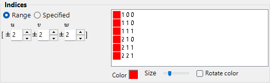
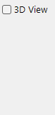
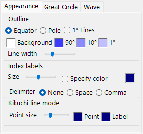
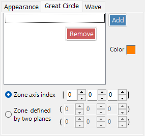
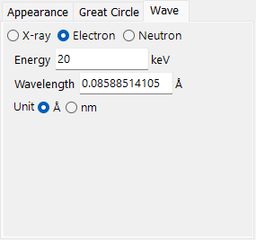

# Stereonet

**Stereonet** displays crystal plane and axis directions using stereographic projection.

---

## Mouse operations

| Operation | Action |
|-----------|--------|
| Left drag | Rotate the crystal |
| Right click | Zoom out |
| Right drag / wheel | Zoom in / zoom in–out |
| Double-click | Switch between **Axis** / **Plane** modes |
| Middle drag | Translate |

The plane/axis indices at the current **cursor position** are displayed as you move the mouse over the projection — useful for reading off the indices of a measured spot.

## File menu
Save or copy in raster or vector format. Vector format allows editing font/line thickness in PowerPoint or other vector editors.

## Mode

### Projection target

Select what to project onto the net.

- **Axis** — projects zone-axis directions [*uvw*].
- **Plane** — projects crystal-plane normals {*hkl*}.
- **Kikuchi line** — projects Kikuchi-line pairs (the (*hkl*) trace and its companion).

### Projection method

| Method | Description |
|--------|-------------|
| **Wulff** (equal-angle / stereographic) | Preserves the angle relation between projected features but not solid angle. Used by classical crystallographers when reading inter-axis or inter-plane angles. |
| **Schmidt** (equal-area / Lambert) | Preserves the solid-angle (area) of each region but distorts angles. Preferred for statistical pole figures where relative density matters. |

### Hemisphere

Choose **Upper** or **Lower** hemisphere as the projection source — switches whether the visible face of the sphere is the one closest to or farthest from the observer.

### Display options

- Show index labels.
- Optionally weight each point by structure factor *F*ₕₖₗ when **Plane** is selected (set the wave source in the [Wave tab](#wave)).

> For trigonal/hexagonal crystals, Miller–Bravais (4-index) notation can be enabled from **Option ▸ Use Miller-Bravais (hkil) index** in the main window.

## Indices

Sets which crystal planes / axes are drawn.

### Range mode

Specifies a range of [*u v w*] or {*h k l*} indices to be drawn. ReciPro enumerates every (*hkl*) within the limits and projects each one.

### Specified mode

Specifies particular axes or planes individually. Type an index, press **Add** to register it, or **Remove** to delete it. When **include equivalent indices** is checked, all crystallographically equivalent planes/axes are added at once.

### Colour

Set the plot colour. Tick **Change colour automatically** to colour-code each set of equivalent axes/planes differently — useful for distinguishing families on a multi-index plot.

## 3D Options

Controls the 3D net (sphere) overlay — opacity of the sphere, axis indicators, etc.

## Tab menu

### Appearance

#### Size

- **String size** — size of the index labels.
- **Point size** — size of the projected points.

#### Color

Colour of points, index labels, and the stereonet outline.

- **Specify label color** — overrides the per-point colour with a single dedicated label colour, useful when the points are colour-coded but you want all labels in one colour for readability.

#### Outline

How the stereonet outline is drawn — the bounding circle and (optionally) the great-circle latitude/longitude grid. The outline **line width** is set with the dedicated track bar (added 2026-05).

### Great and Small Circle

Draw great circles and small circles. Specify either by **zone-axis index** [*uvw*] (the great circle of planes containing that axis) or by **two crystal-plane indices** that share the zone axis. The line width of the circles is also configurable via track bar.

### Wave {#wave}

Available only when **Plane** is selected as the projection target. Sets the wave source (X-ray / electron / neutron) and the wavelength or energy required to compute the crystal structure factors used for the **structure-factor weighting** option in [Mode](#mode).
