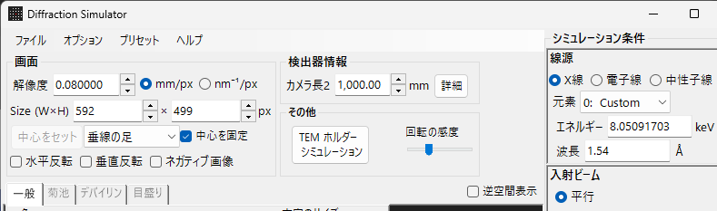
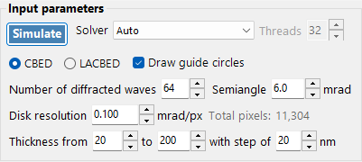
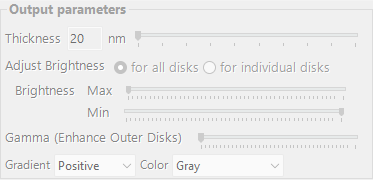

<!-- nav -->

[← 7.3. PED Simulation](7-3-ped-simulation.md)  |  [🏠 Home](../index.md)  |  [8. Electron trajectory →](13-electron-trajectory.md)

# CBED Simulation

**CBED (Convergent-Beam Electron Diffraction)** simulation computes and displays convergent-beam patterns using the Bloch wave (Bethe) method. CBED patterns show diffraction disks instead of spots, and contain rich information about crystal symmetry, thickness, and structure.

To open this window, select **Convergence (CBED)** in the incident beam mode of the [Diffraction Simulator](7-diffraction-simulator/index.md), then click **Simulate**.

---

## Input parameters

### Mode
- **CBED**: Standard convergent-beam pattern where each disk corresponds to one reflection. The transmitted disk (000) is at the center.
- **LACBED** (Large-Angle CBED): Large-angle convergent beam pattern where disks from different reflections overlap. Useful for observing higher-order Laue zone (HOLZ) lines and symmetry.

### Convergence semi-angle (mrad)
The half-angle of the convergent beam cone. This determines the size of each diffraction disk. Typical values: 5-30 mrad. The disk diameter in reciprocal space equals 2 * alpha.

### Disk resolution (mrad/pixel)
The angular resolution within each disk. Smaller values give higher resolution but increase computation time quadratically (total pixels = (2*alpha/resolution)^2). The total number of beam directions (pixels) is shown in the status display.

### Max Bloch waves
The maximum number of beams included in the Bloch wave calculation at each incident beam direction. More beams give more accurate results but increase the computation time (O(N^3) eigenvalue problem per pixel). Typical values: 100-500.

### Thickness range
Set the start, end, and step values for sample thickness (nm). CBED patterns depend strongly on thickness, and computing multiple thicknesses simultaneously is efficient because the eigenvalue problem is solved only once per beam direction.

### Solver
Choose the linear algebra backend for the eigenvalue problem:
- **Auto**: Automatically selects the best available solver.
- **Eigenproblem (MKL)**: Intel MKL-based eigensolver (fastest, requires MKL).
- **Eigenproblem (Eigen)**: Eigen C++ library solver.
- **Managed**: Pure .NET managed solver (slowest but always available).

### Thread count
Number of parallel threads for the calculation. Set to the number of CPU cores for best performance.

### Guide circles
When checked, draw circles indicating the boundary of each diffraction disk (Bragg angle circles).

---

## Simulate / Stop

Click **Simulate** to start the CBED simulation. A progress bar shows the percentage completed, elapsed time, and estimated remaining time. Click **Stop** to cancel the calculation.

---

## Output controls

After the calculation completes, the output panel becomes available:

### Display mode
- **All disks**: Show the complete CBED pattern with all disks.
- **Individual disk**: Show a single selected disk at full resolution.

### Thickness slider
Select which thickness to display (from the computed thickness range).

### Brightness (Min / Max)
Adjust the minimum and maximum intensity for display. This is useful for bringing out weak features.

### Gamma
Gamma correction for the intensity display. Values < 1 enhance weak features; values > 1 enhance strong features.

### Color scale
Choose the color map: Gray, Spectrum (rainbow), etc.

### Gradient
Set the gradient display mode for the pattern.

---

## Physical background

In CBED, the incident beam is a cone of plane waves with different directions. For each direction, the Bloch wave method solves the electron Schrodinger equation inside the crystal:

1. The crystal potential V(r) is expanded in Fourier components U_g.
2. The electron wavefunction is expanded as a sum of Bloch waves.
3. This leads to an eigenvalue problem of size N (number of beams).
4. The eigenvalues give the Bloch wave wavevectors; the eigenvectors give the Bloch wave amplitudes.
5. Boundary conditions at the entrance and exit surfaces determine the diffracted beam intensities.

The intensity at each pixel in a CBED disk is I_g(k) = |sum_j C_g^j * C_0^j * exp(2*pi*i*gamma_j*t)|^2, where j runs over Bloch waves, C are eigenvector components, gamma are eigenvalues, and t is thickness.

HOLZ (Higher-Order Laue Zone) lines appear as fine dark/bright lines within the CBED disks, arising from reflections in upper Laue zones. They are sensitive to the c-axis lattice parameter and are useful for 3D structure analysis.

---

[← 7.3. PED Simulation](7-3-ped-simulation.md)  |  [🏠 Home](../index.md)  |  [8. Electron trajectory →](13-electron-trajectory.md)
